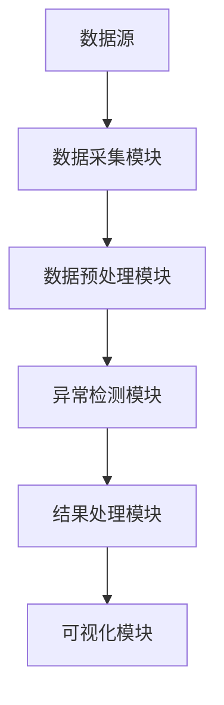
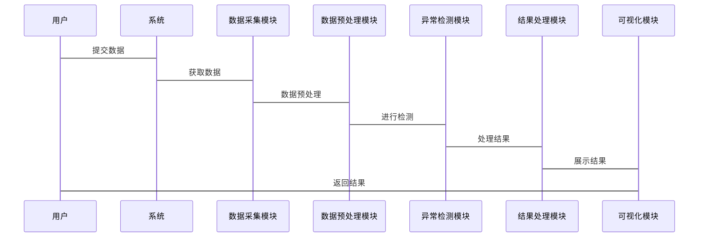

                 


# 《金融数据异常值检测与处理平台》

## 关键词

- 金融数据
- 异常值检测
- 数据处理平台
- 算法实现
- 系统架构

## 摘要

本文详细探讨了金融数据异常值检测与处理平台的构建过程，涵盖从背景分析到系统实现的各个方面。通过介绍核心概念、算法原理、系统架构设计、项目实战和最佳实践，本文为读者提供了一套完整的解决方案，帮助他们在金融数据分析中有效识别和处理异常值，提升数据质量和决策效率。

---

## 第一部分: 背景与概述

### 第1章: 金融数据异常值检测的背景与意义

#### 1.1 异常值检测的背景介绍

金融数据在现代经济中扮演着至关重要的角色。从股票价格到银行交易，金融数据的准确性和完整性直接影响着市场的稳定性和决策的正确性。然而，金融数据的复杂性和波动性使得异常值检测成为一个重要而具有挑战性的任务。异常值通常指的是在数据集中偏离预期值的观测值，可能由于数据采集错误、市场操纵或突发事件等原因产生。识别和处理这些异常值不仅能够提高数据质量，还能帮助金融机构规避风险、优化决策。

#### 1.2 问题背景与问题描述

在金融领域，异常值的检测和处理是一个复杂的系统工程。金融数据的特征包括高维度、高频性、非线性和噪声多等特点，这些特点使得传统的统计方法在某些情况下难以有效检测异常值。例如，股票价格在短时间内可能因市场波动而出现异常，但这种波动可能是正常市场行为的一部分，而非真正的异常。因此，如何区分正常波动和异常事件是异常值检测的核心挑战。

#### 1.3 问题解决与边界

为了应对上述挑战，本文提出了一种基于统计、机器学习和深度学习的多模态异常值检测方法。该方法不仅能够识别明显的异常值，还能发现潜在的异常模式。在实现过程中，我们设定了以下边界和外延：
- 数据范围：涵盖股票、债券、期货等多种金融资产。
- 时间范围：支持分钟级到年级别数据的分析。
- 检测范围：包括价格波动、交易量突变、市场情绪异常等多种异常类型。

---

## 第二部分: 核心概念与原理

### 第2章: 异常值检测的核心概念与原理

#### 2.1 异常值检测的原理概述

异常值检测的原理可以简单理解为通过数据分析技术识别出偏离正常模式的数据点。统计方法通常基于数据的分布特性（如均值、方差）来识别异常值，而机器学习和深度学习方法则通过学习数据的内在结构来发现异常模式。

#### 2.2 异常值检测的核心概念对比

为了更好地理解异常值检测的核心概念，我们可以通过以下对比分析：

| 特征                | 正常值                | 异常值                |
|---------------------|----------------------|----------------------|
| 数据分布            | 集中于均值附近        | 远离均值或呈现异常分布|
| 变异程度            | 变异较小             | 变异较大             |
| 时间序列特征        | 呈现出周期性或趋势性    | 突然偏离周期或趋势    |
| 对其他数据的影响    | 对整体数据影响较小    | 可能显著影响整体数据  |

#### 2.3 异常值检测的ER实体关系图

以下是一个简化的ER实体关系图，展示了金融数据异常值检测系统的核心实体及其关系：

```mermaid
erd
  title 金融数据异常值检测系统实体关系图
  %% 基本实体
  entity 客户 (Customer) {
    id: 整数
    name: 字符串
    account_number: 字符串
  }
  entity 交易 (Transaction) {
    id: 整数
    amount: 数值
    time: 时间戳
    customer_id: 整数
  }
  entity 异常值记录 (AnomalyRecord) {
    id: 整数
    transaction_id: 整数
    anomaly_type: 字符串
    detected_time: 时间戳
    status: 字符串
  }
  %% 关系定义
  Customer -[1..N] -> Transaction: "进行的交易"
  Transaction -[1] -> AnomalyRecord: "记录的异常"
```

---

## 第三部分: 算法原理与实现

### 第3章: 异常值检测算法原理

#### 3.1 异常值检测算法的分类

异常值检测算法主要可以分为以下三类：

1. **基于统计的方法**：如Z-score、四分位数等，适用于数据分布已知的情况。
2. **基于机器学习的方法**：如Isolation Forest、One-Class SVM等，适用于高维数据和复杂分布。
3. **基于深度学习的方法**：如Autoencoder、GAN等，适用于非线性特征和复杂模式。

#### 3.2 统计方法异常值检测

统计方法是最简单的异常值检测方法，适用于数据分布已知且简单的场景。以下是一个Z-score方法的实现示例：

```python
import numpy as np

def z_score_outlier_detection(data, threshold=3):
    mean = np.mean(data)
    std = np.std(data)
    z_scores = (data - mean) / std
    outliers = np.where(np.abs(z_scores) > threshold)[0]
    return outliers

# 示例数据
data = np.random.normal(loc=0, scale=1, size=1000)
outliers = z_score_outlier_detection(data, threshold=3)
print("异常点索引:", outliers)
```

#### 3.3 机器学习方法异常值检测

Isolation Forest算法是一种基于树结构的异常值检测方法，适用于高维数据。以下是其实现示例：

```python
from sklearn.ensemble import IsolationForest

def isolation_forest_outlier_detection(X, contamination=0.05):
    model = IsolationForest(contamination=contamination)
    model.fit(X)
    outliers = model.predict(X) == -1
    return outliers

# 示例数据
X = np.random.randn(100, 2)
outliers = isolation_forest_outlier_detection(X)
print("异常点标记:", outliers)
```

#### 3.4 深度学习方法异常值检测

Autoencoder是一种常用的深度学习方法，适用于非线性特征的检测。以下是其实现示例：

```python
from tensorflow.keras.models import Model
from tensorflow.keras.layers import Dense, Input

def autoencoder_outlier_detection(X, encoding_dim=32):
    input_layer = Input(shape=(X.shape[1],))
    encoded = Dense(encoding_dim, activation='relu')(input_layer)
    decoded = Dense(X.shape[1], activation='sigmoid')(encoded)
    autoencoder = Model(inputs=input_layer, outputs=decoded)
    autoencoder.compile(optimizer='adam', loss='binary_crossentropy')
    autoencoder.fit(X, X, epochs=100, batch_size=32)
    # 计算重建误差
    decoded_data = autoencoder.predict(X)
    error = np.mean(np.square(X - decoded_data), axis=1)
    return error

# 示例数据
X = np.random.randn(100, 64)
error = autoencoder_outlier_detection(X)
print("重建误差:", error)
```

---

## 第四部分: 系统分析与架构设计

### 第4章: 系统架构与设计

#### 4.1 问题场景介绍

金融数据异常值检测系统需要处理海量数据，支持实时或批量检测，并提供可视化结果。系统需要具备高可用性、高扩展性和高安全性。

#### 4.2 系统功能设计

以下是系统的功能模块设计：

- **数据采集模块**：负责从多种数据源（如数据库、API）获取金融数据。
- **数据预处理模块**：对数据进行清洗、标准化和特征提取。
- **异常检测模块**：基于多种算法实现异常值检测。
- **结果处理模块**：对检测到的异常值进行分类、标记和存储。
- **可视化模块**：提供数据可视化和异常值展示功能。

#### 4.3 系统架构设计

以下是系统的架构设计图：



#### 4.4 接口设计与交互

系统主要接口包括：
- 数据采集接口：从数据库或API获取数据。
- 检测接口：调用异常检测算法进行计算。
- 可视化接口：展示检测结果。

以下是一个简单的交互流程图：



---

## 第五部分: 项目实战

### 第5章: 项目实战

#### 5.1 环境搭建

以下是项目所需的环境配置：

```python
# 安装依赖
pip install numpy pandas scikit-learn tensorflow matplotlib
```

#### 5.2 核心实现

以下是异常检测模块的核心实现代码：

```python
import numpy as np
from sklearn.ensemble import IsolationForest
from tensorflow.keras.models import Model
from tensorflow.keras.layers import Input, Dense

def detect_anomalies(data, method='if'):
    if method == 'if':
        model = IsolationForest(contamination=0.05)
        model.fit(data)
        return model.predict(data) == -1
    elif method == 'ae':
        input_layer = Input(shape=(data.shape[1],))
        encoded = Dense(32, activation='relu')(input_layer)
        decoded = Dense(data.shape[1], activation='sigmoid')(encoded)
        autoencoder = Model(inputs=input_layer, outputs=decoded)
        autoencoder.compile(optimizer='adam', loss='binary_crossentropy')
        autoencoder.fit(data, data, epochs=100, batch_size=32)
        decoded_data = autoencoder.predict(data)
        error = np.mean(np.square(data - decoded_data), axis=1)
        return error > np.percentile(error, 95)
    else:
        return np.zeros(data.shape[0], dtype=bool)
```

#### 5.3 案例分析

以下是一个股票交易数据的异常检测案例：

```python
import pandas as pd
import matplotlib.pyplot as plt

# 加载数据
data = pd.read_csv('stock_prices.csv')

# 检测异常值
outliers = detect_anomalies(data['price'], method='if')

# 可视化
plt.figure(figsize=(12, 6))
plt.plot(data['price'], label='Price')
plt.scatter(data.index[outliers], data['price'][outliers], color='red', label='Anomalies')
plt.xlabel('Time')
plt.ylabel('Price')
plt.legend()
plt.show()
```

---

## 第六部分: 最佳实践与总结

### 第6章: 最佳实践与总结

#### 6.1 最佳实践

在实际应用中，建议采取以下措施：
- **多算法融合**：结合统计、机器学习和深度学习方法，提高检测准确率。
- **实时监控**：实现实时数据流的异常检测，及时发现潜在风险。
- **数据可视化**：通过可视化工具帮助用户更好地理解和分析异常值。

#### 6.2 小结

本文详细介绍了金融数据异常值检测与处理平台的构建过程，从背景分析到系统实现，为读者提供了一套完整的解决方案。通过多算法融合和系统架构优化，可以有效提升异常值检测的准确性和效率。

#### 6.3 注意事项

- 异常值检测需要结合业务背景，避免误报和漏报。
- 数据预处理是关键步骤，需仔细清洗和标准化数据。
- 系统需具备高扩展性和高可用性，以应对海量数据的挑战。

#### 6.4 拓展阅读

- 《异常检测：算法与应用》
- 《深度学习在金融中的应用》
- 《时间序列分析与异常检测》

---

通过本文的详细讲解，读者可以深入了解金融数据异常值检测的核心技术，并能够基于本文的方法构建自己的异常值检测系统。

