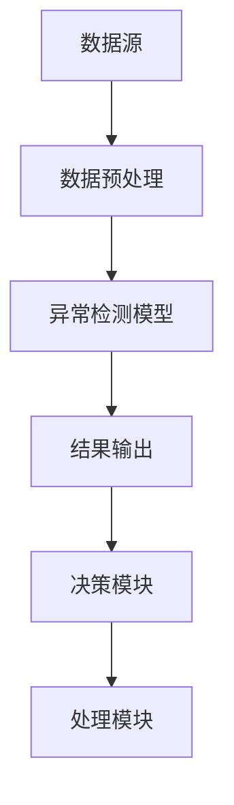
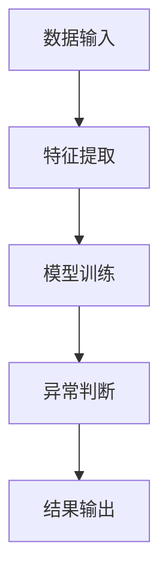
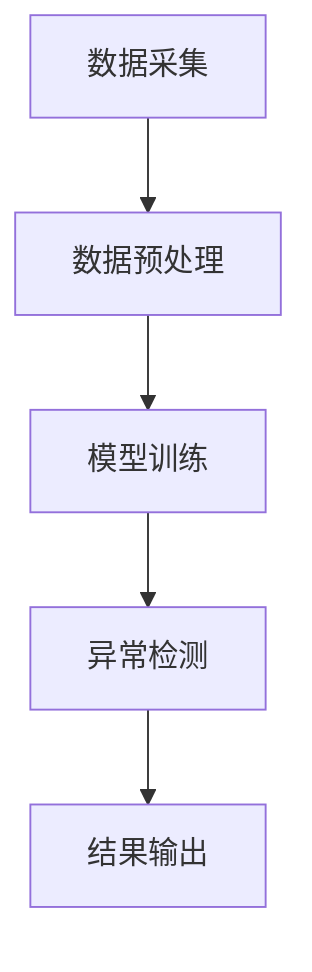

                 


# 《金融数据异常值检测与处理系统》

## 关键词：金融数据，异常值检测，机器学习，统计学，数据处理

## 摘要：  
金融数据的异常值检测是金融数据分析中的重要任务，能够帮助发现潜在的市场风险、欺诈行为和数据质量问题。本文系统地介绍了金融数据异常值检测的核心原理、算法实现以及系统架构设计，并通过具体案例展示了如何构建和应用一个高效的金融数据异常值检测与处理系统。文章内容涵盖从理论到实践的全过程，为读者提供全面的指导。

---

## 第一部分: 金融数据异常值检测与处理系统背景介绍

### 第1章: 金融数据异常值检测的背景与问题描述

#### 1.1 问题背景  
金融数据具有高频性、连续性、波动性等特点，其异常值可能引发严重的经济损失或市场波动。例如，欺诈交易、市场操纵、系统错误等都可能生成异常值，及时发现和处理这些异常值对于维护金融市场稳定至关重要。  

#### 1.2 问题描述  
- **定义与目标**：异常值检测旨在识别与正常数据模式不符的样本。  
- **分类与方法**：根据检测方法的不同，可以分为基于统计的方法、基于机器学习的方法和基于深度学习的方法。  
- **挑战与难点**：金融数据的高维性、稀疏性以及动态变化性增加了异常值检测的难度。  

#### 1.3 问题解决与边界  
- **核心解决思路**：通过数据分析和建模，识别偏离正常分布的样本。  
- **系统边界与功能范围**：系统主要针对结构化金融数据，支持单变量和多变量异常检测。  
- **系统外延与适用场景**：异常值检测可以应用于实时监控、历史数据分析等多种场景。  

#### 1.4 核心概念结构  
- **核心要素**：数据源、预处理、检测算法、结果输出。  
- **系统架构模块**：数据采集、数据预处理、模型训练、结果处理。  
- **数据流与功能流程**：数据输入 → 预处理 → 模型训练 → 异常判断 → 结果输出。  

---

## 第二部分: 金融数据异常值检测的核心概念与联系

### 第2章: 异常值检测的核心原理与方法

#### 2.1 异常值检测的原理  
- **统计学方法原理**：基于数据的分布特性，如均值、方差等。  
- **机器学习方法原理**：通过学习正常数据的分布，识别异常样本。  
- **深度学习方法原理**：利用神经网络提取高维特征，识别异常模式。  

#### 2.2 异常值检测方法的对比分析  
| 方法类型       | 统计学方法 | 机器学习方法 | 深度学习方法 |
|----------------|------------|---------------|--------------|
| 适用场景       | 单变量数据 | 多变量数据     | 高维数据     |
| 检测效率       | 高         | 中等           | 较低          |
| 模型复杂度     | 低         | 中等           | 高            |

#### 2.3 异常值检测的核心算法  
- **马尔可夫链模型**：通过状态转移概率识别异常行为。  
- **Isolation Forest 算法**：通过构建随机树隔离异常样本。  
- **Autoencoder 网络**：通过自编码器重构数据，识别异常点。  

#### 2.4 实体关系图  


---

## 第三部分: 异常值检测的数学模型与算法原理

### 第3章: 统计学方法与数学模型

#### 3.1 统计学方法  
- **Z-Score 模型**  
  $$ z = \frac{x - \mu}{\sigma} $$  
  其中，$\mu$ 是均值，$\sigma$ 是标准差。  
- **箱线图模型**  
  $$ IQR = Q3 - Q1 $$  
  其中，$Q1$ 和 $Q3$ 分别是第一和第三四分位数。  
- **Grubbs 检验**：用于检测单变量数据中的异常值。  

#### 3.2 机器学习方法  
- **K-近邻（KNN）方法**：通过计算样本之间的距离，识别异常点。  
- **One-Class SVM**：用于学习正常数据的分布，识别异常样本。  
- **随机森林异常检测**：通过集成学习，识别异常点。  

#### 3.3 深度学习方法  
- **自编码器（Autoencoder）**：通过重构数据，识别异常点。  
- **图神经网络（GNN）**：用于处理图结构数据中的异常检测。  

#### 3.4 算法流程图  


---

## 第四部分: 系统架构与设计方案

### 第4章: 系统架构设计

#### 4.1 系统功能模块  
- **数据采集模块**：从数据库或API获取金融数据。  
- **数据预处理模块**：清洗数据，处理缺失值和异常值。  
- **模型训练模块**：训练异常检测模型，并保存模型参数。  

#### 4.2 系统架构图  


---

## 第五部分: 项目实战

### 第5章: 项目实现与案例分析

#### 5.1 环境安装  
- Python 3.8+  
- Scikit-learn、TensorFlow、PyTorch 等库  

#### 5.2 核心代码实现  
```python
import numpy as np
from sklearn.ensemble import IsolationForest

# 示例数据
X = np.random.randn(100, 1) * 3 + 2
# 添加异常值
X[10] = 100
X[20] = -50

# 训练模型
model = IsolationForest(n_estimators=100, random_state=42)
model.fit(X)

# 预测异常值
y_pred = model.predict(X)
# 输出异常值索引
outliers = np.where(y_pred == -1)[0]
print("异常值索引:", outliers)
```

#### 5.3 实际案例分析  
假设我们有一个股票交易数据集，其中包含开盘价、收盘价、最高价、最低价和交易量。我们可以通过异常检测模型识别可能的市场操纵行为。  

---

## 第六部分: 总结与扩展阅读

### 第6章: 总结与最佳实践

#### 6.1 本章小结  
金融数据异常值检测是一个复杂但重要的任务，涉及多种方法和技术。本文详细介绍了从理论到实践的全过程，为构建高效检测系统提供了指导。

#### 6.2 最佳实践 tips  
- 数据预处理是关键，需仔细处理缺失值和异常值。  
- 根据数据特性选择合适的方法，统计方法适用于简单场景，深度学习适用于高维场景。  
- 实时监控系统需要高效的模型部署和快速的响应能力。  

#### 6.3 扩展阅读  
- 《异常检测的理论与实践》  
- 《深度学习在金融时间序列分析中的应用》  
- 《实时金融数据分析与处理》  

---

通过以上内容，读者可以系统地了解金融数据异常值检测的理论基础、实现方法和应用案例。

