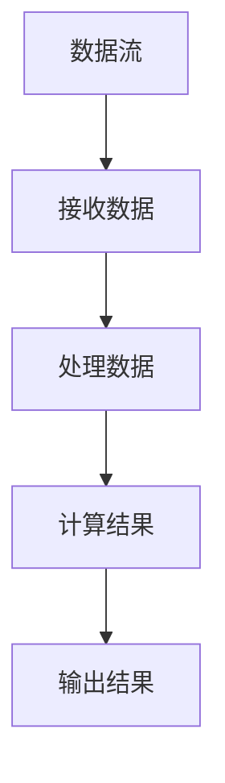
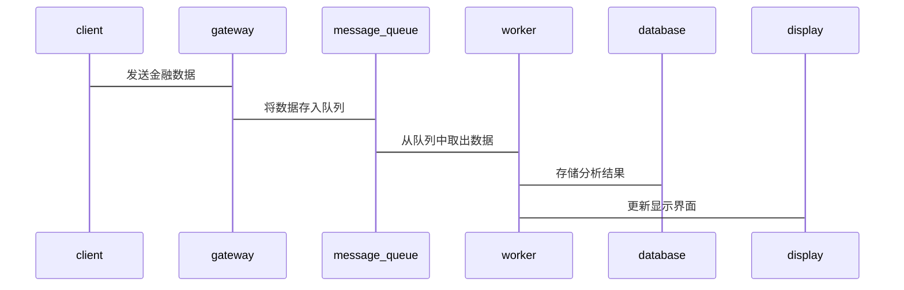

                 


# 《金融数据的实时处理与分析》

> 关键词：金融数据，实时处理，流数据，分布式系统，风险评估，机器学习

> 摘要：本文深入探讨了金融数据实时处理与分析的核心技术，涵盖背景介绍、算法原理、系统架构设计以及项目实战，结合实际案例，提供详细的解决方案和实现步骤。

---

## 第一部分：金融数据实时处理与分析基础

### 第1章：金融数据实时处理与分析的背景与概述

#### 1.1 金融数据实时处理的重要性
- **1.1.1 金融数据的特点与挑战**
  - 金融数据具有高频性、复杂性和高价值性。
  - 需要处理海量数据，实时性要求高，数据类型多样。
  - 数据安全性和隐私保护是重要挑战。

- **1.1.2 实时处理与分析的必要性**
  - 金融市场瞬息万变，实时分析能帮助投资者快速做出决策。
  - 实时处理可以有效防范金融风险，如市场波动和欺诈行为。

- **1.1.3 金融行业的应用场景**
  - 股票交易：实时监控市场动态，捕捉交易机会。
  - 风险管理：实时评估市场风险，制定应对策略。
  - 智能投顾：基于实时数据提供个性化的投资建议。

#### 1.2 问题背景与描述
- **1.2.1 传统金融数据分析的局限性**
  - 数据处理延迟高，无法捕捉实时市场变化。
  - 数据分析依赖批量处理，难以应对高频交易需求。

- **1.2.2 实时数据处理的需求**
  - 快速响应市场变化，减少决策延迟。
  - 支持高频交易和实时监控，提高交易效率。

- **1.2.3 问题解决思路与方法**
  - 引入流数据处理技术，实现数据实时传输和处理。
  - 结合分布式系统和实时计算框架，提升处理能力。

#### 1.3 核心概念与边界
- **1.3.1 核心概念**
  - 流数据处理：实时接收和处理数据流。
  - 分布式计算：利用分布式系统提升处理能力。
  - 事件时间：数据产生的时间，用于处理窗口。

- **1.3.2 边界与外延**
  - 系统边界：实时处理与分析仅限于数据流处理，不涉及存储和长期分析。
  - 外延：实时处理技术可应用于其他领域，如物联网和实时监控。

---

## 第二部分：实时处理的核心技术

### 第2章：实时数据流处理模型与算法

#### 2.1 流数据处理模型
- **2.1.1 流数据处理的基本原理**
  - 数据以流的形式持续输入，系统实时处理并输出结果。
  - 使用时间戳标记数据，确保数据处理顺序正确。

- **2.1.2 时间戳与事件时间**
  - 时间戳：每个数据点的时间标记。
  - 事件时间：数据产生的时间，可能与系统处理时间不同。

- **2.1.3 窗口机制与处理时间**
  - 时间窗口：限定时间段内的数据处理。
  - 滚动窗口和滑动窗口：处理实时数据流的不同方式。

#### 2.2 分布式流处理框架
- **2.2.1 Kafka与Flink的结合**
  - Kafka作为消息队列，Flink作为流处理引擎。
  - Kafka负责数据分发，Flink负责数据处理和计算。

- **2.2.2 分布式流处理的优缺点**
  - 优点：高吞吐量、低延迟、可扩展。
  - 缺点：复杂性高，需要处理网络分区和容错。

- **2.2.3 实时数据流的处理流程**
  - 数据生产者将数据发送到Kafka。
  - Flink消费者从Kafka读取数据，进行实时计算。
  - 结果输出到存储系统或实时仪表盘。

#### 2.3 算法原理与流程图
- **2.3.1 流数据处理算法的数学模型**
  - 示例：滑动窗口计算平均值。
  - 公式：$$\text{current\_avg} = \frac{\text{sum} + \text{new\_value}}{\text{count} + 1}$$

- **2.3.2 算法流程图（Mermaid）**


- **2.3.3 代码实现与案例分析**
  ```python
  from pyflink.datastream import StreamExecutionEnvironment
  from pyflink.table import *

  env = StreamExecutionEnvironment.get_execution_environment()
  table_env = TableEnvironment.get_default_env()

  # 定义输入和输出表
  input_table = table_env.from_path("input", "input")
  output_table = input_table.select("id, value, time")

  # 实时计算平均值
  avg = output_table.group_by("id").agg(
      row_time("time"),
      (col("value").alias("sum")).agg Alias("sum_value")
  )

  # 输出结果
  avg.to_path("output").execute()
  ```

---

## 第三部分：金融数据特征分析

### 第3章：实时特征计算与统计分析

#### 3.1 数据特征工程
- **3.1.1 特征提取与选择**
  - 从原始数据中提取有用的特征，如波动率、成交量等。
  - 使用特征选择方法，如基于统计的方法和机器学习方法。

- **3.1.2 特征工程的流程与方法**
  - 数据清洗：处理缺失值和异常值。
  - 特征变换：标准化、归一化等。

- **3.1.3 实时特征计算的挑战**
  - 处理实时数据流时，特征计算需要实时更新。

#### 3.2 统计分析与数学模型
- **3.2.1 时间序列分析的数学模型**
  - ARIMA模型：用于预测未来的市场趋势。
  - 公式：$$ARIMA(p, d, q)$$

- **3.2.2 常见统计方法与公式**
  - 均值、方差、标准差的计算。
  - 示例：$$\mu = \frac{1}{n}\sum_{i=1}^{n} x_i$$

- **3.2.3 案例分析与代码实现**
  ```python
  import pandas as pd
  import numpy as np

  # 示例数据
  data = pd.Series([1, 2, 3, 4, 5])
  # 计算均值
  mean = data.mean()
  # 计算标准差
  std = data.std()
  print(f"均值: {mean}, 标准差: {std}")
  ```

---

## 第四部分：金融风险实时评估与预警

### 第4章：实时风险评估模型

#### 4.1 风险指标与评估方法
- **4.1.1 常见风险指标的定义与计算**
  - Value at Risk (VaR)：在一定置信水平下的潜在损失。
  - 公式：$$VaR = \text{quantile}(p)$$

- **4.1.2 风险评估模型的选择**
  - 根据业务需求选择合适的模型，如线性回归、随机森林等。

- **4.1.3 模型的实时更新与优化**
  - 使用在线学习方法，实时更新模型参数。

#### 4.2 预警机制与案例分析
- **4.2.1 预警规则的设计与实现**
  - 设定阈值，当风险指标超过阈值时触发预警。

- **4.2.2 实时预警系统的架构**
  - 数据采集、处理、分析和预警通知的流程。

- **4.2.3 典型案例分析与总结**
  - 某次市场崩盘的实时预警案例，分析系统的有效性和改进方向。

---

## 第五部分：系统架构与设计

### 第5章：系统架构设计与实现

#### 5.1 系统架构设计
- **5.1.1 问题场景介绍**
  - 高并发、低延迟的实时数据处理需求。
  - 系统需要具备可扩展性和高可用性。

- **5.1.2 系统功能设计**
  - 数据采集：从多种数据源采集金融数据。
  - 数据处理：实时计算和分析数据。
  - 结果展示：将分析结果展示在用户界面上。

- **5.1.3 系统架构图（Mermaid）**


#### 5.2 系统接口设计
- **5.2.1 数据采集接口**
  - 接收数据流，支持多种数据格式。

- **5.2.2 数据处理接口**
  - 提供API，供上层应用调用处理结果。

- **5.2.3 系统交互流程（Mermaid）**


---

## 第六部分：项目实战

### 第6章：金融数据实时处理系统实现

#### 6.1 项目环境搭建
- **6.1.1 安装必要的工具与库**
  - Python、Java、Flink、Kafka、Pandas等。

#### 6.2 系统核心实现
- **6.2.1 数据采集模块**
  - 使用Kafka作为消息队列，接收实时金融数据。

- **6.2.2 数据处理模块**
  - 使用Flink进行实时流处理，计算所需特征和风险指标。

- **6.2.3 结果展示模块**
  - 使用仪表盘展示实时分析结果，如价格趋势、风险预警等。

#### 6.3 代码实现与解读
- **6.3.1 数据采集代码**
  ```python
  from kafka import KafkaProducer

  producer = KafkaProducer(bootstrap_servers='localhost:9092')
  for data in stream:
      producer.send('financial_data', value=data)
  ```

- **6.3.2 数据处理代码**
  ```python
  from pyflink.datastream import StreamExecutionEnvironment
  from pyflink.table import *

  env = StreamExecutionEnvironment.get_execution_environment()
  table_env = TableEnvironment.get_default_env()

  input_table = table_env.from_path("input", "input")
  output_table = input_table.select("id, value, time")

  # 计算风险指标
  risk = output_table.group_by("id").agg(
      row_time("time"),
      (col("value").alias("sum")).agg Alias("sum_value")
  )

  risk.to_path("output").execute()
  ```

#### 6.4 案例分析与总结
- **6.4.1 案例分析**
  - 实时处理股票价格数据，计算波动率并预警。

- **6.4.2 项目总结**
  - 项目实现的目标和实际效果。
  - 可优化的方面和未来改进方向。

---

## 第七部分：总结与展望

### 第7章：总结与最佳实践

#### 7.1 总结
- 本文详细介绍了金融数据实时处理与分析的核心技术，包括流数据处理、分布式系统架构设计和实时风险评估。

#### 7.2 最佳实践 tips
- 使用Flink和Kafka结合处理实时数据。
- 定期更新模型，确保其准确性。
- 注意数据安全和隐私保护。

#### 7.3 未来展望
- 引入人工智能技术，提升实时分析能力。
- 探索更高效的分布式计算框架。

---

通过以上内容，我们详细讲解了金融数据实时处理与分析的各个方面，结合实际案例和代码实现，帮助读者全面理解相关技术及其应用。

