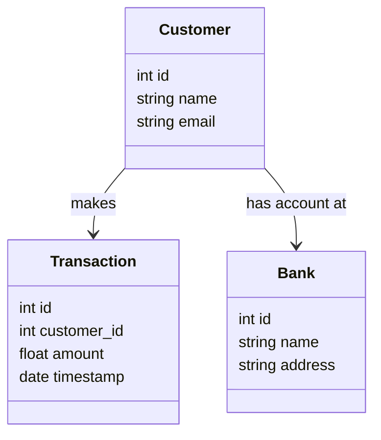
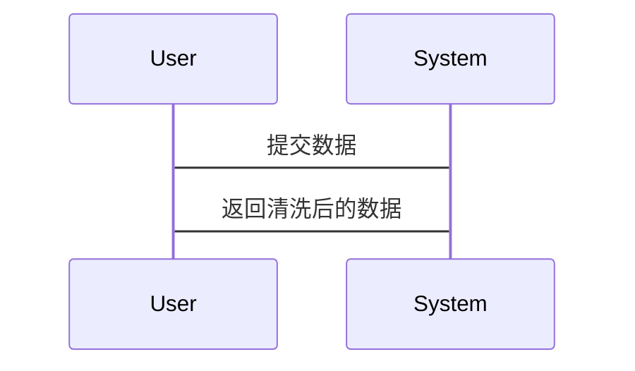

                 


# 《金融数据质量自动化控制与修复平台》

## 关键词：
金融数据质量、数据清洗、特征工程、数据质量管理、数据修复、数据完整性

## 摘要：
本文详细探讨了金融数据质量自动化控制与修复平台的构建与应用。从数据质量问题的背景出发，分析了数据不完整、错误和不一致等问题对金融业务的影响。通过介绍数据质量管理的核心概念，如完整性、一致性、准确性和及时性，阐述了数据清洗和特征工程的流程。基于机器学习的算法，构建了数据修复模型，展示了如何通过系统架构设计实现数据质量管理平台的自动化运行。通过实战案例，验证了该平台在金融数据处理中的有效性，为金融机构提供了可靠的数据质量管理解决方案。

---

## 第1章: 金融数据质量控制的背景与问题

### 1.1 问题背景
#### 1.1.1 金融数据的重要性
金融数据是金融机构运营的核心资产，其质量和准确性直接影响决策的正确性。例如，错误的数据可能导致投资失误或信用评估失败，进而引发严重的经济损失。

#### 1.1.2 数据质量问题的现状
当前金融数据面临多重挑战，包括数据来源多样化、数据格式不统一、数据录入错误等。这些问题导致数据清洗和修复工作耗时且复杂。

#### 1.1.3 数据质量问题对企业的影响
数据质量问题可能导致交易错误、合规风险和客户信任度下降。例如，错误的数据可能导致企业做出错误的投资决策，进而影响企业声誉和财务状况。

### 1.2 问题描述
#### 1.2.1 数据不完整性的表现
数据缺失是常见的问题，例如某些字段未填写或数据未完全加载。这种缺失可能影响数据分析的准确性。

#### 1.2.2 数据错误的类型
数据错误包括输入错误、格式错误、逻辑错误等。例如，日期格式不统一可能导致数据分析错误。

#### 1.2.3 数据一致性的挑战
数据一致性是指同一数据在不同系统中保持一致。例如，客户信息在不同业务系统中的不一致可能导致操作错误。

### 1.3 数据质量控制的目标与方法
#### 1.3.1 数据质量管理的目标
数据质量管理的目标包括提高数据准确性、完整性、一致性和及时性，降低数据错误率。

#### 1.3.2 数据质量管理的主要方法
数据质量管理的方法包括数据清洗、数据匹配、数据转换、数据增强等。例如，使用正则表达式清洗数据中的错误格式。

#### 1.3.3 数据质量管理的行业标准
金融行业常用的数据质量管理标准包括ISO 30100和CMMI，这些标准为数据质量管理提供了规范和指导。

### 1.4 金融数据质量控制的边界与外延
#### 1.4.1 数据质量控制的边界
数据质量控制的边界包括数据来源、数据处理流程和数据存储位置。例如，数据清洗仅针对特定字段。

#### 1.4.2 数据质量控制的外延
数据质量控制的外延包括数据安全、数据隐私和数据生命周期管理。例如，确保数据在处理过程中不被泄露。

#### 1.4.3 数据质量控制与其他领域的关联
数据质量控制与数据分析、数据挖掘和数据可视化密切相关。例如，高质量的数据是数据分析的基础。

### 1.5 数据质量控制的核心概念与结构
#### 1.5.1 核心概念的定义
数据完整性：数据无缺失；数据一致性：数据格式统一；数据准确性：数据真实反映实际情况；数据及时性：数据及时更新。

#### 1.5.2 数据质量管理的核心要素
数据完整性、数据一致性、数据准确性、数据及时性、数据安全性。

#### 1.5.3 数据质量管理的ER实体关系图
```mermaid
erDiagram
    customer[CUSTOMER] {
        +int id
        +string name
        +string email
    }
    transaction[TRANSACTION] {
        +int id
        +int customer_id
        +float amount
        +date timestamp
    }
    bank[ BANK] {
        +int id
        +string name
        +string address
    }
    customer --> transaction: "makes"
    customer --> bank: "has account at"
```

---

## 第2章: 数据质量管理的核心概念与联系

### 2.1 数据质量管理的原理
#### 2.1.1 数据质量管理的基本原理
数据质量管理包括数据识别、数据评估、数据清洗、数据转换和数据验证五个步骤。例如，识别数据中的错误格式并进行清洗。

#### 2.1.2 数据质量管理的关键步骤
数据清洗：删除或修正错误数据；数据转换：将数据转换为统一格式；数据验证：验证数据是否符合要求。

#### 2.1.3 数据质量管理的实施框架
数据质量管理的实施框架包括数据采集、数据处理、数据存储和数据应用四个阶段。

### 2.2 数据质量管理的核心要素
#### 2.2.1 数据完整性
数据完整性是指数据无缺失。例如，检查每个记录的必填字段是否填写。

#### 2.2.2 数据一致性
数据一致性是指数据格式统一。例如，确保所有日期都采用相同的格式。

#### 2.2.3 数据准确性
数据准确性是指数据真实反映实际情况。例如，检查交易金额是否正确。

#### 2.2.4 数据及时性
数据及时性是指数据及时更新。例如，确保最新的交易数据及时录入系统。

#### 2.2.5 数据安全性
数据安全性是指数据在处理过程中不被泄露或篡改。例如，使用加密技术保护数据。

### 2.3 数据质量管理的特征对比
#### 2.3.1 数据完整性与数据一致性的对比
数据完整性关注数据的无缺失，数据一致性关注数据格式统一。例如，完整性检查每个字段是否填写，一致性检查字段格式是否统一。

#### 2.3.2 数据准确性与数据及时性的对比
数据准确性关注数据内容的正确性，数据及时性关注数据的更新频率。例如，准确性检查交易金额是否正确，及时性检查数据是否及时更新。

#### 2.3.3 数据安全性与其他数据质量特征的对比
数据安全性关注数据的安全性，与其他特征如完整性、一致性等无直接关系。例如，数据安全性确保数据不被非法访问，而数据完整性确保数据无缺失。

### 2.4 数据质量管理的ER实体关系图
```mermaid
erDiagram
    customer[CUSTOMER] {
        +int id
        +string name
        +string email
    }
    transaction[TRANSACTION] {
        +int id
        +int customer_id
        +float amount
        +date timestamp
    }
    bank[ BANK] {
        +int id
        +string name
        +string address
    }
    customer --> transaction: "makes"
    customer --> bank: "has account at"
```

---

## 第3章: 数据清洗与特征工程

### 3.1 数据清洗的流程
#### 3.1.1 数据清洗的步骤
1. 数据识别：确定数据来源和格式。
2. 数据评估：评估数据质量，发现错误和缺失。
3. 数据清洗：删除或修正错误数据。
4. 数据转换：将数据转换为统一格式。
5. 数据验证：验证数据清洗结果。

#### 3.1.2 数据清洗的方法
1. 删除重复数据：使用去重方法。
2. 处理缺失值：使用均值、中位数或删除方法。
3. 标准化格式：统一日期、金额等格式。
4. 删除异常值：使用统计方法或阈值过滤。

#### 3.1.3 数据清洗的数学模型
数据清洗的数学模型包括均值填充、中位数填充和回归填充。例如，使用均值填充缺失值：

$$
\text{新值} = \text{均值}
$$

### 3.2 特征工程的流程
#### 3.2.1 特征工程的核心步骤
1. 特征选择：选择对模型最重要的特征。
2. 特征提取：从数据中提取有用特征。
3. 特征转换：将特征转换为适合模型的形式。

#### 3.2.2 特征工程的方法
1. 特征选择：使用相关系数或LASSO回归选择特征。
2. 特征提取：使用PCA进行降维。
3. 特征转换：使用标准化或归一化方法。

#### 3.2.3 特征工程的数学模型
特征工程的数学模型包括主成分分析（PCA）：

$$
\text{主成分} = \sum_{i=1}^{n} \lambda_i \cdot x_i
$$

### 3.3 数据修复的数学模型
#### 3.3.1 数据修复的目标
数据修复的目标是纠正数据中的错误或不一致。例如，修复错误的交易金额。

#### 3.3.2 数据修复的算法
数据修复的算法包括回归模型和聚类模型。例如，使用线性回归模型预测正确值：

$$
y = a x + b
$$

---

## 第4章: 系统分析与架构设计

### 4.1 系统分析
#### 4.1.1 问题场景介绍
金融数据质量管理系统的应用场景包括银行、证券公司和保险公司。例如，银行需要管理客户的交易数据。

#### 4.1.2 项目介绍
金融数据质量管理系统的目的是提高数据质量，减少数据错误，提高数据分析的准确性。

### 4.2 系统功能设计
#### 4.2.1 领域模型


#### 4.2.2 系统架构设计


#### 4.2.3 系统接口设计
系统接口包括数据录入接口、数据清洗接口和数据修复接口。例如，数据清洗接口接收原始数据并返回清洗后的数据。

#### 4.2.4 系统交互设计


---

## 第5章: 项目实战

### 5.1 环境安装
项目实战需要安装Python、Pandas、Scikit-learn和Jupyter Notebook。例如，使用以下命令安装Python库：

```bash
pip install pandas scikit-learn
```

### 5.2 核心代码实现
#### 5.2.1 数据清洗代码
```python
import pandas as pd

# 加载数据
df = pd.read_csv('data.csv')

# 处理缺失值
df['amount'].fillna(df['amount'].mean(), inplace=True)

# 标准化日期格式
df['timestamp'] = pd.to_datetime(df['timestamp'])
```

#### 5.2.2 数据修复代码
```python
from sklearn.linear_model import LinearRegression

# 训练模型
model = LinearRegression()
model.fit(X_train, y_train)

# 预测修复值
y_pred = model.predict(X_test)
```

### 5.3 代码应用解读与分析
#### 5.3.1 数据清洗代码解读
上述代码首先加载数据，然后使用均值填充缺失值，最后将日期格式标准化。这有助于提高数据质量。

#### 5.3.2 数据修复代码解读
上述代码使用线性回归模型预测修复值。通过训练模型，可以自动修复数据中的错误。

### 5.4 实际案例分析
#### 5.4.1 案例背景
假设某银行的交易数据中存在缺失的交易金额。通过数据清洗和修复，可以恢复这些缺失的金额。

#### 5.4.2 数据清洗与修复过程
1. 加载数据并识别缺失值。
2. 使用均值填充缺失金额。
3. 训练模型预测修复值。
4. 验证修复结果。

#### 5.4.3 数据修复结果
修复后的数据准确反映了实际交易金额，提高了数据分析的准确性。

### 5.5 项目小结
通过项目实战，验证了数据清洗和修复算法的有效性。数据清洗和修复是提高数据质量的关键步骤。

---

## 第6章: 总结与展望

### 6.1 总结
#### 6.1.1 数据质量管理的重要性和作用
数据质量管理是金融业务的基础，直接影响决策的正确性。

#### 6.1.2 数据质量管理的实施步骤
数据质量管理的实施包括数据清洗、数据转换和数据验证三个步骤。

### 6.2 数据质量管理的最佳实践
#### 6.2.1 数据质量管理的实施框架
数据质量管理的实施框架包括数据识别、数据评估、数据清洗、数据转换和数据验证。

#### 6.2.2 数据质量管理的注意事项
数据质量管理需要注意数据安全、数据隐私和数据生命周期管理。

### 6.3 数据质量管理的未来展望
#### 6.3.1 数据质量管理技术的发展趋势
数据质量管理技术将更加智能化和自动化，例如使用AI技术自动识别和修复数据错误。

#### 6.3.2 数据质量管理的应用前景
数据质量管理将在金融、医疗和教育等领域得到广泛应用，帮助组织提高数据质量。

### 6.4 小结
数据质量管理是金融业务的重要组成部分，通过实施数据质量管理，可以提高数据质量，降低数据错误率，提高数据分析的准确性。

---

## 附录: 拓展阅读

### 附录A: 数据质量管理的工具与技术
数据质量管理的工具包括DataCleaner、Great Expectations和Pandas。例如，使用Pandas进行数据清洗和修复。

### 附录B: 数据质量管理的行业标准
数据质量管理的行业标准包括ISO 30100和CMMI，这些标准为数据质量管理提供了规范和指导。

### 附录C: 数据质量管理的常见问题
数据质量管理的常见问题包括数据缺失、数据错误和数据不一致。例如，如何处理数据中的异常值。

---

# 结语
金融数据质量自动化控制与修复平台是提高数据质量的重要工具，通过实施数据质量管理，可以降低数据错误率，提高数据分析的准确性，为金融机构提供可靠的数据支持。未来，随着技术的发展，数据质量管理将更加智能化和自动化，为金融业务的发展提供更强大的支持。

