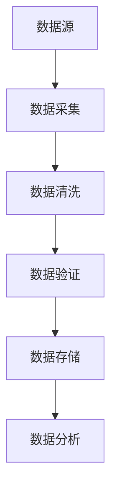
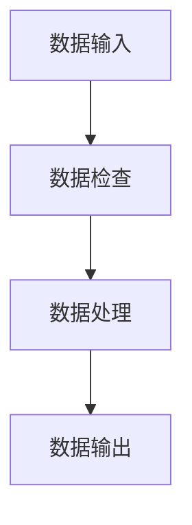
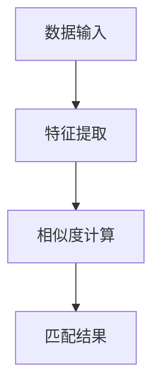
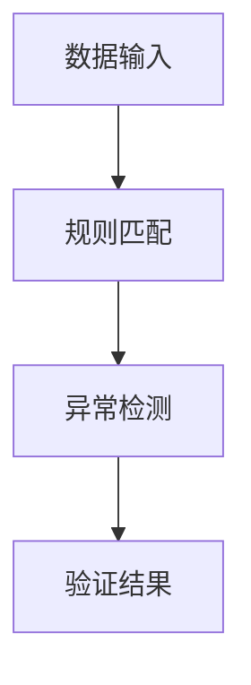
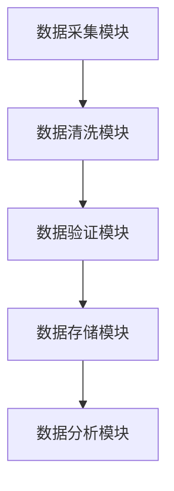
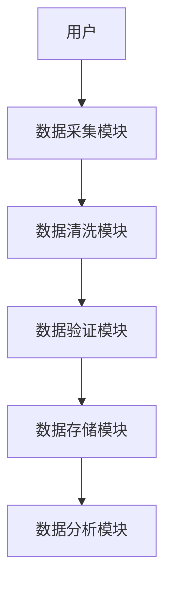

                 


# 《金融数据质量自动化控制平台》

> 关键词：金融数据，数据质量管理，自动化控制，数据清洗，数据验证，系统架构

> 摘要：本文详细探讨了金融数据质量自动化控制平台的设计与实现，从数据质量的核心概念到系统架构，从算法原理到项目实战，系统性地分析了平台的构建过程。通过实际案例分析和最佳实践，本文为金融行业的数据质量管理提供了新的思路和解决方案。

---

# 第1章 金融数据质量概述

## 1.1 金融数据质量的重要性

### 1.1.1 数据质量的核心概念

- 数据完整性
- 数据准确性
- 数据一致性
- 数据及时性
- 数据规范性

### 1.1.2 数据质量管理的背景

- 金融行业对数据的依赖
- 数据质量问题的严重性
- 数据质量管理的必要性

### 1.1.3 金融数据质量对业务的影响

- 数据错误的后果
- 数据质量对决策的影响
- 数据质量对合规性的影响

## 1.2 数据质量管理的目标与原则

### 1.2.1 数据质量管理的目标

- 确保数据的准确性
- 提高数据的可用性
- 降低数据错误率

### 1.2.2 数据质量管理的原则

- 数据质量管理的系统性
- 数据质量管理的持续性
- 数据质量管理的合规性

## 1.3 数据质量管理的核心要素

### 1.3.1 数据质量管理的维度

- 数据完整性
- 数据准确性
- 数据一致性
- 数据及时性
- 数据规范性

### 1.3.2 数据质量管理的流程

- 数据采集
- 数据清洗
- 数据验证
- 数据存储
- 数据分析

## 1.4 本章小结

---

# 第2章 数据质量管理的核心概念分析

## 2.1 数据质量维度分析

### 2.1.1 数据完整性

- 数据完整性的重要性
- 数据完整性的影响因素
- 数据完整性检查的方法

### 2.1.2 数据准确性

- 数据准确性的定义
- 数据准确性的影响因素
- 数据准确性验证的方法

### 2.1.3 数据一致性

- 数据一致性的定义
- 数据一致性的检查方法
- 数据一致性调整的策略

### 2.1.4 数据及时性

- 数据及时性的定义
- 数据及时性的影响因素
- 数据及时性管理的策略

### 2.1.5 数据规范性

- 数据规范性的定义
- 数据规范性的影响因素
- 数据规范性检查的方法

## 2.2 数据质量管理流程分析

### 2.2.1 数据采集阶段的质量控制

- 数据采集的流程
- 数据采集的质量问题
- 数据采集质量控制的方法

### 2.2.2 数据清洗阶段的处理流程

- 数据清洗的步骤
- 数据清洗的方法
- 数据清洗的质量控制

### 2.2.3 数据验证阶段的规则应用

- 数据验证的规则
- 数据验证的流程
- 数据验证的结果分析

## 2.3 数据质量核心要素的对比分析

### 2.3.1 数据维度对比表格

| 数据维度 | 定义 | 影响因素 | 检查方法 |
|----------|------|----------|----------|
| 完整性   | 数据无缺失 | 数据采集过程中的错误 | 数据检查工具 |
| 准确性   | 数据正确无误 | 数据来源的可靠性 | 数据校验算法 |
| 一致性   | 数据内部协调 | 数据格式的统一性 | 数据比对工具 |
| 及时性   | 数据更新及时 | 数据采集的延迟 | 时间戳校验 |
| 规范性   | 数据符合规范 | 数据格式的合规性 | 正则表达式校验 |

### 2.3.2 数据实体关系图



## 2.4 本章小结

---

# 第3章 数据质量管理的算法原理

## 3.1 数据清洗算法

### 3.1.1 数据清洗的基本原理

- 数据清洗的目标
- 数据清洗的步骤
- 数据清洗的实现方法

### 3.1.2 数据清洗算法的实现



### 3.1.3 数据清洗的Python代码实现

```python
import pandas as pd

def data_cleaning(data):
    # 删除缺失值
    data = data.dropna()
    # 去重
    data = data.drop_duplicates()
    # 格式化处理
    data['date'] = pd.to_datetime(data['date'])
    return data
```

## 3.2 数据匹配算法

### 3.2.1 数据匹配的原理

- 数据匹配的目标
- 数据匹配的实现方法
- 数据匹配的算法选择

### 3.2.2 数据匹配算法的实现



### 3.2.3 数据匹配的Python代码实现

```python
from sklearn.metrics.pairwise import cosine_similarity

def data_matching(data1, data2):
    # 特征提取
    features = data1[['name', 'age']]
    # 计算余弦相似度
    similarity = cosine_similarity(features)
    return similarity
```

## 3.3 数据验证算法

### 3.3.1 数据验证的原理

- 数据验证的目标
- 数据验证的实现方法
- 数据验证的规则制定

### 3.3.2 数据验证算法的实现



### 3.3.3 数据验证的Python代码实现

```python
import numpy as np

def data_validation(data):
    # 数据校验规则
    rules = {
        'age': (lambda x: x >= 0),
        'income': (lambda x: x >= 0)
    }
    # 应用规则
    for col, rule in rules.items():
        data[col] = data[col].apply(rule)
    return data
```

## 3.4 本章小结

---

# 第4章 系统分析与架构设计

## 4.1 项目背景与问题场景

### 4.1.1 项目背景

- 金融行业数据质量管理的需求
- 数据质量问题对业务的影响
- 数据质量管理平台的必要性

### 4.1.2 问题场景

- 数据源的多样性
- 数据格式的多样性
- 数据质量要求的多样性

## 4.2 系统功能设计

### 4.2.1 系统功能模块

- 数据采集模块
- 数据清洗模块
- 数据验证模块
- 数据存储模块
- 数据分析模块

### 4.2.2 系统功能流程


## 4.3 系统架构设计

### 4.3.1 系统架构图



### 4.3.2 系统交互设计



## 4.4 本章小结

---

# 第5章 项目实战

## 5.1 环境安装与配置

### 5.1.1 Python环境安装

- Python版本要求
- 依赖库安装
- 环境配置示例

### 5.1.2 数据源获取

- 数据集下载
- 数据集预处理
- 数据集加载

## 5.2 核心代码实现

### 5.2.1 数据采集模块

```python
import requests
import json

def fetch_data(url):
    response = requests.get(url)
    data = json.loads(response.text)
    return data
```

### 5.2.2 数据清洗模块

```python
def clean_data(data):
    # 删除缺失值
    data = data.dropna()
    # 去重
    data = data.drop_duplicates()
    return data
```

### 5.2.3 数据验证模块

```python
def validate_data(data):
    # 校验规则
    rules = {
        'age': (lambda x: x >= 0),
        'income': (lambda x: x >= 0)
    }
    # 应用规则
    for col, rule in rules.items():
        data[col] = data[col].apply(rule)
    return data
```

## 5.3 实际案例分析

### 5.3.1 案例背景

- 数据背景
- 业务需求
- 数据质量要求

### 5.3.2 案例实现

- 数据采集
- 数据清洗
- 数据验证
- 数据存储
- 数据分析

## 5.4 案例分析与解读

### 5.4.1 数据清洗结果分析

- 数据清洗前后的对比
- 数据清洗的效果评估
- 数据清洗的优化建议

### 5.4.2 数据验证结果分析

- 数据验证的规则应用
- 数据验证的结果解读
- 数据验证的优化方向

## 5.5 本章小结

---

# 第6章 最佳实践与总结

## 6.1 最佳实践

### 6.1.1 技术选型建议

- 数据采集工具的选择
- 数据清洗工具的选择
- 数据验证工具的选择

### 6.1.2 系统设计优化

- 系统架构的优化
- 系统性能的优化
- 系统安全的优化

## 6.2 总结与展望

### 6.2.1 本项目总结

- 项目目标的实现
- 项目成果的应用
- 项目经验的总结

### 6.2.2 未来展望

- 数据质量管理的未来趋势
- 数据质量管理技术的发展方向
- 数据质量管理平台的优化方向

## 6.3 注意事项

### 6.3.1 数据质量管理中的常见问题

- 数据源的质量问题
- 数据清洗中的边界条件
- 数据验证中的规则复杂性

### 6.3.2 数据质量管理中的解决方案

- 数据源的多样性处理
- 数据清洗中的鲁棒性设计
- 数据验证中的灵活性设计

## 6.4 拓展阅读

### 6.4.1 相关书籍推荐

- 数据质量管理的经典书籍
- 数据清洗的技术书籍
- 数据验证的实战书籍

### 6.4.2 相关技术文档

- 数据质量管理的技术文档
- 数据清洗的算法文档
- 数据验证的规则文档

## 6.5 本章小结

---

# 结语

## 7.1 项目总结

## 7.2 感谢与致谢

---

通过以上目录大纲，您可以逐步撰写《金融数据质量自动化控制平台》的技术博客文章，确保内容详实、结构清晰、逻辑严谨。

