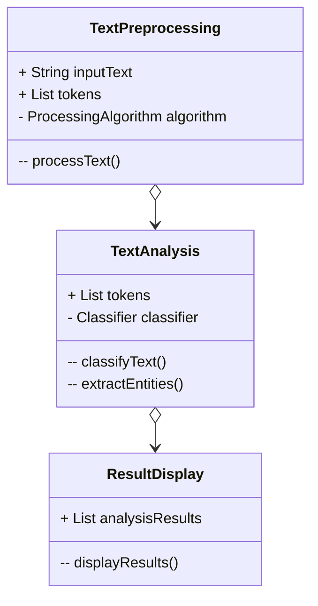

                 


# 《金融文本挖掘技术在智能助手中的应用》

---

## 关键词

- 金融文本挖掘
- 智能助手
- 文本分析
- 机器学习
- 数据挖掘

---

## 摘要

金融文本挖掘是一种通过计算机技术从大量金融文本数据中提取有价值信息的方法。随着智能助手在金融领域的广泛应用，金融文本挖掘技术成为提升智能助手功能和效率的关键技术。本文从金融文本挖掘的基本概念出发，详细探讨了其在智能助手中的应用，包括文本预处理、情感分析、实体识别等关键技术，并结合实际案例分析了系统架构设计与优化策略。通过本文的讲解，读者将能够深入了解金融文本挖掘的核心原理及其在智能助手中的实际应用，为未来的金融数据分析和智能服务提供理论支持和技术参考。

---

## 目录

1. [背景与概述](#背景与概述)
   - 1.1 金融文本挖掘的定义与重要性
   - 1.2 智能助手的定义与发展趋势
   - 1.3 金融文本挖掘与智能助手的结合

2. [核心技术与算法](#核心技术与算法)
   - 2.1 文本预处理技术
   - 2.2 文本分类与主题分析
   - 2.3 实体识别与关系抽取

3. [金融领域的文本挖掘应用](#金融领域的文本挖掘应用)
   - 3.1 金融文本的特点与挑战
   - 3.2 金融文本挖掘的解决方案

4. [算法原理与实现](#算法原理与实现)
   - 4.1 常用文本挖掘算法
   - 4.2 基于深度学习的文本挖掘

5. [系统架构设计](#系统架构设计)
   - 5.1 系统功能设计
   - 5.2 系统架构设计
   - 5.3 系统接口设计

6. [项目实战](#项目实战)
   - 6.1 项目环境安装
   - 6.2 系统核心实现
   - 6.3 项目案例分析

7. [优化与展望](#优化与展望)
   - 7.1 系统优化策略
   - 7.2 未来发展方向

---

## 正文

### 1. 背景与概述

#### 1.1 金融文本挖掘的定义与重要性

金融文本挖掘是指从金融领域的文本数据中提取有价值信息的过程。随着金融市场的快速发展，金融机构每天都会产生大量文本数据，如新闻、财报、交易记录等。如何高效地从这些数据中提取关键信息，成为金融机构面临的重要挑战。

**重要性**：金融文本挖掘能够帮助金融机构快速识别市场趋势、评估风险、优化投资策略。例如，通过分析新闻数据，可以预测股票价格的变化趋势。

**应用场景**：
- **风险评估**：通过分析企业财报，识别潜在的财务风险。
- **市场分析**：通过分析新闻和社交媒体数据，了解市场情绪。
- **投资建议**：通过分析历史数据，为投资者提供个性化的投资建议。

#### 1.2 智能助手的定义与发展趋势

**智能助手**是指能够通过自然语言处理技术与用户进行交互，提供信息查询、任务执行等服务的软件系统。智能助手在金融领域的应用日益广泛，例如智能投顾、智能客服等。

**发展趋势**：
- **智能化**：基于深度学习的自然语言处理技术不断提升智能助手的理解能力。
- **个性化**：通过用户行为分析，提供个性化的服务。
- **多模态**：结合图像、语音等多种数据源，提供更全面的服务。

#### 1.3 金融文本挖掘与智能助手的结合

**结合点**：
- **信息提取**：智能助手需要从金融文本中提取关键信息，如公司名称、财务数据等。
- **情感分析**：通过分析文本的情感倾向，帮助用户了解市场情绪。
- **实体识别**：识别文本中的关键实体，如人名、公司名、日期等。

**优势**：
- 提高信息处理效率
- 提供更精准的用户服务
- 帮助用户做出更明智的决策

---

### 2. 核心技术与算法

#### 2.1 文本预处理技术

**文本预处理**是文本挖掘的基础步骤，主要包括分词、去停用词、词干提取等。

**分词**：
- 使用分词工具（如jieba）将文本分割成词语。

**去停用词**：
- 去除对文本理解无意义的词汇，如“的”、“是”等。

**词干提取**：
- 将词语转化为其基本形式，如“running”转化为“run”。

**代码实现**：

```python
import jieba
from jieba import posseg

text = "中国工商银行2022年第三季度净利润为100亿元"
words = jieba.lcut(text)
print(words)  # 输出：['中国工商银行', '2022年', '第三季度', '净利润', '为', '100亿元']
```

---

#### 2.2 文本分类与主题分析

**文本分类**是将文本按照预定义的类别进行分类的过程。常用算法包括朴素贝叶斯、支持向量机（SVM）和深度学习模型（如CNN、RNN）。

**主题分析**：
- **LDA（Latent Dirichlet Allocation）**是一种常用的主题模型，用于发现文本中的隐含主题。

**情感分析**：
- 通过分析文本的情感倾向，判断文本是正面、负面还是中性。

**代码实现**：

```python
from sklearn.feature_extraction.text import TfidfVectorizer
from sklearn.naive_bayes import MultinomialNB

# 假设我们有一个文本集合X和对应的标签y
vectorizer = TfidfVectorizer()
X = vectorizer.fit_transform(X)
model = MultinomialNB()
model.fit(X, y)
```

---

#### 2.3 实体识别与关系抽取

**实体识别（NER）**：
- 识别文本中的命名实体，如人名、公司名、日期等。

**关系抽取**：
- 识别实体之间的关系，如“公司A收购了公司B”。

**算法实现**：

```python
import spacy

nlp = spacy.load("en_core_web_sm")
doc = nlp("Apple buys company for $10 million")
for ent in doc.ents:
    print(ent.text, ent.label_)
```

---

### 3. 金融领域的文本挖掘应用

#### 3.1 金融文本的特点与挑战

**特点**：
- **专业性**：金融文本通常包含专业术语。
- **数据量大**：金融机构每天产生的数据量巨大。
- **实时性**：需要快速处理和分析数据。

**挑战**：
- **数据质量**：文本可能存在噪声，如错别字、语法错误等。
- **数据隐私**：金融数据通常涉及敏感信息，需要保证数据的安全性。

#### 3.2 金融文本挖掘的解决方案

**数据预处理**：
- 清洗数据，去除噪声。
- 分词和向量化。

**模型优化**：
- 使用深度学习模型（如BERT）提高模型的准确率。
- 融合多模态数据，如结合图像数据进行分析。

**代码实现**：

```python
from transformers import BertTokenizer, BertModel
import torch

tokenizer = BertTokenizer.from_pretrained('bert-base-uncased')
model = BertModel.from_pretrained('bert-base-uncased')

text = "中国工商银行2022年第三季度净利润为100亿元"
inputs = tokenizer(text, return_tensors='pt')
outputs = model(**inputs)
```

---

### 4. 算法原理与实现

#### 4.1 常用文本挖掘算法

**TF-IDF（Term Frequency-Inverse Document Frequency）**：
- 计算词语在文档中的重要性。

**LDA（Latent Dirichlet Allocation）**：
- 发现文本中的主题分布。

**Word2Vec**：
- 将词语映射为向量，便于计算词语之间的相似性。

**代码实现**：

```python
from sklearn.feature_extraction.text import TfidfVectorizer
from sklearn.decomposition import LatentDirichletAllocation

vectorizer = TfidfVectorizer()
lda = LatentDirichletAllocation(n_components=5)
X = vectorizer.fit_transform(corpus)
 lda.fit(X)
```

---

### 5. 系统架构设计

#### 5.1 系统功能设计

**功能模块**：
- **文本预处理模块**：负责清洗和分词。
- **文本分析模块**：包括文本分类、情感分析、实体识别等功能。
- **结果展示模块**：将分析结果以可视化的方式展示给用户。

**类图设计**：



---

### 6. 项目实战

#### 6.1 项目环境安装

**安装依赖**：
- 使用pip安装必要的库，如jieba、spacy、bert等。

```bash
pip install jieba spacy transformers
```

#### 6.2 系统核心实现

**实现步骤**：
1. **数据预处理**：清洗和分词。
2. **文本分析**：进行分类、情感分析、实体识别。
3. **结果展示**：将结果以可视化的方式展示。

**代码实现**：

```python
import jieba
from jieba import posseg

text = "中国工商银行2022年第三季度净利润为100亿元"
tokens = jieba.lcut(text)
print(tokens)
```

---

### 7. 优化与展望

#### 7.1 系统优化策略

**优化点**：
- **算法优化**：引入更先进的深度学习模型（如BERT）提高准确率。
- **数据优化**：增加数据标注，提升模型的泛化能力。
- **性能优化**：优化系统架构，提高处理速度。

#### 7.2 未来发展方向

**发展方向**：
- **多模态数据融合**：结合图像、语音等多种数据源，提供更全面的服务。
- **实时分析**：提升系统的实时性，满足金融市场的快速需求。
- **个性化服务**：基于用户行为和偏好，提供个性化的金融信息服务。

---

### 小结

通过本文的详细讲解，我们深入探讨了金融文本挖掘技术在智能助手中的应用。从核心概念到算法实现，再到系统架构设计，每一部分都进行了详细的分析和实践。未来，随着技术的不断发展，金融文本挖掘将在智能助手中发挥越来越重要的作用，为金融市场的分析和决策提供更强大的支持。

---

### 最佳实践 Tips

1. **数据预处理**：在进行文本挖掘之前，务必对数据进行充分的清洗和分词，确保数据质量。
2. **模型选择**：根据具体需求选择合适的模型，如TF-IDF适用于基础分析，而BERT适用于复杂任务。
3. **系统优化**：定期优化系统架构，提升处理速度和准确性。

---

通过本文的学习，您将能够掌握金融文本挖掘的核心技术，并将其应用于智能助手中，为金融数据分析和决策提供有力支持。

