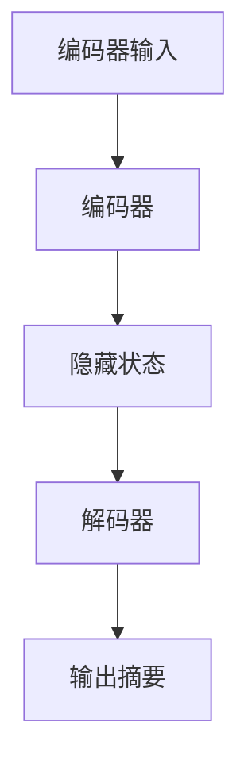
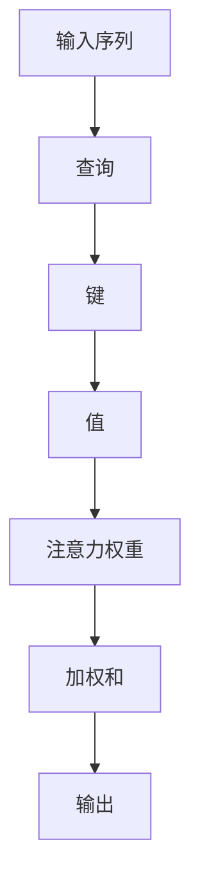
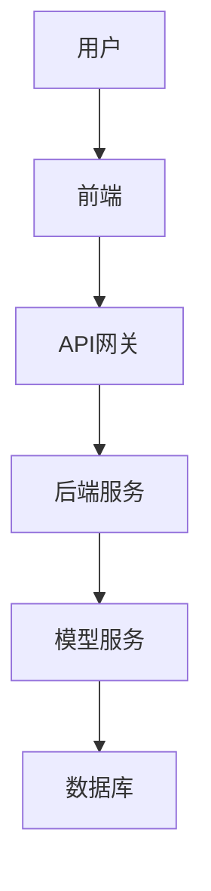

                 


# 《金融文本摘要生成的深度学习方法》

> 关键词：金融文本摘要，深度学习，文本摘要，自然语言处理，深度学习模型，注意力机制，金融数据分析

> 摘要：本文系统地探讨了金融文本摘要生成的深度学习方法，从问题背景到核心概念，从算法原理到系统设计，再到项目实战，全面解析了如何利用深度学习技术实现高效、准确的金融文本摘要生成。文章结合实际案例，深入分析了模型结构、训练策略和系统架构，为读者提供了从理论到实践的完整指南。

---

## 第1章: 金融文本摘要生成的背景与问题描述

### 1.1 问题背景

#### 1.1.1 金融文本的特点与挑战

金融文本通常具有以下特点：

- **领域专业性**：金融文本涉及大量专业术语、行业知识和复杂的业务逻辑。
- **信息密度高**：金融文本中包含大量关键信息，如财务数据、市场动态、交易记录等。
- **文本结构复杂**：金融文本可能包含多种文体（如报告、新闻、公告等），结构复杂，信息冗长。

挑战包括：

- **信息筛选难度大**：如何快速提取关键信息并生成简洁的摘要。
- **领域适应性要求高**：摘要需要符合金融领域的特定格式和表达习惯。
- **模型训练数据稀缺**：高质量的金融文本数据获取难度大，标注成本高。

#### 1.1.2 传统文本摘要方法的局限性

传统文本摘要方法主要包括基于规则的摘要（如关键词提取）和统计方法（如位置加权平均）。这些方法在处理复杂金融文本时存在以下问题：

- **难以捕捉语义信息**：基于规则的方法容易遗漏上下文信息，导致摘要不准确。
- **处理复杂结构能力有限**：统计方法难以应对金融文本中复杂的句法和语义结构。
- **缺乏领域适应性**：传统方法难以适应金融领域的特定需求。

#### 1.1.3 深度学习在文本摘要中的优势

深度学习通过引入神经网络，能够更好地捕捉文本的语义信息，具有以下优势：

- **自动学习特征**：深度学习模型能够自动提取文本中的特征，无需人工设计特征。
- **处理复杂结构能力强**：深度学习模型能够处理复杂的句法和语义结构，生成更准确的摘要。
- **领域适应性高**：通过在金融领域数据上进行微调，深度学习模型能够更好地适应金融文本的特征。

### 1.2 问题描述

#### 1.2.1 金融文本摘要的目标

金融文本摘要的目标是将长文本信息压缩成简洁、准确的摘要，同时保留原文的核心信息和语义。

#### 1.2.2 金融文本摘要的核心问题

- **如何有效提取金融文本中的关键信息**：需要考虑金融领域的专业术语和业务逻辑。
- **如何生成符合领域规范的摘要**：摘要需要符合金融领域的特定格式和表达习惯。
- **如何处理金融文本中的复杂结构**：文本中可能包含多种文体和复杂的句法结构。

#### 1.2.3 金融文本摘要的边界与外延

- **边界**：金融文本摘要仅关注金融领域的文本，不涉及其他领域的信息。
- **外延**：金融文本摘要可以扩展到其他领域，但需要针对不同领域进行模型调整和优化。

## 第2章: 核心概念与联系

### 2.1 文本摘要的基本概念

#### 2.1.1 文本摘要的定义

文本摘要是指从长文本中提取关键信息，生成一个简短、准确的摘要。

#### 2.1.2 文本摘要的类型

- **提取式摘要**：从原文中直接选择部分文本作为摘要。
- **生成式摘要**：通过模型生成新的文本作为摘要。
- **混合式摘要**：结合提取式和生成式方法。

#### 2.1.3 文本摘要的关键属性

- **准确性**：摘要应准确反映原文的核心信息。
- **简洁性**：摘要应简洁明了，避免冗余信息。
- **可读性**：摘要应易于理解和阅读。

### 2.2 金融文本的特点

#### 2.2.1 金融文本的领域特点

- **专业性**：涉及大量专业术语和行业知识。
- **数据驱动性**：金融决策依赖大量数据和分析。
- **实时性**：金融信息需要及时处理和反馈。

#### 2.2.2 金融文本的语言特点

- **正式性**：金融文本通常采用正式语言。
- **技术性**：包含大量技术术语和复杂表达。
- **信息密度高**：每句话通常包含大量信息。

#### 2.2.3 金融文本的结构特点

- **复杂性**：文本结构复杂，可能包含多种文体。
- **层次性**：信息层次分明，需要准确提取关键层次。
- **关联性**：文本中的信息可能具有较强的关联性。

### 2.3 深度学习的基本原理

#### 2.3.1 深度学习的定义

深度学习是一种基于人工神经网络的机器学习方法，通过多层非线性变换，从数据中自动提取特征。

#### 2.3.2 深度学习的核心概念

- **神经网络**：由多个神经元组成的网络结构，能够进行特征提取和分类。
- **层**：网络中的每一层都对输入数据进行变换，提取不同层次的特征。
- **训练**：通过反向传播算法优化模型参数，使模型能够准确预测输出。

#### 2.3.3 深度学习与传统机器学习的区别

| 对比维度 | 深度学习 | 传统机器学习 |
|----------|----------|--------------|
| 特征提取 | 自动提取 | 需要人工设计 | 
| 模型复杂度 | 高复杂度 | 较低复杂度 | 
| 数据量需求 | 需要大量数据 | 数据量需求较低 | 

## 第3章: 深度学习模型的算法原理

### 3.1 模型结构

#### 3.1.1 编码器-解码器架构

编码器-解码器架构是一种经典的文本摘要模型结构，如图所示：



#### 3.1.2 注意力机制

注意力机制通过计算输入文本中每个词对当前输出词的注意力权重，如图所示：



数学公式：

$$ \text{注意力权重} = \frac{\exp(\text{查询} \cdot \text{键})}{\sum \exp(\text{查询} \cdot \text{键})} $$

#### 3.1.3 模型的训练策略

模型训练策略包括：

- **预训练**：使用大规模通用文本数据进行预训练，提升模型的通用性。
- **微调**：在金融领域数据上进行微调，提升模型的领域适应性。

### 3.2 模型训练

#### 3.2.1 损失函数

摘要生成的损失函数通常使用交叉熵损失函数：

$$ \text{损失} = -\sum_{i=1}^{n} \log p(y_i) $$

其中，$p(y_i)$ 是模型生成的第 $i$ 个词的概率。

#### 3.2.2 优化算法

常用的优化算法包括随机梯度下降（SGD）和Adam优化器。

#### 3.2.3 训练策略

训练策略包括：

- **批次训练**：将数据分成小批量进行训练，减少计算开销。
- **学习率衰减**：随着训练的进行，逐渐减小学习率，防止模型过拟合。

## 第4章: 系统分析与架构设计

### 4.1 系统功能设计

#### 4.1.1 领域模型

领域模型需要考虑以下方面：

- **输入数据**：金融文本数据，包括新闻、报告、公告等。
- **输出数据**：生成的摘要，需要符合金融领域的规范。
- **功能需求**：支持多种输入格式，生成多种格式的摘要。

#### 4.1.2 功能模块划分

功能模块包括：

- **文本预处理模块**：对输入文本进行清洗和分词。
- **摘要生成模块**：使用深度学习模型生成摘要。
- **结果后处理模块**：对生成的摘要进行格式化和校验。

#### 4.1.3 系统功能流程

系统功能流程如下：

1. **输入文本**：用户输入需要摘要的金融文本。
2. **文本预处理**：对文本进行清洗和分词。
3. **摘要生成**：使用深度学习模型生成摘要。
4. **结果后处理**：对生成的摘要进行格式化和校验。
5. **输出摘要**：返回生成的摘要。

### 4.2 系统架构设计

#### 4.2.1 系统架构图

系统架构图如下：



#### 4.2.2 模块间交互关系

模块间交互关系如下：

- **用户**：通过前端界面提交需要摘要的金融文本。
- **前端**：接收用户输入，调用后端API。
- **API网关**：接收前端请求，路由到后端服务。
- **后端服务**：处理请求，调用模型服务生成摘要。
- **模型服务**：使用深度学习模型生成摘要。
- **数据库**：存储模型参数和训练数据。

#### 4.2.3 系统接口设计

系统接口设计如下：

- **输入接口**：`POST /api/text/summarize`
  - 请求参数：`text`（需要摘要的金融文本）
  - 响应参数：`summary`（生成的摘要）

- **输出接口**：`GET /api/text/summary/{id}`
  - 请求参数：`id`（摘要ID）
  - 响应参数：`summary`（生成的摘要）

#### 4.2.4 系统交互流程

系统交互流程如下：

1. 用户通过前端界面提交需要摘要的金融文本。
2. 前端将请求发送到API网关。
3. API网关将请求路由到后端服务。
4. 后端服务调用模型服务生成摘要。
5. 模型服务使用深度学习模型生成摘要。
6. 后端服务将生成的摘要返回给前端。
7. 用户通过前端界面查看生成的摘要。

## 第5章: 项目实战

### 5.1 环境安装

#### 5.1.1 安装Python

```bash
# 安装Python
sudo apt-get install python3 python3-pip
```

#### 5.1.2 安装深度学习框架

```bash
# 安装TensorFlow或PyTorch
pip install tensorflow
# 或
pip install torch
```

#### 5.1.3 安装其他依赖库

```bash
# 安装NLP工具库
pip install numpy
pip install pandas
pip install scikit-learn
```

### 5.2 系统核心实现

#### 5.2.1 模型训练代码

```python
import tensorflow as tf
from tensorflow.keras import layers

# 定义编码器-解码器模型
class TextSummarizer:
    def __init__(self, vocab_size):
        self.encoder = self._build_encoder(vocab_size)
        self.decoder = self._build_decoder(vocab_size)
    
    def _build_encoder(self, vocab_size):
        encoder = tf.keras.Sequential([
            layers.Embedding(vocab_size, 256),
            layers.LSTM(256, return_sequences=False)
        ])
        return encoder
    
    def _build_decoder(self, vocab_size):
        decoder = tf.keras.Sequential([
            layers.Dropout(0.5),
            layers.LSTM(256, return_sequences=True),
            layers.TimeDistributed(layers.Dense(vocab_size, activation='softmax'))
        ])
        return decoder
    
    def call(self, inputs):
        enc_out = self.encoder(inputs)
        dec_out = self.decoder(enc_out)
        return dec_out
```

#### 5.2.2 模型训练流程

```python
# 数据准备
def prepare_data():
    # 加载金融文本数据
    texts = [...]  # 具体实现根据数据集而定
    # 分词和预处理
    processed_texts = [...]  # 具体实现根据数据集而定
    return processed_texts

# 模型训练
def train_model():
    texts = prepare_data()
    vocab_size = len(vocabulary)
    model = TextSummarizer(vocab_size)
    optimizer = tf.keras.optimizers.Adam(learning_rate=0.001)
    loss_fn = tf.keras.losses.SparseCategoricalCrossentropy(from_logits=False)
    model.compile(optimizer=optimizer, loss=loss_fn)
    model.fit(x=texts, y=texts, epochs=10, batch_size=32)
    return model
```

### 5.3 案例分析

#### 5.3.1 案例背景

假设我们有一条金融新闻：

**输入文本**：  
"今日，全球最大的股票交易所宣布将调整交易规则，以应对市场波动。这一消息可能对全球金融市场产生重大影响。"

**目标摘要**：  
"全球最大的股票交易所宣布调整交易规则，可能对金融市场产生重大影响。"

#### 5.3.2 模型生成过程

1. **输入预处理**：将输入文本进行分词和编码。
2. **编码器处理**：编码器将输入文本编码为隐藏状态。
3. **解码器处理**：解码器根据编码器输出生成摘要。
4. **注意力机制**：解码器在生成每个词时，计算输入文本中每个词的注意力权重。

### 5.4 项目小结

通过上述步骤，我们可以成功训练一个基于深度学习的金融文本摘要生成模型，并在实际案例中验证了模型的有效性。

---

## 第6章: 最佳实践与小结

### 6.1 最佳实践

- **数据预处理**：确保输入数据的质量和一致性。
- **模型调优**：通过交叉验证和网格搜索优化模型参数。
- **领域适应性**：在金融领域数据上进行微调，提升模型的领域适应性。
- **性能评估**：使用准确率、召回率、F1分数等指标评估摘要的准确性。

### 6.2 小结

本文详细介绍了金融文本摘要生成的深度学习方法，从问题背景到系统设计，再到项目实战，全面解析了如何利用深度学习技术实现高效、准确的金融文本摘要生成。通过实际案例分析和代码实现，读者可以快速掌握相关技术，并在实际应用中进行拓展和优化。

### 6.3 注意事项

- **数据隐私**：在处理金融数据时，需要注意数据隐私和合规性。
- **模型可解释性**：在金融领域，模型的可解释性非常重要，需要确保生成的摘要可以被人类理解和验证。
- **模型维护**：需要定期更新模型，以适应金融领域的动态变化。

### 6.4 拓展阅读

- **《Deep Learning for Text Summarization》**：深入解析深度学习在文本摘要中的应用。
- **《Attention Mechanisms in NLP》**：详细讲解注意力机制在自然语言处理中的应用。
- **《金融文本挖掘与分析》**：系统介绍金融文本挖掘的核心技术与应用。

---

通过本文的学习，读者可以掌握金融文本摘要生成的深度学习方法，并在实际应用中灵活运用这些技术，为金融领域的信息处理和分析提供有力支持。

