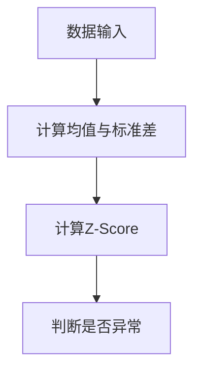
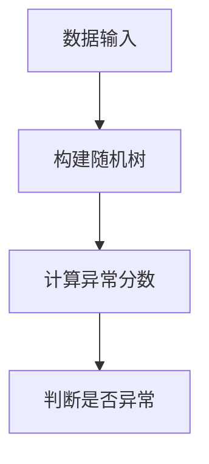
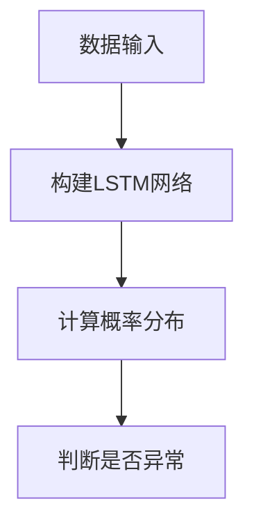
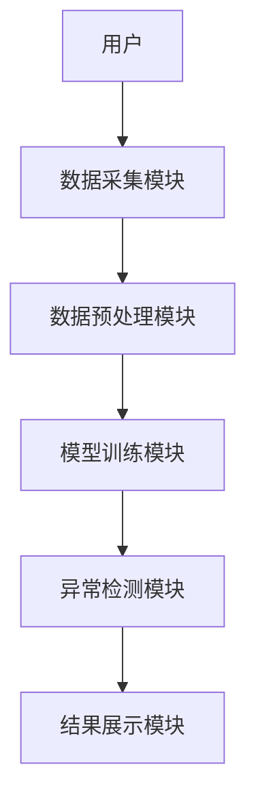
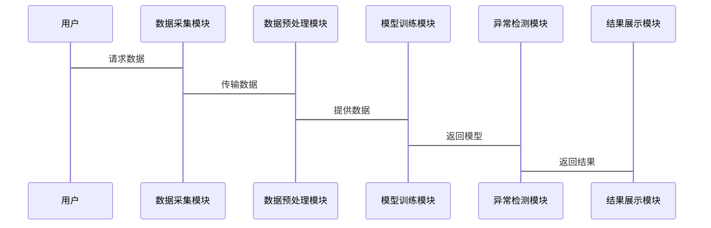

                 


# 《金融时序数据异常检测模型》

> 关键词：金融时序数据，异常检测，机器学习，深度学习，统计模型

> 摘要：本文系统地介绍了金融时序数据异常检测的核心概念、算法原理、系统架构及实际应用。从基础概念到高级算法，从理论分析到实践案例，全面解析了如何在金融领域中有效识别异常数据，为金融风险控制和决策提供支持。

---

## 第一部分: 金融时序数据异常检测的背景与挑战

### 第1章: 金融时序数据异常检测的背景与挑战

#### 1.1 金融时序数据的基本概念
##### 1.1.1 金融数据的定义与特点
金融数据是指与金融市场相关的时间序列数据，通常包括股票价格、指数、汇率、利率等。这些数据具有以下特点：
- **连续性**：数据按时间顺序排列。
- **波动性**：金融市场的数据往往波动较大。
- **依赖性**：当前数据与过去数据密切相关。
- **非线性**：市场行为可能导致数据呈现非线性变化。

##### 1.1.2 时序数据的特性与分类
时序数据可以通过多种方式分类：
- **平稳性**：数据的均值和方差在时间上保持不变。
- **趋势性**：数据随时间呈现上升或下降趋势。
- **周期性**：数据呈现周期性波动。

##### 1.1.3 异常检测在金融领域的应用价值
异常检测在金融领域的应用价值主要体现在以下几个方面：
1. **风险管理**：及时发现异常交易或市场波动，避免重大损失。
2. ** fraud detection**：识别欺诈行为。
3. **市场分析**：发现市场异动，辅助投资决策。

#### 1.2 异常检测的核心概念与问题描述
##### 1.2.1 异常检测的定义与分类
异常检测是指通过分析数据，识别出与正常数据显著不同的数据点或模式。在金融领域，异常检测可以分为以下几类：
- **点异常**：单个数据点的异常。
- **上下文异常**：在特定上下文中异常。
- **群体异常**：数据点与群体行为显著不同。

##### 1.2.2 金融时序数据异常检测的边界与外延
金融时序数据异常检测的边界包括：
- 数据范围：限定在金融领域。
- 时间范围：限定在一定时间段内。
- 异常类型：限定在特定的异常行为。

##### 1.2.3 异常检测的核心要素与概念结构
异常检测的核心要素包括：
- 数据源：金融时序数据。
- 检测方法：统计方法、机器学习方法等。
- 应用场景：风险管理、欺诈 detection等。

---

### 第2章: 金融时序数据异常检测的核心概念与联系

#### 2.1 核心概念原理
##### 2.1.1 时序数据的特征提取
时序数据的特征提取是异常检测的关键步骤。常用的特征包括：
- 均值、方差、偏度、峰度等统计特征。
- 傅里叶变换后的频域特征。
- 分形维数等复杂性特征。

##### 2.1.2 异常检测的关键算法原理
异常检测算法可以分为以下几类：
1. **统计方法**：如Z-Score、马氏距离等。
2. **机器学习方法**：如Isolation Forest、One-Class SVM等。
3. **深度学习方法**：如LSTM、GRU等。

##### 2.1.3 异常检测与金融业务场景的关联
异常检测在金融业务中的关联主要体现在：
- **风险管理**：通过检测异常交易，防范金融风险。
- **市场分析**：通过检测市场异动，辅助投资决策。

#### 2.2 核心概念对比与ER实体关系图
##### 2.2.1 异常检测算法的对比分析
| 算法名称       | 优点                          | 缺点                          |
|----------------|-------------------------------|-------------------------------|
| Z-Score       | 简单，适合正态分布数据        | 不适用于非正态分布数据        |
| Isolation Forest | 适合大数据，无须数据预处理      | 对异常比例敏感                |
| One-Class SVM   | 能处理复杂的边界              | 训练时间较长                  |

##### 2.2.2 ER实体关系图展示
```mermaid
er
    entity(金融时序数据) {
        id: 唯一标识符
        timestamp: 时间戳
        value: 数据值
        label: 数据类型
    }
    entity(异常检测模型) {
        model_id: 模型唯一标识符
        algorithm: 算法类型
        parameters: 模型参数
    }
    entity(异常事件) {
        event_id: 事件唯一标识符
        timestamp: 时间戳
        severity: 严重程度
        description: 事件描述
    }
    relationship(金融时序数据, 异常检测模型, 属于)
    relationship(异常检测模型, 异常事件, 识别)
```

---

### 第3章: 异常检测算法原理与数学模型

#### 3.1 常见异常检测算法及其流程图
##### 3.1.1 基于统计的方法（如Z-Score）


##### 3.1.2 基于机器学习的方法（如Isolation Forest）


##### 3.1.3 基于深度学习的方法（如LSTM）


#### 3.2 算法数学模型
##### 3.2.1 ARIMA模型
ARIMA（自回归积分滑动平均模型）用于时间序列预测，其数学公式为：
$$
y_t = c + \phi_1 y_{t-1} + \dots + \phi_p y_{t-p} + \theta_1 \epsilon_{t-1} + \dots + \theta_q \epsilon_{t-q} + \epsilon_t
$$

##### 3.2.2 LSTM模型
LSTM（长短期记忆网络）的结构包括输入门、遗忘门和输出门，其数学公式如下：
$$
i_t = \sigma(w_i x_t + u_i h_{t-1})
$$
$$
f_t = \sigma(w_f x_t + u_f h_{t-1})
$$
$$
o_t = \sigma(w_o x_t + u_o h_{t-1})
$$
$$
h_t = i_t \cdot \tanh(w_c x_t + u_c h_{t-1})
$$
$$
s_t = f_t \cdot s_{t-1}
$$

##### 3.2.3 Isolation Forest
Isolation Forest通过构建随机树，将数据点隔离到叶子节点，计算异常分数：
$$
\text{异常分数} = \frac{\text{路径长度}}{\text{平均路径长度}}
$$

---

## 第四部分: 系统分析与架构设计方案

### 第4章: 金融时序数据异常检测系统分析与架构设计

#### 4.1 系统功能设计
系统功能模块包括：
- 数据采集模块
- 数据预处理模块
- 模型训练模块
- 异常检测模块
- 结果展示模块

#### 4.2 系统架构设计


#### 4.3 系统接口设计
系统接口包括：
- 数据接口：与数据源对接。
- 模型接口：与其他系统对接。

#### 4.4 系统交互流程


---

## 第五部分: 项目实战

### 第5章: 项目实战与案例分析

#### 5.1 环境配置
环境配置包括：
- Python 3.8+
- Scikit-learn、TensorFlow、PyTorch等库

#### 5.2 核心代码实现
##### 5.2.1 使用LSTM进行异常检测的代码
```python
import numpy as np
import tensorflow as tf

class LSTMModel:
    def __init__(self, input_shape):
        self.model = self.build_model(input_shape)
    
    def build_model(self, input_shape):
        model = tf.keras.Sequential()
        model.add(tf.keras.layers.LSTM(64, input_shape=input_shape))
        model.add(tf.keras.layers.Dense(1, activation='sigmoid'))
        model.compile(loss='binary_crossentropy', optimizer='adam')
        return model

    def train(self, X_train, y_train):
        self.model.fit(X_train, y_train, epochs=10, batch_size=32)
```

##### 5.2.2 使用Isolation Forest进行异常检测的代码
```python
from sklearn.ensemble import IsolationForest

class IsolationForestModel:
    def __init__(self):
        self.model = IsolationForest(n_estimators=100, random_state=42)
    
    def fit(self, X_train):
        self.model.fit(X_train)
    
    def predict(self, X_test):
        return self.model.predict(X_test)
```

#### 5.3 实际案例分析
案例分析包括：
- 数据准备
- 模型训练
- 结果分析

---

## 第六部分: 最佳实践与总结

### 第6章: 最佳实践与总结

#### 6.1 小结
本文详细介绍了金融时序数据异常检测的核心概念、算法原理、系统架构及实际应用。

#### 6.2 注意事项
- 数据预处理是关键。
- 模型选择需根据具体场景。
- 结果解释需结合业务背景。

#### 6.3 拓展阅读
推荐阅读以下书籍和论文：
- 《时间序列分析》
- 《异常检测算法研究》

---

通过本文的系统介绍，读者可以全面了解金融时序数据异常检测的相关知识，并能够将其应用于实际场景中。

