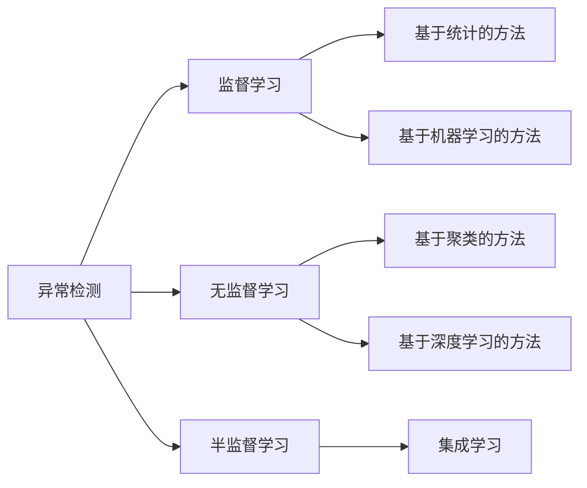
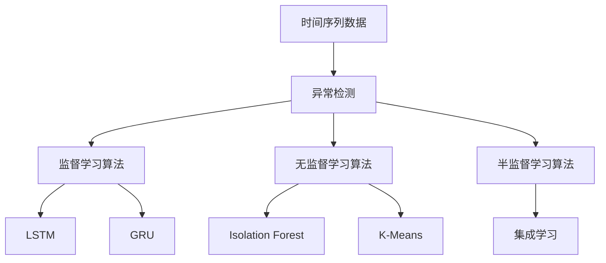
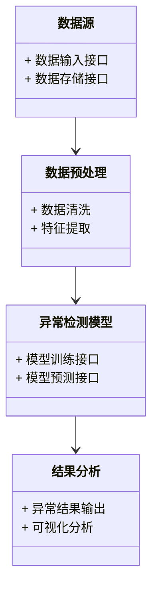
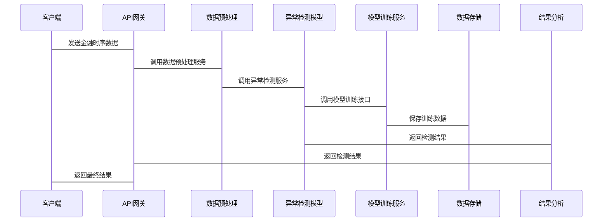

                 


# 《金融时序数据异常检测的AI方法》

## 关键词：金融时序数据，异常检测，人工智能，深度学习，时间序列分析

## 摘要：  
本文详细探讨了金融时序数据异常检测的AI方法，从背景与基础、核心概念、AI方法、算法原理、系统架构、项目实战到最佳实践，系统性地介绍了如何利用人工智能技术解决金融时序数据异常检测问题。文章结合理论与实践，通过具体的算法实现和案例分析，深入剖析了金融时序数据异常检测的关键技术与应用。

---

# 第一部分: 金融时序数据异常检测的背景与基础

## 第1章: 金融时序数据异常检测的背景与问题定义

### 1.1 金融时序数据的特性与重要性  
金融时序数据是指在金融领域中按时间顺序记录的数值型数据，例如股票价格、汇率、利率、交易量等。这些数据具有以下特性：  
1. **连续性**：数据按时间顺序连续记录，通常以固定的时间间隔（如分钟、小时、天）为单位。  
2. **波动性**：金融市场的波动性较高，数据呈现非线性变化趋势。  
3. **周期性**：数据往往表现出明显的周期性特征，如日周期、周周期、月周期等。  
4. **相关性**：不同金融资产或指标之间可能存在相关性，例如股票价格与市场指数的相关性。  

金融时序数据的重要性体现在以下几个方面：  
- **风险管理**：通过检测异常数据，及时发现潜在的市场风险或操作风险。  
- **投资决策**：利用异常检测发现市场异动，辅助投资决策。  
- **合规性检查**：检测交易数据中的异常行为，确保合规性。  

---

### 1.2 异常检测的定义与分类  

#### 1.2.1 异常检测的定义  
异常检测（Anomaly Detection）是指通过数据分析方法识别出与预期模式或行为不一致的数据点或事件。在金融领域，异常检测可以帮助识别市场操纵、欺诈交易、系统故障等异常行为。  

#### 1.2.2 异常检测的分类与应用场景  
异常检测可以分为以下几类：  
1. **基于统计的方法**：通过统计模型（如均值、方差）识别异常值。适用于数据分布已知的场景。  
2. **基于机器学习的方法**：利用监督学习或无监督学习模型（如决策树、聚类算法）识别异常。适用于数据分布复杂且未知的场景。  
3. **基于深度学习的方法**：利用神经网络模型（如LSTM、GRU）捕捉数据的时序特征，识别异常。适用于时序数据的非线性特征提取。  

#### 1.2.3 异常检测在金融领域的特殊性  
金融时序数据的异常检测具有以下特殊性：  
- 数据的高波动性使得异常与正常数据的区分难度较大。  
- 异常事件通常具有稀疏性，正常数据量远大于异常数据量，导致数据类别不平衡。  
- 需要满足实时性要求，许多金融场景需要在数据生成后快速完成检测。  

---

### 1.3 金融时序数据异常检测的挑战  

#### 1.3.1 数据特征的复杂性  
金融时序数据通常具有复杂的特征，例如多时间尺度（高频与低频数据）、多变量（多资产相关性）等，增加了异常检测的难度。  

#### 1.3.2 异常事件的稀疏性  
异常事件在数据中通常占比很小，导致模型难以通过少量异常样本进行有效学习。  

#### 1.3.3 计算效率与实时性要求  
金融领域的实时交易系统需要在数据生成后快速完成检测，对计算效率提出较高要求。  

---

### 1.4 本章小结  
本章从金融时序数据的特性与重要性出发，介绍了异常检测的定义与分类，并重点分析了金融时序数据异常检测面临的挑战。这些内容为后续章节的算法实现与系统设计奠定了基础。

---

# 第二部分: 金融时序数据异常检测的核心概念与联系

## 第2章: 金融时序数据异常检测的核心概念与联系  

### 2.1 时序数据与异常检测的核心概念  

#### 2.1.1 时序数据的数学表示  
时序数据可以表示为一个时间序列 $X = \{x_1, x_2, ..., x_n\}$，其中 $x_i$ 表示第 $i$ 个时间点的观测值。  

#### 2.1.2 异常检测的数学模型  
异常检测的目标是通过某种模型或算法，识别出异常点 $y_i$，其中 $y_i \in \{0, 1\}$，$y_i=1$ 表示异常，$y_i=0$ 表示正常。  

---

### 2.2 核心概念的属性特征对比  

#### 2.2.1 数据特征对比表格  
下表对比了时序数据与非时序数据的核心特征：  

| 特性 | 时序数据 | 非时序数据 |  
|------|----------|------------|  
| 时间性 | 具有严格的时间顺序 | 无时间顺序或时间顺序不重要 |  
| 相关性 | 数据点之间可能存在强相关性 | 数据点之间相关性较弱或无 |  
| 预测性 | 数据具有时间依赖性，适合预测 | 数据适合描述性分析 |  

---

#### 2.2.2 异常检测方法的对比分析  
下图展示了异常检测方法的分类与关系：  



---

### 2.3 实体关系与架构图  

#### 2.3.1 Mermaid流程图：异常检测的分类与关系  


---

## 第3章: 金融时序数据异常检测的AI方法概述  

### 3.1 监督学习与无监督学习的对比  

#### 3.1.1 监督学习的定义与适用场景  
监督学习是一种基于标签数据的机器学习方法，适用于异常检测的有监督场景，例如已知异常样本的情况下。  

#### 3.1.2 无监督学习的定义与适用场景  
无监督学习是一种基于无标签数据的机器学习方法，适用于异常检测的无监督场景，例如未知异常模式的情况下。  

#### 3.1.3 半监督学习的定义与适用场景  
半监督学习是一种介于监督学习与无监督学习之间的方法，适用于部分样本有标签的场景。  

---

### 3.2 常见AI模型的选择与应用  

#### 3.2.1 LSTM模型的定义与特点  
LSTM（长短期记忆网络）是一种基于循环神经网络（RNN）的变体，适用于处理长序列数据，具有记忆遗忘机制，能够捕捉时间序列中的长期依赖关系。  

#### 3.2.2 GRU模型的定义与特点  
GRU（门控循环单元）是LSTM的一种简化版本，通过合并遗忘门和输入门，减少了参数数量，同时保留了LSTM的核心功能。  

#### 3.2.3 Isolation Forest算法的定义与特点  
Isolation Forest是一种基于树结构的无监督异常检测算法，通过构建隔离树将数据点隔离出来，适用于高维数据的异常检测。  

---

### 3.3 特征工程与数据预处理  

#### 3.3.1 数据清洗与标准化  
数据清洗包括去除缺失值、处理异常值等；数据标准化通常采用Z-score标准化或Min-Max标准化。  

#### 3.3.2 特征提取与选择  
特征提取可以通过滑动窗口、差分等方式进行，特征选择可以采用相关性分析或主成分分析（PCA）。  

#### 3.3.3 时间序列的分解与重构  
时间序列的分解可以采用STL（季节趋势分解）或经验模态分解（EMD）方法，重构则通过将分解后的成分重新组合。  

---

## 第4章: 基于深度学习的金融时序数据异常检测算法原理  

### 4.1 LSTM模型的原理与实现  

#### 4.1.1 LSTM的结构与工作原理  
LSTM通过遗忘门、输入门和输出门来控制信息的流动，公式如下：  
- 遗忘门：$f_t = \sigma(w_f \cdot [h_{t-1}, x_t] + b_f)$  
- 输入门：$i_t = \sigma(w_i \cdot [h_{t-1}, x_t] + b_i)$  
- 输出门：$o_t = \sigma(w_o \cdot [h_{t-1}, x_t] + b_o)$  
- 候选状态：$g_t = \tanh(w_g \cdot [h_{t-1}, x_t] + b_g)$  
- 当前状态：$h_t = f_t \cdot h_{t-1} + i_t \cdot g_t$  

#### 4.1.2 LSTM的数学模型与公式  
LSTM的损失函数通常采用交叉熵损失：  
$$ L = -\frac{1}{N}\sum_{i=1}^{N} [y_i \log p_i + (1-y_i)\log (1-p_i)] $$  

#### 4.1.3 LSTM的代码实现与示例  
以下是LSTM模型的PyTorch实现示例：  

```python
import torch
import torch.nn as nn
import torch.optim as optim

class LSTMModel(nn.Module):
    def __init__(self, input_size, hidden_size, output_size):
        super(LSTMModel, self).__init__()
        self.lstm = nn.LSTM(input_size, hidden_size, batch_first=True)
        self.fc = nn.Linear(hidden_size, output_size)
    
    def forward(self, x):
        out, _ = self.lstm(x)
        out = self.fc(out[:, -1, :])
        return out

# 示例数据
input_size = 1
hidden_size = 4
output_size = 1
model = LSTMModel(input_size, hidden_size, output_size)
criterion = nn.MSELoss()
optimizer = optim.Adam(model.parameters(), lr=0.01)

# 假设X为输入数据，y为真实标签
loss = criterion(model(X), y)
loss.backward()
optimizer.step()
```

---

### 4.2 GRU模型的原理与实现  

#### 4.2.1 GRU的结构与工作原理  
GRU通过融合遗忘门和输入门，简化了LSTM的结构，公式如下：  
- 更新门：$z_t = \sigma(w_z \cdot [h_{t-1}, x_t] + b_z)$  
- 重置门：$r_t = \sigma(w_r \cdot [h_{t-1}, x_t] + b_r)$  
- 当前状态：$h_t = (1-z_t)h_{t-1} + z_t \tanh(w_g \cdot [h_{t-1}, x_t \cdot r_t] + b_g)$  

#### 4.2.2 GRU的数学模型与公式  
GRU的损失函数同样采用交叉熵损失：  
$$ L = -\frac{1}{N}\sum_{i=1}^{N} [y_i \log p_i + (1-y_i)\log (1-p_i)] $$  

#### 4.2.3 GRU的代码实现与示例  
以下是GRU模型的PyTorch实现示例：  

```python
import torch
import torch.nn as nn
import torch.optim as optim

class GRUModel(nn.Module):
    def __init__(self, input_size, hidden_size, output_size):
        super(GRUModel, self).__init__()
        self.gru = nn.GRU(input_size, hidden_size, batch_first=True)
        self.fc = nn.Linear(hidden_size, output_size)
    
    def forward(self, x):
        out, _ = self.gru(x)
        out = self.fc(out[:, -1, :])
        return out

# 示例数据
input_size = 1
hidden_size = 4
output_size = 1
model = GRUModel(input_size, hidden_size, output_size)
criterion = nn.MSELoss()
optimizer = optim.Adam(model.parameters(), lr=0.01)

# 假设X为输入数据，y为真实标签
loss = criterion(model(X), y)
loss.backward()
optimizer.step()
```

---

### 4.3 Isolation Forest算法的原理与实现  

#### 4.3.1 Isolation Forest的定义与特点  
Isolation Forest通过构建随机树将数据点隔离，计算每个点的异常分数。  

#### 4.3.2 Isolation Forest的数学模型与公式  
异常分数的计算公式如下：  
$$ s(x) = \frac{1}{(u(x) + 1)} $$  
其中，$u(x)$表示数据点$x$的路径长度。  

#### 4.3.3 Isolation Forest的代码实现与示例  
以下是Isolation Forest算法的Python实现示例：  

```python
from sklearn.ensemble import IsolationForest

# 示例数据
X = ...  # 输入数据

# 初始化模型
model = IsolationForest(n_estimators=100, contamination=0.05, random_state=42)

# 训练模型
model.fit(X)

# 预测异常值
y_pred = model.predict(X)
```

---

## 第5章: 金融时序数据异常检测的系统架构与设计  

### 5.1 问题场景介绍  
金融时序数据异常检测系统需要满足以下需求：  
- 实时性：数据生成后需快速完成检测。  
- 高效性：处理海量数据时需保证计算效率。  
- 可扩展性：支持多种数据源和检测方法。  

---

### 5.2 系统功能设计  

#### 5.2.1 领域模型（Mermaid类图）  


---

#### 5.2.2 系统架构设计（Mermaid架构图）  


---

#### 5.2.3 系统接口设计  
系统接口设计包括：  
- 数据输入接口：提供API用于接收金融时序数据。  
- 异常检测接口：提供API用于调用异常检测模型。  
- 结果输出接口：提供API用于返回检测结果。  

---

#### 5.2.4 系统交互（Mermaid序列图）  


---

## 第6章: 金融时序数据异常检测的项目实战  

### 6.1 项目介绍  
本项目旨在开发一个金融时序数据异常检测系统，基于LSTM模型实现股票价格的异常检测。  

---

### 6.2 系统核心实现  

#### 6.2.1 环境安装  
```bash
pip install numpy pandas scikit-learn torch
```

---

#### 6.2.2 核心代码实现  

```python
import torch
import torch.nn as nn
import torch.optim as optim
import numpy as np
import pandas as pd

# 加载数据
data = pd.read_csv('stock_prices.csv')
X = data[['open', 'high', 'low', 'close']].values
y = data['is_anomaly'].values

# 数据预处理
from sklearn.preprocessing import StandardScaler
scaler = StandardScaler()
X_scaled = scaler.fit_transform(X)

# 划分训练集与测试集
train_X = X_scaled[:800]
train_y = y[:800]
test_X = X_scaled[800:]
test_y = y[800:]

# 模型定义
class LSTMModel(nn.Module):
    def __init__(self, input_size, hidden_size, output_size):
        super(LSTMModel, self).__init__()
        self.lstm = nn.LSTM(input_size, hidden_size, batch_first=True)
        self.fc = nn.Linear(hidden_size, output_size)
    
    def forward(self, x):
        out, _ = self.lstm(x)
        out = self.fc(out[:, -1, :])
        return out

# 模型训练
model = LSTMModel(input_size=4, hidden_size=8, output_size=1)
criterion = nn.BCEWithLogitsLoss()
optimizer = optim.Adam(model.parameters(), lr=0.01)

for epoch in range(100):
    outputs = model(train_X)
    loss = criterion(outputs.squeeze(), train_y)
    loss.backward()
    optimizer.step()

# 模型预测
with torch.no_grad():
    test_outputs = model(test_X)
    test_loss = criterion(test_outputs.squeeze(), test_y)
    print(f'测试损失：{test_loss.item()}')
```

---

### 6.3 案例分析与详细解读  
以某股票价格数据为例，训练LSTM模型后，对测试数据进行异常检测。通过对比实际异常标签与模型预测结果，验证模型的准确性。  

---

### 6.4 项目小结  
本项目通过LSTM模型实现了股票价格的异常检测，验证了深度学习方法在金融时序数据异常检测中的有效性。  

---

## 第7章: 金融时序数据异常检测的最佳实践  

### 7.1 关键点总结  
- 数据预处理是异常检测的关键步骤。  
- 深度学习模型在处理复杂时序数据时具有优势。  
- 系统架构设计需考虑实时性与可扩展性。  

---

### 7.2 注意事项  
- 异常检测模型需要定期更新，以适应数据分布的变化。  
- 模型的可解释性是金融领域的重要需求。  
- 需要结合业务背景分析异常检测结果，避免误报与漏报。  

---

### 7.3 未来研究方向  
- 研究多模态数据的异常检测方法。  
- 探索强化学习在异常检测中的应用。  
- 提升模型的实时性与计算效率。  

---

### 7.4 拓展阅读  
- [《时间序列分析》](https://www.wiley.com/en-us/Time+Series+Analysis%3A+Forecasting+and+Control%2C+2nd+Edition)  
- [《深度学习》](https://www.deeplearningbook.org/)  

---

## 附录: 代码与数据  
附录部分包含完整的项目代码与数据集说明。  

---

# 结语  
金融时序数据异常检测是金融风险管理与投资决策中的重要环节。通过本文的系统性介绍，读者可以全面了解异常检测的核心技术与应用，并通过实际案例掌握基于AI的异常检测方法。未来，随着AI技术的不断发展，金融时序数据异常检测将更加智能化与高效化。

