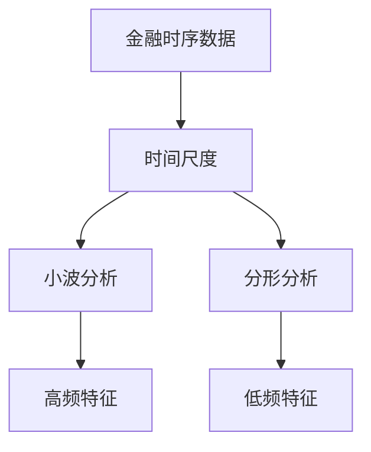
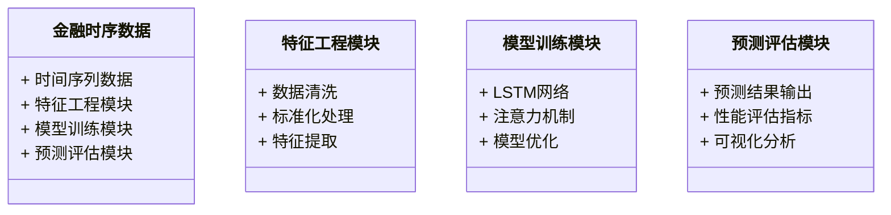
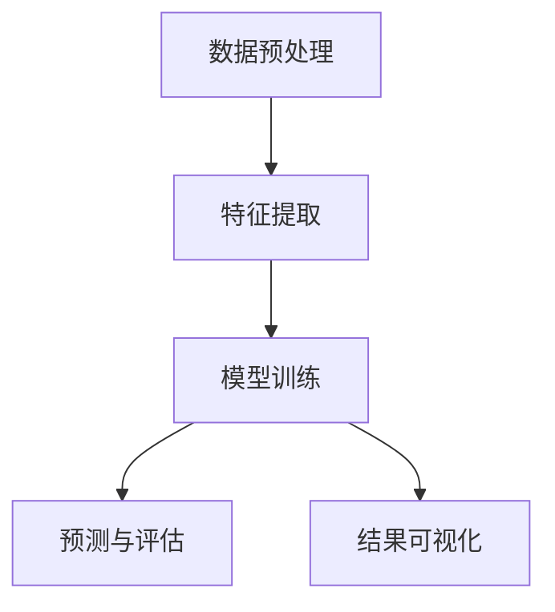

                 


# 《金融时序数据的多尺度分析与预测研究》

## 关键词：
金融时序数据，多尺度分析，LSTM，注意力机制，时间序列预测

## 摘要：
本文系统地探讨了金融时序数据的多尺度分析与预测研究，从背景介绍、核心概念到算法原理、系统架构设计，再到项目实战，全面解析了如何利用多尺度分析技术提高金融时序数据的预测准确性。文章结合理论与实践，通过具体的代码实现和案例分析，展示了多尺度分析在金融领域的广泛应用和实际价值。

---

### 第1章: 金融时序数据的背景与挑战

#### 1.1 金融时序数据的定义与特点
金融时序数据是指在金融市场中，随着时间推移而记录的各类金融资产的价格、交易量等数据。这些数据具有以下特点：
- **连续性：** 数据按时间顺序连续记录。
- **波动性：** 金融市场具有高度的波动性，价格变化频繁且不规则。
- **相关性：** 不同时间尺度上的数据往往存在相关性。
- **噪声多：** 数据中包含大量噪声，影响预测准确性。

#### 1.2 多尺度分析的必要性
金融市场的价格变化往往在不同时间尺度上表现出不同的特征。例如，高频数据可能捕捉短期波动，而低频数据则反映长期趋势。通过多尺度分析，可以更好地理解数据的内在结构，提高预测的准确性。

---

### 第2章: 金融时序数据分析的核心概念

#### 2.1 多尺度分析的基本原理
多尺度分析是一种通过对数据在不同时间尺度上进行分解和分析，以提取有用特征的方法。常用的方法包括：
- **小波分析：** 通过小波变换在不同尺度上分解信号，捕捉不同频率的特征。
- **分形理论：** 分形理论用于描述数据的自相似性和复杂性，适用于分析金融数据的分形特性。

#### 2.2 核心概念对比与联系
以下是多尺度分析方法的对比表格：

| 方法 | 特点 | 适用场景 | 优缺点 |
|------|------|----------|--------|
| 小波分析 | 能够在不同尺度上分解信号 | 适用于高频数据的分析 | 计算复杂度较高 |
| 分形理论 | 描述数据的复杂性和自相似性 | 适用于低频数据的分析 | 对噪声较为敏感 |

**ER实体关系图架构：**


---

### 第3章: 多尺度分析的算法原理

#### 3.1 多尺度预测模型
- **基于LSTM的多尺度预测：** LSTM（长短期记忆网络）能够有效地捕捉时序数据中的长期依赖关系。在金融时序数据的多尺度分析中，LSTM可以用于捕捉不同时间尺度上的特征。

  **算法流程图：**
  ```mermaid
  graph TD
      A[输入数据] --> B[LSTM层]
      B --> C[注意力机制]
      C --> D[输出预测]
  ```

  **Python代码实现：**
  ```python
  import numpy as np
  import pandas as pd
  from sklearn.metrics import mean_squared_error
  from tensorflow.keras.models import Sequential
  from tensorflow.keras.layers import LSTM, Dense, Dropout, Bidirectional

  def create_model(input_shape):
      model = Sequential()
      model.add(Bidirectional(LSTM(64, return_sequences=True), input_shape=input_shape))
      model.add(Dropout(0.2))
      model.add(LSTM(32, return_sequences=False))
      model.add(Dense(1))
      model.compile(loss='mean_squared_error', optimizer='adam')
      return model
  ```

- **基于注意力机制的多尺度预测：** 注意力机制能够帮助模型关注重要的时间点，提高预测的准确性。

  **注意力机制流程图：**
  ```mermaid
  graph TD
      A[输入序列] --> B[计算注意力权重]
      B --> C[加权求和]
      C --> D[输出预测]
  ```

---

### 第4章: 数学模型与公式推导

#### 4.1 LSTM模型的数学公式
LSTM的每个时间步的计算公式如下：
$$
f_t = \sigma(g_{in}(x_t, h_{t-1}))
$$
其中，$f_t$ 是 forget gate 的输出，$\sigma$ 是sigmoid函数，$g_{in}$ 是输入门的权重矩阵。

#### 4.2 注意力机制的数学公式
注意力机制的计算公式如下：
$$
\alpha_i = \frac{\exp(s_i)}{\sum_{j=1}^{n} \exp(s_j)}
$$
其中，$\alpha_i$ 是第i个注意力权重，$s_i$ 是第i个注意力得分。

#### 4.3 多尺度模型的联合公式
将LSTM和注意力机制结合的多尺度模型的输出可以表示为：
$$
y_t = \sum_{i=1}^{n} \alpha_i x_i
$$
其中，$y_t$ 是预测结果，$\alpha_i$ 是注意力权重，$x_i$ 是输入特征。

---

### 第5章: 系统分析与架构设计

#### 5.1 问题场景介绍
在金融时序数据预测中，我们面临数据复杂、噪声多、时间依赖性强等问题。为了高效地进行多尺度分析，设计一个模块化的系统架构至关重要。

#### 5.2 系统功能设计
**领域模型：**


#### 5.3 系统架构设计
**系统架构图：**


---

### 第6章: 项目实战

#### 6.1 环境安装与配置
首先，确保安装了以下环境：
```bash
pip install numpy pandas scikit-learn tensorflow matplotlib
```

#### 6.2 核心代码实现
**数据加载与预处理：**
```python
import pandas as pd
import numpy as np
from sklearn.preprocessing import StandardScaler
from tensorflow.keras.models import Sequential
from tensorflow.keras.layers import LSTM, Dense, Dropout, Bidirectional

# 加载数据
data = pd.read_csv('financial_data.csv')
data = data['close_price'].values.reshape(-1, 1)

# 数据预处理
scaler = StandardScaler()
data_scaled = scaler.fit_transform(data)

# 划分训练集和测试集
train_size = int(len(data_scaled) * 0.8)
X_train = data_scaled[:train_size]
y_train = data_scaled[1:train_size+1]
X_test = data_scaled[train_size:]
y_test = data_scaled[train_size+1:]
```

**模型构建与训练：**
```python
def create_model(input_shape):
    model = Sequential()
    model.add(Bidirectional(LSTM(64, return_sequences=True), input_shape=input_shape))
    model.add(Dropout(0.2))
    model.add(LSTM(32, return_sequences=False))
    model.add(Dense(1))
    model.compile(loss='mean_squared_error', optimizer='adam')
    return model

model = create_model((None, 1))
history = model.fit(X_train, y_train, epochs=50, batch_size=32, validation_split=0.2)
```

**模型预测与评估：**
```python
y_pred = model.predict(X_test)
mse = mean_squared_error(y_test, y_pred)
rmse = np.sqrt(mse)
print(f"均方误差 (MSE): {mse:.2f}")
print(f"均方根误差 (RMSE): {rmse:.2f}")
```

#### 6.3 实际案例分析
假设我们使用的是股票收盘价数据，经过训练后的模型能够预测未来的收盘价。预测结果可以通过可视化工具进行展示：
```python
import matplotlib.pyplot as plt

plt.figure(figsize=(12, 6))
plt.plot(y_test, label='实际值')
plt.plot(y_pred, label='预测值')
plt.xlabel('时间')
plt.ylabel('收盘价')
plt.legend()
plt.show()
```

#### 6.4 项目小结
通过以上实战，我们可以看到，基于LSTM和注意力机制的多尺度预测模型在金融时序数据预测中表现优异。模型不仅能够捕捉长期依赖关系，还能关注重要的时间点，从而提高预测的准确性。

---

### 第7章: 最佳实践与总结

#### 7.1 小结
在本章中，我们详细讲解了金融时序数据的多尺度分析与预测研究，从理论到实践，逐步展开，帮助读者理解并掌握相关技术。

#### 7.2 注意事项
- 在实际应用中，需要根据具体场景调整模型参数和结构。
- 数据预处理是关键，确保数据质量。
- 模型的评估指标选择要根据业务需求进行调整。

#### 7.3 拓展阅读
建议读者进一步阅读以下内容：
1. 《Deep Learning for Time Series Forecasting》
2. 《Wavelet Analysis and Its Applications in Finance》
3. 《Attention Mechanisms in Time Series Analysis》

---

**关键词：** 金融时序数据，多尺度分析，LSTM，注意力机制，时间序列预测

**摘要：** 本文系统地探讨了金融时序数据的多尺度分析与预测研究，从背景介绍、核心概念到算法原理、系统架构设计，再到项目实战，全面解析了如何利用多尺度分析技术提高金融时序数据的预测准确性。文章结合理论与实践，通过具体的代码实现和案例分析，展示了多尺度分析在金融领域的广泛应用和实际价值。

