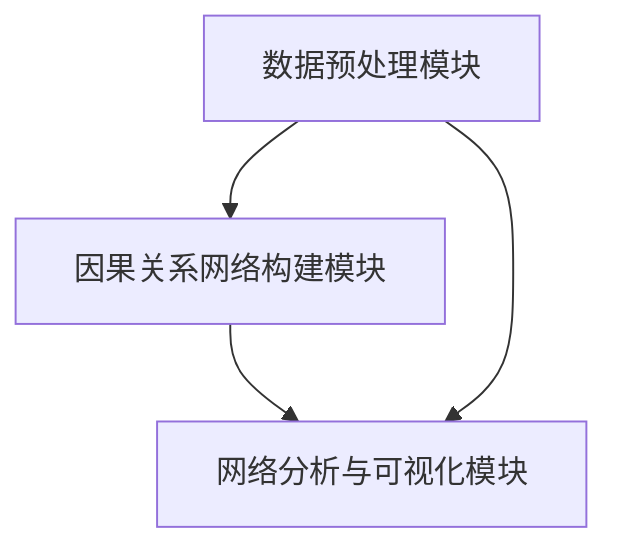
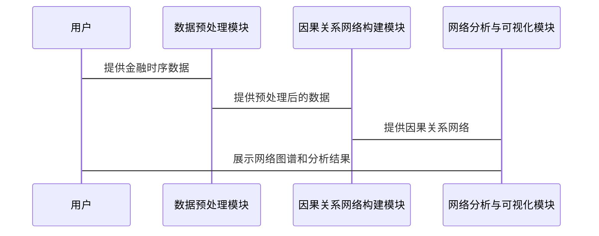

                 


# 《金融时序数据的多尺度因果关系网络构建研究》

---

## 关键词：  
金融时序数据、多尺度分析、因果关系网络、Granger因果检验、深度学习、系统架构  

---

## 摘要：  
本文旨在研究如何在金融时序数据中构建多尺度因果关系网络，并探讨其在金融分析中的应用价值。通过结合多尺度分析和因果关系网络的构建方法，本文提出了一种创新的网络构建框架，能够有效捕捉金融数据中的因果关系，并在不同时间粒度下进行综合分析。本文从理论基础、算法实现、系统架构到实际案例进行了全面探讨，为金融数据分析提供了一种新的思路和方法。  

---

# 第1章: 金融时序数据的多尺度因果关系网络研究背景  

## 1.1 问题背景与研究意义  

### 1.1.1 金融时序数据的特性与挑战  
金融时序数据具有高度的波动性和复杂性，其变化往往受到多种因素的影响。传统的金融数据分析方法（如线性回归、ARIMA等）难以捕捉数据中的非线性关系和复杂的因果关系。  

### 1.1.2 多尺度分析在金融数据中的重要性  
金融市场的波动往往在不同时间粒度上表现出不同的特性。例如，短期波动可能受到市场情绪的影响，而长期趋势则可能与宏观经济政策相关。因此，通过多尺度分析可以更好地理解金融数据的动态特性。  

### 1.1.3 因果关系网络在金融分析中的应用价值  
因果关系网络能够帮助我们识别变量之间的因果关系，从而更好地理解市场的运作机制。例如，可以通过因果关系网络分析某一金融资产是否对其他资产具有影响力。  

---

## 1.2 现有研究的不足  

### 1.2.1 传统金融数据分析方法的局限性  
传统方法往往假设数据的线性关系，难以捕捉复杂的非线性因果关系。  

### 1.2.2 多尺度分析与因果关系结合的不足  
现有研究在多尺度分析和因果关系网络的结合上仍存在不足，难以在不同时间粒度上构建有效的因果关系网络。  

### 1.2.3 当前因果关系网络构建的挑战  
当前因果关系网络的构建方法往往过于复杂，难以在金融时序数据中高效应用。  

---

## 1.3 本研究的目标与意义  

### 1.3.1 研究目标的明确  
本文旨在提出一种基于多尺度分析的因果关系网络构建方法，能够有效捕捉金融时序数据中的因果关系。  

### 1.3.2 研究的创新点  
本文将多尺度分析与因果关系网络结合，提出了一种创新的网络构建框架。  

### 1.3.3 研究的实际应用价值  
本文的研究成果可以应用于金融风险预警、资产配置优化等实际场景中，为金融决策提供科学依据。  

---

# 第2章: 多尺度因果关系网络的核心概念  

## 2.1 因果关系网络的基本原理  

### 2.1.1 因果关系的基本定义  
因果关系是指一个变量的变化能够引起另一个变量的变化。例如，如果A是B的因，那么A的变化会导致B的变化。  

### 2.1.2 因果关系网络的构建方法  
因果关系网络的构建方法主要包括Granger因果检验、基于深度学习的因果关系建模等。  

### 2.1.3 因果关系网络的属性特征对比  
| 属性 | Granger因果检验 | 基于深度学习的因果建模 |  
|------|------------------|------------------------|  
| 适用性 | 适用于线性关系 | 适用于非线性关系 |  
| 计算复杂度 | 较低 | 较高 |  
| 解释性 | 较高 | 较低 |  

---

## 2.2 多尺度分析的原理与方法  

### 2.2.1 多尺度分析的定义  
多尺度分析是指在不同时间粒度上对数据进行分析，以捕捉数据在不同尺度上的特性。  

### 2.2.2 多尺度分析的时间粒度划分  
时间粒度可以划分为分钟、小时、日、周、月、年等不同的粒度。  

### 2.2.3 不同粒度下的因果关系网络构建  
在不同时间粒度下，因果关系网络的结构和权重可能有所不同。通过多尺度分析，可以综合不同粒度下的网络信息，得到更全面的因果关系网络。  

---

## 2.3 本章小结  

---

# 第3章: 金融时序数据的多尺度因果关系网络构建框架  

## 3.1 数据预处理与特征提取  

### 3.1.1 数据清洗与标准化  
对金融时序数据进行清洗，去除异常值，并进行标准化处理。  

### 3.1.2 金融时序数据的特征提取方法  
常用的特征提取方法包括均值、方差、自相关性、hurst指数等。  

### 3.1.3 多尺度特征的构建  
通过多尺度变换（如小波变换）提取不同粒度上的特征。  

---

## 3.2 因果关系网络的构建算法  

### 3.2.1 基于Granger因果检验的网络构建  
Granger因果检验通过回归分析来判断变量之间的因果关系。  

#### Granger因果检验的步骤  
1. 对变量A和变量B进行回归分析，计算A对B的预测误差。  
2. 对变量B和变量A进行回归分析，计算B对A的预测误差。  
3. 比较两种预测误差，判断是否存在因果关系。  

#### Granger因果检验的数学模型  
$$ H_0: \text{不存在因果关系} $$  
$$ H_1: \text{存在因果关系} $$  

---

### 3.2.2 基于深度学习的因果关系建模  
使用LSTM（长短期记忆网络）对因果关系进行建模。  

#### LSTM网络的结构  
LSTM网络由输入门、遗忘门和输出门组成，能够捕捉时序数据中的长程依赖关系。  

---

## 3.3 多尺度网络的整合与分析  

### 3.3.1 不同粒度网络的整合方法  
通过加权平均或其他方法整合不同粒度下的网络信息。  

### 3.3.2 多尺度网络的综合分析  
综合不同粒度下的网络信息，得到一个全局的因果关系网络。  

### 3.3.3 网络的可视化与解读  
通过网络可视化工具（如Gephi）对网络进行可视化，并解读网络中的关键节点和边。  

---

## 3.4 本章小结  

---

# 第4章: 算法原理与数学模型  

## 4.1 Granger因果检验的原理  

### 4.1.1 Granger因果检验的定义  
Granger因果检验是一种基于回归分析的因果关系检验方法。  

### 4.1.2 Granger因果检验的数学模型  
$$ y_t = \alpha + \beta x_t + \epsilon_t $$  
$$ x_t = \alpha + \beta y_t + \epsilon_t $$  

### 4.1.3 Granger因果检验的步骤  
1. 对变量A和变量B进行回归分析，计算A对B的预测误差。  
2. 对变量B和变量A进行回归分析，计算B对A的预测误差。  
3. 比较两种预测误差，判断是否存在因果关系。  

---

## 4.2 基于深度学习的因果关系建模  

### 4.2.1 变量的因果关系表示  
使用LSTM网络对因果关系进行建模，捕捉时序数据中的非线性关系。  

### 4.2.2 因果关系的深度学习模型  
$$ LSTM(y_t | x_{t-1}, x_{t-2}, ..., x_{t-n}) $$  

### 4.2.3 模型的训练与优化  
使用反向传播算法对模型进行训练，并通过交叉验证优化模型参数。  

---

## 4.3 多尺度分析的数学模型  

### 4.3.1 多尺度变换的数学表示  
$$ W_j(t) = \sum_{k} w_j(k) x_{t-k} $$  

### 4.3.2 不同粒度网络的整合公式  
$$ C_{ij} = \sum_{s} \lambda_s C_{ij}^{(s)} $$  
其中，$\lambda_s$是粒度$s$的权重。  

### 4.3.3 网络权重的计算方法  
通过Granger因果检验或深度学习模型计算网络边的权重。  

---

## 4.4 本章小结  

---

# 第5章: 系统架构与实现  

## 5.1 系统功能设计  

### 5.1.1 数据预处理模块  
- 数据清洗与标准化  
- 特征提取与多尺度变换  

### 5.1.2 因果关系网络构建模块  
- Granger因果检验  
- 基于深度学习的因果建模  

### 5.1.3 网络分析与可视化模块  
- 多尺度网络整合  
- 网络可视化与解读  

---

## 5.2 系统架构设计  



---

## 5.3 系统接口设计  

### 5.3.1 输入接口  
- 金融时序数据输入  
- 参数配置输入  

### 5.3.2 输出接口  
- 因果关系网络图谱  
- 网络分析结果  

---

## 5.4 系统交互流程  



---

## 5.5 本章小结  

---

# 第6章: 项目实战与案例分析  

## 6.1 项目环境与数据获取  

### 6.1.1 环境安装  
- Python 3.8及以上版本  
- NumPy、Pandas、Scikit-learn、Keras、Gephi  

### 6.1.2 数据获取  
通过API获取金融时序数据（如股票价格、指数等）。  

---

## 6.2 核心代码实现  

### 6.2.1 Granger因果检验的实现  

```python
import numpy as np
from sklearn.linear_model import LinearRegression
from statsmodels.tsa.stattools import grangercausality

def granger_test(x, y, max_lag=1):
    model = LinearRegression()
    model.fit(x, y)
    y_pred = model.predict(x)
    residuals = y - y_pred
    f_stat, p_val = grangercausality(x, y, max_lag=max_lag)
    return f_stat, p_val
```

### 6.2.2 基于LSTM的因果关系建模  

```python
import tensorflow as tf
from tensorflow.keras.layers import LSTM, Dense

model = tf.keras.Sequential()
model.add(LSTM(64, input_shape=(timesteps, features)))
model.add(Dense(1))
model.compile(optimizer='adam', loss='mse')
model.fit(x_train, y_train, epochs=100, batch_size=32)
```

---

## 6.3 实际案例分析  

### 6.3.1 数据分析与网络构建  
以某股票的价格数据为例，构建多尺度因果关系网络。  

### 6.3.2 网络可视化与解读  
通过Gephi对网络进行可视化，分析网络中的关键节点和边。  

### 6.3.3 实验结果与分析  
比较不同粒度下的网络分析结果，验证多尺度分析的有效性。  

---

## 6.4 本章小结  

---

# 第7章: 总结与展望  

## 7.1 研究总结  
本文提出了一种基于多尺度分析的因果关系网络构建方法，能够有效捕捉金融时序数据中的因果关系。  

## 7.2 研究的创新点  
本文将多尺度分析与因果关系网络结合，提出了一种创新的网络构建框架。  

## 7.3 研究的实际应用价值  
本文的研究成果可以应用于金融风险预警、资产配置优化等实际场景中。  

## 7.4 未来研究方向  
未来可以进一步研究如何在多尺度网络中引入更多的金融数据特征，如市场情绪、新闻事件等，以提高网络的预测能力。  

---

## 7.5 本章小结  

---

# 参考文献  

（此处列出相关文献，如《时间序列分析》、《因果推理与机器学习》等。）  

---

## 致谢  

感谢在本研究中提供帮助和支持的团队成员和朋友们。  

--- 

**注**：由于篇幅限制，上述内容为简要示例，实际文章需要进一步扩展和详细阐述每个部分的内容。

