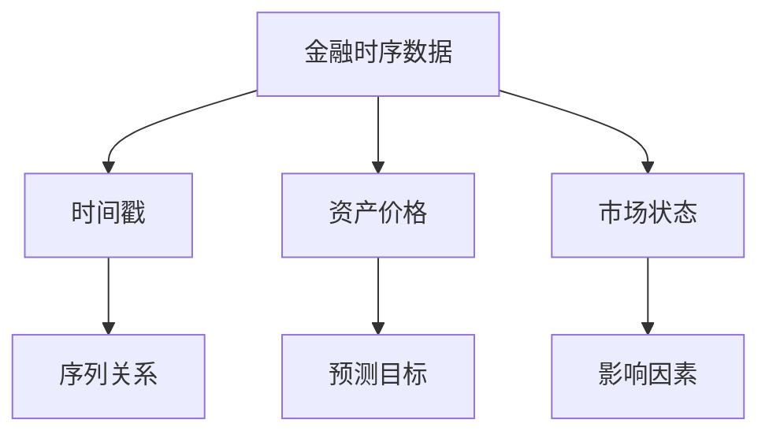

                 


# 《金融时序数据的深度强化学习应用》

> **关键词**：金融时序数据、深度学习、强化学习、LSTM、Transformer、DQN、PPO  
> 
> **摘要**：本文探讨了金融时序数据的深度强化学习应用，分析了时序数据的特点与强化学习的优势，详细介绍了LSTM、Transformer等深度学习模型，以及DQN、PPO等强化学习算法的原理和实现。通过系统设计与实战案例，展示了如何将深度强化学习应用于金融市场的交易策略优化，并提出了实际应用中的注意事项和未来研究方向。

---

## 第一部分: 金融时序数据与深度强化学习概述

### 第1章: 问题背景与核心概念

#### 1.1 金融时序数据的特点
##### 1.1.1 金融数据的时序特性
金融时序数据是指按时间顺序记录的金融市场数据，包括股票价格、汇率、利率等。这些数据具有以下特点：
- **时间依赖性**：数据点之间存在强相关性，过去的价格走势会影响未来的预测。
- **非线性特征**：金融市场的波动通常是非线性的，传统线性模型难以捕捉复杂的变化模式。
- **噪声干扰**：金融数据中常夹杂大量噪声，如市场情绪、突发事件等都会影响数据的稳定性。

##### 1.1.2 金融市场的复杂性
金融市场是一个复杂的动态系统，受到多种因素的影响，包括经济指标、政策变化、市场情绪等。这些因素使得金融数据的预测具有高度的不确定性，传统的统计模型和机器学习方法在处理这种复杂性时显得力不从心。

##### 1.1.3 时序数据的挑战与机遇
时序数据的挑战在于其高度的依赖性和复杂性，而机遇在于通过深度学习模型可以捕捉到数据中的复杂模式和长期依赖关系，从而实现更精准的预测和决策。

#### 1.2 深度强化学习的背景
##### 1.2.1 深度学习的崛起
深度学习通过多层神经网络结构，能够自动提取数据中的高层次特征，已在图像识别、自然语言处理等领域取得了显著成果。其强大的特征提取能力为金融数据的分析提供了新的思路。

##### 1.2.2 强化学习的核心思想
强化学习是一种通过与环境交互来学习策略的方法，其核心在于通过试错机制不断优化决策。在金融市场中，强化学习可以模拟投资决策过程，优化交易策略。

##### 1.2.3 深度强化学习的结合
深度强化学习结合了深度学习的特征提取能力和强化学习的决策优化能力，成为处理金融时序数据的有效工具。

#### 1.3 问题解决的必要性
##### 1.3.1 传统金融模型的局限性
传统金融模型如ARIMA、GARCH等在处理复杂时序数据时表现有限，尤其是在面对非线性和高噪声数据时。

##### 1.3.2 深度强化学习的优势
深度强化学习能够捕捉复杂时序数据中的深层模式，同时通过强化学习不断优化决策策略，显著提高了预测和交易的准确性。

##### 1.3.3 实际应用场景的分析
在金融交易、风险管理、资产配置等领域，深度强化学习已展现出巨大的潜力，尤其是在高频交易和自动化投资决策中表现突出。

---

## 第2章: 核心概念与联系

### 2.1 时序数据的数学模型
##### 2.1.1 时间序列的基本定义
时间序列可以表示为一个有序的数据集，通常表示为$X = \{x_t\}_{t=1}^T$，其中$x_t$表示第$t$个时间点的观测值。

##### 2.1.2 时序数据的分解模型
时序数据通常可以分解为趋势（Trend）、周期（Seasonality）和噪声（Noise）三部分。例如，加法模型可以表示为：
$$x_t = T_t + S_t + N_t$$

##### 2.1.3 时序数据的特征提取
特征提取是时序数据分析的关键步骤，常用的特征包括均值、方差、自相关系数等。

### 2.2 强化学习的原理
##### 2.2.1 马尔可夫决策过程（MDP）
马尔可夫决策过程定义为一个五元组$(S, A, P, R, \gamma)$，其中：
- $S$：状态空间
- $A$：动作空间
- $P$：状态转移概率
- $R$：奖励函数
- $\gamma$：折扣因子

##### 2.2.2 状态空间与动作空间
- **状态空间**：表示环境的状态，例如当前的资产价格、市场指标等。
- **动作空间**：表示可能采取的动作，例如买入、卖出、持有等。

##### 2.2.3 奖励机制与策略优化
奖励函数用于衡量策略的好坏，策略优化的目标是在长期累计奖励最大化的基础上，选择最优动作序列。

### 2.3 核心概念对比分析
##### 2.3.1 不同模型的特征对比
| 模型 | 输入 | 输出 | 优点 |
|------|------|------|------|
| LSTM | 序列数据 | 预测值 | 捕捉长期依赖关系 |
| Transformer | 序列数据 | 预测值 | 并行计算，捕捉全局依赖 |
| DQN | 状态 | 动作 | 离散动作空间优化 |

##### 2.3.2 时序数据与静态数据的差异
时序数据具有时间依赖性，而静态数据缺乏时间顺序特征。

##### 2.3.3 强化学习与监督学习的区别
强化学习通过与环境交互学习策略，而监督学习通过标记数据学习映射关系。

---

## 第3章: 核心概念的ER实体关系图



---

## 第四部分: 项目实战与案例分析

### 第7章: 项目实战

#### 7.1 环境安装与数据准备
##### 7.1.1 环境安装
安装必要的库：
```bash
pip install tensorflow keras pandas numpy matplotlib
```

##### 7.1.2 数据准备
加载股票数据并进行预处理：
```python
import pandas as pd
import numpy as np

# 加载数据
data = pd.read_csv('stock_prices.csv')

# 数据预处理
from sklearn.preprocessing import MinMaxScaler
scaler = MinMaxScaler()
data_scaled = scaler.fit_transform(data['Close'].values.reshape(-1, 1))
```

#### 7.2 模型实现与训练
##### 7.2.1 LSTM模型实现
定义LSTM模型：
```python
from tensorflow.keras.models import Sequential
from tensorflow.keras.layers import LSTM, Dense

model = Sequential()
model.add(LSTM(50, input_shape=(None, 1)))
model.add(Dense(1))
model.compile(optimizer='adam', loss='mean_squared_error')
```

训练模型：
```python
model.fit(X_train, y_train, epochs=50, batch_size=32)
```

##### 7.2.2 强化学习策略实现
定义DQN策略：
```python
import random
import numpy as np

class DQNAgent:
    def __init__(self, state_size, action_size):
        self.state_size = state_size
        self.action_size = action_size
        self.gamma = 0.95
        self.epsilon = 1.0
        self.memory = []
    
    def act(self, state):
        if random.random() < self.epsilon:
            return random.randint(0, self.action_size-1)
        else:
            return np.argmax(self.model.predict(state))
    
    def remember(self, state, action, reward, next_state):
        self.memory.append((state, action, reward, next_state))
    
    def replay(self, batch_size):
        # ... 省略具体实现 ...
```

---

### 第8章: 总结与展望

#### 8.1 最佳实践 tips
- 数据预处理是关键，需选择合适的归一化方法。
- 模型调参需结合实际场景，避免过拟合。
- 强化学习策略需平衡探索与利用，避免陷入局部最优。

#### 8.2 小结
本文详细探讨了金融时序数据的深度强化学习应用，从理论到实践，展示了如何利用LSTM、Transformer等模型，以及DQN、PPO等算法优化金融交易策略。

#### 8.3 注意事项
- 强化学习模型需谨慎处理状态空间和动作空间的设计。
- 模型训练需考虑计算资源和数据量的限制。
- 实际应用中需结合市场规则和风险控制。

#### 8.4 拓展阅读
- 阅读相关论文，如《Deep Reinforcement Learning for Trading》。
- 关注最新的深度强化学习技术在金融领域的应用进展。

---

通过以上结构，文章从理论到实践，全面探讨了金融时序数据的深度强化学习应用，旨在为读者提供系统化的知识和实用的指导。

