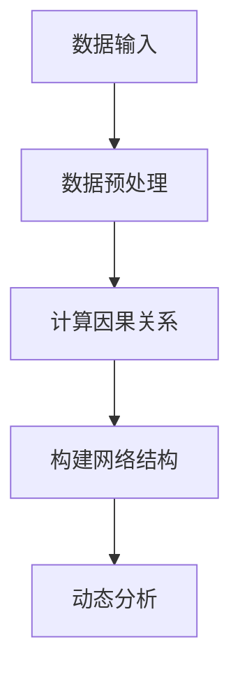
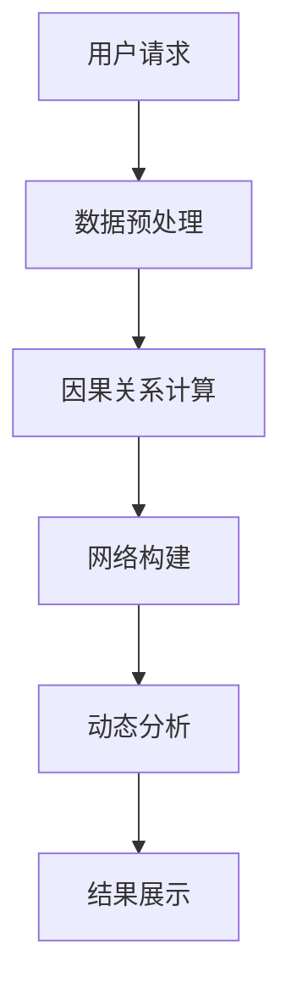

                 


# 《金融时间序列因果关系网络动态分析》

## 关键词：金融时间序列、因果关系网络、动态分析、Granger因果检验、贝叶斯网络、系统架构设计

## 摘要：
本文系统地介绍了金融时间序列因果关系网络动态分析的核心概念、算法原理、系统架构设计及实际应用。通过对金融时间序列数据的分析，构建因果关系网络，并动态分析其变化规律，为金融市场的预测和决策提供理论支持和技术实现。文章从背景介绍出发，逐步深入探讨了相关的核心概念、算法实现及系统设计，并通过实际案例分析展示了方法的应用价值。

---

## 第1章: 金融时间序列因果关系网络动态分析的背景介绍

### 1.1 问题背景
#### 1.1.1 金融时间序列分析的挑战
金融市场的数据具有高度复杂性和不确定性，时间序列分析在金融领域中扮演着重要角色。然而，传统的统计方法难以捕捉变量之间的因果关系，尤其是动态变化的因果关系。

#### 1.1.2 因果关系网络在金融分析中的重要性
因果关系网络能够揭示变量之间的相互作用和影响，帮助我们理解金融市场中复杂的动态关系。

#### 1.1.3 动态分析的必要性
金融市场中的因果关系并非静态，而是随着时间变化而变化。动态分析能够捕捉这些变化，为金融预测和投资决策提供更准确的支持。

### 1.2 核心概念
#### 1.2.1 金融时间序列的定义与特征
金融时间序列是指金融市场中连续观测到的数值按时间顺序排列的数据，如股票价格、指数、汇率等。其主要特征包括趋势性、周期性、随机性和波动性。

#### 1.2.2 因果关系网络的基本概念
因果关系网络是一种图结构，节点代表变量，边代表变量之间的因果关系。在金融领域，因果关系网络可以帮助我们理解不同金融资产或指标之间的相互影响。

#### 1.2.3 动态分析的核心要素
动态分析关注因果关系网络随时间的变化，能够捕捉变量之间因果关系的强度和方向的变化。

### 1.3 问题解决
#### 1.3.1 时间序列分析的方法论
时间序列分析的方法包括传统统计方法（如ARIMA）和现代机器学习方法（如LSTM）。

#### 1.3.2 因果关系网络的构建方法
因果关系网络的构建方法包括Granger因果检验、贝叶斯网络和基于因果推断的方法。

#### 1.3.3 动态分析的应用场景
动态分析在金融领域的应用场景包括股票价格预测、经济指标预测和风险管理。

### 1.4 边界与外延
#### 1.4.1 金融时间序列分析的边界条件
金融时间序列分析的边界条件包括数据的可得性、模型的适用性和计算资源的限制。

#### 1.4.2 因果关系网络的适用范围
因果关系网络适用于变量之间的因果关系分析，但需要确保数据的充分性和独立性。

#### 1.4.3 动态分析的限制与扩展
动态分析的限制包括计算复杂性和模型的稳定性，可以通过引入滑动窗口和在线更新方法进行扩展。

### 1.5 概念结构与核心要素
#### 1.5.1 核心概念的层次结构
时间序列 → 因果关系 → 网络结构 → 动态变化

#### 1.5.2 核心要素的对比分析
| 核心要素 | 特性 | 示例 |
|----------|------|------|
| 时间序列 | 连续性 | 股票价格 |
| 因果关系 | 相关性 | 股价与成交量 |
| 网络结构 | 图结构 | 股票之间的相互影响 |

#### 1.5.3 概念之间的关系
时间序列是因果关系的基础，因果关系网络是时间序列数据的高级表达，动态分析则是对网络结构随时间变化的深入研究。

### 1.6 本章小结
本章介绍了金融时间序列因果关系网络动态分析的背景、核心概念和问题解决方法，为后续章节的分析奠定了基础。

---

## 第2章: 金融时间序列因果关系网络的核心概念与联系

### 2.1 核心概念原理
#### 2.1.1 因果关系的定义与特征
因果关系是指一个变量的变化导致另一个变量的变化，具有方向性和强度。

#### 2.1.2 时间序列中的因果关系
时间序列中的因果关系可以通过Granger因果检验等方法进行分析。

#### 2.1.3 网络结构中的因果关系
网络结构中的因果关系可以通过贝叶斯网络和因果推断方法进行建模。

### 2.2 概念属性特征对比
| 概念 | 特性 | 示例 |
|------|------|------|
| 时间序列 | 连续性 | 每日股价 |
| 因果关系 | 相关性 | 股价与宏观经济指标 |
| 网络结构 | 图结构 | 股票之间的相互影响 |

### 2.3 ER实体关系图架构


### 2.4 本章小结
本章通过对比分析和ER图展示了金融时间序列因果关系网络的核心概念及其联系。

---

## 第3章: 金融时间序列因果关系网络的算法原理

### 3.1 算法原理概述
#### 3.1.1 Granger因果检验
Granger因果检验是一种常用的统计方法，用于验证变量之间的因果关系。

#### 3.1.2 贝叶斯网络方法
贝叶斯网络是一种概率图模型，能够建模变量之间的因果关系。

#### 3.1.3 动态网络构建算法
动态网络构建算法用于随时间更新因果关系网络的结构。

### 3.2 算法流程图


### 3.3 核心算法实现
#### 3.3.1 Granger因果检验的数学模型
$$ F = \frac{(R_1 - R_2)}{R_2} \times \frac{df_1}{df_2} $$
其中，$R_1$ 和 $R_2$ 分别是两个模型的残差平方和，$df_1$ 和 $df_2$ 是自由度。

#### 3.3.2 贝叶斯网络的构建过程
贝叶斯网络的构建过程包括数据预处理、变量选择、模型训练和网络推理。

#### 3.3.3 动态网络的更新机制
动态网络的更新机制可以通过滑动窗口方法或在线更新方法实现。

### 3.4 举例说明
#### 3.4.1 股票价格预测案例
通过Granger因果检验分析股票价格与宏观经济指标之间的因果关系。

#### 3.4.2 经济指标分析案例
通过贝叶斯网络分析不同经济指标之间的因果关系。

### 3.5 本章小结
本章详细介绍了Granger因果检验、贝叶斯网络和动态网络构建算法的原理及应用。

---

## 第4章: 金融时间序列因果关系网络的系统分析与架构设计

### 4.1 问题场景介绍
#### 4.1.1 金融市场的复杂性
金融市场中的变量数量多，变量之间的关系复杂，需要构建高效的系统进行分析。

#### 4.1.2 因果关系网络的应用场景
因果关系网络在金融市场的预测、风险管理和投资决策中具有重要作用。

#### 4.1.3 动态分析的系统需求
动态分析需要实时数据处理、高效的计算能力和灵活的网络更新机制。

### 4.2 项目介绍
#### 4.2.1 项目目标
构建一个动态更新的金融时间序列因果关系网络分析系统，支持实时数据处理和网络结构的动态更新。

#### 4.2.2 系统功能设计
| 功能模块 | 描述 |
|----------|------|
| 数据预处理 | 数据清洗、标准化 |
| 因果关系计算 | Granger检验、贝叶斯网络计算 |
| 网络构建 | 网络结构生成、可视化 |
| 动态分析 | 网络结构更新、动态关系分析 |

### 4.3 系统架构设计
#### 4.3.1 系统分层架构
- 数据层：数据存储和访问
- 计算层：因果关系计算和网络构建
- 展示层：网络可视化和结果展示

#### 4.3.2 系统架构图


#### 4.3.3 系统接口设计
- 数据接口：数据输入和输出接口
- 计算接口：因果关系计算接口
- 展示接口：网络可视化接口

#### 4.3.4 系统交互流程图


### 4.4 本章小结
本章通过系统架构设计和接口设计，展示了如何构建一个高效的金融时间序列因果关系网络动态分析系统。

---

## 第5章: 金融时间序列因果关系网络的项目实战

### 5.1 环境搭建
#### 5.1.1 安装Python和相关库
安装Python，安装Pandas、NumPy、Scipy、NetworkX、PyMC等库。

```bash
pip install pandas numpy scipy networkx pymc
```

#### 5.1.2 数据获取
获取金融时间序列数据，如股票价格数据。

```python
import pandas as pd
data = pd.read_csv('stock_data.csv')
```

### 5.2 系统核心实现
#### 5.2.1 数据预处理
数据清洗和标准化。

```python
data = data.dropna()
data = (data - data.mean()) / data.std()
```

#### 5.2.2 因果关系计算
使用Granger因果检验计算变量之间的因果关系。

```python
from statsmodels.tsa.stattools import grangercausalitytests
result = grangercausalitytests(data, maxlag=5)
```

#### 5.2.3 网络构建
构建因果关系网络。

```python
import networkx as nx
G = nx.DiGraph()
for i in range(len(result)):
    if result[i]['granger_ftest'] > 0.05:
        G.add_edge(i, j)
```

#### 5.2.4 动态分析
动态更新网络结构。

```python
def update_network(new_data):
    # 更新数据
    # 重新计算因果关系
    # 更新网络结构
    pass
```

### 5.3 案例分析
#### 5.3.1 股票价格预测案例
分析股票价格与宏观经济指标之间的因果关系。

#### 5.3.2 经济指标分析案例
分析多个经济指标之间的因果关系。

### 5.4 本章小结
本章通过实际案例展示了如何实现金融时间序列因果关系网络动态分析系统，并对结果进行了详细解读。

---

## 第6章: 金融时间序列因果关系网络的扩展与展望

### 6.1 最佳实践 tips
#### 6.1.1 数据质量的重要性
确保数据的完整性和准确性是分析的基础。

#### 6.1.2 模型选择的注意事项
选择适合数据特点的模型，避免过拟合。

#### 6.1.3 网络更新的频率
根据实际需求调整网络更新的频率和方法。

### 6.2 小结
总结本文的主要内容和研究成果。

### 6.3 注意事项
#### 6.3.1 数据依赖性
因果关系分析需要确保数据的独立性。

#### 6.3.2 模型的局限性
模型的局限性包括数据的稀疏性和动态变化的复杂性。

#### 6.3.3 计算资源的限制
大规模数据的分析需要强大的计算资源支持。

### 6.4 拓展阅读
#### 6.4.1 推荐书籍
《因果推断入门》、《时间序列分析》

#### 6.4.2 推荐论文
Granger因果检验的改进方法、动态网络的构建方法。

---

## 参考文献
（此处列出相关的书籍、论文和工具文档）

---

## 附录
（此处列出代码、数据和工具的详细信息）

---

## 作者简介
（此处介绍作者的背景和相关著作）

---

以上是《金融时间序列因果关系网络动态分析》的技术博客文章的完整目录大纲和内容框架。每一章的内容都可以进一步扩展和详细阐述，以确保文章的完整性和深度。

