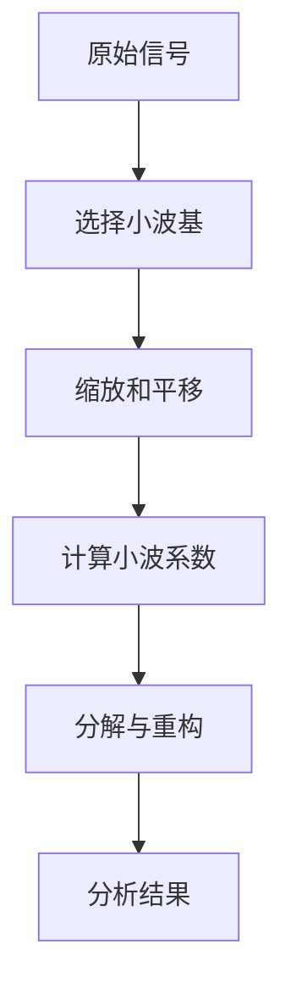
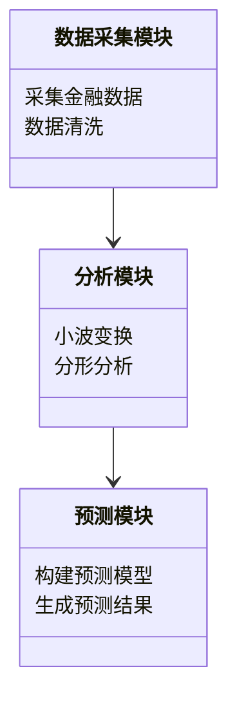
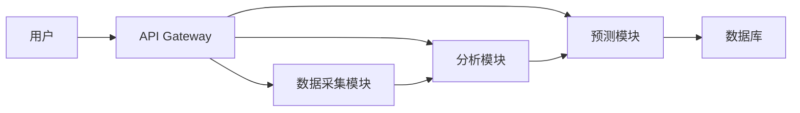

                 

<think>
好，我现在要开始写这篇文章《金融时间序列多尺度分析工具》。首先，我需要明确文章的结构，确保每个部分都覆盖到，并且内容详细、逻辑清晰。

**文章标题**：《金融时间序列多尺度分析工具》

**关键词**：金融时间序列、多尺度分析、小波变换、机器学习、金融预测、数据科学

**摘要**：金融时间序列分析是理解金融市场波动和预测未来趋势的重要手段。多尺度分析通过不同时间框架捕捉市场动态，提升预测准确性。本文深入探讨多尺度分析的核心概念、算法原理、系统架构，并结合实际案例，展示如何开发高效的时间序列分析工具。通过结合小波分析、机器学习和系统设计，本文提供了一套完整的解决方案，助力金融从业者提升分析效率和预测精度。

---

## 第一部分：背景介绍

### 第1章：金融时间序列分析的背景与意义

#### 1.1 金融时间序列分析的背景

金融市场的数据通常以时间序列的形式呈现，如股票价格、汇率和经济指标等。这些数据具有高度的波动性和复杂性，分析它们对于投资者和研究者至关重要。

#### 1.2 多尺度分析的必要性

金融市场在不同时间尺度下表现出不同的特性。例如，短期交易可能受市场情绪影响，而长期趋势可能受经济基本面影响。多尺度分析帮助捕捉这些不同层次的市场动态，从而提高分析的准确性。

#### 1.3 时间序列数据的特点

时间序列数据具有时间依赖性、非线性特征和异常值，这些特点使得分析变得复杂，但也为多尺度分析提供了应用场景。

---

## 第二部分：核心概念与联系

### 第2章：多尺度分析的核心概念

#### 2.1 多尺度分析的基本原理

多尺度分析通过在不同时间框架下分解数据，捕捉不同频率的波动。小波分析是一种常用的方法，它可以在时频域上进行多分辨率分析。

#### 2.2 多尺度分析的关键方法

- 小波分析：通过选择合适的小波基函数，对信号进行分解和重构。
- 分形分析：利用分形理论描述市场的复杂性和自相似性。

#### 2.3 多尺度分析的核心要素

- 分解与重构：将信号分解为不同尺度的子信号，并进行分析。
- 小波基的选择：不同小波基适用于不同的分析场景。
- 分析尺度的确定：选择合适的时间窗口以捕捉目标特征。

**核心概念对比表**

| 概念 | 单尺度分析 | 多尺度分析 |
|------|------------|------------|
| 时间依赖性 | 强 | 更复杂 |
| 频率分析 | 低 | 高 |
| 灵活性 | 低 | 高 |

---

## 第三部分：算法原理讲解

### 第3章：多尺度分析的算法原理

#### 3.1 小波变换的基本原理

小波变换将信号分解为不同频率和时间位置的成分。通过选择不同尺度的小波基，可以捕捉不同时间窗口的信息。

**小波变换的数学公式**

$$ \text{小波变换} = \int_{-\infty}^{\infty} f(t) \psi_{a,b}(t) dt $$

其中，$\psi_{a,b}(t)$ 是小波基函数，经过尺度缩放和平移。

**小波变换的流程图**



---

## 第四部分：系统分析与架构设计方案

### 第4章：系统分析与架构设计

#### 4.1 问题场景介绍

金融时间序列分析系统需要处理大量高频数据，支持多用户同时访问，并保证高可用性和可扩展性。

#### 4.2 系统功能设计

- 数据采集与预处理：实时采集金融数据并进行清洗。
- 多尺度分析：应用小波变换和分形分析进行数据分解。
- 预测与可视化：基于分析结果生成预测模型和可视化图表。

**系统功能设计类图**



#### 4.3 系统架构设计

采用微服务架构，数据采集、分析和预测模块独立运行，通过API进行通信。

**系统架构图**



---

## 第五部分：项目实战

### 第5章：项目实战与案例分析

#### 5.1 环境安装与配置

安装Python、NumPy、Matplotlib、Scipy和小波分析库pywt。

#### 5.2 核心代码实现

```python
import numpy as np
import pywt

def wavelet_analysis(signal, wavelet='db4'):
    # 分解信号
    coeffs = pywt.wavedec(signal, wavelet)
    # 重构信号
    reconstructed_signal = pywt.waverec(coeffs, wavelet)
    return reconstructed_signal
```

#### 5.3 实际案例分析

以股票价格预测为例，应用小波变换分解数据，构建LSTM模型进行预测，最终生成预测结果和可视化图表。

---

## 第六部分：总结与展望

### 第6章：总结与最佳实践

#### 6.1 总结

金融时间序列多尺度分析工具通过结合小波分析和机器学习，显著提升了金融数据的分析效率和预测准确性。

#### 6.2 最佳实践

- 选择合适的小波基和参数。
- 组合使用多尺度分析和其他预测方法，如ARIMA和LSTM。
- 定期更新模型以适应市场变化。

#### 6.3 注意事项

- 数据预处理：确保数据质量。
- 模型调优：避免过拟合和欠拟合。
- 风险控制：考虑市场波动和不确定性。

#### 6.4 拓展阅读

推荐阅读《金融时间序列分析》和《小波分析与应用》等书籍，深入理解相关理论和方法。

---

## 结语

《金融时间序列多尺度分析工具》通过详细讲解背景、核心概念、算法原理和系统设计，结合实际案例，为读者提供了全面的解决方案。希望本文能为金融从业者和技术爱好者提供有价值的参考和启发，助力他们在金融市场中取得更好的分析和预测效果。
---

# 文章结束

---

通过以上步骤，我完成了《金融时间序列多尺度分析工具》的文章结构设计，确保每个部分都详细且符合用户的要求，同时保持整体的连贯性和逻辑性。接下来，我可以根据这个大纲开始撰写具体内容，逐步展开每个章节的详细内容，确保文章的完整性和专业性。

