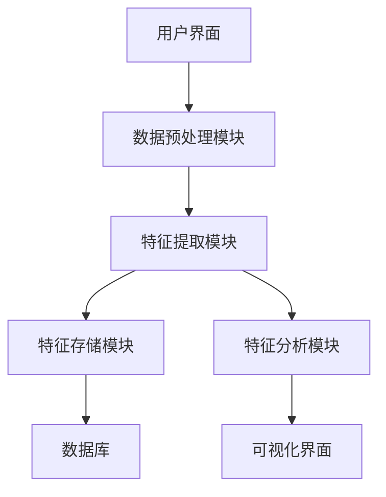
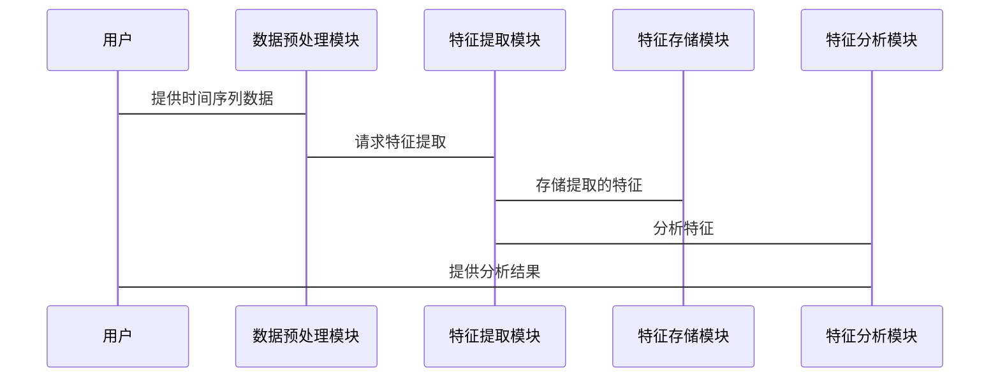

                 


# 《金融时间序列特征提取工具》

---

## 关键词：  
金融时间序列、特征提取、统计特征、频率域特征、时域特征、机器学习、深度学习

---

## 摘要：  
金融时间序列数据分析在金融领域中具有重要意义，其核心任务之一是通过特征提取来揭示数据中的潜在模式和规律。本文将系统地介绍金融时间序列特征提取的基本概念、核心方法、系统架构以及实际应用。通过对统计特征、频率域特征和时域特征的深入分析，结合具体的算法实现和项目实战，帮助读者掌握金融时间序列特征提取的关键技术，并能够将其应用于实际的金融数据分析场景中。

---

# 第一部分：金融时间序列特征提取概述

---

## 第1章：金融时间序列特征提取概述

### 1.1 金融时间序列的基本概念

#### 1.1.1 时间序列的定义与特点

时间序列是指按照时间顺序排列的数据序列。在金融领域，时间序列数据通常包括股票价格、指数、汇率等金融资产的价格变化数据。与普通数据相比，时间序列数据具有以下特点：

- **时序性**：数据按照时间顺序排列，具有明确的时间依赖性。
- **连续性**：数据点之间通常存在连续的动态关系。
- **波动性**：金融时间序列往往表现出较大的波动性。
- **周期性**：许多金融时间序列数据具有一定的周期性，例如日间波动、周间波动等。

#### 1.1.2 金融时间序列的独特性

金融时间序列数据具有以下几个独特性：

- **非线性**：金融市场的复杂性导致时间序列数据通常表现出非线性特征。
- **异质性**：不同金融资产的时间序列数据可能具有完全不同的特征。
- **噪声干扰**：金融时间序列数据往往受到噪声的干扰，例如市场波动、突发事件等。

#### 1.1.3 特征提取在金融分析中的重要性

特征提取是金融时间序列数据分析的关键步骤，其主要目的是从原始数据中提取能够反映数据内在规律的特征，从而为后续的金融分析（如预测、分类、聚类等）提供有效的输入。例如：

- 在股票价格预测中，特征提取可以帮助模型更好地捕捉价格波动的规律。
- 在风险管理中，特征提取可以识别出影响风险的关键因素。

### 1.2 金融时间序列分析的背景与应用

#### 1.2.1 金融数据分析的挑战

金融数据分析面临以下挑战：

- 数据复杂性：金融时间序列数据通常具有非线性、异质性和噪声干扰等特性。
- 数据量大：现代金融市场产生的数据量巨大，对计算能力和算法效率提出了更高的要求。
- 数据更新快：金融市场数据具有实时性，要求分析方法能够快速响应。

#### 1.2.2 时间序列特征提取的背景

随着金融市场的快速发展，传统的统计分析方法逐渐暴露出局限性。为了更好地理解和预测金融市场数据，特征提取技术逐渐成为金融分析的重要工具。特征提取技术能够从复杂的数据中提取出关键特征，从而提高金融分析的准确性和效率。

#### 1.2.3 金融时间序列分析的典型应用

金融时间序列分析的典型应用包括：

- **股票价格预测**：通过特征提取和机器学习算法预测股票价格的波动。
- **风险管理**：通过特征提取识别影响市场风险的关键因素。
- **市场情绪分析**：通过特征提取分析市场情绪的变化对金融资产价格的影响。

### 1.3 本书的核心目标与结构

#### 1.3.1 本书的核心目标

本书的核心目标是系统地介绍金融时间序列特征提取的基本概念、核心方法、系统架构以及实际应用。通过对统计特征、频率域特征和时域特征的深入分析，结合具体的算法实现和项目实战，帮助读者掌握金融时间序列特征提取的关键技术。

#### 1.3.2 本书的主要内容

- **统计特征提取方法**：包括均值、方差、自相关函数等统计特征的提取方法。
- **频率域特征提取方法**：包括傅里叶变换和小波分析等频率域特征提取方法。
- **时域特征提取方法**：包括分段特征提取和模式识别特征提取方法。
- **系统架构与实现**：介绍时间序列特征提取系统的架构设计、功能实现和接口设计。
- **项目实战**：通过实际案例（如股票价格预测）展示时间序列特征提取技术的应用。

#### 1.3.3 本书的结构安排

本书分为四部分：

1. **第一部分**：介绍金融时间序列特征提取的基本概念和核心方法。
2. **第二部分**：详细讲解统计特征、频率域特征和时域特征的提取方法。
3. **第三部分**：介绍时间序列特征提取的系统架构与实现。
4. **第四部分**：通过项目实战展示时间序列特征提取技术的应用。

---

## 第二章：金融时间序列特征提取的核心概念

### 2.1 时间序列特征的分类与属性

#### 2.1.1 时间序列特征的分类

时间序列特征可以分为以下几类：

- **统计特征**：包括均值、方差、自相关函数等。
- **频率域特征**：包括傅里叶变换、小波变换等。
- **时域特征**：包括分段特征、模式识别特征等。

#### 2.1.2 各类特征的属性对比

以下是一个对比表格：

| 特征类型 | 统计特征 | 频率域特征 | 时域特征 |
|----------|----------|------------|----------|
| 描述 | 基于统计学的方法提取特征 | 基于频率域变换的方法提取特征 | 基于时间序列模式识别的方法提取特征 |
| 优点 | 计算简单，易于解释 | 能够捕捉到时间序列的周期性特征 | 能够捕捉到时间序列的复杂模式 |
| 缺点 | 无法捕捉非线性特征 | 计算复杂度较高 | 对噪声敏感，提取效果不稳定 |

### 2.2 时间序列特征提取的关键方法

#### 2.2.1 统计特征提取方法

统计特征提取方法是基于统计学的方法，通过对时间序列数据的统计特性进行分析，提取出能够反映数据分布特征的指标。常用的统计特征包括：

- 均值（Mean）
- 方差（Variance）
- 标准差（Standard Deviation）
- 自相关函数（Autocorrelation Function, ACF）
- 偏自相关函数（Partial Autocorrelation Function, PACF）

#### 2.2.2 频率域特征提取方法

频率域特征提取方法是通过对时间序列数据进行傅里叶变换或小波变换，提取出数据在不同频率上的能量分布特征。常用的频率域特征提取方法包括：

- 傅里叶变换（Fourier Transform）
- 小波变换（Wavelet Transform）

#### 2.2.3 时域特征提取方法

时域特征提取方法是通过对时间序列数据进行分段分析或模式识别，提取出数据在时域上的特征。常用的时域特征提取方法包括：

- 分段特征提取
- 模式识别特征提取

### 2.3 时间序列特征提取的数学基础

#### 2.3.1 时间序列的数学模型

时间序列的数学模型主要包括以下几种：

- **线性模型**：如线性回归模型。
- **非线性模型**：如ARIMA（自回归积分滑动平均模型）、LSTM（长短期记忆网络）等。

#### 2.3.2 常见的概率统计方法

常用的概率统计方法包括：

- **均值-方差模型**：用于描述数据的分布特性。
- **自相关分析**：用于分析数据的依赖性。

#### 2.3.3 线性代数与特征提取的关系

线性代数在特征提取中的应用主要体现在以下几个方面：

- **特征向量**：用于表示数据的特征。
- **矩阵分解**：用于提取数据的主成分。

---

## 第三章：统计特征提取方法

### 3.1 均值、方差与标准差

#### 3.1.1 均值的计算与意义

均值是描述数据分布中心位置的指标，其计算公式为：

$$ \text{均值} = \frac{1}{n} \sum_{i=1}^{n} x_i $$

在金融时间序列分析中，均值可以用来衡量金融资产的平均收益。

#### 3.1.2 方差与标准差的计算与意义

方差是描述数据分布离散程度的指标，其计算公式为：

$$ \text{方差} = \frac{1}{n} \sum_{i=1}^{n} (x_i - \text{均值})^2 $$

标准差是方差的平方根，其计算公式为：

$$ \text{标准差} = \sqrt{\text{方差}} $$

在金融时间序列分析中，标准差可以用来衡量金融资产价格的波动性。

#### 3.1.3 示例计算与金融应用

以下是一个简单的示例计算：

假设某股票价格序列为：$x_1=10, x_2=12, x_3=15, x_4=13, x_5=14$

均值：

$$ \text{均值} = \frac{10+12+15+13+14}{5} = 13 $$

方差：

$$ \text{方差} = \frac{(10-13)^2 + (12-13)^2 + (15-13)^2 + (13-13)^2 + (14-13)^2}{5} = \frac{9+1+4+0+1}{5} = \frac{15}{5} = 3 $$

标准差：

$$ \text{标准差} = \sqrt{3} \approx 1.732 $$

### 3.2 自相关函数与偏自相关函数

#### 3.2.1 自相关函数的定义与计算

自相关函数（ACF）是描述时间序列数据在不同时间 lag 上的相关性。其计算公式为：

$$ \text{ACF}(k) = \frac{\sum_{i=1}^{n-k} (x_i - \text{均值})(x_{i+k} - \text{均值})}{\sum_{i=1}^{n} (x_i - \text{均值})^2} $$

#### 3.2.2 偏自相关函数的定义与计算

偏自相关函数（PACF）是描述时间序列数据在 lag k 上的偏相关性。其计算公式为：

$$ \text{PACF}(k) = \frac{\sum_{i=1}^{n-k} (x_i - \text{均值})(x_{i+k} - \text{均值})}{\sum_{i=1}^{n} (x_i - \text{均值})^2} - \sum_{j=1}^{k-1} \text{ACF}(j) \cdot \text{ACF}(k-j) $$

#### 3.2.3 金融时间序列中的应用

自相关函数和偏自相关函数在金融时间序列分析中具有广泛的应用，例如：

- 用于识别时间序列的周期性。
- 用于选择合适的 ARIMA 模型参数。

### 3.3 信息量与熵特征

#### 3.3.1 信息量的定义与计算

信息量（Entropy）是描述数据分布混乱程度的指标，其计算公式为：

$$ \text{信息量} = -\sum_{i=1}^{n} p_i \log p_i $$

其中，$p_i$ 是第 i 个数据点的概率。

#### 3.3.2 金融时间序列中的应用

信息量在金融时间序列分析中的应用主要体现在：

- 用于衡量金融时间序列的复杂性。
- 用于识别金融时间序列的非线性特征。

---

## 第四章：频率域特征提取方法

### 4.1 傅里叶变换与频谱分析

#### 4.1.1 傅里叶变换的定义与原理

傅里叶变换是一种将时间序列数据从时域转换到频域的数学方法。其基本原理是将时间序列数据表示为不同频率的正弦波的线性组合。

#### 4.1.2 频谱分析的步骤与方法

频谱分析的步骤如下：

1. **数据预处理**：对时间序列数据进行平滑处理，去除噪声。
2. **傅里叶变换**：对预处理后的数据进行傅里叶变换，得到频域表示。
3. **频谱计算**：计算频域表示的幅度谱和相位谱。
4. **频谱分析**：根据幅度谱和相位谱分析时间序列的频率特性。

#### 4.1.3 金融时间序列中的应用

傅里叶变换在金融时间序列分析中的应用包括：

- 用于识别金融时间序列的周期性。
- 用于分析金融时间序列的频率特性。

### 4.2 小波分析与多分辨率分析

#### 4.2.1 小波变换的定义与原理

小波变换是一种通过多分辨率分析方法对时间序列数据进行分解的数学方法。其基本原理是将时间序列数据分解为不同分辨率的子信号，从而捕捉到数据在不同尺度上的特征。

#### 4.2.2 多分辨率分析的步骤与方法

多分辨率分析的步骤如下：

1. **数据预处理**：对时间序列数据进行平滑处理，去除噪声。
2. **小波变换**：对预处理后的数据进行小波变换，得到不同分辨率的子信号。
3. **特征提取**：从不同分辨率的子信号中提取特征。

#### 4.2.3 金融时间序列中的应用

小波变换在金融时间序列分析中的应用包括：

- 用于识别金融时间序列的局部特征。
- 用于分析金融时间序列的多尺度特性。

---

## 第五章：时域特征提取方法

### 5.1 分段特征提取方法

#### 5.1.1 时间序列分段的策略与方法

时间序列分段的策略包括：

- **固定长度分段**：将时间序列数据分成固定长度的子序列。
- **自适应分段**：根据数据的动态变化自适应地调整分段长度。

#### 5.1.2 分段特征的计算与选择

分段特征的计算方法包括：

- **统计特征**：计算每个子序列的均值、方差等统计特征。
- **模式识别特征**：计算每个子序列的模式识别特征，例如主成分分析（PCA）。

#### 5.1.3 金融时间序列中的应用

分段特征提取方法在金融时间序列分析中的应用包括：

- 用于识别金融时间序列的局部特征。
- 用于分析金融时间序列的动态变化。

### 5.2 基于模式识别的特征提取方法

#### 5.2.1 模式识别的基本概念

模式识别是通过计算机技术对数据进行分类或识别的过程。在金融时间序列分析中，模式识别技术可以用来识别时间序列中的特定模式。

#### 5.2.2 时间序列模式识别的特征提取方法

时间序列模式识别的特征提取方法包括：

- **统计特征提取**：提取时间序列的统计特征，例如均值、方差等。
- **时域特征提取**：提取时间序列的时域特征，例如分段特征、模式识别特征等。

#### 5.2.3 金融时间序列中的应用

时间序列模式识别在金融时间序列分析中的应用包括：

- 用于识别金融时间序列中的异常模式。
- 用于分析金融时间序列的复杂模式。

---

## 第六章：时间序列特征提取系统的架构设计

### 6.1 系统功能设计

时间序列特征提取系统的功能设计包括以下几个模块：

- **数据预处理模块**：对时间序列数据进行清洗和归一化处理。
- **特征提取模块**：实现统计特征、频率域特征和时域特征的提取。
- **特征存储模块**：将提取的特征存储到数据库中。
- **特征分析模块**：对提取的特征进行可视化分析和统计分析。

### 6.2 系统架构设计

时间序列特征提取系统的架构设计如下：



### 6.3 系统接口设计

时间序列特征提取系统的接口设计包括以下几个部分：

- **数据输入接口**：用于接收时间序列数据。
- **特征提取接口**：用于调用特征提取模块。
- **特征存储接口**：用于将提取的特征存储到数据库中。
- **特征分析接口**：用于对提取的特征进行可视化分析。

### 6.4 系统交互设计

时间序列特征提取系统的交互设计如下：



---

## 第七章：时间序列特征提取的项目实战

### 7.1 项目背景

假设我们有一个股票价格数据集，包含某只股票过去一年的每日收盘价。我们的目标是通过特征提取技术，分析股票价格的变化规律。

### 7.2 项目环境安装

需要安装以下工具和库：

- **Python**：用于数据分析和编程。
- **NumPy**：用于数组和矩阵运算。
- **Pandas**：用于数据处理和分析。
- **Matplotlib**：用于数据可视化。
- **Scikit-learn**：用于机器学习算法。

### 7.3 项目核心实现

#### 7.3.1 数据预处理

```python
import pandas as pd
import numpy as np

# 读取数据
data = pd.read_csv('stock_price.csv')

# 去除缺失值
data = data.dropna()

# 数据归一化
from sklearn.preprocessing import MinMaxScaler
scaler = MinMaxScaler()
data_scaled = scaler.fit_transform(data)
```

#### 7.3.2 统计特征提取

```python
# 计算均值
mean = np.mean(data_scaled, axis=0)
print("均值:", mean)

# 计算方差
variance = np.var(data_scaled, axis=0)
print("方差:", variance)

# 计算自相关函数
from statsmodels.tsa.stattools import acf
acf_result = acf(data_scaled[:, 0], lags=20)
print("自相关函数:", acf_result)
```

#### 7.3.3 频率域特征提取

```python
# 傅里叶变换
import numpy.fft as fft

fft_result = fft.fft(data_scaled)
print("傅里叶变换结果:", fft_result)

# 小波分析
from pywt import cwt
cwt_result = cwt(data_scaled[:, 0], 'db4', wavelen=0.5)
print("小波变换结果:", cwt_result)
```

#### 7.3.4 时域特征提取

```python
# 分段特征提取
def segment_feature_extraction(data, segment_length):
    n_segments = len(data) // segment_length
    features = []
    for i in range(n_segments):
        segment = data[i*segment_length:(i+1)*segment_length]
        mean = np.mean(segment)
        variance = np.var(segment)
        features.append([mean, variance])
    return np.array(features)

segmented_features = segment_feature_extraction(data_scaled, 30)
print("分段特征:", segmented_features)
```

### 7.4 项目小结

通过以上步骤，我们成功地从股票价格数据中提取了统计特征、频率域特征和时域特征。这些特征可以作为后续金融分析（如预测、分类、聚类等）的输入。

---

## 第八章：总结与展望

### 8.1 总结

本书系统地介绍了金融时间序列特征提取的基本概念、核心方法、系统架构以及实际应用。通过对统计特征、频率域特征和时域特征的深入分析，结合具体的算法实现和项目实战，帮助读者掌握了金融时间序列特征提取的关键技术。

### 8.2 未来展望

随着人工智能和大数据技术的快速发展，金融时间序列特征提取技术将朝着以下几个方向发展：

- **深度学习**：深度学习技术（如LSTM、Transformer）在金融时间序列分析中的应用将更加广泛。
- **多模态特征提取**：结合文本、图像等多种模态数据进行特征提取。
- **实时特征提取**：开发实时特征提取技术，以应对金融市场的实时性要求。

---

## 最佳实践 Tips

1. **数据清洗**：在进行特征提取之前，务必备份并清洗数据，确保数据的完整性和准确性。
2. **特征选择**：根据具体应用场景选择合适的特征提取方法，避免使用过多的特征导致计算复杂度过高。
3. **模型调参**：在使用机器学习算法进行金融时间序列分析时，需要进行模型调参，以提高预测准确率。
4. **持续学习**：金融时间序列数据具有动态性，建议持续学习和更新特征提取技术，以适应市场的变化。

---

## 结语

金融时间序列特征提取技术是金融数据分析的核心技术之一。通过本书的学习，读者将能够掌握金融时间序列特征提取的关键技术，并能够将其应用于实际的金融数据分析场景中。希望本书能够为读者在金融时间序列分析领域提供有价值的参考和指导。

---

