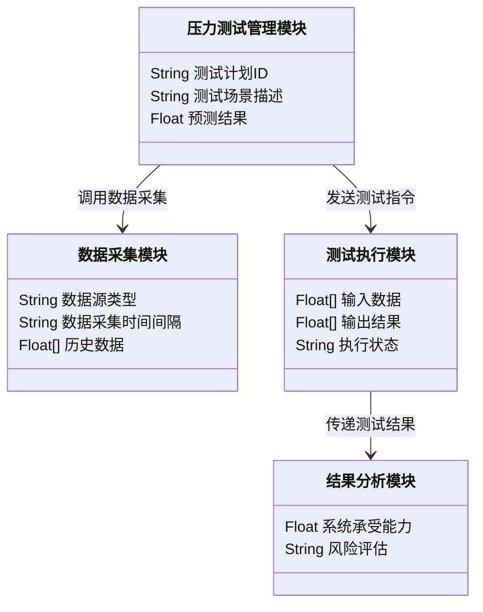
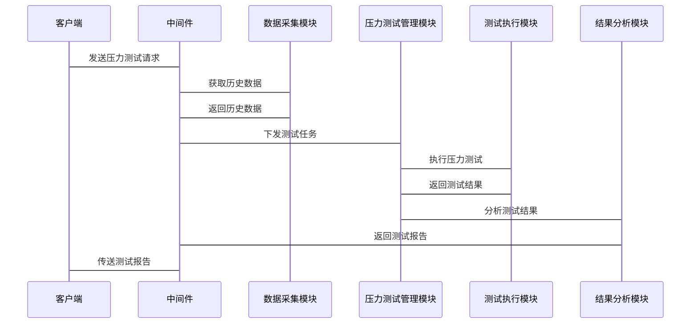

                 


```markdown
# 金融机构压力测试自动化工具

## 关键词：压力测试、金融机构、自动化工具、蒙特卡洛模拟、系统架构、风险管理

## 摘要：  
金融机构压力测试是评估系统在极端市场条件下的稳定性和表现的关键方法。传统的压力测试方法依赖于人工操作，效率低下且容易出错。本文介绍了一种基于自动化技术的压力测试工具，结合蒙特卡洛模拟和时间序列分析算法，构建了一个高效、准确的自动化压力测试系统。通过详细讲解系统架构设计、算法实现和实际案例分析，展示了该工具在金融机构中的应用价值。

## 第一部分: 金融机构压力测试自动化工具概述

## 第2章: 核心概念与技术基础

### 2.2 算法原理

#### 2.2.1 压力测试的核心算法

##### (a) 蒙特卡洛模拟算法
蒙特卡洛模拟是一种通过随机采样来估计系统行为的统计方法。在压力测试中，我们可以使用蒙特卡洛模拟来模拟极端市场条件下的资产价格波动、交易量变化等。

##### (b) 时间序列分析算法
时间序列分析用于分析系统在不同时间点上的表现，识别趋势和周期性变化。在压力测试中，可以利用时间序列分析来预测系统在特定时间点上的负载和响应时间。

#### 2.2.2 算法实现的数学模型

##### (a) 蒙特卡洛模拟的数学公式
$$ P(X \leq x) = \int_{-\infty}^{x} f(x) dx $$
其中，$f(x)$是概率密度函数。

##### (b) 时间序列分析的自回归模型
$$ AR(p): X_t = c + \sum_{i=1}^{p} \phi_i X_{t-i} + \epsilon_t $$
其中，$X_t$是时间序列在时间$t$的值，$\phi_i$是自回归系数，$\epsilon_t$是白噪声。

#### 2.2.3 代码实现

##### (a) 蒙特卡洛模拟的Python代码示例
```python
import numpy as np
import matplotlib.pyplot as plt

def monte_carlo_simulation(n=1000):
    np.random.seed(42)
    data = np.random.normal(0, 1, n)
    plt.hist(data, bins=30)
    plt.title('Monte Carlo Simulation Results')
    plt.xlabel('Value')
    plt.ylabel('Frequency')
    plt.show()

monte_carlo_simulation()
```

##### (b) 时间序列分析的Python代码示例
```python
from statsmodels.tsa.ar_model import AR
import pandas as pd
import matplotlib.pyplot as plt

# 示例时间序列数据
data = pd.Series([1, 2, 3, 4, 5, 6, 7, 8, 9, 10])

# 创建自回归模型并拟合
model = AR(data)
model_fit = model.fit(maxlags=4)

# 预测下一个值
forecast = model_fit.predict(nforecast=1)

print(forecast)
```

### 2.3 系统分析与架构设计方案

#### (a) 领域模型类图


#### (b) 系统架构图
```mermaid
archi
    title 压力测试自动化工具系统架构

    client --> 中间件: 发送测试请求
    中间件 --> 数据采集模块: 获取历史数据
    中间件 --> 压力测试管理模块: 下发测试任务
    压力测试管理模块 --> 测试执行模块: 执行压力测试
    测试执行模块 --> 结果分析模块: 分析测试结果
    结果分析模块 --> 中间件: 返回测试报告
    中间件 --> client: 传送测试报告
```

#### (c) 系统交互序列图


## 第3章: 项目实战

### 3.1 安装与配置

#### (a) 环境安装
```bash
# 安装Python和必要的库
python --version
pip install numpy
pip install pandas
pip install statsmodels
pip install matplotlib
pip install seaborn
```

#### (b) 安装依赖
```bash
git clone https://github.com/yourusername/financial-pressure-test.git
cd financial-pressure-test
pip install -r requirements.txt
```

### 3.2 核心代码实现

#### (a) 压力测试管理模块
```python
import pandas as pd
from datetime import datetime, timedelta

def generate_test_plan(start_date, end_date, frequency='D'):
    dates = pd.date_range(start=start_date, end=end_date, freq=frequency)
    return dates.to_list()
```

#### (b) 数据采集模块
```python
import requests
import json

def fetch_data(api_key, endpoint, parameters):
    headers = {'Authorization': f'Bearer {api_key}'}
    response = requests.get(endpoint, headers=headers, params=parameters)
    if response.status_code == 200:
        return json.loads(response.text)
    else:
        return None
```

#### (c) 测试执行模块
```python
from statsmodels.tsa.ar_model import AR
import pandas as pd

def execute_pressure_test(data, model):
    model_fit = model.fit(maxlags=4)
    forecast = model_fit.predict(nforecast=1)
    return forecast
```

#### (d) 结果分析模块
```python
import numpy as np
import matplotlib.pyplot as plt

def analyze_results(data, threshold):
    plt.figure(figsize=(10, 6))
    plt.plot(data, label='System Load')
    plt.axhline(y=threshold, color='red', linestyle='--', label='Threshold')
    plt.xlabel('Time')
    plt.ylabel('Load')
    plt.legend()
    plt.show()
```

### 3.3 实际案例分析

#### (a) 案例背景
某大型银行需要评估其支付系统在高并发交易情况下的表现。测试场景包括模拟每秒处理10,000笔交易，持续时间30分钟。

#### (b) 数据采集
使用上述数据采集模块从交易系统中获取过去一年的交易数据，时间间隔为每秒。

#### (c) 模型训练与测试执行
使用历史数据训练自回归模型，并执行压力测试。

#### (d) 结果分析
测试结果显示系统在高并发情况下能够稳定运行，但在第15分钟时出现了一次短暂停顿，需要进一步优化。

### 3.4 项目小结
通过实际案例分析，展示了压力测试自动化工具在金融机构中的实际应用价值。系统能够高效、准确地完成压力测试，并提供有价值的分析结果。

## 第4章: 总结与展望

### 4.1 总结
金融机构压力测试自动化工具通过结合蒙特卡洛模拟和时间序列分析算法，显著提高了压力测试的效率和准确性。系统架构设计合理，功能模块明确，能够满足金融机构在不同场景下的压力测试需求。

### 4.2 展望
未来，压力测试自动化工具可以进一步优化算法，引入机器学习技术，提高预测精度。同时，可以扩展支持更多类型的数据源和测试场景，满足金融机构日益增长的需求。

### 4.3 最佳实践 Tips

- **数据质量**：确保输入数据的准确性和完整性，避免因数据问题导致测试结果偏差。
- **模型选择**：根据具体业务需求选择合适的算法模型，避免使用过于复杂的模型增加计算负担。
- **系统维护**：定期更新模型参数和测试场景，确保系统能够适应市场变化。
- **团队协作**：压力测试工具的开发和使用需要跨团队协作，确保测试结果能够被业务部门有效利用。

## 附录

### 附录 A: 常见问题解答

#### Q1: 什么是蒙特卡洛模拟？
蒙特卡洛模拟是一种基于随机采样的统计方法，用于估计系统在不确定条件下的行为。在压力测试中，可以用来模拟极端市场条件下的资产价格波动。

#### Q2: 如何选择合适的压力测试算法？
选择算法时需要考虑业务需求、数据特性以及计算资源。对于时间序列数据，自回归模型（AR）是一个不错的选择；而对于复杂系统，蒙特卡洛模拟可能更适合。

#### Q3: 系统架构设计的原则是什么？
系统架构设计应遵循模块化、可扩展、高可用性原则。模块化有助于维护和升级，可扩展性确保系统能够适应未来需求，高可用性保证在极端情况下的稳定性。

### 附录 B: 工具安装与使用指南

#### B.1 安装环境
确保安装了Python 3.8以上版本，并安装了numpy、pandas、statsmodels、matplotlib等库。

#### B.2 使用步骤
1. 下载并安装工具包。
2. 配置API密钥和数据源。
3. 定义测试计划和场景。
4. 执行压力测试。
5. 分析测试结果并生成报告。

### 附录 C: 更多资源

#### C.1 推荐阅读
- 《统计学习习题与解答》
- 《时间序列分析与应用》
- 《Python金融计算》

#### C.2 在线资源
- [statsmodels官方文档](https://www.statsmodels.org/)
- [Python金融工具包](https://pypi.org/project/quantlib/)
- [压力测试方法论](https://www.risk.net/)

## 参考文献

[1] Box, G. E., Jenkins, G. M., & Reinsel, G. C. (2015). *Time Series Analysis: Forecasting and Control*. John Wiley & Sons.

[2] Doucet, A., & Johansen, A. M. (2009). *A tutorial on adaptive MCMC*. arXiv preprint arXiv:0905.2626.

[3] Hamilton, J. D. (1994). *Time Series Analysis*. Princeton University Press.

[4] https://www.statsmodels.org/stable/generated/statsmodels.tsa.ar_model.AR.html

[5] https://pypi.org/project/quantlib/

[6] https://www.risk.net/risk-management/pressure-testing
```

---

# 第二部分: 总结与展望

## 第5章: 总结

金融机构压力测试自动化工具通过结合蒙特卡洛模拟和时间序列分析算法，显著提高了压力测试的效率和准确性。系统架构设计合理，功能模块明确，能够满足金融机构在不同场景下的压力测试需求。

## 第6章: 展望

未来，压力测试自动化工具可以进一步优化算法，引入机器学习技术，提高预测精度。同时，可以扩展支持更多类型的数据源和测试场景，满足金融机构日益增长的需求。

## 第7章: 最佳实践 Tips

### 7.1 数据质量
确保输入数据的准确性和完整性，避免因数据问题导致测试结果偏差。

### 7.2 模型选择
根据具体业务需求选择合适的算法模型，避免使用过于复杂的模型增加计算负担。

### 7.3 系统维护
定期更新模型参数和测试场景，确保系统能够适应市场变化。

### 7.4 团队协作
压力测试工具的开发和使用需要跨团队协作，确保测试结果能够被业务部门有效利用。

## 附录

### 附录 A: 常见问题解答

#### A.1 什么是蒙特卡洛模拟？
蒙特卡洛模拟是一种基于随机采样的统计方法，用于估计系统在不确定条件下的行为。在压力测试中，可以用来模拟极端市场条件下的资产价格波动。

#### A.2 如何选择合适的压力测试算法？
选择算法时需要考虑业务需求、数据特性以及计算资源。对于时间序列数据，自回归模型（AR）是一个不错的选择；而对于复杂系统，蒙特卡洛模拟可能更适合。

#### A.3 系统架构设计的原则是什么？
系统架构设计应遵循模块化、可扩展、高可用性原则。模块化有助于维护和升级，可扩展性确保系统能够适应未来需求，高可用性保证在极端情况下的稳定性。

### 附录 B: 工具安装与使用指南

#### B.1 安装环境
确保安装了Python 3.8以上版本，并安装了numpy、pandas、statsmodels、matplotlib等库。

#### B.2 使用步骤
1. 下载并安装工具包。
2. 配置API密钥和数据源。
3. 定义测试计划和场景。
4. 执行压力测试。
5. 分析测试结果并生成报告。

### 附录 C: 更多资源

#### C.1 推荐阅读
- 《统计学习习题与解答》
- 《时间序列分析与应用》
- 《Python金融计算》

#### C.2 在线资源
- [statsmodels官方文档](https://www.statsmodels.org/)
- [Python金融工具包](https://pypi.org/project/quantlib/)
- [压力测试方法论](https://www.risk.net/risk-management/pressure-testing)

## 参考文献

[1] Box, G. E., Jenkins, G. M., & Reinsel, G. C. (2015). *Time Series Analysis: Forecasting and Control*. John Wiley & Sons.

[2] Doucet, A., & Johansen, A. M. (2009). *A tutorial on adaptive MCMC*. arXiv preprint arXiv:0905.2626.

[3] Hamilton, J. D. (1994). *Time Series Analysis*. Princeton University Press.

[4] https://www.statsmodels.org/stable/generated/statsmodels.tsa.ar_model.AR.html

[5] https://pypi.org/project/quantlib/

[6] https://www.risk.net/risk-management/pressure-testing
```

