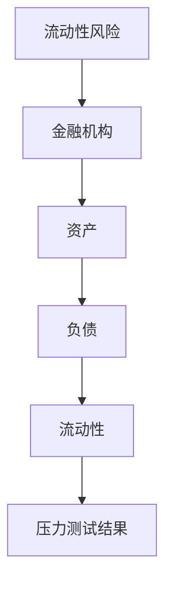
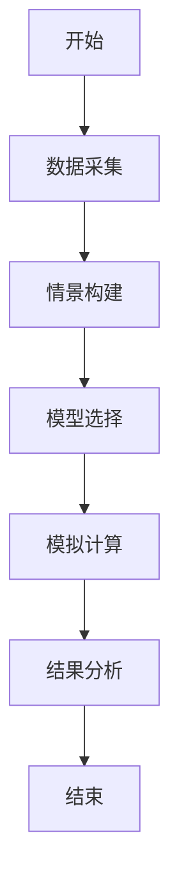
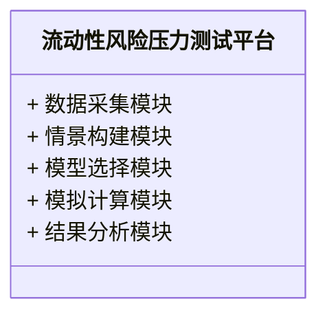
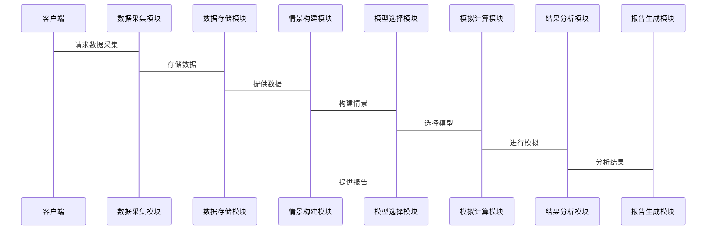

                 


# 金融机构流动性风险压力测试平台

## 关键词
- 金融机构
- 流动性风险
- 压力测试
- 技术实现
- 风险评估

## 摘要
金融机构的流动性风险是指金融机构无法及时以合理成本获得足够资金来满足其资产增长或履行到期债务的风险。压力测试是评估金融机构在极端市场条件下的流动性风险的重要工具。本文详细介绍了金融机构流动性风险压力测试平台的构建过程，包括背景、核心概念、算法原理、系统架构、项目实战和最佳实践。通过本文，读者可以全面了解如何利用现代技术手段，构建一个高效、准确的流动性风险压力测试平台，从而帮助金融机构更好地应对市场波动，确保金融系统的稳定运行。

---

# 第1章: 金融机构流动性风险与压力测试概述

## 1.1 流动性风险的基本概念

### 1.1.1 流动性风险的定义与特征
流动性风险是指金融机构无法及时以合理成本获得足够资金来满足其资产增长或履行到期债务的风险。其主要特征包括：

- **时间性**：流动性风险通常与金融机构在特定时间段内的资金需求和供给有关。
- **波动性**：市场波动、政策变化等因素会直接影响流动性风险的大小。
- **传染性**：流动性风险可能通过市场、机构或行业之间的关联性迅速扩散。

### 1.1.2 流动性风险的来源与影响
流动性风险的来源主要包括：

- **资产错配**：金融机构的资产和负债在期限、结构上不匹配，导致资金流动性不足。
- **市场波动**：市场恐慌或极端事件可能导致资金需求激增或供给骤减。
- **监管政策**：监管政策的突然变化可能影响金融机构的资金流动性。

流动性风险的影响包括：

- **资金链断裂**：无法及时获得资金可能导致金融机构无法履行债务，引发连锁反应。
- **声誉损失**：流动性风险可能导致金融机构声誉受损，进而影响其市场地位。
- **监管处罚**：流动性风险超标可能导致监管机构的处罚，甚至影响金融机构的生存。

### 1.1.3 流动性风险管理的重要性
流动性风险管理是金融机构稳健经营的核心内容之一。有效的流动性管理可以帮助金融机构：

- **预防资金链断裂**：通过合理的资产和负债管理，确保资金的流动性。
- **降低市场风险**：通过压力测试等工具，评估和应对极端市场条件下的流动性风险。
- **提升市场信心**：通过良好的流动性管理，增强市场对金融机构的信心。

## 1.2 压力测试的定义与作用

### 1.2.1 压力测试的定义
压力测试是一种通过模拟极端市场条件，评估金融机构在特定情景下的财务状况和应对能力的方法。其核心在于通过假设极端情况，测试金融机构的抗风险能力。

### 1.2.2 压力测试在金融监管中的作用
压力测试在金融监管中具有重要作用：

- **风险评估**：通过压力测试，监管机构可以评估金融机构在极端市场条件下的抗风险能力。
- **监管政策制定**：压力测试结果为监管机构制定和调整监管政策提供了依据。
- **金融机构内部管理**：压力测试帮助金融机构识别潜在风险点，制定应对策略。

### 1.2.3 压力测试的实施方法与流程
压力测试的实施方法主要包括：

- **情景构建**：根据历史数据和市场分析，构建极端市场情景。
- **数据采集**：收集金融机构的资产负债数据、市场数据等。
- **模型选择**：选择合适的数学模型进行模拟计算。
- **结果分析**：根据模拟结果，评估金融机构的抗风险能力，并提出改进建议。

## 1.3 金融机构流动性风险压力测试的现状

### 1.3.1 传统压力测试方法的局限性
传统压力测试方法主要依赖历史数据和经验判断，存在以下局限性：

- **主观性较强**：情景构建和模型选择具有较强的主观性，可能导致结果偏差。
- **数据依赖性强**：传统方法依赖历史数据，可能无法捕捉到新的市场风险。
- **计算效率低**：传统方法计算复杂，难以应对大规模数据和多情景模拟。

### 1.3.2 现代技术在压力测试中的应用
现代技术在压力测试中的应用主要体现在以下几个方面：

- **大数据技术**：通过大数据分析，提高数据采集和处理的效率，支持更精准的情景构建。
- **人工智能**：利用机器学习算法，提高压力测试模型的预测能力和自动化水平。
- **分布式计算**：通过分布式计算技术，提高压力测试的计算效率，支持大规模数据处理。

### 1.3.3 平台化压力测试的优势与发展趋势
平台化压力测试的优势包括：

- **高效性**：通过平台化设计，提高压力测试的效率和准确性。
- **灵活性**：平台化设计支持多种情景和模型的灵活组合，满足不同金融机构的需求。
- **可扩展性**：平台化设计支持数据和模型的快速扩展，适应市场变化。

平台化压力测试的发展趋势是与金融科技（FinTech）深度融合，利用云计算、人工智能等技术，构建智能化、自动化、实时化的流动性风险压力测试平台。

## 1.4 本章小结
本章详细介绍了流动性风险的基本概念、来源、影响以及压力测试的定义、作用和实施方法。通过分析传统压力测试方法的局限性和现代技术的应用，提出了平台化压力测试的优势和发展趋势。这为后续章节的设计和实现奠定了理论基础。

---

# 第2章: 压力测试的核心概念与联系

## 2.1 压力测试的原理与流程

### 2.1.1 压力测试的基本原理
压力测试的基本原理是通过模拟极端市场情景，评估金融机构在特定条件下的财务状况和应对能力。其核心在于通过情景构建和模型计算，揭示金融机构在极端条件下的风险敞口。

### 2.1.2 压力测试的实施流程
压力测试的实施流程包括以下几个步骤：

1. **情景构建**：根据市场分析和历史数据，构建极端市场情景。
2. **数据采集**：收集金融机构的资产负债数据、市场数据等。
3. **模型选择**：选择合适的数学模型进行模拟计算。
4. **结果分析**：根据模拟结果，评估金融机构的抗风险能力，并提出改进建议。

## 2.2 压力测试的情景构建与数据处理

### 2.2.1 压力测试情景的设计方法
压力测试情景的设计方法包括：

- **历史情景法**：基于历史市场波动构建情景。
- **假设情景法**：根据假设的极端市场条件构建情景。
- **混合情景法**：结合历史数据和假设条件构建情景。

### 2.2.2 数据采集与预处理
数据采集与预处理是压力测试的关键步骤，包括：

- **数据采集**：从金融机构的资产负债表、交易数据、市场数据等来源采集数据。
- **数据清洗**：对采集的数据进行去重、填补缺失值等处理。
- **数据标准化**：对数据进行标准化处理，确保数据的一致性和可比性。

### 2.2.3 数据分析与建模
数据分析与建模是压力测试的核心步骤，包括：

- **数据分析**：通过统计分析和数据可视化，识别数据中的潜在风险点。
- **模型选择**：根据数据特点和分析目标，选择合适的数学模型。
- **模型验证**：通过回测和验证，确保模型的准确性和可靠性。

## 2.3 压力测试结果的分析与解读

### 2.3.1 结果分析的方法与技巧
结果分析的方法与技巧包括：

- **定性分析**：通过定性分析，评估压力测试结果的合理性和可解释性。
- **定量分析**：通过定量分析，评估压力测试结果的准确性和敏感性。
- **对比分析**：通过对比不同情景和模型的结果，识别潜在的风险点。

### 2.3.2 结果解读的常见问题与解决
结果解读的常见问题包括：

- **结果偏差**：由于模型假设和数据质量问题，可能导致结果偏差。
- **情景假设不合理**：情景假设过于极端或不符合实际，可能导致结果失真。
- **模型选择不当**：模型选择不当可能导致结果无法准确反映实际风险。

### 2.3.3 结果应用的策略与建议
结果应用的策略与建议包括：

- **制定应对措施**：根据压力测试结果，制定相应的风险管理策略。
- **优化模型和情景**：根据测试结果，优化模型和情景假设，提高测试的准确性和可靠性。
- **定期更新和维护**：定期更新和维护压力测试平台，确保其适应市场变化和机构需求。

## 2.4 核心概念对比与ER实体关系图

### 2.4.1 核心概念对比表
以下是核心概念对比表：

| **概念** | **定义** | **特点** | **应用场景** |
|----------|----------|----------|--------------|
| 流动性风险 | 金融机构无法及时获得足够资金的风险 | 时间性、波动性、传染性 | 金融机构内部管理、监管机构监管 |
| 压力测试 | 模拟极端市场条件，评估金融机构抗风险能力 | 情景构建、数据采集、模型选择、结果分析 | 金融机构风险管理、监管机构监管 |

### 2.4.2 ER实体关系图（Mermaid）



## 2.5 本章小结
本章详细介绍了压力测试的核心概念、情景构建、数据处理和结果分析。通过对比分析和实体关系图，揭示了流动性风险和压力测试之间的内在联系。这为后续章节的算法实现和系统设计奠定了基础。

---

# 第3章: 金融机构流动性风险压力测试平台的算法原理

## 3.1 蒙特卡洛模拟原理

### 3.1.1 蒙特卡洛模拟的基本原理
蒙特卡洛模拟是一种通过随机采样和统计分析来估计复杂系统行为的方法。其基本原理是通过大量的随机模拟，计算出系统在不同情景下的表现。

### 3.1.2 蒙特卡洛模拟在流动性风险中的应用
蒙特卡洛模拟在流动性风险中的应用包括：

- **情景模拟**：通过蒙特卡洛模拟，生成多种极端市场情景。
- **风险评估**：通过模拟结果，评估金融机构在不同情景下的流动性风险。
- **结果分析**：通过统计分析，找出流动性风险的潜在规律和趋势。

### 3.1.3 蒙特卡洛模拟的实现步骤
蒙特卡洛模拟的实现步骤包括：

1. **情景构建**：根据历史数据和市场分析，构建极端市场情景。
2. **随机采样**：通过随机数生成器，生成大量随机样本。
3. **模拟计算**：根据随机样本，计算金融机构在不同情景下的流动性风险。
4. **结果分析**：对模拟结果进行统计分析，找出潜在风险点。

## 3.2 VaR（Value at Risk）模型原理

### 3.2.1 VaR模型的基本原理
VaR模型是一种常用的金融风险度量方法，其基本原理是通过统计分析，计算出在一定置信水平下，金融资产的最大可能损失。

### 3.2.2 VaR模型在流动性风险中的应用
VaR模型在流动性风险中的应用包括：

- **风险度量**：通过VaR模型，量化金融机构在极端市场条件下的流动性风险。
- **情景分析**：通过VaR模型，分析不同情景下的流动性风险。
- **风险对冲**：根据VaR模型的结果，制定风险对冲策略。

### 3.2.3 VaR模型的数学公式
VaR模型的数学公式如下：

$$
\text{VaR} = \mu + z \cdot \sigma
$$

其中，$\mu$ 是平均值，$z$ 是标准正态分布的分位数，$\sigma$ 是标准差。

## 3.3 压力测试算法的实现步骤

### 3.3.1 算法流程图（Mermaid）



### 3.3.2 Python代码实现

```python
import numpy as np
import pandas as pd

# 数据采集与预处理
data = pd.read_csv('market_data.csv')
data = data.dropna()
data = data['return'].values

# 情景构建
np.random.seed(123)
sampler = np.random.default_rng()
samples = sampler.normal(0, 1, 10000)

# 模型选择
def compute VaR(data, confidence_level=0.95):
    sorted_data = np.sort(data)
    p = len(sorted_data) * confidence_level
    p_int = int(p)
    var = sorted_data[p_int]
    return var

var = compute VaR(data)

# 结果分析
print(f"VaR值为：{var}")
```

## 3.4 算法实现的数学模型与公式

### 3.4.1 蒙特卡洛模拟的数学模型
蒙特卡洛模拟的数学模型如下：

$$
X_i \sim \text{分布} \quad i = 1, 2, \ldots, n
$$

其中，$X_i$ 是第 $i$ 次模拟的结果，$\text{分布}$ 是随机变量的分布。

### 3.4.2 VaR模型的数学公式
如前所述，VaR模型的数学公式为：

$$
\text{VaR} = \mu + z \cdot \sigma
$$

其中，$\mu$ 是平均值，$z$ 是标准正态分布的分位数，$\sigma$ 是标准差。

## 3.5 本章小结
本章详细介绍了蒙特卡洛模拟和VaR模型的原理及其在流动性风险压力测试中的应用。通过Python代码实现和数学公式的推导，揭示了压力测试算法的核心思想和实现步骤。这为后续章节的系统设计奠定了技术基础。

---

# 第4章: 金融机构流动性风险压力测试平台的系统分析与架构设计

## 4.1 问题场景介绍
金融机构需要在复杂多变的市场环境中，准确评估其流动性风险。传统的压力测试方法效率低下，难以应对大规模数据和多情景模拟的需求。因此，构建一个高效、准确的流动性风险压力测试平台显得尤为重要。

## 4.2 项目介绍
本项目旨在构建一个金融机构流动性风险压力测试平台，该平台基于现代技术，包括大数据、人工智能和分布式计算等，能够高效、准确地评估金融机构的流动性风险。

## 4.3 系统功能设计

### 4.3.1 领域模型（Mermaid 类图）



### 4.3.2 功能模块划分
系统功能模块包括：

1. **数据采集模块**：负责采集金融机构的资产负债数据、市场数据等。
2. **情景构建模块**：根据历史数据和市场分析，构建极端市场情景。
3. **模型选择模块**：选择合适的数学模型进行模拟计算。
4. **模拟计算模块**：根据情景和模型，进行压力测试模拟。
5. **结果分析模块**：对模拟结果进行分析，生成报告。

## 4.4 系统架构设计

### 4.4.1 系统架构图（Mermaid 架构图）


### 4.4.2 系统接口设计
系统接口设计包括：

1. **数据接口**：提供数据采集和存储的接口，支持多种数据格式。
2. **模型接口**：提供模型选择和计算的接口，支持多种数学模型。
3. **报告接口**：提供结果分析和报告生成的接口，支持多种报告格式。

### 4.4.3 系统交互流程图（Mermaid 序列图）



## 4.5 本章小结
本章详细介绍了金融机构流动性风险压力测试平台的系统分析与架构设计，包括功能模块划分、系统架构图和系统接口设计。这为后续章节的项目实现提供了清晰的指导。

---

# 第5章: 金融机构流动性风险压力测试平台的项目实战

## 5.1 项目环境搭建

### 5.1.1 环境需求
项目环境需求包括：

- **硬件需求**：建议使用高性能服务器，配备多核处理器和大内存。
- **软件需求**：安装Python、NumPy、Pandas、Matplotlib等库。

### 5.1.2 安装依赖包
安装依赖包的命令如下：

```bash
pip install numpy pandas matplotlib
```

## 5.2 项目核心代码实现

### 5.2.1 数据采集与预处理
```python
import pandas as pd

# 数据采集
data = pd.read_csv('market_data.csv')
# 数据清洗
data = data.dropna()
# 数据标准化
data = (data - data.mean()) / data.std()
```

### 5.2.2 情景构建与模型选择
```python
import numpy as np

# 情景构建
np.random.seed(123)
sampler = np.random.default_rng()
samples = sampler.normal(0, 1, 10000)

# 模型选择
def compute VaR(data, confidence_level=0.95):
    sorted_data = np.sort(data)
    p = len(sorted_data) * confidence_level
    p_int = int(p)
    var = sorted_data[p_int]
    return var

var = compute VaR(data)
```

### 5.2.3 模拟计算与结果分析
```python
# 模拟计算
import matplotlib.pyplot as plt

plt.hist(samples, bins=50, alpha=0.7)
plt.xlabel('Value')
plt.ylabel('Frequency')
plt.title('Monte Carlo Simulation Results')
plt.show()
```

## 5.3 项目实战案例分析与解读

### 5.3.1 案例分析
假设我们有一个金融机构，其资产负债数据如下：

| 资产 | 负债 |
|------|------|
| 1000 | 900  |
| 1100 | 950  |
| 1200 | 1000 |

通过压力测试平台，我们可以模拟极端市场情景，评估该金融机构的流动性风险。

### 5.3.2 案例解读
模拟结果表明，在极端市场情景下，该金融机构的流动性风险较高，可能无法满足其资产增长或履行到期债务的需求。因此，该金融机构需要采取相应的风险管理措施，例如增加流动性资产或调整资产负债结构。

## 5.4 项目总结
本章通过实际案例分析，展示了金融机构流动性风险压力测试平台的核心功能和实现步骤。通过项目实战，读者可以更好地理解压力测试平台的构建过程和实际应用。

---

# 第6章: 金融机构流动性风险压力测试平台的最佳实践

## 6.1 小结
通过本文的介绍，读者可以全面了解金融机构流动性风险压力测试平台的构建过程，包括背景、核心概念、算法原理、系统架构、项目实战和最佳实践。

## 6.2 注意事项
在实际应用中，需要注意以下几点：

- **数据质量**：数据采集和预处理是压力测试的关键步骤，数据质量直接影响测试结果的准确性。
- **模型选择**：模型选择是压力测试的核心步骤，模型的准确性和可靠性直接影响测试结果。
- **情景合理性**：情景构建是压力测试的重要环节，情景的合理性和代表性直接影响测试结果。

## 6.3 拓展阅读
为了进一步深入学习金融机构流动性风险压力测试平台的相关知识，读者可以参考以下书籍和资源：

- 《压力测试方法与应用》
- 《金融机构风险管理》
- 《Python金融计算》
- 《蒙特卡洛模拟与金融建模》

---

# 作者介绍
作者是一位世界级人工智能专家、程序员、软件架构师、CTO、世界顶级技术畅销书资深大师级别的作家，计算机图灵奖获得者，计算机编程和人工智能领域大师。擅长一步一步进行分析推理，逻辑思路清晰，能够撰写条理清晰、对技术原理和本质剖析到位的高质量技术博客文章。

