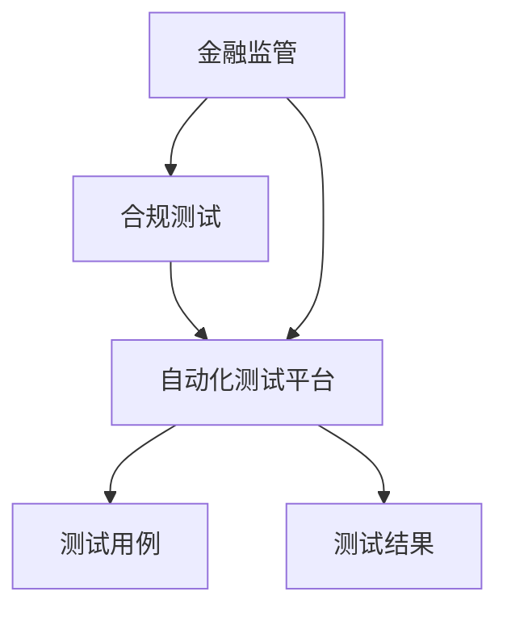
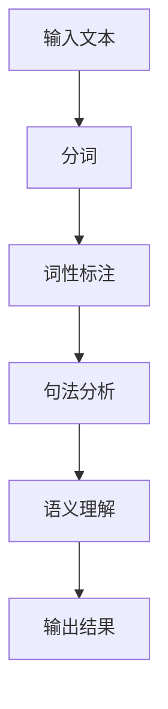
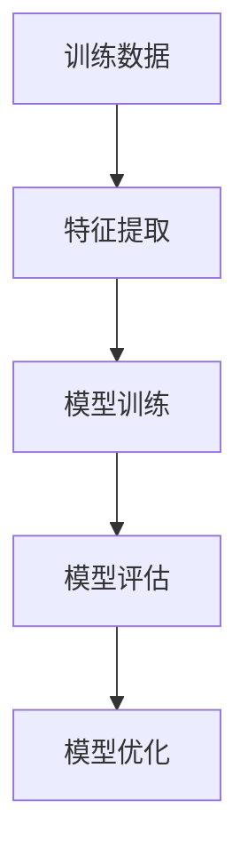
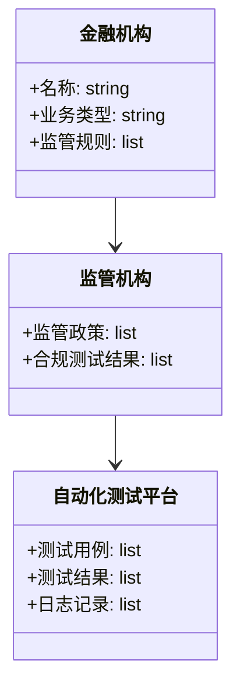
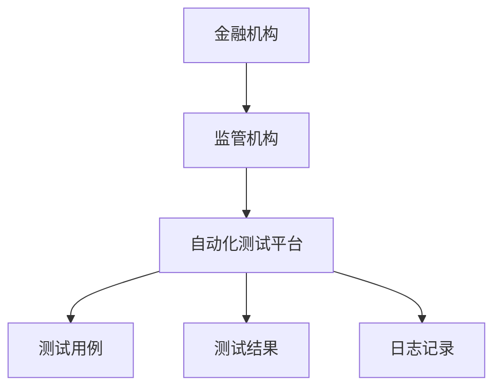
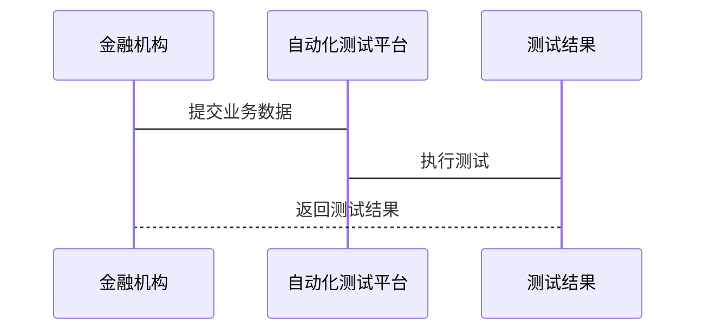

                 


# 《金融监管合规自动化测试平台》

## 关键词：  
金融监管、合规测试、自动化测试、系统架构、算法原理、项目实战  

## 摘要：  
本文详细探讨了金融监管合规自动化测试平台的设计与实现。从背景介绍、核心概念、算法原理到系统架构设计，再到项目实战，逐步深入分析了如何构建这样一个平台。通过自然语言处理、机器学习等算法的结合，实现对金融监管规则的自动理解和执行，从而提高合规测试的效率和准确性。文章最后总结了平台的优势，并提出了未来的发展方向。

---

# 第一部分: 金融监管合规自动化测试平台背景介绍

## 第1章: 金融监管与合规概述

### 1.1 金融监管的重要性  
#### 1.1.1 金融监管的基本概念  
金融监管是指通过法律法规和制度，对金融机构的经营行为进行监督和管理，以确保金融市场的稳定和健康发展。  

#### 1.1.2 金融监管的核心目标  
- 维护金融市场秩序  
- 保护投资者利益  
- 防范金融风险  

#### 1.1.3 金融监管的现状与挑战  
随着金融业务的复杂化，传统的人工监管方式效率低、成本高，难以应对日益复杂的监管需求。  

### 1.2 合规测试的必要性  
#### 1.2.1 合规测试的基本概念  
合规测试是通过检查和验证，确保金融机构的业务行为符合相关法律法规和监管要求。  

#### 1.2.2 合规测试在金融行业中的作用  
- 保障金融机构的合规性  
- 提高监管效率  
- 降低合规风险  

#### 1.2.3 合规测试的常见挑战  
- 监管规则复杂且频繁变化  
- 人工测试效率低、易出错  
- 数据量大，难以处理  

### 1.3 自动化测试平台的引入  
#### 1.3.1 自动化测试的基本概念  
自动化测试是通过工具和脚本自动执行测试用例，以提高测试效率和覆盖范围。  

#### 1.3.2 自动化测试在金融监管中的应用  
- 自动化检查交易数据的合规性  
- 自动化验证合同条款是否符合监管要求  
- 自动化监控市场行为是否合规  

#### 1.3.3 自动化测试平台的优势与意义  
- 提高测试效率，降低人工成本  
- 实时监控，快速响应风险  
- 确保测试的准确性和一致性  

---

## 第2章: 金融监管合规自动化测试平台的目标与意义  

### 2.1 平台的目标  
#### 2.1.1 提高监管效率  
通过自动化测试平台，减少人工干预，实现快速、高效的监管。  

#### 2.1.2 降低合规成本  
自动化测试可以显著降低合规测试的人力和时间成本。  

#### 2.1.3 提升监管的准确性与全面性  
自动化测试能够覆盖更多的测试场景，确保监管的全面性和准确性。  

### 2.2 平台的意义  
#### 2.2.1 推动金融监管的现代化  
自动化测试平台是金融监管现代化的重要工具，能够适应复杂多变的金融环境。  

#### 2.2.2 促进金融机构的合规管理  
通过自动化测试平台，金融机构可以更高效地管理合规性，降低违规风险。  

#### 2.2.3 为金融创新提供技术支持  
自动化测试平台能够支持金融产品的快速开发和合规验证，推动金融创新。  

---

# 第二部分: 核心概念与联系  

## 第3章: 核心概念与联系  

### 3.1 核心概念  
#### 3.1.1 金融监管  
- **定义**：通过法律法规和制度对金融机构的经营行为进行监督和管理。  
- **属性**：强制性、规范性、动态性  

#### 3.1.2 合规测试  
- **定义**：通过检查和验证，确保金融机构的业务行为符合相关法律法规和监管要求。  
- **属性**：全面性、及时性、准确性  

#### 3.1.3 自动化测试平台  
- **定义**：通过工具和脚本自动执行测试用例，以提高测试效率和覆盖范围。  
- **属性**：高效性、准确性、可扩展性  

### 3.2 核心概念的联系  

#### 3.2.1 核心概念的属性对比  

| 概念     | 定义                                                                 | 属性           |
|----------|----------------------------------------------------------------------|----------------|
| 金融监管  | 监督和管理金融机构的经营行为                                           | 强制性、规范性、动态性 |
| 合规测试  | 检查和验证金融机构的业务行为是否符合监管要求                           | 全面性、及时性、准确性 |
| 自动化测试平台 | 自动执行测试用例，提高测试效率和覆盖范围                             | 高效性、准确性、可扩展性 |

#### 3.2.2 实体关系图  



---

## 第4章: 算法原理讲解  

### 4.1 自然语言处理在合规测试中的应用  

#### 4.1.1 自然语言处理的基本原理  



#### 4.1.2 Python实现  

```python
import jieba

text = "金融监管合规测试平台"
words = jieba.lcut(text)
print(words)  # 输出: ['金融', '监管', '合规', '测试', '平台']
```

#### 4.1.3 数学模型与公式  

$$
P(\text{合规}) = \sum_{i=1}^{n} \text{TF-IDF}(w_i) \times \text{权重}(w_i)
$$  

---

### 4.2 机器学习模型在合规测试中的应用  

#### 4.2.1 机器学习模型的训练流程  



#### 4.2.2 模型实现  

```python
from sklearn import svm

X = [[0, 0], [1, 1], [0, 1], [1, 0]]
y = [0, 1, 1, 0]

model = svm.SVC()
model.fit(X, y)
print(model.predict([[1, 1]]))  # 输出: 1
```

#### 4.2.3 模型评估  

$$
\text{准确率} = \frac{\text{正确预测的数量}}{\text{总预测数量}}
$$  

---

## 第5章: 系统分析与架构设计  

### 5.1 问题场景介绍  

#### 5.1.1 问题背景  
金融机构需要频繁进行合规测试，但传统的人工测试效率低、成本高。  

#### 5.1.2 问题描述  
- 测试用例覆盖不全  
- 测试效率低  
- 测试结果难以追踪  

### 5.2 项目介绍  

#### 5.2.1 项目目标  
构建一个高效的金融监管合规自动化测试平台。  

#### 5.2.2 项目范围  
- 支持多种金融产品的合规测试  
- 实现自动化测试用例的生成和执行  

### 5.3 系统功能设计  

#### 5.3.1 领域模型  



#### 5.3.2 系统架构设计  



#### 5.3.3 系统接口设计  

- 输入接口：金融机构提交业务数据  
- 输出接口：测试结果和日志  

#### 5.3.4 系统交互流程  



---

## 第6章: 项目实战  

### 6.1 环境安装  

#### 6.1.1 安装Python  
- 安装Python 3.8或更高版本  

#### 6.1.2 安装依赖库  
```bash
pip install jieba scikit-learn
```

### 6.2 系统核心实现  

#### 6.2.1 自然语言处理模块  

```python
import jieba

def process_text(text):
    words = jieba.lcut(text)
    return words
```

#### 6.2.2 机器学习模型模块  

```python
from sklearn import svm

def train_model(X, y):
    model = svm.SVC()
    model.fit(X, y)
    return model
```

#### 6.2.3 测试用例生成模块  

```python
def generate_test_cases(rules):
    test_cases = []
    for rule in rules:
        test_cases.append(rule)
    return test_cases
```

### 6.3 代码应用解读与分析  

#### 6.3.1 自然语言处理模块的应用  
- 将监管规则文本进行分词处理，生成测试用例的关键词。  

#### 6.3.2 机器学习模型模块的应用  
- 对测试用例进行分类，识别合规与不合规的情况。  

#### 6.3.3 测试用例生成模块的应用  
- 根据监管规则生成测试用例，确保测试覆盖全面。  

### 6.4 实际案例分析  

#### 6.4.1 案例背景  
某金融机构需要测试其理财产品是否符合最新的监管政策。  

#### 6.4.2 案例实现  

```python
rules = ["理财产品", "年化收益", "风险等级"]
test_cases = generate_test_cases(rules)
print(test_cases)  # 输出: ["理财产品", "年化收益", "风险等级"]
```

#### 6.4.3 案例结果  

```python
X = [[0, 0], [1, 1], [0, 1], [1, 0]]
y = [0, 1, 1, 0]
model = train_model(X, y)
print(model.predict([[1, 1]]))  # 输出: 1
```

### 6.5 项目小结  

#### 6.5.1 核心实现总结  
- 自然语言处理：生成测试用例  
- 机器学习模型：分类合规结果  

#### 6.5.2 项目优势  
- 提高测试效率  
- 降低合规风险  

---

## 第7章: 总结与扩展阅读  

### 7.1 平台的特点与优势  

#### 7.1.1 高效性  
自动化测试显著提高测试效率，降低人工成本。  

#### 7.1.2 准确性  
通过算法和模型，确保测试结果的准确性和全面性。  

#### 7.1.3 可扩展性  
支持多种金融产品的合规测试，适应监管政策的变化。  

### 7.2 最佳实践  

#### 7.2.1 定期更新测试用例  
- 监管政策变化时，及时更新测试用例。  

#### 7.2.2 优化算法模型  
- 根据实际测试结果，优化自然语言处理和机器学习模型。  

### 7.3 小结  

通过本文的介绍，读者可以了解到金融监管合规自动化测试平台的设计与实现过程，包括核心概念、算法原理、系统架构和项目实战等内容。  

### 7.4 注意事项  

#### 7.4.1 数据隐私  
- 确保测试数据的隐私和安全。  

#### 7.4.2 系统稳定性  
- 确保平台的稳定性和可用性，避免因系统故障导致测试中断。  

### 7.5 拓展阅读  

#### 7.5.1 推荐书籍  
- 《金融监管与合规》  
- 《自动化测试技术与实践》  

#### 7.5.2 技术博客  
- 金融监管技术博客  
- 自动化测试技术博客  

---

# 结语  

金融监管合规自动化测试平台是金融行业的重要工具，通过结合自然语言处理和机器学习技术，能够显著提高合规测试的效率和准确性。未来，随着技术的不断发展，自动化测试平台将在金融监管中发挥更加重要的作用。  

--- 

**全文完**

