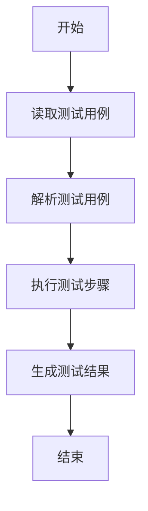
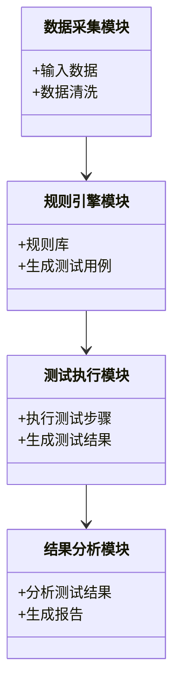

                 


# 《金融监管合规自动化测试平台》

## 关键词：金融监管、自动化测试、合规、平台架构、算法原理、系统设计

## 摘要：  
随着金融行业的快速发展，监管合规的重要性日益凸显。传统的人工监管方式效率低下、易出错，而自动化测试平台的引入为金融监管带来了更高的效率和准确性。本文将详细探讨金融监管合规自动化测试平台的构建与实现，从背景介绍、核心概念、算法原理、系统设计到项目实战，全面解析如何利用技术手段提升金融监管的效率和准确性。

---

# 第1章: 金融监管合规自动化测试平台背景介绍

## 1.1 问题背景

### 1.1.1 金融监管的重要性
金融监管是维护金融市场秩序、保护投资者利益、防范系统性风险的重要手段。随着金融业务的复杂化和创新化，监管要求日益严格，监管对象涵盖银行、证券、保险等多种金融机构及其产品。

### 1.1.2 传统金融监管的痛点
- **效率低**：人工审查耗时长，难以应对海量数据。
- **误差大**：人为因素可能导致漏检或误判。
- **成本高**：需要大量专业人员，监管成本居高不下。
- **滞后性**：传统监管方式难以实现实时监控。

### 1.1.3 自动化测试的必要性
自动化测试通过技术手段实现监管规则的自动化执行，能够显著提高监管效率、降低错误率，同时减少人力成本。

## 1.2 问题描述

### 1.2.1 金融监管合规的核心目标
- 确保金融机构及其产品符合相关法律法规。
- 实时监控金融市场动态，及时发现违规行为。
- 提供准确的监管报告，支持决策者制定政策。

### 1.2.2 金融监管中的主要问题
- 数据量大且复杂，人工处理难度高。
- 监管规则繁多，难以统一执行。
- 缺乏高效的自动化工具，监管效率低下。

### 1.2.3 自动化测试在金融监管中的应用场景
- **合规性测试**：验证金融机构是否符合监管要求。
- **实时监控**：对金融市场数据进行实时分析，发现异常行为。
- **风险评估**：基于历史数据和模型，评估潜在风险。

## 1.3 问题解决

### 1.3.1 自动化测试的解决方案
- 利用自动化技术实现监管规则的自动执行。
- 通过数据挖掘和机器学习技术提高监管准确性。
- 建立统一的监管平台，实现数据共享和协同监管。

### 1.3.2 技术实现路径
- 数据采集与处理：从金融机构和金融市场获取数据，进行清洗和预处理。
- 规则引擎：基于监管法规构建规则引擎，实现自动化判断。
- 测试执行与结果分析：执行自动化测试，生成测试报告，识别违规行为。

### 1.3.3 平台建设的目标与意义
- **目标**：构建一个高效、准确、易用的自动化测试平台，实现金融监管的智能化。
- **意义**：提高监管效率，降低监管成本，防范金融风险，促进行业健康发展。

## 1.4 边界与外延

### 1.4.1 平台的功能边界
- **数据采集**：仅处理金融机构提供的数据，不涉及外部数据源。
- **测试范围**：仅限于监管合规性测试，不包括业务测试。
- **输出结果**：生成测试报告，不直接处理违规行为的后续处置。

### 1.4.2 与相关系统的接口关系
- **金融机构系统**：通过API接口获取金融机构数据。
- **监管机构系统**：通过数据接口上传测试结果。
- **外部数据源**：通过第三方接口获取市场数据。

### 1.4.3 平台的扩展性与兼容性
- **扩展性**：支持新增监管规则和测试用例。
- **兼容性**：支持多种金融机构的数据格式和接口协议。

## 1.5 概念结构与核心要素组成

### 1.5.1 平台的核心模块
- 数据采集模块
- 规则引擎模块
- 测试执行模块
- 结果分析模块

### 1.5.2 各模块之间的关系
- 数据采集模块向规则引擎模块提供数据。
- 规则引擎模块根据数据生成测试用例。
- 测试执行模块执行测试用例，生成测试结果。
- 结果分析模块对测试结果进行分析，生成报告。

### 1.5.3 核心要素的定义与属性
| 核心要素 | 定义 | 属性 |
|----------|------|------|
| 数据采集 | 获取金融机构数据 | 数据格式、数据来源、数据清洗 |
| 规则引擎 | 基于法规生成测试用例 | 规则库、规则优先级、规则更新 |
| 测试执行 | 执行测试用例 | 测试步骤、测试环境、测试结果 |
| 结果分析 | 分析测试结果 | 报告生成、问题定位、数据可视化 |

## 1.6 本章小结

---

# 第2章: 核心概念与联系

## 2.1 核心概念原理

### 2.1.1 自动化测试的基本原理
- **自动化测试**：通过脚本和工具模拟人工操作，自动执行测试用例。
- **规则引擎**：基于监管法规构建规则库，实现自动化判断。
- **数据驱动测试**：通过数据驱动的方式生成测试用例。

### 2.1.2 金融监管合规的核心算法
- **模式匹配**：识别数据中的特定模式，判断是否符合监管规则。
- **分类算法**：利用机器学习算法对数据进行分类，识别违规行为。
- **异常检测**：通过统计分析或深度学习方法检测异常数据。

### 2.1.3 平台的运行机制
- 数据采集模块获取金融机构数据。
- 规则引擎模块根据监管法规生成测试用例。
- 测试执行模块执行测试用例，生成测试结果。
- 结果分析模块分析测试结果，生成报告。

## 2.2 概念属性特征对比表格

| 概念 | 属性 | 特征 |
|------|------|------|
| 自动化测试 | 技术类型 | 脚本驱动、规则引擎 |
| 金融监管 | 监管对象 | 金融机构、金融产品 |
| 合规测试 | 测试目标 | 符合监管要求 |

## 2.3 ER实体关系图

```mermaid
er
    actor: 测试人员
    system: 金融监管合规自动化测试平台
    test_case: 测试用例
    result: 测试结果
    actor --> system: 提交测试任务
    system --> test_case: 执行测试用例
    test_case --> result: 生成测试结果
    system --> result: 返回测试结果
```

## 2.4 本章小结

---

# 第3章: 算法原理讲解

## 3.1 算法原理概述

### 3.1.1 自动化测试的核心算法
- **规则匹配算法**：基于监管法规生成测试用例。
- **分类算法**：利用机器学习算法对数据进行分类，识别违规行为。
- **异常检测算法**：通过统计分析或深度学习方法检测异常数据。

### 3.1.2 金融监管合规的算法特点
- 数据量大，需要高效的处理算法。
- 规则复杂，需要灵活的规则匹配算法。
- 实时性要求高，需要快速的计算算法。

### 3.1.3 算法的优化与改进
- **规则引擎优化**：通过缓存和索引优化规则匹配效率。
- **算法优化**：利用分布式计算和并行处理提高计算效率。

## 3.2 算法流程图



## 3.3 算法实现代码

```python
def automated_test(test_cases):
    for case in test_cases:
        parse_case(case)
        execute_steps(case)
        generate_result(case)
    return result

# 示例规则匹配算法
def rule_matching(data, rules):
    matches = []
    for rule in rules:
        if data matches rule:
            matches.append(rule)
    return matches
```

## 3.4 数学模型和公式

### 3.4.1 分类算法的数学模型
$$ P(\text{违规}|x) = \frac{P(x|\text{违规})P(\text{违规})}{P(x)} $$

### 3.4.2 异常检测算法的公式
$$ \text{异常分数} = \sum_{i=1}^{n} |x_i - \mu_i| $$

## 3.5 本章小结

---

# 第4章: 系统分析与架构设计方案

## 4.1 问题场景介绍

### 4.1.1 金融机构的合规需求
- 需要确保业务操作符合监管法规。
- 需要定期提交合规报告。

### 4.1.2 监管机构的监管需求
- 需要实时监控金融机构的业务操作。
- 需要快速定位违规行为。

## 4.2 项目介绍

### 4.2.1 项目目标
- 构建一个高效、准确的金融监管合规自动化测试平台。

### 4.2.2 项目范围
- 数据采集、规则引擎、测试执行、结果分析。

## 4.3 系统功能设计

### 4.3.1 领域模型 mermaid 类图



### 4.3.2 系统架构设计 mermaid 架构图

```mermaid
container 容器 {
    数据采集模块
    规则引擎模块
    测试执行模块
    结果分析模块
}
container 数据源 {
    金融机构系统
    市场数据源
}
数据采集模块 --> 数据源
规则引擎模块 --> 数据采集模块
测试执行模块 --> 规则引擎模块
结果分析模块 --> 测试执行模块
```

### 4.3.3 系统接口设计
- 数据采集接口：金融机构系统通过API接口提供数据。
- 规则引擎接口：监管机构通过API接口上传监管法规。
- 测试执行接口：测试执行模块通过API接口调用测试用例。
- 结果分析接口：结果分析模块通过API接口生成报告。

### 4.3.4 系统交互 mermaid 序列图

```mermaid
sequenceDiagram
    actor 测试人员 -> 数据采集模块: 提交测试任务
    数据采集模块 -> 金融机构系统: 获取数据
    数据采集模块 -> 规则引擎模块: 传输数据
    规则引擎模块 -> 测试执行模块: 生成测试用例
    测试执行模块 -> 结果分析模块: 执行测试用例
    结果分析模块 -> 测试人员: 返回测试结果
```

## 4.4 本章小结

---

# 第5章: 项目实战

## 5.1 环境安装

### 5.1.1 开发环境
- 操作系统：Linux/Windows/MacOS
- 编程语言：Python 3.8+
- 开发工具：Jenkins、PyCharm、Visual Studio Code
- 框架：Django/Flask
- 数据库：MySQL/PostgreSQL
- 依赖管理工具：pip

## 5.2 系统核心实现源代码

### 5.2.1 数据采集模块

```python
import requests

def fetch_data(url):
    response = requests.get(url)
    return response.json()
```

### 5.2.2 规则引擎模块

```python
from rules import Rule

class RuleEngine:
    def __init__(self, rules):
        self.rules = rules

    def generate_test_cases(self, data):
        test_cases = []
        for rule in self.rules:
            if rule.applies_to(data):
                test_cases.append(rule.create_test_case(data))
        return test_cases
```

### 5.2.3 测试执行模块

```python
def execute_test_case(test_case):
    result = {}
    for step in test_case['steps']:
        if step['action'] == 'validate':
            result[step['data']] = step['expected']
    return result
```

### 5.2.4 结果分析模块

```python
def analyze_results(results):
    report = []
    for key, value in results.items():
        if value != 'pass':
            report.append(f"Error: {key} failed.")
    return report
```

## 5.3 代码应用解读与分析

### 5.3.1 数据采集模块解读
- 通过`requests`库获取数据，返回JSON格式的数据。

### 5.3.2 规则引擎模块解读
- 基于规则库生成测试用例，每个规则对应一个测试用例。

### 5.3.3 测试执行模块解读
- 执行测试用例中的每个步骤，生成测试结果。

### 5.3.4 结果分析模块解读
- 分析测试结果，生成报告，识别违规行为。

## 5.4 实际案例分析和详细讲解剖析

### 5.4.1 案例背景
- 某银行的客户交易数据需要符合反洗钱法规。

### 5.4.2 数据采集
- 从银行系统获取客户交易数据。

### 5.4.3 规则引擎
- 基于反洗钱法规生成测试用例。

### 5.4.4 测试执行
- 执行测试用例，生成测试结果。

### 5.4.5 结果分析
- 识别异常交易，生成报告。

## 5.5 本章小结

---

# 第6章: 最佳实践、小结、注意事项、拓展阅读

## 6.1 最佳实践

### 6.1.1 工具选择
- 使用高效的编程语言（如Python）和成熟的框架（如Django）。
- 使用可靠的数据库和数据处理工具。

### 6.1.2 代码管理
- 使用版本控制工具（如Git）管理代码。
- 定期进行代码审查和优化。

### 6.1.3 安全性
- 确保数据传输和存储的安全性，使用加密技术。
- 定期进行安全测试，发现潜在漏洞。

## 6.2 小结

### 6.2.1 本章总结
- 本文详细介绍了金融监管合规自动化测试平台的构建与实现。
- 从背景介绍到系统设计，再到项目实战，全面解析了平台的各个模块。

### 6.2.2 核心要点
- 数据采集、规则引擎、测试执行和结果分析是平台的核心模块。
- 系统架构设计和接口设计是平台顺利运行的关键。

## 6.3 注意事项

### 6.3.1 数据安全
- 确保平台数据的安全性，防止数据泄露。

### 6.3.2 系统稳定性
- 确保平台的稳定性，避免因系统故障导致数据丢失。

### 6.3.3 规则更新
- 定期更新规则库，确保平台符合最新的监管要求。

## 6.4 拓展阅读

### 6.4.1 推荐书籍
- 《软件自动化测试》
- 《金融监管与合规》

### 6.4.2 技术博客
- 官方技术博客链接：[链接](#)

### 6.4.3 在线课程
- 推荐在线课程：[链接](#)

## 6.5 本章小结

---

# 附录

## 附录A: 术语表

## 附录B: 参考文献

## 附录C: 相关工具与资源

---

# 结束语

感谢您的阅读！希望本文对您理解金融监管合规自动化测试平台有所帮助。如需进一步了解或实践，可以参考本文提供的代码和资源链接。

