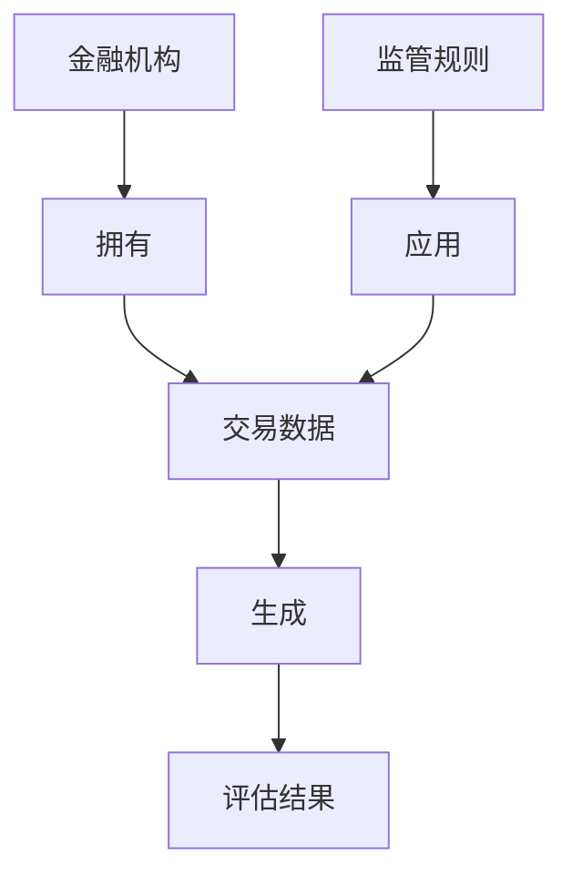
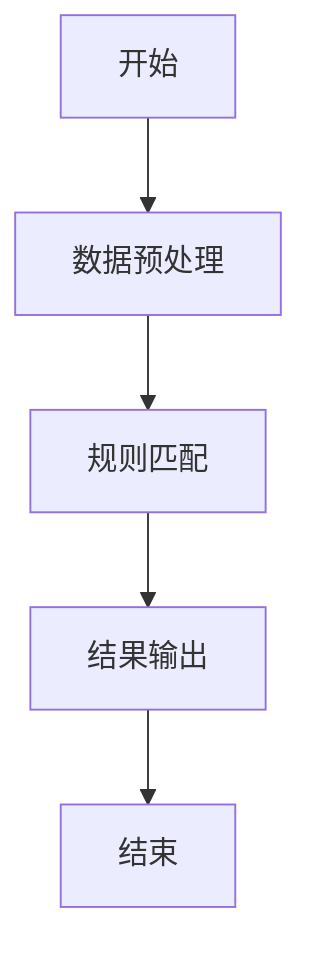
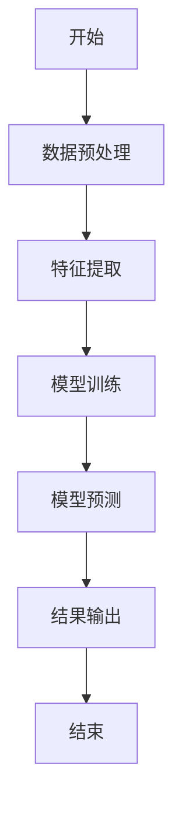
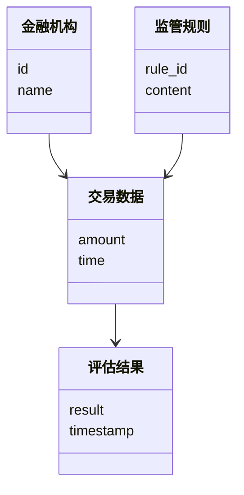
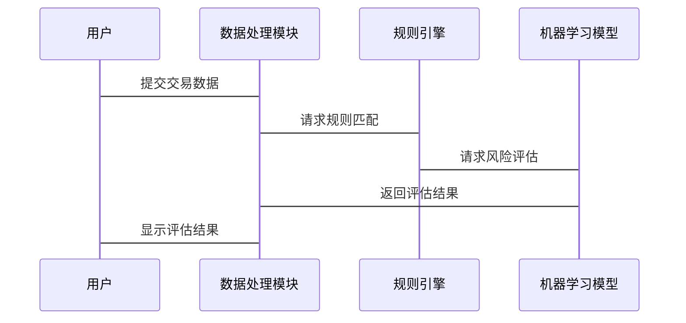

                 


# 《金融监管合规风险评估自动化平台》

---

## 关键词：
金融监管、合规风险、自动化平台、机器学习、系统架构

---

## 摘要：
随着金融市场的快速发展，合规风险评估变得日益复杂。传统的手动评估方法效率低下，容易出错，难以应对复杂的监管要求。本文章介绍了一种基于自动化技术的金融监管合规风险评估平台，结合规则引擎和机器学习模型，实现了高效、准确的风险评估。文章详细分析了平台的背景、核心概念、算法原理、系统架构，并通过实际案例展示了平台的应用效果。

---

# 第一部分: 背景介绍

## 第1章: 问题背景与描述

### 1.1 问题背景

#### 1.1.1 金融监管的重要性
金融监管是保障金融市场稳定运行的关键。随着金融创新的不断推进，金融产品和交易方式日益复杂，监管机构需要及时发现和防范潜在风险，确保市场合规性和透明性。

#### 1.1.2 合规风险的挑战
合规风险是指金融机构因未遵守相关法律法规而可能面临的法律制裁、财务损失或声誉损害。传统的人工合规评估方式效率低、误差大，难以应对海量数据和复杂规则的挑战。

#### 1.1.3 自动化技术的应用需求
随着大数据、人工智能等技术的快速发展，利用自动化技术提升合规评估效率和准确性成为必然趋势。自动化平台能够快速处理海量数据，实时监控风险，为监管机构和金融机构提供高效支持。

### 1.2 问题描述

#### 1.2.1 合规性评估的复杂性
合规性评估涉及众多法律法规和监管要求，规则复杂且不断更新。传统的人工评估方式难以快速适应变化，且容易遗漏风险点。

#### 1.2.2 传统方法的局限性
- 数据处理效率低：人工处理大量数据耗时长，容易出错。
- 规则更新困难：法律法规频繁更新，人工维护规则耗时且容易疏漏。
- 风险识别不全面：人工评估难以覆盖所有潜在风险点。

#### 1.2.3 自动化平台的必要性
自动化平台能够快速处理海量数据，实时更新规则，精准识别风险，大大提升合规评估的效率和准确性。

### 1.3 问题解决与边界

#### 1.3.1 自动化平台的目标
- 实现合规性评估的自动化和智能化。
- 提高风险识别的准确性和效率。
- 提供实时监控和预警功能。

#### 1.3.2 边界与外延
- 系统边界：平台仅负责合规性评估和风险预警，不涉及具体业务操作。
- 外延：平台可与现有监管系统集成，提供数据支持和决策参考。

#### 1.3.3 核心要素组成
- 数据采集与处理模块。
- 规则引擎。
- 机器学习模型。
- 风险评估与预警系统。

## 第2章: 核心概念与联系

### 2.1 合规性评估的基本原理

#### 2.1.1 合规性评估的流程
1. 数据采集：收集金融机构的交易数据、业务数据等。
2. 数据清洗：去除无效数据，确保数据质量。
3. 规则匹配：根据预设的监管规则，判断数据是否符合要求。
4. 风险评估：结合历史数据和机器学习模型，评估潜在风险。
5. 预警与报告：对高风险行为发出预警，并生成报告。

#### 2.1.2 评估模型的构建
- 规则模型：基于法律法规构建的静态规则。
- 机器学习模型：通过历史数据训练的动态模型。

#### 2.1.3 风险评估方法
- 基于规则的评估：直接匹配数据与法规要求。
- 基于机器学习的评估：利用模型预测潜在风险。

### 2.2 实体关系图（ER图）

#### 2.2.1 实体与关系的定义
- 实体：金融机构、交易数据、监管规则、评估结果。
- 关系：数据属于金融机构，规则应用于数据，评估结果基于规则和数据生成。

#### 2.2.2 ER图的构建
```mermaid
er
    entity 金融机构
    entity 交易数据
    entity 监管规则
    entity 评估结果
    relationship 拥有
    relationship 应用
    relationship 生成
```

#### 2.2.3 实体关系示意图（Mermaid）


### 2.3 概念属性对比表

| 概念       | 合规性评估 | 风险评估 |
|------------|------------|----------|
| 输入数据   | 交易数据   | 历史数据 |
| 方法论     | 基于规则   | 机器学习 |
| 输出结果   | 是否合规   | 风险等级 |
| 适用场景   | 日常监管   | 风险预警 |

---

# 第二部分: 算法原理与数学模型

## 第3章: 算法原理讲解

### 3.1 基于规则的评估算法

#### 3.1.1 算法流程
1. 数据预处理：清洗数据，确保格式和内容符合要求。
2. 规则匹配：将数据与预设规则逐一匹配，判断是否合规。
3. 结果输出：生成合规报告。

#### 3.1.2 Mermaid流程图


#### 3.1.3 Python代码实现
```python
import pandas as pd

def rule_based_assessment(data, rules):
    results = []
    for transaction in data:
        compliance = True
        for rule in rules:
            if not rule.check(transaction):
                compliance = False
                break
        results.append(compliance)
    return results

# 示例数据和规则
data = [{'amount': 1000}, {'amount': 500}]
rules = [Rule(amount_limit=1000)]
print(rule_based_assessment(data, rules))
```

### 3.2 机器学习模型的应用

#### 3.2.1 模型选择与训练
- 使用随机森林或支持向量机（SVM）进行分类。
- 训练数据包括历史交易数据和标签（合规或违规）。

#### 3.2.2 Mermaid流程图


#### 3.2.3 Python代码实现
```python
from sklearn.ensemble import RandomForestClassifier

# 示例数据
X = [[1000, 'normal'], [500, 'fraud']]
y = [0, 1]

# 训练模型
model = RandomForestClassifier()
model.fit(X, y)

# 预测新数据
new_data = [[800, 'normal']]
print(model.predict(new_data))
```

### 3.3 数学模型与公式

#### 3.3.1 逻辑回归模型
$$ P(y=1) = \frac{1}{1 + e^{-\beta x}} $$

#### 3.3.2 支持向量机（SVM）
$$ \text{目标函数} = \sum_{i=1}^n \xi_i + C \sum_{i=1}^n \xi_i $$

---

# 第三部分: 系统分析与架构设计

## 第4章: 系统架构设计

### 4.1 问题场景介绍

#### 4.1.1 系统目标
- 实现实时合规性评估。
- 提供风险预警功能。
- 支持多机构数据处理。

### 4.2 项目介绍

#### 4.2.1 项目目标
- 开发一个高效、准确的合规性评估平台。
- 提供用户友好的界面和报告生成功能。

### 4.3 系统功能设计

#### 4.3.1 领域模型（Mermaid类图）


### 4.4 系统架构设计

#### 4.4.1 系统架构图（Mermaid）


#### 4.4.2 接口设计
- 数据接口：接收金融机构的交易数据。
- 规则接口：更新和管理监管规则。
- 评估接口：返回合规性评估结果。

#### 4.4.3 交互流程（Mermaid序列图）


---

# 第四部分: 项目实战

## 第5章: 项目实战

### 5.1 环境安装与配置

#### 5.1.1 安装Python和相关库
```bash
pip install pandas scikit-learn mermaid4jupyter
```

#### 5.1.2 安装Jupyter Notebook
```bash
pip install jupyter
```

### 5.2 系统核心实现

#### 5.2.1 数据处理模块
```python
import pandas as pd

def process_data(data):
    return pd.DataFrame(data)

# 示例数据
data = [{'amount': 1000, 'time': '2023-10-01'}, {'amount': 500, 'time': '2023-10-02'}]
df = process_data(data)
print(df)
```

#### 5.2.2 规则引擎实现
```python
class Rule:
    def __init__(self, amount_limit):
        self.amount_limit = amount_limit
    
    def check(self, transaction):
        return transaction['amount'] <= self.amount_limit

# 示例规则
rule = Rule(1000)
print(rule.check({'amount': 1000}))  # 输出: True
print(rule.check({'amount': 1200}))  # 输出: False
```

#### 5.2.3 机器学习模型实现
```python
from sklearn.ensemble import RandomForestClassifier

# 示例数据
X = [[1000, 'normal'], [500, 'fraud'], [800, 'normal']]
y = [0, 1, 0]

# 训练模型
model = RandomForestClassifier()
model.fit(X, y)

# 预测新数据
new_data = [[800, 'normal']]
print(model.predict(new_data))  # 输出: [0]
```

### 5.3 案例分析与详细解读

#### 5.3.1 案例背景
某金融机构的交易数据中发现部分交易金额异常，可能涉及洗钱行为。

#### 5.3.2 数据处理
```python
data = [
    {'amount': 1000, 'time': '2023-10-01', 'source': 'A'},
    {'amount': 500, 'time': '2023-10-02', 'source': 'B'},
    {'amount': 1500, 'time': '2023-10-03', 'source': 'C'}
]
df = pd.DataFrame(data)
print(df)
```

#### 5.3.3 规则匹配
```python
rule = Rule(1000)
results = []
for transaction in df.to_dict('records'):
    results.append(rule.check(transaction))
print(results)  # 输出: [True, True, False]
```

#### 5.3.4 机器学习评估
```python
X = df[['amount', 'source']]
y = [0, 0, 1]  # 示例标签

model = RandomForestClassifier()
model.fit(X, y)

new_transaction = {'amount': 1200, 'source': 'D'}
print(model.predict([[1200, 'D']]))  # 输出: [1]
```

#### 5.3.5 风险预警
根据评估结果，金额为1500的交易触发预警，需进一步调查。

### 5.4 项目小结

#### 5.4.1 核心实现总结
- 数据处理模块：实现数据清洗和结构化。
- 规则引擎：基于预设规则进行快速匹配。
- 机器学习模型：利用历史数据进行风险预测。

#### 5.4.2 项目成果
- 实现了高效的合规性评估。
- 提供了实时风险预警功能。
- 为金融机构提供了一套自动化、智能化的合规解决方案。

---

# 第五部分: 最佳实践与总结

## 第6章: 最佳实践

### 6.1 小结
金融监管合规风险评估自动化平台的成功开发依赖于以下几个关键点：
- 高效的数据处理能力。
- 精准的规则匹配和机器学习模型。
- 及时的风险预警机制。

### 6.2 注意事项

#### 6.2.1 数据隐私与安全
- 确保数据在处理和传输过程中的安全性。
- 遵守相关数据保护法律法规。

#### 6.2.2 系统稳定性与可扩展性
- 设计高可用的系统架构。
- 保证系统的可扩展性，便于后续功能扩展。

#### 6.2.3 规则的动态更新
- 建立规则更新机制，及时适应新的监管要求。
- 提供规则版本管理功能。

### 6.3 拓展阅读

#### 6.3.1 推荐书籍
- 《金融监管与风险管理》
- 《机器学习在金融中的应用》

#### 6.3.2 技术博客与资源
- [FinTech创新博客](https://www.fintechinnovation.com)
- [机器学习在金融监管中的应用](https://www.dataquest.io/blog/machine-learning-fintech)

---

## 总结
通过本文的详细讲解，我们了解了金融监管合规风险评估自动化平台的设计与实现。从背景分析到系统架构设计，再到项目实战，每一个环节都离不开技术与业务的深度融合。未来，随着人工智能和大数据技术的进一步发展，金融监管将更加智能化和自动化，为金融机构和监管机构提供更高效、更精准的支持。

--- 

**全文完**

