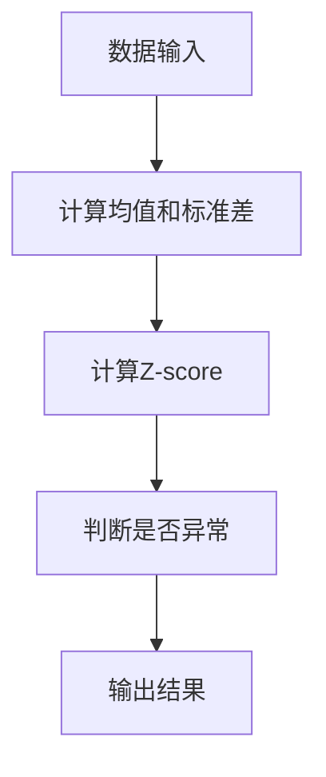
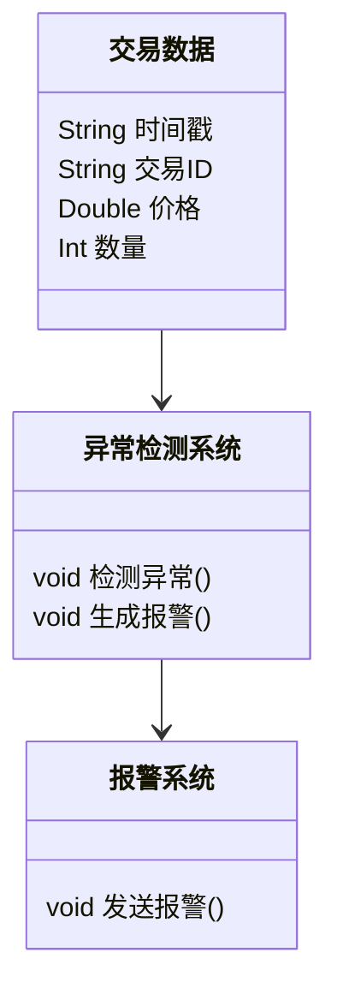
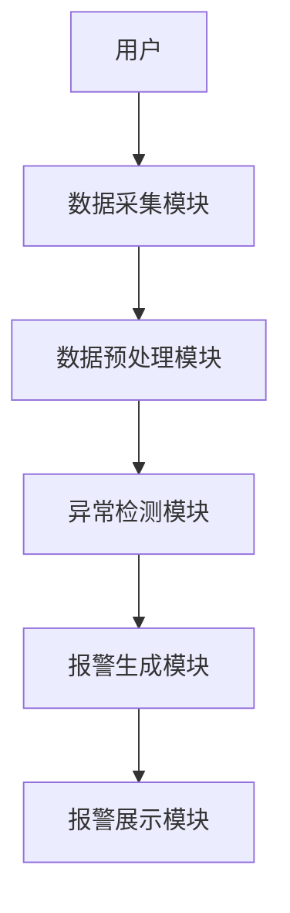
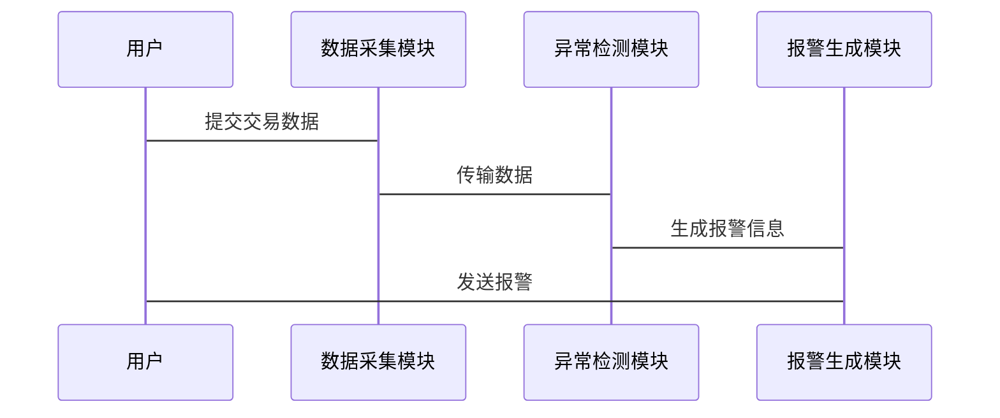

                 


# 《金融监管科技异常行为检测与追踪系统》

---

## 关键词：
金融监管科技、异常行为检测、追踪系统、机器学习、实时监控、监管合规、数据隐私

---

## 摘要：
本文深入探讨了金融监管科技中异常行为检测与追踪系统的核心原理、技术实现和实际应用。通过分析金融市场的异常行为类型，结合先进的数据处理、机器学习和深度学习算法，构建了一个高效、可靠的异常行为检测与追踪系统。文章详细讲解了系统的架构设计、算法实现和实际案例，并提出了系统的优化建议和未来发展方向。

---

## 正文

### 第一部分: 金融监管科技异常行为检测与追踪系统背景介绍

#### 第1章: 金融监管科技的背景与意义

##### 1.1 金融监管科技的定义与核心概念

###### 1.1.1 金融监管科技的定义
金融监管科技（FinTech的子领域，称为RegTech，即监管科技）是指利用现代信息技术手段，如大数据、人工智能、区块链等，来提升金融监管效率和效果的新兴技术领域。RegTech的目标是通过技术创新，帮助金融机构和监管机构更好地识别、预防和应对金融市场的违规行为。

###### 1.1.2 异常行为检测的必要性
在金融市场中，异常行为通常指那些违反法律法规、破坏市场公平性的行为，如市场操纵、内幕交易、洗钱等。这些行为不仅损害了市场的健康发展，还可能引发系统性风险。因此，及时发现和处理这些异常行为，对于维护金融市场的稳定至关重要。

###### 1.1.3 追踪系统的功能与目标
异常行为检测与追踪系统的主要功能包括：
- 数据采集与处理：从多种数据源（如交易数据、市场数据、社交媒体等）获取相关信息。
- 异常检测：通过算法识别潜在的异常行为。
- 追踪分析：对异常行为进行溯源，确定行为的主体和具体操作。
- 报警与报告：将检测到的异常行为及时通知相关机构，并生成报告。

其目标是通过技术手段，实现对金融市场的实时监控，确保监管的及时性和有效性。

##### 1.2 问题背景与问题描述

###### 1.2.1 异常行为的类型
金融市场中的异常行为主要分为以下几类：
1. **市场操纵**：通过虚假交易、散布谣言等手段影响市场价格。
2. **内幕交易**：利用未公开的信息进行交易，谋取不正当利益。
3. **洗钱行为**：通过复杂的操作隐藏资金来源，掩盖非法资金流动。

###### 1.2.2 异常行为检测的挑战
在实际应用中，异常行为检测面临以下挑战：
- **数据复杂性**：金融市场数据具有高维度、非线性、噪声多等特点。
- **模型可解释性**：复杂的算法模型可能难以解释检测结果。
- **实时性要求**：为了及时应对异常行为，检测系统需要具备实时处理能力。

##### 1.3 问题解决与边界条件

###### 1.3.1 系统边界与外延
异常行为检测与追踪系统的边界包括：
- 数据范围：仅处理与金融市场相关的数据。
- 适用场景：主要用于股票、期货等金融产品的交易监控。
- 边界条件：不处理非金融市场的数据，也不涉及监管机构的执法行动。

### 第二部分: 异常行为检测与追踪的核心概念联系

#### 第2章: 异常行为检测与追踪的核心概念

##### 2.1 核心概念原理

###### 2.1.1 数据流分析
数据流分析是异常行为检测的基础，主要包括：
1. **数据采集**：从交易系统、市场数据源等获取原始数据。
2. **数据预处理**：清洗数据，去除噪声，提取特征。
3. **数据流分析**：通过流处理技术（如Flink、Spark Streaming）实时分析数据流。

###### 2.1.2 行为模式识别
行为模式识别主要依赖于机器学习算法，包括：
1. **监督学习**：基于标记的数据，训练分类模型识别异常行为。
2. **无监督学习**：利用聚类算法发现数据中的异常模式。
3. **强化学习**：通过策略优化，提升检测系统的效率和准确性。

##### 2.2 核心概念对比

###### 2.2.1 异常行为与正常行为的特征对比
| 特征               | 正常行为                     | 异常行为                     |
|--------------------|------------------------------|------------------------------|
| 时间序列           | 数据波动较小，符合市场规律   | 数据波动异常，偏离市场规律   |
| 频率               | 交易频率稳定                 | 交易频率突然变化             |
| 交易量             | 交易量与市场走势一致         | 交易量异常增长或骤减         |
| 关联性             | 与其他市场数据相关性较高     | 与其他市场数据相关性较低     |

###### 2.2.2 不同检测算法的优缺点对比
| 算法               | 优点                         | 缺点                         |
|--------------------|------------------------------|------------------------------|
| 基于统计的方法     | 实现简单，计算效率高           | 对复杂异常模式的检测能力有限 |
| 机器学习模型       | 检测能力强，支持复杂模式识别   | 需要大量标记数据，可解释性差  |
| 深度学习模型       | 能够捕捉深层次特征             | 计算资源消耗大，实时性较差     |

##### 2.3 ER实体关系图

###### 2.3.1 实体关系图的构建
```mermaid
er
actor: 用户
system: 异常行为检测系统
data_source: 数据源
transaction: 交易记录
market_data: 市场数据
alarm: 报警信息
report: 检测报告
action: 处理行动
```

###### 2.3.2 关系图的解释与应用
该ER图描述了系统的主要实体及其关系：
- **用户**：系统的主要使用者，包括监管机构和金融机构。
- **数据源**：包括交易记录、市场数据等。
- **异常行为检测系统**：负责数据处理、异常检测和结果输出。
- **报警信息**：当检测到异常行为时，系统生成报警信息。
- **检测报告**：系统生成的详细报告，供用户参考。
- **处理行动**：根据报警信息，用户采取相应的处理行动。

---

### 第三部分: 异常行为检测算法原理

#### 第3章: 异常检测算法原理

##### 3.1 基于统计的异常检测

###### 3.1.1 Z-score方法
Z-score方法是一种常用的统计方法，用于检测数据中的异常值。其公式为：
$$ Z = \frac{x - \mu}{\sigma} $$
其中，$\mu$ 是数据的均值，$\sigma$ 是标准差，$x$ 是待检测的值。通常，当$|Z| > 3$时，认为该值为异常值。

###### 3.1.2 算法流程图


##### 3.2 机器学习模型

###### 3.2.1 Isolation Forest算法
Isolation Forest是一种无监督学习算法，适用于检测异常值。其核心思想是通过构建随机森林，将数据点隔离到不同的子空间中。代码示例如下：
```python
from sklearn.ensemble import IsolationForest

# 初始化模型
model = IsolationForest(n_estimators=100, random_state=42)

# 训练模型
model.fit(X_train)

# 预测异常值
y_pred = model.predict(X_test)
```

##### 3.3 深度学习模型

###### 3.3.1 LSTM网络
LSTM（长短期记忆网络）是一种时间序列模型，适用于处理金融时间序列数据。其核心结构包括输入门、遗忘门和输出门。代码示例如下：
```python
from keras.layers import LSTM, Dense
from keras.models import Sequential

# 初始化模型
model = Sequential()
model.add(LSTM(64, input_shape=(timesteps, features)))
model.add(Dense(1, activation='sigmoid'))

# 编译模型
model.compile(loss='binary_crossentropy', optimizer='adam', metrics=['accuracy'])

# 训练模型
model.fit(X_train, y_train, epochs=10, batch_size=32)
```

---

### 第四部分: 系统架构设计与实现

#### 第4章: 系统架构设计

##### 4.1 问题场景介绍

###### 4.1.1 项目介绍
本项目旨在开发一个金融监管科技异常行为检测与追踪系统，目标是实时监控股票交易数据，检测异常行为并生成报警信息。

##### 4.2 系统功能设计

###### 4.2.1 领域模型


##### 4.3 系统架构设计

###### 4.3.1 系统架构图


##### 4.4 系统接口设计

###### 4.4.1 API接口
系统提供以下API接口：
- `GET /api/v1/data`：获取交易数据
- `POST /api/v1/detect`：提交数据进行异常检测
- `GET /api/v1/alarm`：获取报警信息

##### 4.5 系统交互设计

###### 4.5.1 交互流程图


---

### 第五部分: 项目实战

#### 第5章: 项目实战

##### 5.1 环境搭建

###### 5.1.1 安装Python环境
```bash
python --version
pip install --upgrade pip
```

##### 5.2 核心实现

###### 5.2.1 数据采集与预处理
```python
import pandas as pd

# 读取数据
data = pd.read_csv('交易数据.csv')

# 数据预处理
data['时间戳'] = pd.to_datetime(data['时间戳'])
data.set_index('时间戳', inplace=True)
```

##### 5.2.2 特征工程
```python
from sklearn.preprocessing import StandardScaler

# 特征提取
features = data[['价格', '数量', '成交量']]
scaler = StandardScaler()
features_scaled = scaler.fit_transform(features)
```

##### 5.2.3 模型训练与调优
```python
from sklearn.ensemble import IsolationForest
from sklearn.metrics import accuracy_score

# 模型训练
model = IsolationForest(n_estimators=100, random_state=42)
model.fit(features_scaled)

# 模型预测
y_pred = model.predict(features_scaled)
print('模型准确率:', accuracy_score(data['标签'], y_pred))
```

##### 5.2.4 实时监控
```python
import time

# 实时监控
while True:
    data =获取实时数据()
    prediction = model.predict(data)
    if prediction == -1:
        发送报警()
    time.sleep(1)
```

##### 5.3 案例分析

###### 5.3.1 案例背景
假设我们监测某只股票的交易数据，发现交易量突然激增，怀疑存在市场操纵行为。

###### 5.3.2 数据分析
通过对交易数据的分析，发现异常交易集中在特定时间段，且交易量与价格走势不符。

###### 5.3.3 检测结果
模型检测到异常行为，生成报警信息，并提供详细的异常交易记录。

---

### 第六部分: 最佳实践与小结

#### 第6章: 最佳实践

##### 6.1 项目经验总结

###### 6.1.1 数据质量的重要性
数据质量直接影响检测结果的准确性，因此在数据预处理阶段需要仔细清洗数据，去除噪声。

###### 6.1.2 模型选择的策略
根据具体场景选择合适的算法，如对于实时性要求高的场景，优先选择计算效率高的算法。

##### 6.2 注意事项

###### 6.2.1 数据隐私保护
在实际应用中，需要注意数据隐私保护，避免泄露敏感信息。

###### 6.2.2 模型可解释性
复杂的模型可能难以解释检测结果，因此需要在模型选择和调优过程中注重可解释性。

##### 6.3 未来发展方向

###### 6.3.1 多模态数据融合
结合文本、图像等多种数据源，提升检测系统的综合能力。

###### 6.3.2 智能化监控
通过强化学习等技术，实现更加智能化的监控和报警。

---

## 小结

本文系统地介绍了金融监管科技异常行为检测与追踪系统的背景、核心概念、算法原理、系统架构和实际应用。通过具体的项目实战，展示了如何利用现代技术手段构建高效的检测系统。未来，随着技术的不断发展，异常行为检测与追踪系统将更加智能化和精准化，为金融市场的健康发展提供有力支持。

