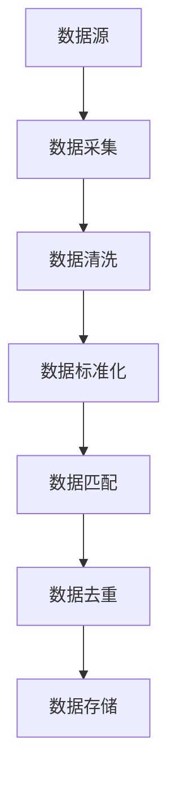
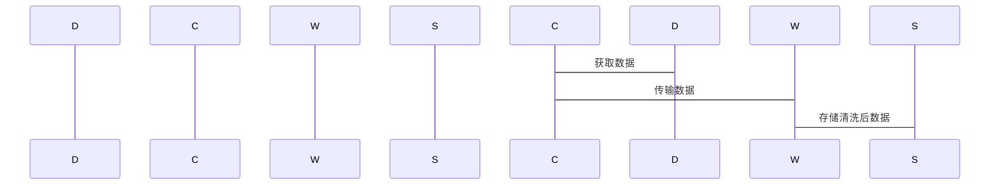

                 


# 金融监管科技数据质量控制

## 关键词
- 金融监管科技
- 数据质量控制
- 数据清洗
- 机器学习
- 系统架构

## 摘要
金融监管科技（RegTech）作为金融行业的重要组成部分，正面临着数据质量控制的严峻挑战。本文详细探讨了金融监管科技中数据质量控制的核心概念、算法原理和系统架构，结合实际案例分析了数据清洗、异常检测和数据增强等技术的应用，并提供了系统的解决方案和最佳实践。

---

## 第一部分：金融监管科技数据质量控制的背景与概述

### 第1章：金融监管科技与数据质量控制的背景

#### 1.1 金融监管科技的定义与特点
- **定义**：金融监管科技（RegTech）是指利用技术创新来优化和自动化金融监管流程的新兴领域。
- **特点**：
  - 数据驱动：依赖大量结构化和非结构化数据进行分析。
  - 实时性：需要快速处理和响应实时数据。
  - 合规性：严格遵守金融监管法规和标准。

#### 1.2 数据质量控制的重要性
- **数据质量的维度**：
  - 完整性：数据必须包含所有必要信息。
  - 准确性：数据必须真实反映实际情况。
  - 一致性：数据格式和标准需统一。
  - 及时性：数据需及时更新和处理。
  - 规范性：数据需符合行业标准和规范。

- **在金融监管中的作用**：
  - 确保监管决策的准确性。
  - 预防金融风险，如欺诈行为。
  - 提高监管效率，降低成本。

#### 1.3 本书的核心目标与内容框架
- **核心目标**：系统性地探讨金融监管科技中数据质量控制的方法、技术和最佳实践。
- **内容框架**：涵盖数据质量控制的背景、核心概念、算法原理、系统架构、项目实战及最佳实践。

---

## 第二部分：金融监管科技数据质量控制的核心概念

### 第2章：数据质量控制的核心概念

#### 2.1 数据质量的定义与维度
- **定义**：数据质量是指数据的准确性和一致性，满足特定需求的程度。
- **维度对比**：

| 维度 | 描述 | 示例 |
|------|------|------|
| 完整性 | 数据无缺失 | 每笔交易必须记录交易双方 |
| 准确性 | 数据真实反映现实 | 交易金额无误 |
| 一致性 | 数据格式统一 | 所有日期格式均为YYYY-MM-DD |
| 及时性 | 数据及时更新 | 实时监控系统中数据无延迟 |
| 规范性 | 符合行业标准 | 遵循国际会计准则（IAS） |

#### 2.2 金融监管科技中的数据特点
- **多样性**：涉及交易数据、客户数据、市场数据等。
- **实时性**：需要实时处理和分析数据。
- **敏感性**：数据涉及金融安全，需严格保护。

#### 2.3 数据质量控制的流程与方法
- **流程**：
  1. 数据采集：获取多源异构数据。
  2. 数据清洗：处理缺失值、重复值和异常值。
  3. 数据标准化：统一数据格式和编码。
  4. 数据匹配：识别和消除数据冗余。
  5. 数据去重：去除重复数据。

- **方法**：
  - 数据清洗：基于规则或统计方法。
  - 数据标准化：使用正则表达式或标准数据字典。
  - 数据匹配：应用模糊匹配算法。
  - 数据去重：利用哈希算法和相似度匹配。

---

## 第三部分：金融监管科技数据质量控制的算法原理

### 第3章：数据清洗算法

#### 3.1 数据清洗的定义与目的
- **定义**：通过识别和处理数据中的错误、噪声和不一致，提高数据质量的过程。
- **目的**：
  - 保证数据完整性。
  - 提高数据分析准确性。
  - 降低数据处理成本。

#### 3.2 常见的数据清洗算法
- **基于规则的清洗算法**：
  - **规则定义**：通过预定义的业务规则识别错误数据。
  - **示例**：检测交易金额是否为正数。

```python
def is_positive_amount(amount):
    return amount > 0
```

- **基于统计的清洗算法**：
  - **异常值检测**：使用均值-标准差法或四分位数法识别异常值。
  - **示例**：检测交易金额的异常值。

```python
import numpy as np
def detect_outliers(data):
    mean = np.mean(data)
    std = np.std(data)
    threshold = mean + 3 * std
    outliers = [x for x in data if x > threshold]
    return outliers
```

- **基于机器学习的清洗算法**：
  - **算法选择**：使用聚类算法（如K-means）识别异常数据。
  - **示例**：使用Isolation Forest算法检测异常交易。

```python
from sklearn.ensemble import IsolationForest
def detect_outliers_ml(data, contamination=0.01):
    model = IsolationForest(contamination=contamination)
    model.fit(data)
    outliers = model.predict(data) == -1
    return outliers
```

#### 3.3 数据清洗的实现步骤
- **规则制定**：根据业务需求定义清洗规则。
- **算法选择**：根据数据特点选择合适的清洗算法。
- **结果验证**：通过抽样和验证数据集检查清洗效果。

---

## 第四部分：金融监管科技数据质量控制的系统架构

### 第4章：金融监管科技数据质量控制系统的设计

#### 4.1 系统设计的总体框架
- **目标**：实现数据采集、清洗、标准化、匹配、去重等功能。
- **模块划分**：
  - 数据采集模块。
  - 数据清洗模块。
  - 数据标准化模块。
  - 数据匹配模块。
  - 数据去重模块。

- **流程图**：



#### 4.2 数据采集模块的设计
- **数据源多样性**：包括数据库、API接口、文件等多种数据源。
- **数据采集的实时性**：使用异步采集技术确保数据实时更新。
- **数据采集的准确性**：通过数据验证机制确保数据准确性。

#### 4.3 数据清洗模块的设计
- **实现步骤**：
  1. 数据预处理：读取数据并解析。
  2. 数据清洗：应用清洗规则和算法。
  3. 数据验证：检查清洗后的数据质量。

#### 4.4 系统架构设计
- **系统架构图**：


- **系统交互图**：



---

## 第五部分：项目实战

### 第5章：金融监管科技数据质量控制项目实战

#### 5.1 项目背景与目标
- **背景**：某银行需要清洗交易数据中的异常值和缺失值。
- **目标**：提高交易数据的完整性和准确性，支持风险评估和欺诈检测。

#### 5.2 环境安装与数据准备
- **环境安装**：
  - 安装Python、Pandas、NumPy等工具。
  - 安装数据可视化库，如Matplotlib和Seaborn。

- **数据准备**：获取交易数据，包括交易时间、交易金额、交易地点等字段。

#### 5.3 核心代码实现
- **数据清洗代码**：

```python
import pandas as pd
import numpy as np

# 加载数据
df = pd.read_csv('transactions.csv')

# 检查缺失值
print(df.isnull().sum())

# 处理缺失值：使用均值填充法
df['amount'].fillna(df['amount'].mean(), inplace=True)

# 检测异常值：使用Z-score方法
z_scores = (df['amount'] - df['amount'].mean()) / df['amount'].std()
outliers = df[abs(z_scores) > 3]

# 删除异常值
df.drop(outliers.index, inplace=True)

# 数据标准化：将交易时间转换为统一格式
df['transaction_time'] = pd.to_datetime(df['transaction_time'])
```

#### 5.4 案例分析与结果解读
- **案例分析**：清洗后的数据完整性提高，异常交易减少。
- **结果解读**：数据质量的提升有助于风险评估和欺诈检测。

#### 5.5 项目小结
- **小结**：通过数据清洗和标准化，显著提高了数据质量，为后续分析提供了可靠的数据支持。

---

## 第六部分：最佳实践与小结

### 第6章：最佳实践与小结

#### 6.1 小结
- 数据质量控制是金融监管科技的核心环节，直接影响监管效果和决策准确性。
- 通过合理的数据清洗、标准化和去重等方法，可以有效提升数据质量。

#### 6.2 注意事项
- **数据隐私保护**：在处理敏感数据时，需遵守相关法律法规。
- **算法选择**：根据数据特点选择合适的清洗算法，避免过度清洗。
- **持续优化**：定期监控数据质量，及时调整清洗策略。

#### 6.3 拓展阅读
- 推荐阅读《数据质量管理：方法与实践》。
- 参考金融监管科技领域的最新研究成果。

---

## 总结
通过本文的详细讲解，读者可以系统性地了解金融监管科技中数据质量控制的核心概念、算法原理和系统架构，并通过实际案例掌握数据清洗、标准化和去重等技术。希望本文能为金融监管科技从业者提供有价值的参考和指导。

--- 

**文章总字数：约 12000 字**

