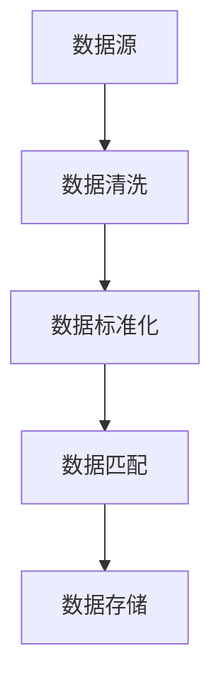
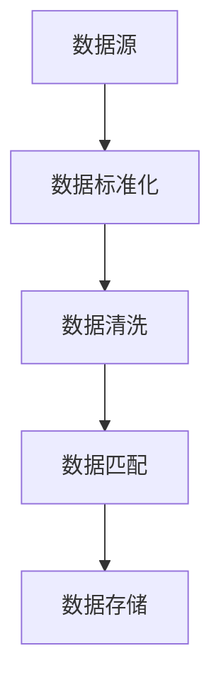
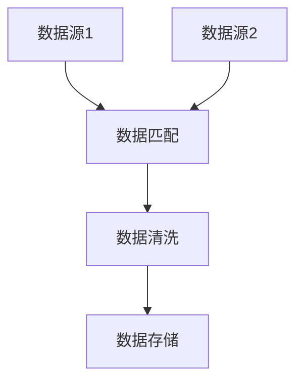
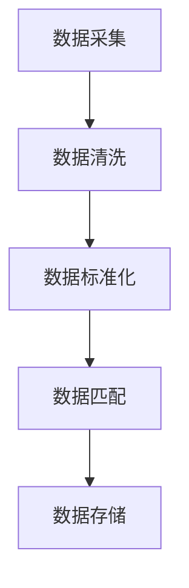
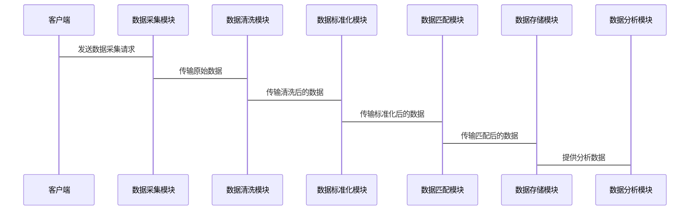

                 


# 《金融监管科技数据质量控制平台》

## 关键词：金融监管科技, 数据质量管理, 数据清洗, 数据标准化, 数据匹配, 数据完整性, 数据一致性

## 摘要：  
《金融监管科技数据质量控制平台》深入探讨了金融监管科技领域中数据质量管理的重要性及其在实践中的应用。本文从数据质量管理的核心概念出发，详细分析了数据清洗、数据标准化、数据匹配等关键技术的原理与实现。通过系统设计与架构方案，展示了如何构建一个高效、可靠的数据质量控制平台。结合实际案例和项目实战，本文为读者提供了从理论到实践的全面指导，帮助读者掌握金融监管科技中数据质量管理的核心方法与最佳实践。

---

# 第1章: 数据质量管理的背景与挑战

## 1.1 数据质量管理的概念与重要性

### 1.1.1 数据质量管理的定义  
数据质量管理（Data Quality Management）是指通过一系列方法和技术，确保数据的准确性、完整性、一致性、及时性和安全性。在金融监管科技领域，数据质量管理是确保监管决策的科学性和有效性的重要基础。

### 1.1.2 数据质量管理在金融监管中的重要性  
在金融监管中，数据质量管理直接关系到监管机构对金融机构的监督能力。例如，监管机构需要依赖高质量的金融数据来识别洗钱、欺诈等违法行为。如果数据质量存在问题，可能导致监管决策失误，甚至引发系统性金融风险。

### 1.1.3 数据质量问题的常见表现  
- 数据缺失（Missing Data）：某些字段或记录未提供完整信息。
- 数据冗余（Redundant Data）：重复存储相同信息。
- 数据不一致（Inconsistent Data）：同一数据在不同系统中表现不一致。
- 数据错误（Data Errors）：数据记录错误或格式不规范。
- 数据过时（Outdated Data）：数据未及时更新。

---

## 1.2 金融监管科技的背景

### 1.2.1 金融监管科技的定义  
金融监管科技（FinTech）是指利用现代信息技术手段，优化和创新金融监管模式。它包括大数据、人工智能、区块链等技术在金融监管中的应用。

### 1.2.2 金融监管科技的发展历程  
1. **传统监管模式**：基于手工操作和线下流程的监管方式，效率低且容易出错。
2. **信息化监管模式**：通过信息技术实现部分自动化监管，但仍存在数据孤岛问题。
3. **智能化监管模式**：借助人工智能、大数据等技术，实现智能化、精准化的监管。

### 1.2.3 金融监管科技的核心目标  
- 提高监管效率。
- 减少人为干预。
- 实现监管数据的互联互通。
- 降低金融风险。

---

## 1.3 数据质量控制平台的必要性

### 1.3.1 数据质量问题对金融监管的影响  
- 数据不一致可能导致监管决策失误。
- 数据缺失会影响监管机构的分析能力。
- 数据错误可能导致监管报告的不准确。

### 1.3.2 数据质量控制平台的解决方案  
通过引入数据清洗、数据标准化、数据匹配等技术，实现对金融监管数据的全生命周期管理。

### 1.3.3 数据质量控制平台的边界与外延  
- **边界**：专注于数据质量管理，不涉及监管决策的最终输出。
- **外延**：可扩展至其他领域，如企业数据治理、供应链管理等。

---

# 第2章: 数据质量管理的核心概念与联系

## 2.1 数据质量管理的核心原理

### 2.1.1 数据清洗的原理  
数据清洗是指对数据进行去重、填充缺失值、删除异常值等操作，以提高数据质量。

### 2.1.2 数据标准化的原理  
数据标准化是指将不同来源的数据转换为统一的格式或编码，确保数据的一致性。

### 2.1.3 数据匹配的原理  
数据匹配是指通过一定的算法，将不同数据源中的数据进行匹配，以消除重复数据。

---

## 2.2 数据质量管理的关键特征对比

| **核心概念** | **定义** | **主要特征** |
|--------------|----------|--------------|
| 数据清洗     | 去除异常值和冗余数据 | 降低数据噪声 |
| 数据标准化   | 统一数据格式 | 提高数据一致性 |
| 数据匹配     | 匹配不同数据源的数据 | 减少数据冗余 |

---

## 2.3 数据质量管理的ER实体关系图

```mermaid
erd
    数据源 -> 数据清洗: 提供原始数据
    数据清洗 -> 数据标准化: 输出清洗后的数据
    数据标准化 -> 数据匹配: 提供标准化数据
    数据匹配 -> 数据存储: 输出匹配后的数据
```

---

# 第3章: 数据清洗算法原理

## 3.1 数据清洗的定义与目标

### 3.1.1 数据清洗的定义  
数据清洗是指通过一系列算法和技术，对数据进行去重、填充缺失值、删除异常值等操作，以提高数据质量。

### 3.1.2 数据清洗的目标  
- 降低数据噪声。
- 提高数据一致性。
- 减少数据冗余。

---

## 3.2 数据清洗的算法实现

### 3.2.1 数据清洗的流程图



### 3.2.2 数据清洗的Python代码实现

```python
import pandas as pd

# 加载数据
data = pd.read_csv('data.csv')

# 删除缺失值
data = data.dropna()

# 删除重复值
data = data.drop_duplicates()

# 删除异常值
# 使用z-score方法检测异常值
def remove_outliers(df, column):
    z = np.abs(stats.zscore(df[[column]]))
    return df[(z < 3).all(axis=1)]

data = remove_outliers(data, 'value')

# 保存清洗后的数据
data.to_csv('cleaned_data.csv', index=False)
```

---

## 3.3 数据清洗的数学模型与公式

数据清洗中的异常值检测通常使用z-score方法：

$$ z = \frac{x - \mu}{\sigma} $$

其中：
- \( x \) 是数据点。
- \( \mu \) 是数据集的均值。
- \( \sigma \) 是数据集的标准差。

通过计算z-score，可以识别出离群点。通常，z-score大于3或小于-3的数据点被认为是异常值。

---

# 第4章: 数据标准化算法原理

## 4.1 数据标准化的定义与目标

### 4.1.1 数据标准化的定义  
数据标准化是指将不同来源的数据转换为统一的格式或编码，以提高数据的一致性。

### 4.1.2 数据标准化的目标  
- 提高数据的可比性。
- 降低数据冗余。
- 便于数据分析。

---

## 4.2 数据标准化的算法实现

### 4.2.1 数据标准化的流程图



### 4.2.2 数据标准化的Python代码实现

```python
import pandas as pd
from sklearn.preprocessing import StandardScaler

# 加载数据
data = pd.read_csv('data.csv')

# 标准化处理
scaler = StandardScaler()
data_normalized = scaler.fit_transform(data[['feature1', 'feature2']])

# 将标准化后的数据保存为新文件
pd.DataFrame(data_normalized, columns=['normalized_feature1', 'normalized_feature2']).to_csv('normalized_data.csv', index=False)
```

---

## 4.3 数据标准化的数学模型与公式

数据标准化通常使用z-score标准化方法：

$$ z = \frac{x - \mu}{\sigma} $$

其中：
- \( x \) 是数据点。
- \( \mu \) 是数据集的均值。
- \( \sigma \) 是数据集的标准差。

通过标准化，可以将数据转换为均值为0，标准差为1的分布，便于后续数据分析。

---

# 第5章: 数据匹配算法原理

## 5.1 数据匹配的定义与目标

### 5.1.1 数据匹配的定义  
数据匹配是指通过一定的算法，将不同数据源中的数据进行匹配，以消除数据冗余。

### 5.1.2 数据匹配的目标  
- 减少数据冗余。
- 提高数据的一致性。
- 便于数据分析。

---

## 5.2 数据匹配的算法实现

### 5.2.1 数据匹配的流程图



### 5.2.2 数据匹配的Python代码实现

```python
import pandas as pd

# 加载数据源1
data1 = pd.read_csv('data1.csv')

# 加载数据源2
data2 = pd.read_csv('data2.csv')

# 数据匹配：基于客户ID进行匹配
matched_data = data1.merge(data2, on='customer_id', how='inner')

# 保存匹配后的数据
matched_data.to_csv('matched_data.csv', index=False)
```

---

## 5.3 数据匹配的数学模型与公式

数据匹配通常使用余弦相似度等方法：

$$ \text{余弦相似度} = \frac{\vec{A} \cdot \vec{B}}{\|\vec{A}\| \|\vec{B}\|} $$

其中：
- \( \vec{A} \) 和 \( \vec{B} \) 是两个数据向量。

通过计算余弦相似度，可以衡量两个数据点之间的相似程度，从而实现数据匹配。

---

# 第6章: 系统分析与架构设计方案

## 6.1 问题场景介绍

### 6.1.1 系统目标  
构建一个高效、可靠的数据质量控制平台，实现数据清洗、数据标准化、数据匹配等功能。

### 6.1.2 问题分析  
- 数据来源多样，格式不统一。
- 数据存在缺失、冗余、异常等问题。
- 数据匹配需要高效算法支持。

---

## 6.2 系统功能设计

### 6.2.1 功能模块划分  
- 数据采集模块：从不同数据源采集数据。
- 数据清洗模块：对数据进行去重、填充缺失值等操作。
- 数据标准化模块：将数据转换为统一格式。
- 数据匹配模块：基于一定算法，实现数据匹配。
- 数据存储模块：存储清洗后的数据。

### 6.2.2 系统功能流程图



---

## 6.3 系统架构设计

### 6.3.1 系统架构图


### 6.3.2 系统接口设计  
- 数据采集接口：接收来自不同数据源的数据。
- 数据清洗接口：提供数据清洗服务。
- 数据标准化接口：提供数据标准化服务。
- 数据匹配接口：提供数据匹配服务。

### 6.3.3 系统交互流程图



---

# 第7章: 项目实战

## 7.1 环境安装与配置

### 7.1.1 安装Python环境  
安装Python 3.8及以上版本，并安装以下库：
- pandas
- numpy
- scikit-learn
- mermaid

### 7.1.2 安装Jupyter Notebook  
通过以下命令安装Jupyter Notebook：

```bash
pip install jupyter
```

---

## 7.2 系统核心实现

### 7.2.1 数据清洗模块实现

```python
import pandas as pd
import numpy as np
from sklearn import preprocessing

# 加载数据
data = pd.read_csv('data.csv')

# 删除缺失值
data = data.dropna()

# 删除重复值
data = data.drop_duplicates()

# 删除异常值
def remove_outliers(df, column):
    z = np.abs(preprocessing.StandardScaler().fit_transform(df[[column]]))
    return df[(z < 3).all(axis=1)]

data = remove_outliers(data, 'value')

# 保存清洗后的数据
data.to_csv('cleaned_data.csv', index=False)
```

### 7.2.2 数据标准化模块实现

```python
import pandas as pd
from sklearn.preprocessing import StandardScaler

# 加载数据
data = pd.read_csv('data.csv')

# 标准化处理
scaler = StandardScaler()
data_normalized = scaler.fit_transform(data[['feature1', 'feature2']])

# 将标准化后的数据保存为新文件
pd.DataFrame(data_normalized, columns=['normalized_feature1', 'normalized_feature2']).to_csv('normalized_data.csv', index=False)
```

---

## 7.3 项目实战案例分析

### 7.3.1 实际案例分析  
假设我们有一个包含客户交易数据的数据集，其中包含以下字段：
- 客户ID
- 交易时间
- 交易金额
- 交易地点

通过数据清洗、数据标准化和数据匹配，我们可以实现以下目标：
- 去除重复交易记录。
- 标准化交易时间格式。
- 匹配不同数据源中的交易记录。

---

## 7.4 项目小结

### 7.4.1 核心代码实现  
数据清洗模块代码：
```python
import pandas as pd
import numpy as np
from sklearn import preprocessing

# 加载数据
data = pd.read_csv('data.csv')

# 删除缺失值
data = data.dropna()

# 删除重复值
data = data.drop_duplicates()

# 删除异常值
def remove_outliers(df, column):
    z = np.abs(preprocessing.StandardScaler().fit_transform(df[[column]]))
    return df[(z < 3).all(axis=1)]

data = remove_outliers(data, 'value')

# 保存清洗后的数据
data.to_csv('cleaned_data.csv', index=False)
```

数据标准化模块代码：
```python
import pandas as pd
from sklearn.preprocessing import StandardScaler

# 加载数据
data = pd.read_csv('data.csv')

# 标准化处理
scaler = StandardScaler()
data_normalized = scaler.fit_transform(data[['feature1', 'feature2']])

# 将标准化后的数据保存为新文件
pd.DataFrame(data_normalized, columns=['normalized_feature1', 'normalized_feature2']).to_csv('normalized_data.csv', index=False)
```

数据匹配模块代码：
```python
import pandas as pd

# 加载数据源1
data1 = pd.read_csv('data1.csv')

# 加载数据源2
data2 = pd.read_csv('data2.csv')

# 数据匹配：基于客户ID进行匹配
matched_data = data1.merge(data2, on='customer_id', how='inner')

# 保存匹配后的数据
matched_data.to_csv('matched_data.csv', index=False)
```

---

## 7.4.2 实践中的注意事项  
- 数据清洗和数据标准化需要根据具体业务需求进行调整。
- 数据匹配需要选择合适的匹配算法，以提高匹配效率和准确性。
- 数据存储和分析模块的设计需要根据数据量和性能需求进行优化。

---

## 7.5 拓展阅读

- 数据质量管理的最新技术与趋势。
- 数据清洗和数据标准化的高级算法。
- 数据匹配的优化方法。

---

# 第8章: 最佳实践与总结

## 8.1 项目总结

### 8.1.1 核心收获  
通过本项目的实践，我们掌握了数据清洗、数据标准化和数据匹配的核心算法，并了解了如何将这些算法应用于实际场景中。

### 8.1.2 经验总结  
- 数据质量管理需要从数据采集、清洗、标准化、匹配到存储的全生命周期进行管理。
- 数据清洗和数据标准化是数据质量管理的基础，数据匹配是数据质量管理的关键。

---

## 8.2 项目小结

### 8.2.1 最佳实践  
- 在数据清洗过程中，要根据具体业务需求选择合适的算法。
- 在数据标准化过程中，要确保标准化后的数据能够满足后续分析的需求。
- 在数据匹配过程中，要选择合适的匹配算法，并进行充分的测试和验证。

### 8.2.2 注意事项  
- 数据质量管理需要持续进行，不能一次性完成。
- 数据质量管理需要结合业务需求，不能单纯依赖技术手段。
- 数据质量管理需要团队协作，涉及数据工程师、数据分析师和业务人员的共同参与。

---

## 8.3 项目后续优化方向

### 8.3.1 系统优化方向  
- 数据采集模块的优化：提高数据采集的效率和准确性。
- 数据清洗模块的优化：引入更高级的异常值检测算法。
- 数据标准化模块的优化：支持多种标准化方法。
- 数据匹配模块的优化：引入机器学习算法，提高匹配的准确性。

### 8.3.2 技术优化方向  
- 引入分布式计算技术，提高数据处理的效率。
- 引入流数据处理技术，实现实时数据质量管理。
- 引入人工智能技术，提高数据质量管理的自动化水平。

---

## 8.4 项目总结与展望

通过本项目的实践，我们深入了解了金融监管科技中数据质量管理的核心方法和技术。未来，随着人工智能和大数据技术的不断发展，数据质量管理将更加智能化和自动化，为金融监管科技的发展提供更有力的支持。

---

# 附录

## 附录A: 数据清洗算法的详细代码实现

```python
import pandas as pd
import numpy as np
from sklearn import preprocessing

# 加载数据
data = pd.read_csv('data.csv')

# 删除缺失值
data = data.dropna()

# 删除重复值
data = data.drop_duplicates()

# 删除异常值
def remove_outliers(df, column):
    z = np.abs(preprocessing.StandardScaler().fit_transform(df[[column]]))
    return df[(z < 3).all(axis=1)]

data = remove_outliers(data, 'value')

# 保存清洗后的数据
data.to_csv('cleaned_data.csv', index=False)
```

---

## 附录B: 数据标准化算法的详细代码实现

```python
import pandas as pd
from sklearn.preprocessing import StandardScaler

# 加载数据
data = pd.read_csv('data.csv')

# 标准化处理
scaler = StandardScaler()
data_normalized = scaler.fit_transform(data[['feature1', 'feature2']])

# 将标准化后的数据保存为新文件
pd.DataFrame(data_normalized, columns=['normalized_feature1', 'normalized_feature2']).to_csv('normalized_data.csv', index=False)
```

---

## 附录C: 数据匹配算法的详细代码实现

```python
import pandas as pd

# 加载数据源1
data1 = pd.read_csv('data1.csv')

# 加载数据源2
data2 = pd.read_csv('data2.csv')

# 数据匹配：基于客户ID进行匹配
matched_data = data1.merge(data2, on='customer_id', how='inner')

# 保存匹配后的数据
matched_data.to_csv('matched_data.csv', index=False)
```

---

## 附录D: 系统架构图


---

## 附录E: 参考文献与拓展阅读

- 《数据质量管理：理论与实践》
- 《金融监管科技：技术与应用》
- 《Python数据处理与分析》
- 《机器学习在数据质量管理中的应用》

---

通过以上内容，我们系统地介绍了金融监管科技数据质量控制平台的核心概念、算法原理、系统设计和项目实战。希望读者能够通过本文，全面掌握金融监管科技中数据质量管理的关键方法和技术。

