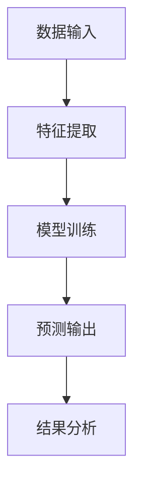
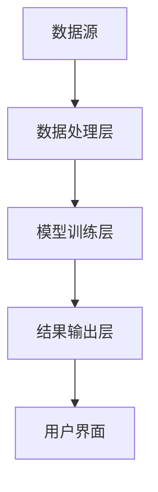

                 


# 《金融监管科技（RegTech）中的AI应用》

> 关键词：RegTech, AI, 人工智能, 金融监管, 风险管理

> 摘要：本文深入探讨了人工智能（AI）在金融监管科技（RegTech）中的应用，从理论到实践，详细分析了AI技术如何提升金融监管的效率与准确性。文章首先介绍了RegTech的基本概念和AI的核心技术，随后分析了AI在风险评估、欺诈检测和合规管理等领域的具体应用场景。通过案例分析和算法实现，本文展示了如何利用机器学习、自然语言处理和计算机视觉等技术解决金融监管中的复杂问题。最后，本文总结了RegTech与AI结合的优势，并展望了未来的发展趋势。

---

## 第1章: RegTech与AI的结合

### 1.1 RegTech的基本概念

#### 1.1.1 什么是RegTech？
- RegTech（金融监管科技）是指利用技术手段优化金融监管流程、提高监管效率的新兴领域。
- 核心目标是通过技术手段解决传统金融监管中的痛点，如合规成本高、数据处理复杂、监管效率低等。

#### 1.1.2 RegTech的发展背景
- 金融危机的频发暴露了传统金融监管的不足。
- 数字化转型与技术创新推动了RegTech的崛起。
- 监管机构对技术手段的需求日益增长。

#### 1.1.3 RegTech的核心目标与价值
- 核心目标：提高监管效率、降低合规成本、增强数据处理能力。
- 价值：通过技术手段实现监管的智能化、自动化和实时化。

---

### 1.2 AI技术的基本概念

#### 1.2.1 人工智能（AI）的定义
- AI是指计算机系统执行人类智能任务的能力，如学习、推理、识别和决策。

#### 1.2.2 机器学习（ML）与深度学习（DL）的区别
- 机器学习：基于数据的训练，构建预测模型。
- 深度学习：一种机器学习方法，通过多层神经网络进行特征提取。

#### 1.2.3 AI在金融领域的应用现状
- 现状：AI已在金融领域的风险管理、欺诈检测、投资决策等方面得到广泛应用。
- 优势：AI能够处理海量数据、发现隐藏规律、实时监控风险。

---

### 1.3 RegTech与AI的结合

#### 1.3.1 RegTech中的AI应用背景
- 传统金融监管的痛点：人工成本高、数据分散、监管滞后。
- AI技术的引入：通过自动化和智能化提升监管效率。

#### 1.3.2 RegTech中的AI应用场景
- 风险管理：利用AI预测市场风险、信用风险等。
- 欺诈检测：通过AI识别异常交易行为，防范金融欺诈。
- 合规管理：AI帮助金融机构自动监控合规性，降低合规成本。

---

## 第2章: AI在RegTech中的核心概念与技术

### 2.1 AI在RegTech中的核心概念

#### 2.1.1 机器学习模型
- 监督学习：基于标记数据进行训练，预测未知数据。
- 无监督学习：从无标记数据中发现模式。
- 强化学习：通过奖励机制优化决策。

#### 2.1.2 自然语言处理（NLP）
- NLP用于分析文本数据，识别关键词、情感倾向等。
- 在RegTech中，NLP可用于分析监管文件、新闻舆情等。

#### 2.1.3 计算机视觉（CV）
- CV用于图像识别，帮助监管机构分析文档、视频等非结构化数据。

---

### 2.2 核心概念的ER实体关系图

```mermaid
er
  actor: Regulator
  entity: FinancialTransaction
  entity: Customer
  entity: RiskFactor
  entity: ComplianceRule
  relation: Manages
  relation: Monitors
  relation: Enforces
```

---

### 2.3 AI算法的流程图



---

## 第3章: AI在RegTech中的算法原理

### 3.1 机器学习算法

#### 3.1.1 线性回归
- 公式：$$ y = \beta_0 + \beta_1x + \epsilon $$
- 应用：预测金融市场的趋势。

#### 3.1.2 支持向量机（SVM）
- 理论：通过划分超平面实现分类。
- 应用：用于欺诈检测和信用评估。

#### 3.1.3 神经网络
- 结构：由输入层、隐藏层和输出层组成。
- 应用：复杂模式识别，如异常交易检测。

---

### 3.2 算法实现代码示例

```python
# 线性回归模型
import numpy as np
from sklearn.linear_model import LinearRegression

# 数据准备
X = np.array([1, 2, 3, 4, 5]).reshape(-1, 1)
y = np.array([2, 4, 5, 4, 5])

# 模型训练
model = LinearRegression()
model.fit(X, y)

# 预测
print(model.predict(X))
```

---

## 第4章: 系统分析与架构设计

### 4.1 问题场景介绍

#### 4.1.1 项目介绍
- 项目目标：开发一个基于AI的金融监管系统，实现风险评估、欺诈检测和合规监控。

#### 4.1.2 系统功能设计
- 风险评估模块：实时监控市场风险。
- 欺诈检测模块：识别异常交易行为。
- 合规监控模块：自动检查合规性。

#### 4.1.3 系统架构设计



---

## 第5章: 项目实战

### 5.1 环境安装

#### 5.1.1 安装Python
- 使用Anaconda安装Python 3.8以上版本。

#### 5.1.2 安装依赖库
- 使用pip安装numpy、scikit-learn、tensorflow等库。

### 5.2 系统核心实现源代码

```python
# 反欺诈检测模型
import numpy as np
from sklearn.ensemble import RandomForestClassifier

# 数据准备
X = np.array([[1, 0, 0, 0],
              [0, 1, 0, 0],
              [0, 0, 1, 0],
              [0, 0, 0, 1]])

y = np.array([0, 1, 2, 3])

# 模型训练
model = RandomForestClassifier(n_estimators=100)
model.fit(X, y)

# 预测
print(model.predict(X))
```

---

## 第6章: 总结与展望

### 6.1 总结
- AI技术为RegTech带来了革命性的变化，提高了金融监管的效率和准确性。
- 通过机器学习、NLP和CV等技术，RegTech能够更好地应对复杂的金融监管挑战。

### 6.2 未来展望
- 技术融合：AI与其他技术（如区块链）的结合将推动RegTech进一步发展。
- 数据共享：数据共享机制的完善将提升AI模型的性能。
- 监管沙盒：通过监管沙盒测试AI技术的可行性。

---

通过以上目录结构，本文系统地介绍了AI在RegTech中的应用，从理论到实践，为读者提供了全面的知识和实用的案例。

