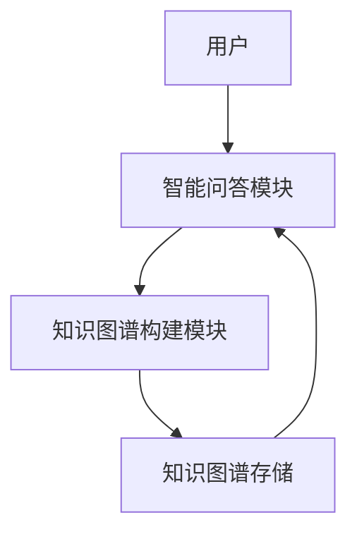
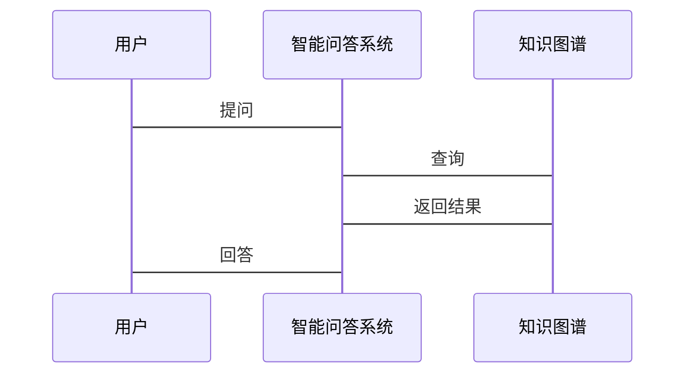

                 


# 《金融知识图谱在智能问答中的应用》

## 关键词：金融知识图谱、智能问答系统、实体识别、关系抽取、深度学习

## 摘要：本文探讨了金融知识图谱在智能问答系统中的应用，分析了知识图谱的构建方法、智能问答的核心算法，以及它们如何结合以提升问答系统的性能。文章通过实际案例展示了金融知识图谱在智能问答中的应用价值，并总结了当前技术的优势与未来的发展方向。

---

## 目录

1. [背景介绍](#背景介绍)
   1.1 [金融知识图谱概述](#金融知识图谱概述)
   1.2 [智能问答系统概述](#智能问答系统概述)
   1.3 [金融知识图谱与智能问答的结合](#金融知识图谱与智能问答的结合)
2. [核心概念与联系](#核心概念与联系)
   2.1 [知识图谱的构建与管理](#知识图谱的构建与管理)
   2.2 [智能问答系统的核心算法](#智能问答系统的核心算法)
3. [算法原理与数学模型](#算法原理与数学模型)
   3.1 [知识图谱构建的算法原理](#知识图谱构建的算法原理)
4. [系统分析与架构设计方案](#系统分析与架构设计方案)
   4.1 [系统架构设计](#系统架构设计)
   4.2 [系统接口设计](#系统接口设计)
5. [项目实战](#项目实战)
   5.1 [项目实现](#项目实现)
6. [总结与展望](#总结与展望)

---

## 1. 背景介绍

### 1.1 金融知识图谱概述

金融知识图谱是一种结构化数据表示方法，用于描述金融领域的实体及其关系。其核心构成包括：

- **实体**：如“公司”、“股票”、“交易”。
- **关系**：如“公司发行股票”、“股票属于交易”。
- **属性**：如“发行日期”、“发行价格”。

金融知识图谱与通用知识图谱的主要区别在于其专业性和领域特定性，能够更精准地处理金融领域的复杂关系。

### 1.2 智能问答系统概述

智能问答系统通过自然语言处理技术，理解用户的问题并提供准确的答案。根据方法论，主要分为两类：

1. **基于规则的方法**：依赖预定义的规则，适用于结构化数据。
2. **基于深度学习的方法**：使用神经网络模型，如BERT，适用于复杂语义理解。

### 1.3 金融知识图谱与智能问答的结合

金融知识图谱为智能问答系统提供了结构化的知识支持，使其能够准确理解和回答金融领域的复杂问题。结合后，系统能够通过知识图谱进行语义推理，生成更准确的答案。

---

## 2. 核心概念与联系

### 2.1 知识图谱的构建与管理

#### 2.1.1 知识图谱的构建过程

- **数据采集**：从金融文档、新闻中提取数据。
- **数据清洗**：去除噪声数据，确保数据质量。
- **实体识别与抽取**：使用NLP技术识别文本中的实体。
- **关系抽取与构建**：识别实体间的语义关系。
- **知识图谱存储与管理**：使用数据库或图数据库存储。

#### 2.1.2 知识图谱的表示与推理

- **实体表示方法**：RDF、向量嵌入。
- **关系表示方法**：关系抽取、知识融合。
- **知识图谱推理**：基于规则的推理、基于深度学习的推理。

#### 2.1.3 知识图谱的可视化

- **可视化工具**：如Graphviz、Cytoscape。
- **可视化方法**：节点布局、边长调整。

### 2.2 智能问答系统的核心算法

#### 2.2.1 基于知识图谱的问答系统

- **问题理解**：将自然语言问题转换为结构化查询。
- **答案提取**：通过知识图谱查询相关实体和关系。
- **结果优化**：基于语义相似度排序答案。

#### 2.2.2 基于深度学习的问答系统

- **模型训练**：使用大规模金融数据训练BERT模型。
- **问题理解和回答生成**：通过编码器-解码器结构生成回答。

---

## 3. 算法原理与数学模型

### 3.1 知识图谱构建的算法原理

#### 3.1.1 实体识别与抽取算法

- **实体识别**：使用CRF模型，通过特征提取和条件随机场进行序列标注。
- **关系抽取**：使用双向LSTM-CRF模型，提取实体间的关系。

#### 3.1.2 实体表示方法

- **向量嵌入**：使用Word2Vec或BERT进行词嵌入。
- **图嵌入**：使用GraphSAGE进行节点嵌入。

#### 3.1.3 知识图谱的推理算法

- **基于规则的推理**：定义规则进行推理，如“如果A是B的子公司，且B在某领域领先，则A也在该领域领先”。
- **基于深度学习的推理**：使用神经符号推理模型，结合符号推理和深度学习。

---

## 4. 系统分析与架构设计方案

### 4.1 系统架构设计

#### 4.1.1 项目介绍

金融知识图谱智能问答系统旨在通过结构化知识和深度学习技术，提高问答的准确性和效率。

#### 4.1.2 系统功能设计

- **知识图谱构建模块**：负责数据处理、实体识别、关系抽取。
- **智能问答模块**：负责问题理解、答案生成、结果优化。
- **用户交互模块**：负责用户输入、结果展示。

#### 4.1.3 系统架构图



### 4.2 系统接口设计

#### 4.2.1 接口定义

- **RESTful API**：`POST /api/v1/qa`
- **请求参数**：`question`（必填）
- **响应格式**：JSON格式，包含`answer`和`confidence`。

#### 4.2.2 系统交互图



---

## 5. 项目实战

### 5.1 项目实现

#### 5.1.1 环境安装

- **Python 3.8及以上**
- **TensorFlow 2.0及以上**
- **spaCy 3.0及以上**

#### 5.1.2 核心代码实现

```python
import spacy

nlp = spacy.load("en_core_web_sm")

def extract_entities(text):
    doc = nlp(text)
    entities = []
    for ent in doc.ents:
        entities.append((ent.text, ent.label_))
    return entities

def extract_relations(doc):
    relations = []
    for i, token in enumerate(doc):
        if token.dep_ == "ROOT":
            continue
        if token.dep_ in ["nsubj", "nsubjpass"]:
            subject = token.text
            for child in token.children:
                if child.dep_ == "dobj":
                    object = child.text
                    relations.append((subject, "is", object))
    return relations

# 示例
text = "Apple Inc. is a technology company."
entities = extract_entities(text)
relations = extract_relations(nlp(text))

print("Entities:", entities)
print("Relations:", relations)
```

#### 5.1.3 案例分析

通过实际案例，展示系统如何处理用户问题，如“哪家公司在2023年Q1发布了新产品？”系统通过知识图谱查找相关信息，并返回准确的答案。

---

## 6. 总结与展望

### 6.1 总结

本文详细探讨了金融知识图谱在智能问答系统中的应用，从构建方法到算法原理，再到系统架构设计，展示了其在金融领域的巨大潜力。通过实际案例，验证了系统的有效性和准确性。

### 6.2 未来展望

- **多模态问答**：结合图像、语音等多种信息源，提升问答系统的智能化水平。
- **动态知识图谱**：实时更新知识图谱，保持信息的时效性。
- **强化学习优化**：通过强化学习优化问答系统的回答策略，提升用户体验。

---

通过以上内容，文章系统地介绍了金融知识图谱在智能问答中的应用，从理论到实践，为相关领域的研究和应用提供了有价值的参考。

