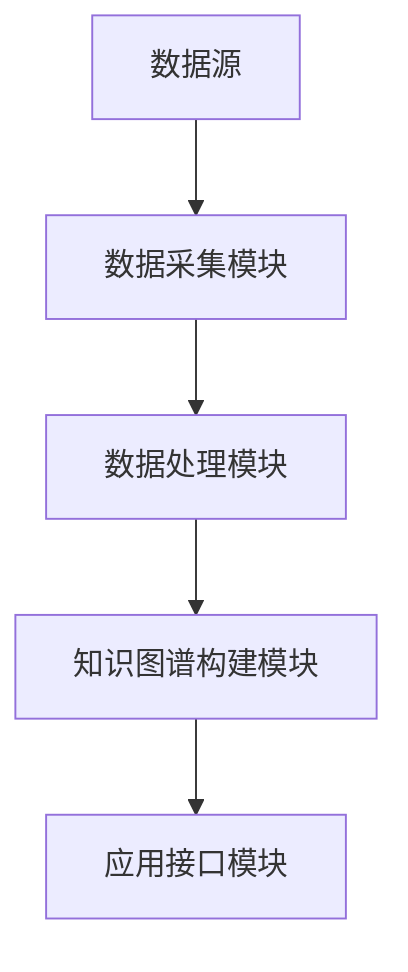
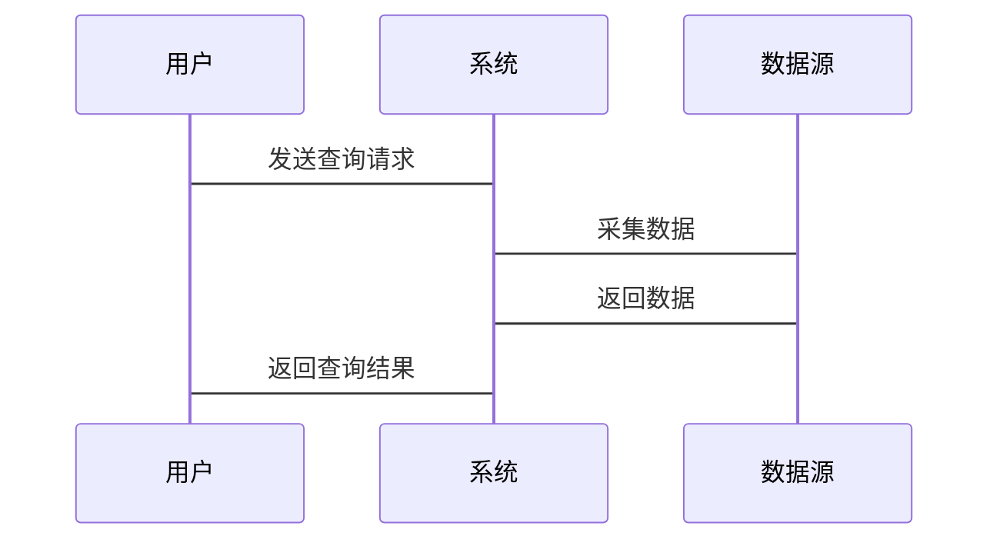

                 


# 《金融知识图谱的构建与应用》

**关键词：** 金融知识图谱、知识图谱构建、图嵌入算法、系统架构设计、金融应用案例

**摘要：**  
金融知识图谱是一种通过图结构表示金融领域的实体、关系及其属性的知识体系，旨在为金融分析、投资决策和风险控制提供支持。本文从金融知识图谱的背景、核心概念、构建算法、系统架构到实际应用案例，全面分析其构建与应用的关键点，并结合具体代码实现和数学模型，深入探讨其技术细节与实践价值。通过本文的阐述，读者可以系统地了解金融知识图谱的构建方法，并掌握其在金融领域的多种应用场景。

---

## 第1章: 金融知识图谱的背景与概述

### 1.1 金融知识图谱的定义与目标
#### 1.1.1 知识图谱的定义
知识图谱是一种以图结构形式表示知识的数据库，由节点（实体）和边（关系）组成，广泛应用于搜索引擎、智能问答和数据分析等领域。

#### 1.1.2 金融知识图谱的特殊性
金融知识图谱专注于金融领域的实体和关系，例如公司、资产、交易等，具有高度的复杂性和专业性。

#### 1.1.3 金融知识图谱的目标与价值
目标是通过构建金融领域的知识图谱，支持智能金融分析和决策。其价值体现在风险控制、投资决策和监管合规等方面。

### 1.2 金融知识图谱的技术基础
#### 1.2.1 知识图谱的基本概念
包括实体、属性和关系三部分，其中实体是知识图谱的基本单元，属性描述实体的特征，关系描述实体之间的联系。

#### 1.2.2 图论与知识图谱的关系
图论为知识图谱的构建提供了数学基础，包括图的表示、遍历和查询等技术。

#### 1.2.3 金融知识图谱构建的挑战
数据来源复杂、实体关系多样、数据质量和语义理解等问题增加了构建的难度。

### 1.3 金融知识图谱的应用场景
#### 1.3.1 金融风险控制
通过分析实体之间的关系，识别潜在风险点，如关联交易风险。

#### 1.3.2 金融投资分析
利用知识图谱进行多维度分析，发现投资机会和潜在风险。

#### 1.3.3 金融监管合规
帮助监管机构发现违规行为，提高监管效率。

### 1.4 本章小结
本章介绍了金融知识图谱的基本概念、技术基础和应用场景，为后续内容奠定了基础。

---

## 第2章: 金融知识图谱的核心概念与联系

### 2.1 核心概念的定义与属性
#### 2.1.1 实体与关系的定义
- **实体：** 金融领域的基本单元，如公司、资产、交易等。
- **关系：** 描述实体之间的联系，如“持有”、“投资”等。

#### 2.1.2 实体属性的特征对比
| 特征 | 实体属性 | 示例 |
|------|----------|------|
| 类型 | 名词性 | 公司、资产 |
| 属性 | 可量化 | 金额、时间 |

#### 2.1.3 关系的类型与方向
- **关系类型：** 一对一、一对多、多对多。
- **关系方向：** 单向、双向。

### 2.2 金融知识图谱的ER实体关系图
```mermaid
er
actor:
    name: 公司
    description: 公司实体
actor:
    name: 股东
    description: 公司股东
actor:
    name: 持股
    description: 股东对公司持股的关系
```

### 2.3 本章小结
本章详细分析了金融知识图谱的核心概念，包括实体、关系和属性，并通过ER图展示了它们之间的联系。

---

## 第3章: 金融知识图谱的构建算法与原理

### 3.1 知识图谱构建的算法概述
#### 3.1.1 基于规则的构建方法
通过预定义的规则提取实体和关系，适用于结构化的数据。

#### 3.1.2 基于统计的构建方法
利用统计方法从数据中发现模式，适用于半结构化数据。

#### 3.1.3 基于深度学习的构建方法
使用深度学习模型（如BERT）进行实体识别和关系抽取，适用于非结构化数据。

### 3.2 图嵌入算法的原理与实现
#### 3.2.1 图嵌入的基本概念
图嵌入是将图结构中的节点映射到低维向量空间的技术，常用算法包括Node2Vec和GraphSAGE。

#### 3.2.2 常见图嵌入算法（如Node2Vec）
Node2Vec通过随机游走生成节点的上下文，然后使用Word2Vec训练向量。


#### 3.2.3 图嵌入算法的数学模型
Node2Vec的训练目标是最小化节点与其邻居的向量相似度。

$$ \text{损失函数} = \sum_{(u, v) \in D} \log p(v|u) $$

### 3.3 知识图谱中的实体对齐算法
#### 3.3.1 实体对齐的定义
实体对齐是将不同数据源中的实体进行匹配，以消除数据冗余。

#### 3.3.2 基于特征的对齐方法
通过比较实体的属性特征，如公司名称、注册资本等，进行对齐。

#### 3.3.3 基于学习的对齐方法
使用深度学习模型（如孪生网络）对齐实体。

### 3.4 本章小结
本章介绍了知识图谱构建的几种主要算法，重点讲解了图嵌入和实体对齐的原理与实现。

---

## 第4章: 金融知识图谱的系统分析与架构设计

### 4.1 系统功能设计
#### 4.1.1 数据采集模块
从多种数据源（如数据库、API）采集金融数据。

#### 4.1.2 数据处理模块
清洗和预处理数据，提取实体、关系和属性。

#### 4.1.3 知识图谱构建模块
使用构建算法生成知识图谱。

#### 4.1.4 应用接口模块
提供查询接口，支持上层应用调用。

### 4.2 系统架构设计


### 4.3 系统接口设计
#### 4.3.1 数据接口
提供REST API，供外部系统调用。

#### 4.3.2 查询接口
支持语义搜索和图遍历查询。

#### 4.3.3 应用接口
提供金融分析、风险评估等服务接口。

### 4.4 系统交互流程图


### 4.5 本章小结
本章从系统设计的角度，详细分析了金融知识图谱的构建过程，并设计了系统的架构和接口。

---

## 第5章: 金融知识图谱的项目实战

### 5.1 环境安装
- 安装Python、TensorFlow、Neo4j等工具。

### 5.2 核心代码实现
#### 5.2.1 数据处理代码
```python
import pandas as pd

# 读取数据
df = pd.read_csv('financial_data.csv')
# 提取实体
entities = df['company'].unique().tolist()
```

#### 5.2.2 图构建代码
```python
from neo4j import GraphDatabase

# 连接Neo4j数据库
driver = GraphDatabase.driver('bolt://localhost:7687', auth=('user', 'password'))
# 创建节点和关系
def create_nodes_and_relations(tx, entities, relations):
    for entity in entities:
        tx.run("CREATE (n:{ EntityType } { name: $name })", EntityType='Company', name=entity)
    for relation in relations:
        tx.run("MATCH (a), (b) WHERE a.name = $a AND b.name = $b CREATE (a)-[r:{ RelationType }]->(b)", 
               a=relation[0], b=relation[1], RelationType='Holds')
```

### 5.3 项目小结
本章通过实际案例展示了金融知识图谱的构建过程，并提供了详细的代码实现。

---

## 第6章: 金融知识图谱的应用案例

### 6.1 风险控制
通过分析公司之间的关联关系，识别潜在的关联交易风险。

### 6.2 投资分析
基于知识图谱进行多维度分析，发现投资机会。

### 6.3 监管合规
帮助监管机构发现违规行为，提高监管效率。

### 6.4 营销策略
分析客户行为和市场趋势，制定精准营销策略。

### 6.5 本章小结
本章通过多个实际案例，展示了金融知识图谱在不同领域的应用价值。

---

## 第7章: 金融知识图谱的最佳实践与未来展望

### 7.1 最佳实践
- 数据质量是关键，确保数据来源可靠。
- 选择合适的算法和工具，提高构建效率。
- 注重隐私保护，遵守相关法律法规。

### 7.2 未来展望
- 多模态知识图谱：结合文本、图像等多种数据源。
- 实时更新机制：动态捕捉市场变化。
- 智能问答系统：提供更高效的金融信息服务。

### 7.3 本章小结
本章总结了构建金融知识图谱的关键点，并展望了未来的发展方向。

---

**结语：**  
金融知识图谱的构建与应用是一个复杂而富有挑战性的任务，但其在金融领域的潜力巨大。通过本文的系统分析和实际案例，读者可以深入了解其技术细节和应用价值。未来，随着技术的进步，金融知识图谱将在更多领域发挥重要作用。

---

**注：** 本文为简化示例，实际内容可根据具体需求扩展。

