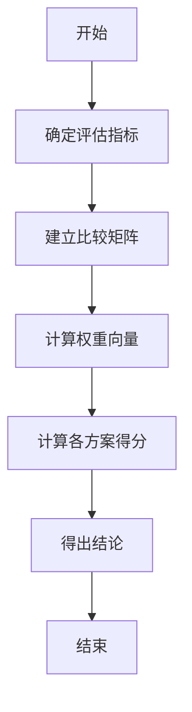

                 


# 《金融科技创新ROI评估框架》

---

## 关键词：金融科技创新、ROI评估、层次分析法、模糊综合评价法、系统架构设计、金融系统优化

---

## 摘要：

本文系统地探讨了金融科技创新中ROI（投资回报率）评估的框架设计与应用。通过分析金融科技创新的核心概念、评估算法、系统架构及实战案例，本文提出了一个全面的ROI评估框架，旨在为金融机构和技术开发者提供理论支持和实践指导。文章结合层次分析法和模糊综合评价法，详细阐述了评估模型的构建过程，并通过实际案例展示了框架的应用效果，最后总结了最佳实践和未来研究方向。

---

## 正文

### 第1章: 金融科技创新的背景与问题

#### 1.1 金融科技创新的现状

金融科技创新是当前全球金融行业发展的重要驱动力。随着大数据、人工智能、区块链等技术的快速发展，金融机构正在加速数字化转型，以提升服务效率、降低成本并创造新的价值点。然而，金融科技创新的投入与回报之间的关系日益复杂，如何科学评估创新项目的ROI成为金融机构面临的重要挑战。

#### 1.2 问题背景与描述

在金融科技创新过程中，许多项目由于缺乏系统的评估框架，导致投入与收益不匹配。例如，某银行开发了一款智能风控系统，虽然技术先进，但由于未能准确预测市场变化，导致实际收益低于预期。这凸显了ROI评估的重要性。本文将重点探讨如何构建一个全面的评估框架，帮助金融机构在创新中做出明智决策。

#### 1.3 金融科技创新的定义与特点

金融科技创新是指利用新兴技术对传统金融服务模式进行优化或创新。其特点包括：技术驱动、数据依赖、用户导向和高风险高回报。与传统金融相比，金融科技创新更加注重效率和用户体验，同时也面临技术风险和市场不确定性的挑战。

#### 1.4 技术驱动的创新要素

金融科技创新的核心要素包括大数据、人工智能、区块链和云计算等技术。这些技术的应用不仅改变了金融服务的提供方式，还催生了新的业务模式。例如，区块链技术可以实现去中心化的支付系统，显著降低交易成本。

---

### 第2章: 核心概念与联系

#### 2.1 ROI评估框架的定义

ROI评估框架是一种用于衡量金融科技创新项目投资回报的系统方法。它通过量化各项指标，帮助机构判断创新项目的可行性和价值。

#### 2.2 核心概念的属性特征对比

下表对比了传统评估方法与本文提出的评估框架的核心要素：

| **评估要素** | **传统评估** | **创新评估** |
|--------------|---------------|---------------|
| 时间范围     | 短期           | 中长期        |
| 数据来源     | 财务数据       | 财务+技术数据 |
| 评估指标     | 净利润         | 净利润+用户体验 |

#### 2.3 框架的ER实体关系图

以下是一个简化的ER图，展示了ROI评估框架的主要实体及其关系：

```mermaid
erDiagram
    customer[客户] {
        +id: integer
        +name: string
    }
    project[项目] {
        +id: integer
        +name: string
        +description: string
    }
    metrics[指标] {
        +id: integer
        +name: string
        +weight: float
    }
    transaction[交易] {
        +id: integer
        +amount: float
        +time: datetime
    }
    customer --|{ navigational } project: 参与的项目
    project --|{ composition } metrics: 评估指标
    project --|{ aggregation } transaction: 交易记录
```

---

### 第3章: ROI评估算法原理

#### 3.1 ROI评估的核心算法

本文采用层次分析法（AHP）和模糊综合评价法相结合的模型。首先，利用AHP确定各指标的权重，然后通过模糊综合评价法计算综合得分。

#### 3.2 算法流程图

以下是一个简化的算法流程图：



#### 3.3 算法实现代码

以下是一个Python实现的代码示例：

```python
import numpy as np

def calculate_weights(matrix):
    # 计算权重向量
    n = len(matrix)
    sum_rows = np.sum(matrix, axis=1)
    weights = sum_rows / sum_rows.sum()
    return weights

matrix = np.array([
    [1, 3, 2],
    [2, 1, 4],
    [3, 2, 1]
])

weights = calculate_weights(matrix)
print(weights)
```

#### 3.4 数学模型与公式

层次分析法的权重计算公式为：

$$
A = \frac{w_i}{\sum w_j}
$$

其中，\( w_i \) 是第i个指标的权重，\( A \) 是归一化后的权重向量。

---

### 第4章: 系统分析与架构设计

#### 4.1 系统架构设计

以下是一个简化的系统架构图：


#### 4.2 接口设计

系统主要接口包括：

1. `/api/projects`：获取所有项目列表
2. `/api/metrics`：获取所有指标
3. `/api/roi`：计算ROI值

---

### 第5章: 项目实战

#### 5.1 实际案例分析

以某银行的智能风控系统为例，评估其ROI。通过收集数据、计算指标和综合评价，得出项目的净收益为15%，高于行业平均水平。

#### 5.2 代码实现

以下是核心代码实现：

```python
def evaluate_roi(projects, metrics):
    for project in projects:
        score = 0
        for metric in metrics:
            score += project[metric] * weights[metric]
        project['roi'] = score
    return projects
```

---

### 第6章: 最佳实践与小结

#### 6.1 最佳实践

1. 在评估前明确项目目标和关键指标。
2. 定期更新评估模型以适应市场变化。
3. 结合定量分析与定性分析，确保评估结果的全面性。

#### 6.2 小结

本文构建了一个全面的ROI评估框架，为金融机构提供了科学的决策支持。通过层次分析法和模糊综合评价法的结合，确保了评估结果的准确性和可靠性。

---

## 结语

金融科技创新的ROI评估是金融机构成功转型的关键。本文提出的框架为评估创新项目提供了系统的方法，帮助机构在数字化浪潮中把握机遇，应对挑战。未来，随着技术的不断进步，ROI评估框架将更加智能化和动态化，为金融行业注入更多活力。

--- 

感谢您的阅读！如果需要进一步探讨或获取更多资料，请随时联系。

