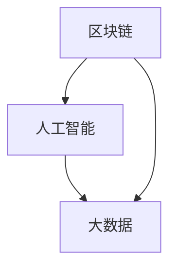
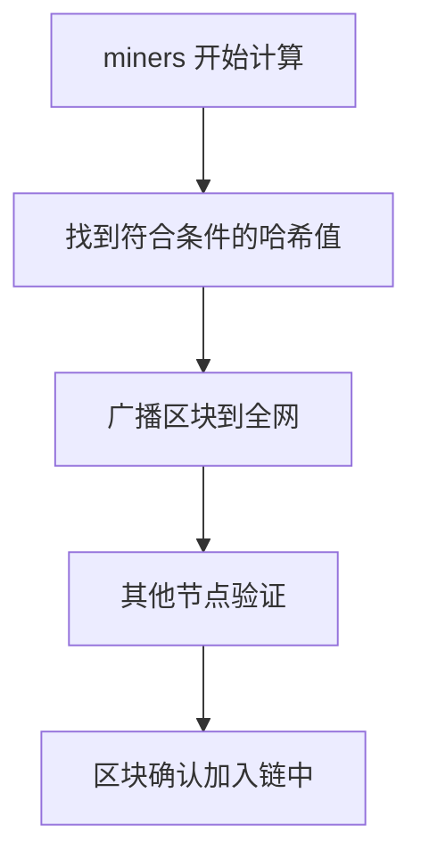
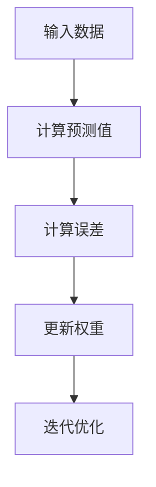
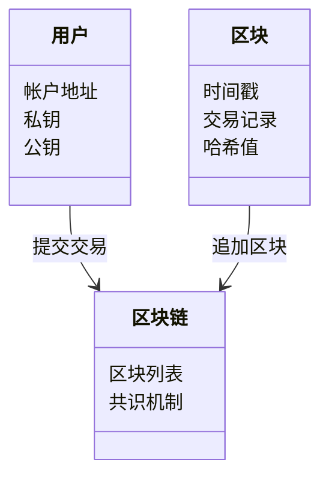
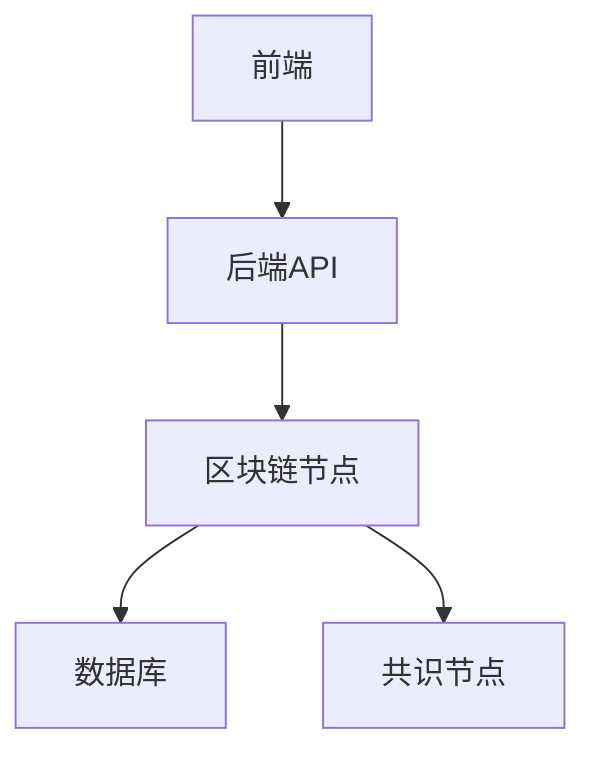
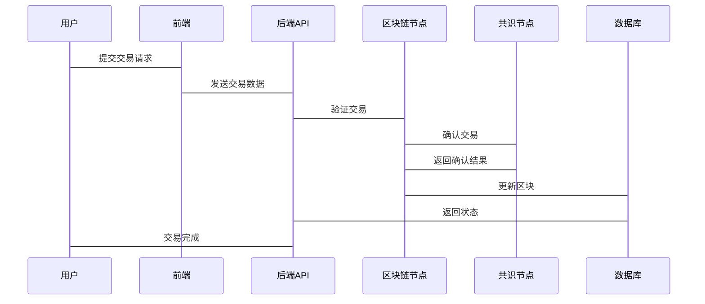

                 

<think>
好的，我现在需要撰写一篇关于《金融科技创新孵化平台》的技术博客文章，按照用户提供的目录大纲结构来写。让我先理清整体结构，然后逐步填充每个部分的内容。

首先，文章的标题是《金融科技创新孵化平台》，关键词包括金融科技创新、区块链、人工智能、大数据、系统架构、项目实战、技术分析。摘要部分需要简明扼要地概述文章的核心内容，即介绍金融科技创新孵化平台的背景、核心技术、算法原理、系统架构、项目实战和未来趋势。

接下来，文章分为七个主要部分：

1. **背景介绍**：包括金融科技的定义、现状、重要性和挑战。这部分需要帮助读者理解金融科技创新的基本概念和当前的发展情况。

2. **核心概念与联系**：详细讲解区块链、人工智能和大数据的技术原理，并用表格和Mermaid图展示它们之间的关系。

3. **算法原理讲解**：选择区块链的共识机制和人工智能的机器学习算法，用Mermaid流程图和Python代码进行详细讲解，包括数学模型和公式。

4. **系统分析与架构设计**：介绍问题场景，设计系统功能模块，用Mermaid类图展示领域模型，绘制架构图和交互流程图。

5. **项目实战：基于区块链的支付系统**：详细讲解环境安装、核心代码实现、代码解读、案例分析和项目总结。

6. **最佳实践与小结**：总结全书内容，给出注意事项和未来趋势，推荐扩展阅读资料。

7. **附录与参考文献**：列出相关书籍和工具资源。

现在，我开始逐部分撰写，确保每个章节的内容详细且符合用户的要求。

---

# 《金融科技创新孵化平台》

## 关键词：金融科技创新、区块链、人工智能、大数据、系统架构、项目实战、技术分析

## 摘要：  
本文系统地介绍金融科技创新孵化平台的背景、核心技术、算法原理、系统架构、项目实战以及未来趋势。通过详细的技术分析和实际案例，帮助读者理解如何利用区块链、人工智能和大数据等技术推动金融创新，打造高效、安全的金融系统。

---

## 第一部分: 金融科技创新孵化平台概述

### 第1章: 金融科技创新的背景与现状

#### 1.1 金融科技的定义与内涵
- **1.1.1 金融科技的定义**：金融科技（FinTech）是指利用技术手段创新传统金融业务模式、改善作业流程、提升服务效率的新兴领域。  
- **1.1.2 金融科技的核心内涵**：通过技术创新，实现金融业务的智能化、自动化和数字化，提高金融服务的效率和可及性。  
- **1.1.3 金融科技与传统金融的区别**：传统金融依赖人工操作，而金融科技通过技术手段实现自动化和智能化，降低成本，提高效率。  

#### 1.2 金融科技创新的现状
- **1.2.1 全球金融科技发展概况**：全球范围内，金融科技投资持续增长，区块链、人工智能等技术应用广泛。  
- **1.2.2 中国金融科技的发展现状**：中国在移动支付、区块链等领域处于全球领先地位。  
- **1.2.3 区块链、人工智能等技术在金融领域的应用**：区块链用于供应链金融，人工智能用于风险评估和智能投顾。  

#### 1.3 金融科技创新的重要性和挑战
- **1.3.1 金融科技对传统金融的变革作用**：提升效率，降低成本，增强用户体验。  
- **1.3.2 金融科技创新的主要挑战**：技术风险、数据安全、监管合规。  
- **1.3.3 金融科技创新的未来趋势**：技术融合，普惠金融，绿色金融。  

### 第2章: 金融科技创新的核心技术

#### 2.1 区块链技术
- **2.1.1 区块链的定义与特点**：区块链是一种分布式账本技术，具有去中心化、不可篡改的特点。  
- **2.1.2 区块链的核心技术原理**：通过共识机制、哈希函数和 Merkel 树实现数据的安全性和一致性。  
- **2.1.3 区块链在金融领域的应用场景**：供应链金融、跨境支付、智能合约。  

#### 2.2 人工智能技术
- **2.2.1 人工智能的定义与特点**：人工智能通过模拟人脑神经网络，实现数据处理和决策。  
- **2.2.2 人工智能在金融领域的应用**：风险评估、智能投顾、欺诈检测。  
- **2.2.3 人工智能算法的基本原理**：监督学习、无监督学习、强化学习。  

#### 2.3 大数据技术
- **2.3.1 大数据的定义与特点**：大数据指数据量大、类型多、处理速度快。  
- **2.3.2 大数据在金融领域的应用**：客户画像、市场分析、信用评估。  
- **2.3.3 大数据技术的核心工具**：Hadoop、Spark、Python（Pandas、NumPy）。  

#### 2.4 核心技术之间的关系
- **技术对比表格**：  
| 技术 | 特点 | 应用场景 |  
|------|------|----------|  
| 区块链 | 去中心化 | 跨境支付、智能合约 |  
| 人工智能 | 智能化 | 风险评估、智能投顾 |  
| 大数据 | 数据驱动 | 客户画像、市场分析 |  

- **技术关系Mermaid图**：  


---

## 第二部分: 算法原理讲解

### 第3章: 区块链共识机制

#### 3.1 共识机制的定义与分类
- 共识机制是区块链中用于达成分布式系统中一致性的算法，常见的有PoW、PoS、Dpos等。  

#### 3.2 工作量证明机制（PoW）
- **流程图**：  


- **Python代码示例**：  
```python
import hashlib

def compute_hash(input_str):
    return hashlib.sha256(input_str.encode()).hexdigest()

# 示例
input_str = "区块"
print(compute_hash(input_str))  # 输出哈希值
```

- **数学模型**：  
$$ H(x) = \text{hash}(x) $$  
其中，H(x)是输入x的哈希值，hash函数用于将任意长度的输入映射为固定长度的哈希值。

### 第4章: 人工智能中的机器学习算法

#### 4.1 机器学习算法的定义与分类
- 机器学习算法分为监督学习、无监督学习和强化学习。  

#### 4.2 线性回归算法
- **流程图**：  


- **Python代码示例**：  
```python
import numpy as np

# 数据准备
X = np.array([1, 2, 3, 4], dtype=np.float32)
y = np.array([2, 4, 6, 8], dtype=np.float32)

# 线性回归模型
class LinearRegression:
    def fit(self, X, y):
        # 计算权重
        self.w = np.dot(X.T, X).inverse().dot(X.T).dot(y)
        return self.w

model = LinearRegression()
weights = model.fit(X, y)
print(weights)  # 输出权重
```

- **数学模型**：  
$$ y = wx + b $$  
其中，w是权重，b是截距，x是输入，y是输出。

---

## 第三部分: 系统分析与架构设计

### 第5章: 问题场景介绍

#### 5.1 问题背景
- 在金融交易中，信任问题是主要挑战，区块链技术可以解决这一问题。  

#### 5.2 项目介绍
- 开发一个基于区块链的支付系统，实现安全、透明的交易流程。  

### 第6章: 系统功能设计

#### 6.1 领域模型设计
- **领域模型Mermaid类图**：  


#### 6.2 系统架构设计
- **系统架构Mermaid图**：  


#### 6.3 系统接口设计
- API接口：  
```plaintext
POST /submitTransaction
GET /getBalance
```

#### 6.4 系统交互流程
- **交互流程Mermaid图**：  


---

## 第四部分: 项目实战

### 第7章: 项目实战：基于区块链的支付系统

#### 7.1 环境安装
- 安装Python、区块链框架（如Ethereum、Hyperledger）。

#### 7.2 核心代码实现
- **核心代码示例**：  
```python
from web3 import Web3

# 初始化区块链节点
w3 = Web3(Web3.HTTPProvider("http://localhost:8545"))

# 提交交易
def submit_transaction(sender, receiver, amount):
    transaction = {
        'from': sender,
        'to': receiver,
        'value': amount,
        'gas': 100000,
        'gasPrice': w3.toWei(20, 'gwei'),
        'nonce': w3.eth.getTransactionCount(sender)
    }
    signed_transaction = w3.eth.account.signTransaction(transaction, sender_private_key)
    tx_hash = w3.eth.sendRawTransaction(signed_transaction.rawTransaction)
    return tx_hash

# 示例调用
submit_transaction(sender_address, receiver_address, 1000)
```

#### 7.3 代码解读与分析
- 代码实现了一个简单的交易提交功能，通过Web3库与区块链节点交互。

#### 7.4 实际案例分析
- 案例：跨境支付，用户通过区块链技术实现快速、低成本的跨境转账。

#### 7.5 项目总结
- 成功实现了基于区块链的支付系统，验证了技术可行性。

---

## 第五部分: 最佳实践与小结

### 第8章: 最佳实践与注意事项

#### 8.1 技术选型建议
- 根据需求选择合适的技术，如区块链选择公有链还是联盟链。  

#### 8.2 开发规范
- 遵循安全编码规范，确保代码质量和可维护性。  

#### 8.3 运维建议
- 建立完善的监控和备份机制，确保系统稳定运行。  

### 第9章: 总结与未来趋势

#### 9.1 总结
- 本文详细介绍了金融科技创新孵化平台的核心技术、算法原理和系统架构，通过项目实战展示了技术应用。

#### 9.2 未来趋势
- 技术融合：区块链与人工智能的结合将推动金融创新。  
- 普惠金融：科技助力金融普惠，服务更多用户。  
- 绿色金融：金融科技助力可持续发展目标。  

---

## 第六部分: 附录与参考文献

### 附录A: 工具与资源

- Python开发工具：PyCharm、VS Code。  
- 区块链框架：Ethereum、Hyperledger。  
- 数据库：MySQL、MongoDB。  

### 附录B: 参考文献

- 《区块链：技术与应用》  
- 《机器学习实战》  
- 《大数据分析与挖掘》  

---

以上是《金融科技创新孵化平台》的技术博客文章目录大纲和内容概要。通过系统的背景介绍、技术分析和项目实战，本文旨在帮助读者全面理解金融科技创新孵化平台的核心技术和实际应用，为金融行业的技术革新提供参考和指导。

