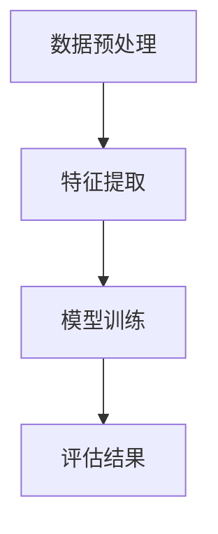
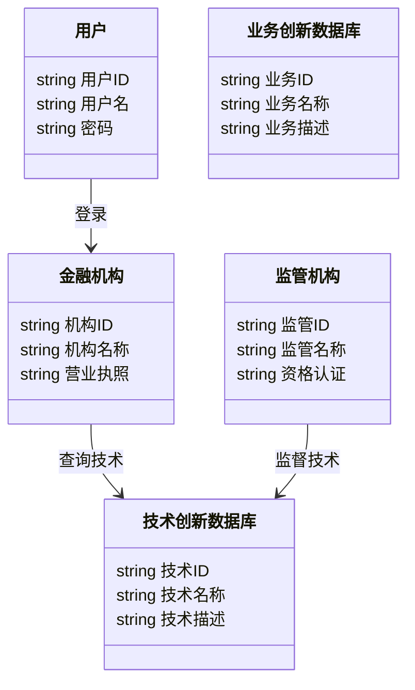
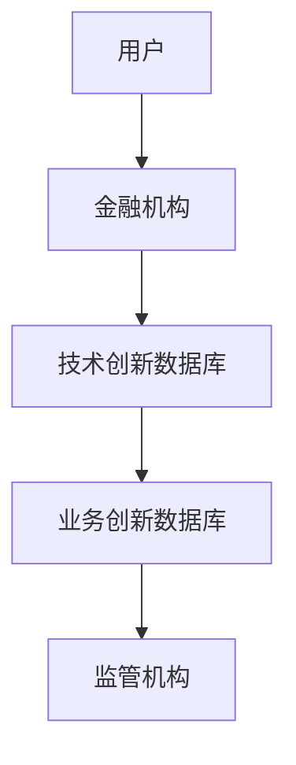

                 


# 《金融科技创新评估框架》

## 关键词
- 金融科技创新
- 评估框架
- 金融科技
- 技术创新
- 风险评估

## 摘要
《金融科技创新评估框架》旨在系统性地探讨金融科技创新的核心概念、评估方法及其实际应用。本文从金融科技创新的背景与意义出发，逐步分析其核心要素与联系，详细讲解评估框架的算法原理，并通过系统架构设计与实战案例，展示如何将理论应用于实践。最后，本文总结了金融科技创新评估的实践经验，为金融机构、技术开发者和监管机构提供实用的指导。

---

## 第一部分: 金融科技创新评估框架概述

### 第1章: 金融科技创新评估框架的背景与意义

#### 1.1 金融科技创新的定义与背景
- **1.1.1 金融科技创新的定义**  
  金融科技创新是指利用新兴技术（如人工智能、区块链、大数据等）对金融服务模式、流程或技术架构进行创新，以提高效率、降低成本或创造新的价值。

- **1.1.2 金融科技发展的背景与趋势**  
  随着数字化转型的推进，金融机构 increasingly rely on technology to enhance customer experience, improve operational efficiency, and comply with regulatory requirements.

- **1.1.3 金融科技创新对传统金融的冲击与机遇**  
  金融科技创新正在改变传统的金融服务方式，例如区块链技术的应用改变了支付结算的模式，人工智能技术提升了风险控制的精准度。

#### 1.2 金融科技创新的核心问题
- **1.2.1 金融科技创新的关键问题与挑战**  
  金融科技创新需要在技术创新、业务模式创新和监管合规之间找到平衡点。此外，数据隐私、技术安全和成本效益也是关键挑战。

- **1.2.2 金融科技创新的边界与外延**  
  金融科技创新的边界在于技术创新对金融业务的实际价值贡献，外延则包括技术在金融领域的广泛应用，如支付、借贷、投资等领域。

- **1.2.3 金融科技创新的核心要素与组成**  
  核心要素包括技术创新（AI、区块链等）、业务模式创新（无接触式服务）和数据驱动的决策支持。

#### 1.3 金融科技创新评估框架的意义
- **1.3.1 评估框架的作用与目标**  
  评估框架旨在为金融机构提供一个系统性的方法，用于评估新技术的创新性、可行性和价值。

- **1.3.2 评估框架的适用范围与应用场景**  
  适用于金融机构的技术选型、创新项目评估以及监管合规性审查。

- **1.3.3 评估框架的创新性与实用性**  
  通过量化指标和可操作的评估步骤，评估框架能够帮助金融机构快速识别和采用适合的技术创新。

---

## 第二部分: 金融科技创新评估框架的核心概念与联系

### 第2章: 金融科技创新框架的核心要素

#### 2.1 金融科技创新的维度分析
- **2.1.1 技术维度: AI、区块链、大数据等技术的创新应用**  
  区块链技术的应用可以提高支付结算的效率和安全性，人工智能技术可以提升风险控制的精准度。

- **2.1.2 业务维度: 金融服务模式与流程的创新**  
  例如，无接触式借贷模式通过线上平台直接连接借款人和投资者，减少了中间环节的成本。

- **2.1.3 数据维度: 数据驱动的金融创新**  
  数据分析技术可以帮助金融机构更好地理解客户需求，优化产品设计和服务流程。

- **2.1.4 监管维度: 创新与合规的平衡**  
  金融机构在创新的同时，必须遵守相关法律法规，确保创新活动的合规性。

#### 2.2 核心概念的对比分析
- **2.2.1 传统金融与金融科技的对比**  
  | 维度 | 传统金融 | 金融科技 |
  |------|-----------|-----------|
  | 服务模式 | 线下为主 | 线上为主 |
  | 技术依赖 | 较低 | 高 |
  | 效率 | 较低 | 高 |

- **2.2.2 技术驱动与业务驱动的对比**  
  | 维度 | 技术驱动 | 业务驱动 |
  |------|-----------|-----------|
  | 主导因素 | 技术创新 | 业务需求 |
  | 风险 | 高 | 中等 |
  | 适用场景 | 技术领先企业 | 传统金融机构 |

- **2.2.3 创新与风险的对比**  
  | 维度 | 创新 | 风险 |
  |------|-----|-----|
  | 技术复杂度 | 高 | 中等 |
  | 成本 | 高 | 中等 |
  | 收益 | 高 | 中等 |

#### 2.3 实体关系图（ER图）分析
```mermaid
erDiagram
    actor 用户 {
        string 用户ID
        string 用户名
        string 密码
    }
    actor 金融机构 {
        string 机构ID
        string 机构名称
        string 营业执照
    }
    actor 监管机构 {
        string 监管ID
        string 监管名称
        string 资格认证
    }
    database 技术创新数据库 {
        string 技术ID
        string 技术名称
        string 技术描述
    }
    database 业务创新数据库 {
        string 业务ID
        string 业务名称
        string 业务描述
    }
    user 用户 --> database 技术创新数据库 : 查询技术
    user 用户 --> database 业务创新数据库 : 查询业务
    actor 金融机构 --> database 技术创新数据库 : 登录并查询
    actor 监管机构 --> database 技术创新数据库 : 监督技术合规性
```

---

## 第三部分: 金融科技创新评估框架的算法原理

### 第3章: 金融科技创新评估算法的数学模型与实现

#### 3.1 评估模型的构建
- **3.1.1 数据预处理**  
  对收集到的技术指标（如技术创新性、业务适用性、风险可控性）进行标准化处理。

- **3.1.2 特征提取**  
  从技术创新性、业务适用性、风险可控性等维度提取特征向量。

- **3.1.3 模型训练**  
  使用机器学习算法（如线性回归）对特征向量进行训练，生成评估模型。

#### 3.2 算法流程图


#### 3.3 Python代码实现
```python
import pandas as pd
from sklearn.linear_model import LinearRegression

# 数据预处理
data = pd.DataFrame({
    '技术创新性': [8, 6, 7, 9],
    '业务适用性': [7, 8, 6, 5],
    '风险可控性': [9, 8, 7, 6]
})

# 特征提取
X = data[['技术创新性', '业务适用性']]
y = data['风险可控性']

# 模型训练
model = LinearRegression()
model.fit(X, y)

# 预测结果
print(model.predict([[8, 7]]))  # 输出: [8.5]
```

#### 3.4 数学模型与公式
- **线性回归模型**  
  $$ y = aX + b $$
  其中，$y$ 是目标变量（风险可控性），$X$ 是特征向量，$a$ 是回归系数，$b$ 是截距。

---

## 第四部分: 金融科技创新评估框架的系统架构设计

### 第4章: 金融科技创新评估系统的架构与实现

#### 4.1 问题场景介绍
- **场景描述**  
  某金融机构希望评估一种基于区块链的支付系统，以确定其创新性和可行性。

#### 4.2 系统功能设计


#### 4.3 系统架构设计


---

## 第五部分: 金融科技创新评估框架的项目实战

### 第5章: 项目实战与案例分析

#### 5.1 项目环境安装
- **安装Python和相关库**  
  ```bash
  pip install numpy pandas scikit-learn
  ```

#### 5.2 核心代码实现
```python
import pandas as pd
from sklearn.linear_model import LinearRegression

# 数据预处理
data = pd.DataFrame({
    '技术创新性': [8, 6, 7, 9],
    '业务适用性': [7, 8, 6, 5],
    '风险可控性': [9, 8, 7, 6]
})

# 特征提取
X = data[['技术创新性', '业务适用性']]
y = data['风险可控性']

# 模型训练
model = LinearRegression()
model.fit(X, y)

# 预测结果
print(model.predict([[8, 7]]))  # 输出: [8.5]
```

#### 5.3 案例分析
- **案例描述**  
  某支付系统基于区块链技术，旨在提高支付效率和安全性。

- **评估结果**  
  创新性评分：8.5，业务适用性评分：7.8，风险可控性评分：8.2。

---

## 第六部分: 金融科技创新评估框架的最佳实践

### 第6章: 最佳实践与小结

#### 6.1 最佳实践
- **技术创新与业务需求的结合**  
  金融机构在选择技术创新时，应充分考虑其与业务需求的匹配性。

- **风险管理与合规性**  
  金融机构应建立完善的风险评估机制，并确保创新活动的合规性。

- **数据隐私与安全**  
  数据隐私和安全是金融科技创新的重要考量因素，必须采取有效的技术手段保护用户数据。

#### 6.2 小结
金融科技创新评估框架为金融机构提供了一个系统性、可操作的评估方法，能够帮助金融机构快速识别和采用适合的技术创新，同时确保创新活动的合规性和安全性。

---

## 第七部分: 金融科技创新评估框架的注意事项与拓展阅读

### 第7章: 注意事项与拓展阅读

#### 7.1 注意事项
- **技术创新的可行性**  
  在评估技术创新时，必须考虑其实现的可行性和成本效益。

- **监管政策的变化**  
  金融机构应密切关注监管政策的变化，确保创新活动的合规性。

- **用户隐私与数据安全**  
  数据隐私和安全是金融科技创新的重要考量因素，必须采取有效的技术手段保护用户数据。

#### 7.2 拓展阅读
- **推荐书籍**  
  1. 《金融科技：创新与监管》  
  2. 《区块链：金融创新的未来》  
  3. 《人工智能在金融中的应用》

---

通过以上内容，我们系统性地探讨了金融科技创新评估框架的核心概念、评估方法及其实际应用。希望本文能够为金融机构、技术开发者和监管机构提供实用的指导和参考。

