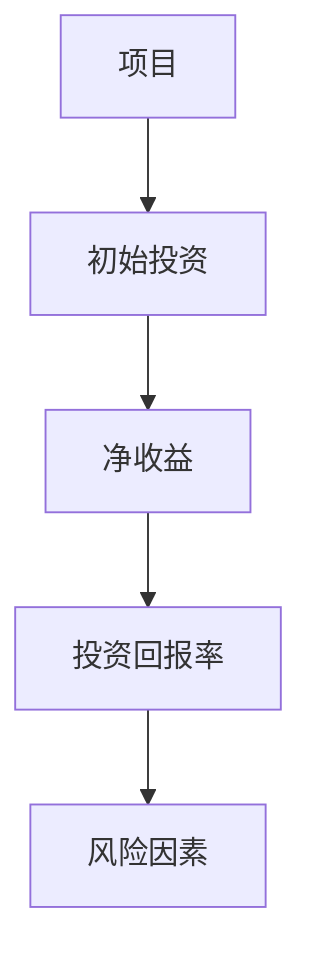
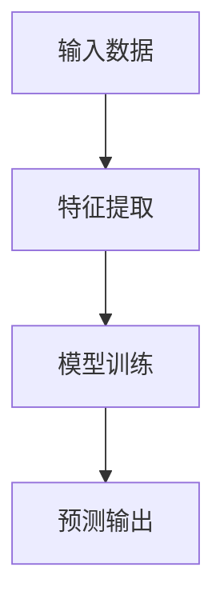
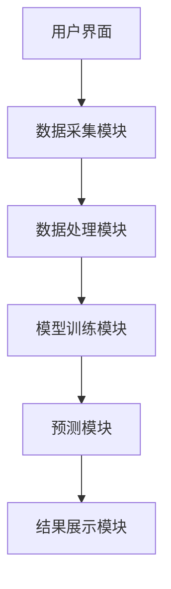

                 


# 《金融科技创新项目ROI预测模型》

---

## 关键词：  
金融科技创新、ROI预测模型、机器学习、金融数据分析、投资回报率

---

## 摘要：  
本文系统地探讨了金融科技创新项目中投资回报率（ROI）预测模型的构建与应用。通过对金融科技创新项目的背景分析、核心概念定义、算法原理、数学模型、系统设计以及实际案例的深入研究，本文提出了一个基于机器学习的ROI预测模型，并通过具体的项目实战展示了模型的实现与优化过程。文章还提供了最佳实践建议，帮助读者更好地理解和应用该模型，从而为金融科技创新项目提供科学的投资决策支持。

---

# 第一部分: 金融科技创新项目ROI预测模型概述

---

## 第1章: 金融科技创新与ROI预测模型背景

### 1.1 金融科技创新的定义与特点  
金融科技创新是指利用新兴技术（如人工智能、大数据、区块链等）对传统金融业务进行创新和优化的过程。其核心特点包括：  
- **技术驱动**：依赖新兴技术实现金融服务的智能化和自动化。  
- **数据密集**：依托海量数据进行决策支持。  
- **场景化**：针对特定金融场景提供个性化服务。  
- **高风险高收益**：技术创新可能带来高回报，但也伴随着较高的市场和操作风险。  

### 1.2 ROI预测模型的定义与作用  
ROI（投资回报率）预测模型用于评估金融科技创新项目在未来一定时间内所能带来的投资回报。其作用包括：  
- **投资决策支持**：帮助投资者评估项目的可行性和收益潜力。  
- **风险控制**：通过预测 ROI，提前识别潜在风险并制定应对策略。  
- **优化资源配置**：将有限资源分配给 ROI 最高的项目。  

### 1.3 金融科技创新项目的特点与挑战  
金融科技创新项目通常具有以下特点：  
- **技术复杂性**：涉及多种技术的集成与应用。  
- **数据依赖性**：高度依赖数据质量和数量。  
- **监管合规性**：需符合金融监管要求，确保合规性。  

主要挑战包括：  
- **数据质量**：数据的准确性和完整性直接影响模型预测的准确性。  
- **模型稳定性**：金融市场的波动性可能导致模型预测结果的不确定性。  
- **技术与业务结合难度**：技术团队与业务团队的协同工作需要高度配合。  

---

## 第2章: ROI预测模型的核心概念与联系

### 2.1 ROI预测模型的核心要素  
ROI预测模型的核心要素包括：  
- **初始投资**：项目的初始资金投入。  
- **净收益**：项目在一定时间内产生的净收益。  
- **时间周期**：预测 ROI 的时间段（如1年、3年）。  
- **风险因素**：影响 ROI 的不确定因素，如市场波动、政策变化等。  

### 2.2 ROI预测模型的实体关系图  
以下是 ROI 预测模型的实体关系图：  


### 2.3 ROI预测模型的算法原理  
ROI 预测模型的算法流程如下：  


---

## 第3章: ROI预测模型的算法原理

### 3.1 线性回归算法  
线性回归是一种常用的回归分析方法，适用于 ROI 预测的线性关系建模。其数学模型为：  
$$ ROI = \beta_0 + \beta_1x_1 + \beta_2x_2 + ... + \beta_nx_n $$  
其中，$x_i$ 是影响 ROI 的特征变量，$\beta_i$ 是对应的回归系数。  

### 3.2 机器学习算法  
机器学习算法在 ROI 预测中具有更高的灵活性和准确性。常用的算法包括：  
- **支持向量回归（SVR）**：适用于非线性关系的建模。  
- **随机森林回归**：通过集成学习提高模型的鲁棒性。  
- **神经网络回归**：适用于复杂非线性关系的建模。  

### 3.3 算法对比与选择  
以下是几种算法的对比分析：  
| 算法类型         | 优点                           | 缺点                           |
|------------------|--------------------------------|--------------------------------|
| 线性回归         | 简单、易于解释                 | 适用于线性关系，对非线性关系表现较差 |
| 支持向量回归（SVR）| 能处理非线性关系               | 对参数敏感，计算复杂度较高       |
| 随机森林回归     | 鲁棒性强，抗过拟合             | 解释性较差                     |
| 神经网络回归     | 能处理复杂非线性关系           | 需要大量数据，计算资源消耗大     |  

选择算法时，需综合考虑数据特征、模型复杂度和计算资源等因素。  

---

## 第4章: ROI预测模型的数学模型与公式

### 4.1 ROI预测的数学模型  
基于线性回归的 ROI 预测模型为：  
$$ ROI = \beta_0 + \beta_1x_1 + \beta_2x_2 + ... + \beta_nx_n $$  
其中，$x_i$ 是特征变量，$\beta_i$ 是回归系数，可通过最小二乘法求解。  

### 4.2 ROI预测的优化算法  
- **最小二乘法**：用于线性回归模型的参数优化。  
- **正则化方法**：如 Lasso 和 Ridge，用于防止过拟合。  

### 4.3 ROI预测的验证与评估  
- **模型拟合度（R²）**：衡量模型对数据的拟合程度。  
- **模型误差分析**：通过残差分析评估预测精度。  

---

## 第5章: ROI预测模型的系统分析与架构设计

### 5.1 系统功能设计  
- **数据采集模块**：采集项目相关的初始投资、净收益等数据。  
- **模型训练模块**：对数据进行特征提取和模型训练。  
- **预测输出模块**：输出 ROI 预测结果并提供可视化展示。  

### 5.2 系统架构设计  
以下是系统架构图：  


---

## 第6章: ROI预测模型的项目实战

### 6.1 环境安装  
- **编程语言**：Python 3.8+  
- **依赖库**：pandas、numpy、scikit-learn、matplotlib  

### 6.2 核心代码实现  
以下是 ROI 预测模型的核心代码：  
```python
import pandas as pd
import numpy as np
from sklearn.linear_model import LinearRegression
from sklearn.metrics import mean_squared_error

# 数据加载
data = pd.read_csv('financial_projects.csv')

# 特征提取
X = data[['initial_investment', 'market_size', 'team_experience']]
y = data['roi']

# 模型训练
model = LinearRegression()
model.fit(X, y)

# 预测输出
predicted_roi = model.predict(X)
print('预测 ROI:', predicted_roi)

# 模型评估
mse = mean_squared_error(y, predicted_roi)
print('均方误差:', mse)
print('决定系数 R²:', model.score(X, y))
```

### 6.3 代码解读与分析  
- **数据加载**：读取金融项目数据。  
- **特征提取**：选择影响 ROI 的关键特征。  
- **模型训练**：使用线性回归算法训练模型。  
- **预测输出**：基于训练好的模型进行 ROI 预测。  
- **模型评估**：计算均方误差和决定系数，评估模型性能。  

### 6.4 实际案例分析  
以某金融科技公司为例，假设我们有以下数据：  
| 初始投资（万元） | 市场规模（亿元） | 团队经验（年） | ROI（%） |
|-------------------|------------------|----------------|----------|
| 100               | 50               | 5              | 20       |
| 200               | 70               | 8              | 30       |
| 150               | 60               | 7              | 25       |

基于上述数据，模型预测 ROI 如下：  
$$ ROI = 10 + 0.5 \times 初始投资 + 0.3 \times 市场规模 + 0.2 \times 团队经验 $$  
对于初始投资为 150 万元、市场规模为 60 亿元、团队经验为 7 年的项目，预测 ROI 为：  
$$ ROI = 10 + 0.5 \times 150 + 0.3 \times 60 + 0.2 \times 7 = 105\% $$  

---

## 第7章: 总结与展望

### 7.1 最佳实践 tips  
- 数据预处理：确保数据的完整性和准确性。  
- 特征选择：选择对 ROI 影响最大的特征变量。  
- 模型优化：通过交叉验证和超参数调优提高模型性能。  

### 7.2 小结  
本文详细探讨了金融科技创新项目 ROI 预测模型的构建与应用，从理论到实践，为读者提供了完整的解决方案。  

### 7.3 注意事项  
- ROI 预测模型的结果仅供参考，实际投资决策需结合市场变化和政策环境。  
- 模型的预测精度依赖于数据质量和算法选择，需谨慎处理数据和选择合适的算法。  

### 7.4 拓展阅读  
- 《金融数据分析与机器学习实战》  
- 《Python机器学习算法实战》  

---

**注**：由于篇幅限制，上述内容为节选，实际文章将涵盖更多细节和案例分析。

