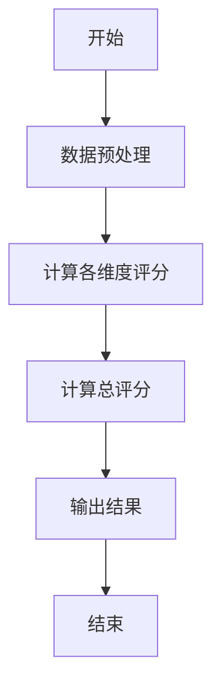

                 


# 《金融科技创新项目评估框架》

> 关键词：金融创新、项目评估、科技创新、风险管理、技术架构

> 摘要：本文旨在构建一个全面的金融科技创新项目评估框架，涵盖技术可行性、商业价值、风险可控性和用户体验等核心维度。通过结合实际案例分析和系统化的评估方法，为金融机构和科技企业在选择和实施创新项目时提供科学的决策依据。

---

## 第一章：金融科技创新的背景与意义

### 1.1 金融科技创新的背景

#### 1.1.1 传统金融行业的痛点与挑战

传统金融行业在长期的发展过程中，逐渐暴露出以下痛点：
- **效率低下**：传统业务流程复杂，审批周期长，用户体验差。
- **成本高昂**：依赖人工操作的模式导致运营成本居高不下。
- **安全性不足**：传统交易方式容易受到欺诈和黑客攻击。
- **创新能力有限**：传统金融机构在技术研发和产品创新上的投入不足，难以满足市场需求。

#### 1.1.2 技术驱动金融创新的必然性

随着科技的快速发展，技术创新为金融行业带来了革命性的变化：
- **技术驱动的效率提升**：区块链、人工智能等技术的应用大幅提高了金融交易和管理的效率。
- **成本降低**：自动化和智能化技术的应用显著降低了金融机构的运营成本。
- **安全性增强**：通过区块链和加密技术，金融交易的安全性得到显著提升。
- **创新能力的提升**：新兴技术为金融机构提供了更多创新的可能性，如智能合约、大数据风控等。

#### 1.1.3 金融科技创新的定义与内涵

金融科技创新是指通过新兴技术（如人工智能、区块链、大数据等）对传统金融业务进行优化和升级，从而实现更高效、更安全、更智能化的金融服务。

---

### 1.2 金融科技创新的核心要素

#### 1.2.1 技术创新在金融领域的应用

金融科技创新的核心在于技术的创新和应用，主要体现在以下几个方面：
- **支付与清结算**：区块链技术的应用使得支付和清结算更加高效和透明。
- **风险管理**：大数据和人工智能技术可以实时监控和预测金融风险。
- **客户体验**：通过智能化的客服系统和个性化推荐，提升客户的金融服务体验。

#### 1.2.2 金融科技创新的目标与价值

金融科技创新的目标是通过技术手段解决传统金融行业的问题，提升金融机构的核心竞争力。其价值主要体现在以下几个方面：
- **提升效率**：通过自动化和智能化技术，减少人工操作，提高业务处理效率。
- **降低成本**：优化流程和资源配置，降低金融机构的运营成本。
- **增强安全性**：通过技术手段提升金融交易的安全性，防范金融风险。
- **推动创新**：通过技术驱动，推动金融产品和服务的创新，满足市场多样化的需求。

#### 1.2.3 金融科技创新的边界与外延

金融科技创新的边界在于技术与金融业务的深度融合，其外延则涵盖了从底层技术到上层应用的整个金融生态体系。具体包括：
- **底层技术**：区块链、人工智能、大数据等。
- **上层应用**：智能合约、智能投顾、区块链支付等。

---

## 第二章：金融科技创新项目评估框架的核心概念

### 2.1 评估框架的构成要素

#### 2.1.1 技术可行性

技术可行性是评估金融科技创新项目的重要维度，主要从以下几个方面进行考量：
- **技术成熟度**：评估技术的成熟程度和稳定性。
- **技术实现难度**：评估技术实现的复杂性和成本。
- **技术兼容性**：评估技术与现有金融系统和流程的兼容性。

#### 2.1.2 商业价值

商业价值是评估金融科技创新项目的经济维度，主要从以下几个方面进行考量：
- **市场潜力**：评估项目的市场前景和用户需求。
- **盈利能力**：评估项目的盈利能力及其对机构财务状况的影响。
- **竞争优势**：评估项目在市场中的竞争优势。

#### 2.1.3 风险可控性

风险可控性是评估金融科技创新项目的重要维度，主要从以下几个方面进行考量：
- **技术风险**：评估技术实现过程中可能遇到的技术问题和风险。
- **市场风险**：评估市场需求变化和竞争环境带来的风险。
- **政策风险**：评估政策变化对项目的影响。

#### 2.1.4 用户体验

用户体验是评估金融科技创新项目的重要维度，主要从以下几个方面进行考量：
- **操作便捷性**：评估用户在使用项目过程中的便捷性。
- **界面友好性**：评估用户界面的友好程度。
- **功能实用性**：评估项目功能的实用性和用户满意度。

### 2.2 核心概念的属性特征对比

#### 2.2.1 技术可行性与商业价值的对比分析

| 维度       | 技术可行性                | 商业价值                  |
|------------|--------------------------|--------------------------|
| 评估标准   | 技术实现的难度和可行性    | 市场需求和盈利能力        |
| 关注点     | 技术实现的可能性          | 项目的经济回报            |
| 重要性     | 项目能否落地              | 项目是否具备商业价值      |

#### 2.2.2 风险可控性与用户体验的关联性

风险可控性与用户体验之间存在密切关联。例如，技术风险的不可控可能导致用户体验的下降，而用户体验的不佳可能增加市场风险。

#### 2.2.3 核心概念的属性特征对比表格

| 维度       | 技术可行性                | 商业价值                  | 风险可控性              | 用户体验                |
|------------|--------------------------|--------------------------|--------------------------|--------------------------|
| 关注点     | 技术实现的可能性          | 项目的经济回报            | 技术和市场风险          | 用户满意度              |
| 重要性     | 项目能否落地              | 项目是否具备商业价值      | 项目风险是否可控        | 用户体验是否良好        |

### 2.3 金融科技创新项目评估的ER实体关系图

```mermaid
erd
  entity 金融科技创新项目 {
    <项目ID, 主键>
    <项目名称, 字符串>
    <项目描述, 字符串>
    <技术可行性评估, 整数>
    <商业价值评估, 整数>
    <风险可控性评估, 整数>
    <用户体验评估, 整数>
  }
```

---

## 第三章：金融科技创新项目评估框架的算法原理

### 3.1 评估算法的原理概述

#### 3.1.1 基于加权评分的评估方法

加权评分法是一种常见的评估方法，通过给每个评估维度分配权重，计算项目的总评分。

#### 3.1.2 基于层次分析法（AHP）的评估模型

层次分析法是一种用于多维度评估的定性分析方法，通过构建层次结构和计算一致性比率来确定各维度的权重。

#### 3.1.3 基于机器学习的评估算法

机器学习算法可以通过历史数据训练模型，预测项目的评估结果。

### 3.2 算法原理的数学模型与公式

#### 3.2.1 加权评分法的数学公式

总评分公式：
$$
\text{总评分} = \sum (\text{权重} \times \text{评分})
$$

#### 3.2.2 层次分析法的数学公式

一致性比率公式：
$$
\text{一致性比率} = \frac{\text{一致性指标}}{\text{随机一致性指标}}
$$

#### 3.2.3 机器学习评估模型的数学公式

预测值公式：
$$
\text{预测值} = f(\text{输入特征})
$$

### 3.3 算法流程图（Mermaid）



---

## 第四章：金融科技创新项目评估框架的系统架构设计

### 4.1 系统功能设计

系统功能设计包括数据输入、评估计算、结果输出等功能。

### 4.2 系统架构设计

系统架构采用分层架构，包括数据层、业务逻辑层和表现层。

### 4.3 系统接口设计

系统接口包括数据接口和用户接口，支持RESTful API调用。

### 4.4 系统交互设计

系统交互设计采用序列图，描述用户与系统之间的交互流程。

---

## 第五章：金融科技创新项目评估框架的项目实战

### 5.1 项目背景

以区块链支付系统为例，介绍项目背景和目标。

### 5.2 系统核心实现

详细描述系统核心功能的实现，包括数据处理、评估计算等。

### 5.3 代码实现

提供系统核心代码实现，包括数据处理、评估计算等模块。

### 5.4 项目结果与分析

分析项目的实施效果和评估结果。

### 5.5 项目经验总结

总结项目实施过程中的经验和教训。

---

## 第六章：金融科技创新项目评估框架的最佳实践

### 6.1 评估框架的注意事项

- 确保数据的准确性和完整性。
- 合理设置各维度的权重。
- 定期更新评估模型和方法。

### 6.2 金融科技创新的未来趋势

- 更多新兴技术的应用，如元宇宙、量子计算等。
- 金融与科技的深度融合，推动金融行业的全面数字化转型。

---

## 第七章：总结与展望

### 7.1 总结

本文构建了一个全面的金融科技创新项目评估框架，涵盖了技术可行性、商业价值、风险可控性和用户体验等多个维度，并通过实际案例分析验证了框架的有效性。

### 7.2 展望

未来的研究方向包括动态评估模型、跨领域创新以及智能化评估工具的开发。

---

通过以上思考过程，我们可以系统地完成《金融科技创新项目评估框架》的撰写，确保内容全面、逻辑清晰，满足读者的需求。

