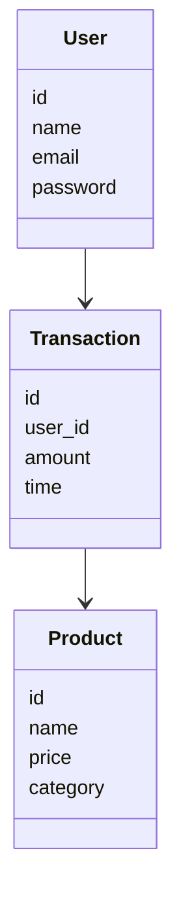
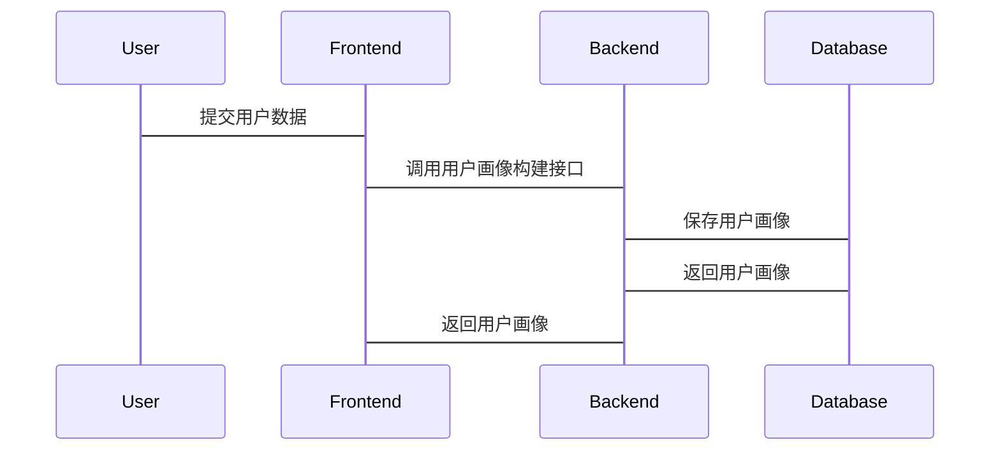

                 


# 《金融科技用户体验优化与个性化定制平台》

> **关键词**：金融科技，用户体验优化，个性化定制，推荐系统，用户画像，系统架构

> **摘要**：本文探讨了金融科技领域中用户体验优化与个性化定制平台的重要性，分析了其核心概念、技术原理、系统架构及实现方案，并通过项目实战展示了如何构建一个高效的个性化定制平台。文章还总结了项目的成果与未来展望，为金融机构和技术开发者提供了有价值的参考。

---

# 第一部分：金融科技用户体验优化与个性化定制平台背景与现状

## 第1章：金融科技的发展与挑战

### 1.1 金融科技的定义与发展趋势

#### 1.1.1 金融科技的定义
金融科技（FinTech）是指通过技术手段创新传统金融业务模式、改善金融服务效率、提升用户体验的新兴领域。它涵盖支付、借贷、投资、保险等多个金融子领域。

#### 1.1.2 金融科技的发展趋势
近年来，随着人工智能、大数据、区块链等技术的快速发展，金融科技正经历一场深刻的变革。金融机构逐渐从传统的“以产品为中心”的模式向“以用户为中心”的模式转变，用户体验成为决定金融机构竞争力的关键因素。

#### 1.1.3 金融科技对用户体验的影响
金融科技的核心目标是提升用户体验。通过技术手段，金融机构可以更精准地理解用户需求，提供个性化的服务，从而增强用户粘性和满意度。

---

### 1.2 用户体验在金融科技中的重要性

#### 1.2.1 用户体验的核心概念
用户体验（User Experience, UX）是指用户在与产品或服务交互过程中所感受到的主观体验。它不仅包括功能的可用性，还包括情感上的愉悦感。

#### 1.2.2 金融科技中用户体验的挑战
在金融科技领域，用户体验的挑战主要体现在以下方面：
1. 金融产品的复杂性：金融产品通常涉及复杂的术语和流程，用户难以理解和操作。
2. 数据隐私与安全：用户对个人数据的隐私和安全高度关注，如何在满足合规要求的前提下提供良好的用户体验成为一大挑战。
3. 个性化需求：用户对金融服务的需求日益多样化，如何满足不同用户群体的个性化需求成为关键。

#### 1.2.3 用户体验优化对金融机构的价值
1. 提高用户满意度：通过优化用户体验，金融机构可以提高用户对服务的满意度，增强用户忠诚度。
2. 提升品牌竞争力：良好的用户体验有助于提升金融机构的品牌形象，吸引更多用户。
3. 实现业务增长：通过提供个性化的服务，金融机构可以更好地满足用户需求，从而实现业务增长。

---

### 1.3 个性化定制平台的必要性

#### 1.3.1 个性化服务的需求
随着用户需求的多样化，用户对金融服务的需求也日益个性化。例如，不同用户对理财产品的需求、贷款产品的偏好等存在显著差异。

#### 1.3.2 个性化定制平台的功能特点
个性化定制平台通过分析用户的行为数据、交易数据等，构建用户画像，并基于用户画像提供个性化的推荐、定制化的产品和服务。

#### 1.3.3 个性化定制平台的市场潜力
个性化定制平台能够帮助金融机构更精准地定位用户需求，提供差异化服务，从而在激烈的市场竞争中占据优势。同时，个性化服务也能提高用户的使用频率和粘性，为金融机构带来长期价值。

---

## 第2章：金融科技用户体验优化的核心问题

### 2.1 用户体验优化的关键要素

#### 2.1.1 用户需求分析
用户需求分析是用户体验优化的基础。通过分析用户的行为数据、反馈意见等，可以深入了解用户的实际需求和痛点。

#### 2.1.2 用户行为分析
用户行为分析是通过收集和分析用户在使用产品或服务时的行为数据，了解用户的使用习惯和偏好。例如，通过分析用户在网站或APP上的点击路径，可以发现用户在使用过程中的障碍点。

#### 2.1.3 用户界面设计
用户界面设计是用户体验优化的重要组成部分。一个直观、易用的界面能够显著提升用户体验。设计界面时需要考虑用户的直觉和习惯，减少用户的认知负担。

---

### 2.2 个性化定制平台的核心功能

#### 2.2.1 用户画像构建
用户画像是基于用户的行为数据、交易数据等构建的用户信息模型。通过用户画像，可以了解用户的年龄、性别、收入水平、消费习惯等特征，从而为个性化服务提供依据。

#### 2.2.2 个性化推荐系统
个性化推荐系统是基于用户画像和历史行为数据，利用算法为用户推荐符合其需求的产品或服务。例如，银行可以根据用户的消费习惯推荐理财产品，或者根据用户的信用评分推荐贷款产品。

#### 2.2.3 个性化交互设计
个性化交互设计是通过动态调整界面元素、功能模块等方式，为用户提供个性化的交互体验。例如，根据用户的使用习惯，动态调整界面布局或功能推荐。

---

### 2.3 平台边界与外延

#### 2.3.1 平台的功能边界
个性化定制平台的功能边界包括用户数据采集、用户画像构建、个性化推荐、个性化交互设计等。

#### 2.3.2 平台的外延应用
个性化定制平台的外延应用包括智能客服、智能风控、智能营销等。这些功能可以与个性化定制平台无缝对接，进一步提升用户体验。

#### 2.3.3 平台与相关系统的接口关系
个性化定制平台需要与金融机构的其他系统（如CRM系统、风控系统等）进行接口对接，确保数据的流通和功能的协同。

---

## 第3章：核心概念与技术联系

### 3.1 核心概念原理

#### 3.1.1 用户画像的构建方法
用户画像是基于用户的行为数据、交易数据等构建的用户信息模型。常见的构建方法包括基于统计的方法（如聚类分析）和基于机器学习的方法（如协同过滤）。

#### 3.1.2 个性化推荐系统的算法原理
个性化推荐系统的核心是利用算法对用户数据进行分析，从而推荐符合用户需求的产品或服务。常用的算法包括协同过滤、基于内容的推荐、基于知识图谱的推荐等。

#### 3.1.3 个性化交互设计的实现方式
个性化交互设计的实现方式包括动态调整界面元素、基于用户行为的交互优化等。

---

### 3.2 核心概念属性对比表格

| 核心概念 | 属性 | 描述 |
|---------|------|------|
| 用户画像 | 数据来源 | 用户行为数据、交易数据等 |
|         | 数据处理 | 数据清洗、特征提取 |
|         | 数据建模 | 使用机器学习模型进行画像构建 |

---

### 3.3 ER实体关系图


---

## 第4章：算法原理与数学模型

### 4.1 协同过滤算法

#### 4.1.1 协同过滤算法的定义
协同过滤是一种基于用户行为数据的推荐算法，其核心思想是“用户的行为相似，偏好也相似”。

#### 4.1.2 协同过滤算法的数学模型
协同过滤算法的核心是计算用户之间的相似度，常用的方法是余弦相似度：

$$ sim(u, v) = \frac{\sum_{i=1}^n u_i v_i}{\sqrt{\sum_{i=1}^n u_i^2} \cdot \sqrt{\sum_{i=1}^n v_i^2}} $$

其中，$u$ 和 $v$ 是两个用户的特征向量。

#### 4.1.3 协同过滤算法的实现步骤
1. 数据预处理：清洗数据，提取特征。
2. 计算相似度：基于特征向量计算用户之间的相似度。
3. 推荐生成：根据相似用户的偏好，生成推荐列表。

---

### 4.2 聚类分析算法

#### 4.2.1 聚类分析算法的定义
聚类分析是一种基于数据相似性的无监督学习算法，其核心思想是将相似的数据点归为一类。

#### 4.2.2 聚类分析算法的数学模型
K-means算法是一种常用的聚类算法，其目标是最小化簇内平方误差之和：

$$ \min \sum_{i=1}^k \sum_{j=1}^n (x_{ij} - c_i)^2 $$

其中，$k$ 是簇的数量，$c_i$ 是第 $i$ 个簇的中心。

---

## 第5章：系统分析与架构设计

### 5.1 系统功能设计

#### 5.1.1 领域模型


---

#### 5.1.2 系统架构


---

### 5.2 系统接口设计

#### 5.2.1 接口调用流程
1. 用户登录：通过API调用后端接口进行身份验证。
2. 数据采集：通过API接口采集用户行为数据。
3. 数据处理：后端接口接收数据，进行清洗和特征提取。
4. 数据建模：后端接口调用机器学习模型进行数据建模。

---

### 5.3 交互流程设计

#### 5.3.1 用户画像构建


---

## 第6章：项目实战

### 6.1 项目介绍

#### 6.1.1 项目背景
本项目旨在构建一个基于用户画像的个性化推荐系统，帮助金融机构提升用户体验。

---

### 6.2 核心代码实现

#### 6.2.1 数据预处理
```python
import pandas as pd

# 读取数据
data = pd.read_csv('user_behavior.csv')

# 数据清洗
data.dropna(inplace=True)
data['timestamp'] = pd.to_datetime(data['timestamp'])
```

---

#### 6.2.2 用户画像构建
```python
from sklearn.cluster import KMeans

# 数据特征提取
X = data[['age', 'income', 'transaction_amount']]

# 模型训练
model = KMeans(n_clusters=5, random_state=42)
model.fit(X)

# 获取聚类结果
clusters = model.labels_
```

---

#### 6.2.3 个性化推荐系统实现
```python
from sklearn.metrics.pairwise import cosine_similarity

# 计算用户相似度
user_features = data[['feature1', 'feature2', 'feature3']]
similarity_matrix = cosine_similarity(user_features)

# 推荐生成
def get_recommendations(user_id, similarity_matrix):
    # 获取相似用户的索引
    similar_users = np.argsort(similarity_matrix[user_id])[::-1]
    # 返回推荐结果
    return data.iloc[similar_users]
```

---

## 第7章：总结与展望

### 7.1 项目成果总结
通过本项目，我们成功构建了一个基于用户画像的个性化推荐系统，显著提升了用户体验。

---

### 7.2 技术局限性与未来展望
尽管本项目取得了一定的成果，但仍然存在一些技术局限性，例如推荐系统的实时性、数据隐私保护等问题。未来，我们可以进一步优化算法，引入更多先进的技术手段，如图神经网络、强化学习等，以提升推荐系统的性能和用户体验。

---

### 7.3 最佳实践与注意事项
1. 数据隐私保护：在处理用户数据时，必须严格遵守数据隐私保护法律法规。
2. 用户反馈机制：建立完善的用户反馈机制，及时收集用户意见，不断优化用户体验。
3. 系统维护与更新：定期维护和更新系统，确保系统的稳定性和安全性。

---

### 7.4 拓展阅读
1. 《推荐系统实践》
2. 《用户画像：数据化用户洞察》
3. 《金融科技的未来趋势》

---

通过以上分析，我们可以看到，金融科技用户体验优化与个性化定制平台的构建涉及多个方面，需要综合运用数据分析、机器学习、系统架构等技术手段。希望本文能够为相关领域的从业者提供有价值的参考和启示。

---

**全文完**

