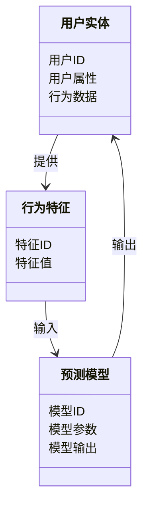
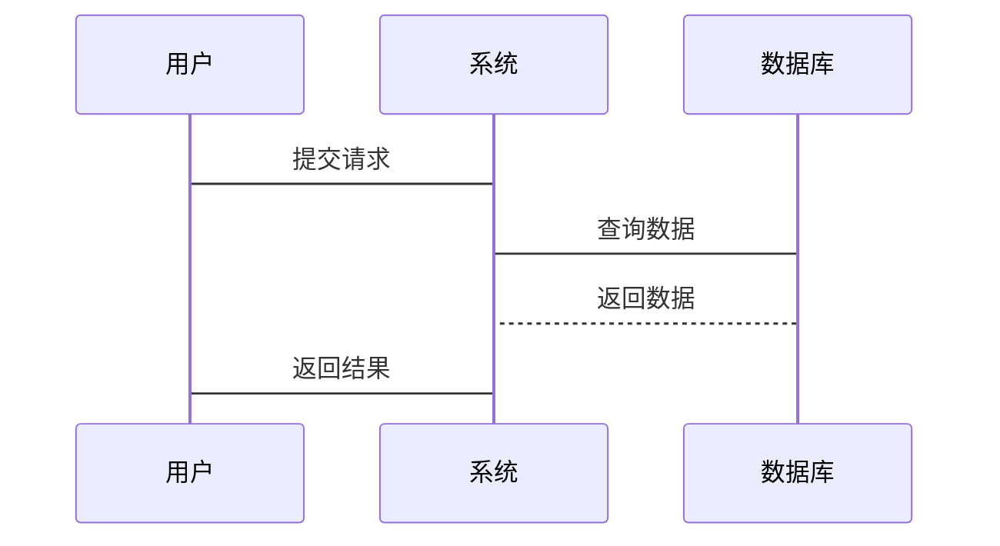

                 


# 金融科技用户行为分析与预测

---

## 关键词

金融科技、用户行为分析、预测模型、算法、系统架构

---

## 摘要

金融科技领域的用户行为分析与预测是当前技术与业务结合的重要方向。本文从金融科技的发展背景出发，详细阐述了用户行为分析的核心概念、算法原理、系统架构设计以及项目实战。通过对比分析和实际案例，展示了如何利用机器学习和深度学习算法，结合系统化的架构设计，实现用户行为的精准预测与应用。本文旨在为金融科技领域的技术人员和产品经理提供理论指导和实践参考。

---

## 第一部分：金融科技用户行为分析与预测概述

### 第1章：金融科技与用户行为分析概述

#### 1.1 金融科技的发展背景

##### 1.1.1 金融科技的定义与特点

金融科技（FinTech）是指利用现代信息技术手段，如大数据、人工智能、区块链等，对传统金融行业进行创新和变革的新兴领域。其特点是高效性、智能化、数字化和全球化。

##### 1.1.2 金融科技的核心技术与应用领域

金融科技的核心技术包括大数据分析、人工智能、区块链、云计算和物联网等。其主要应用于支付清算、借贷融资、投资管理、风险管理等领域。

##### 1.1.3 用户行为分析在金融科技中的重要性

用户行为分析是金融科技中的关键环节，通过对用户行为数据的挖掘和分析，可以帮助金融机构更好地理解用户需求、优化产品设计、提升服务质量，并在风险控制、精准营销等方面发挥重要作用。

#### 1.2 用户行为分析的背景与意义

##### 1.2.1 用户行为分析的基本概念

用户行为分析是指通过对用户在系统中的操作、点击、交易等行为数据进行分析，挖掘用户的兴趣、需求和行为模式的过程。

##### 1.2.2 金融科技用户行为分析的目标与价值

目标是通过分析用户行为数据，预测用户未来的行为趋势，从而为金融机构提供决策支持。其价值体现在提升用户体验、优化运营策略、降低风险等方面。

##### 1.2.3 用户行为分析在金融科技中的独特性

金融科技用户行为分析具有数据多样性、实时性、精准性等特点，能够为金融行业的智能化发展提供有力支持。

#### 1.3 本书的核心内容与目标

##### 1.3.1 本书的研究范围

本书主要研究金融科技领域的用户行为分析与预测，涵盖数据采集、特征工程、算法选择、模型优化和系统实现等方面。

##### 1.3.2 本书的主要目标

通过理论与实践相结合的方式，系统性地讲解金融科技用户行为分析的核心概念、算法原理和系统架构设计，并通过实际案例展示如何将理论应用于实践。

##### 1.3.3 本书的结构安排

全书分为六个部分，从概述到项目实战，层层递进，全面覆盖金融科技用户行为分析与预测的各个方面。

---

## 第二部分：金融科技用户行为分析的核心概念与联系

### 第2章：金融科技用户行为分析的核心概念

#### 2.1 用户行为分析的基本原理

##### 2.1.1 用户行为分析的理论基础

用户行为分析基于数据挖掘、统计学和机器学习的理论，通过分析用户的行为数据，提取有用的信息和模式。

##### 2.1.2 数据驱动的用户行为分析方法

数据驱动的方法包括描述性分析、诊断性分析、预测性分析和规范性分析，旨在通过数据发现用户行为的规律。

##### 2.1.3 金融科技中的用户行为分析框架

金融科技用户行为分析框架包括数据采集、数据预处理、特征提取、模型训练、结果分析和应用优化六个步骤。

#### 2.2 金融科技用户行为分析的关键要素

##### 2.2.1 用户特征与行为数据

用户特征包括用户的基本信息、资产状况、投资偏好等，行为数据包括用户的登录次数、交易频率、点击路径等。

##### 2.2.2 金融场景与行为模式

金融场景包括投资、借贷、保险等不同业务场景，行为模式则是用户在这些场景中的行为特征和规律。

##### 2.2.3 用户行为分析的指标体系

常见的指标包括用户留存率、用户活跃度、用户转化率、用户流失率等，这些指标可以帮助金融机构更好地理解用户行为。

#### 2.3 用户行为分析与金融科技的结合

##### 2.3.1 金融科技中的用户行为分析场景

典型场景包括精准营销、风险控制、客户分层、产品推荐等。

##### 2.3.2 数据源与特征提取

数据源包括用户基本信息、交易记录、网页点击流数据等，特征提取则是从这些数据中提取有意义的特征变量。

##### 2.3.3 用户行为分析的业务价值

通过用户行为分析，金融机构可以实现精准营销、提升用户体验、降低风险、优化产品设计等目标。

---

## 第三部分：金融科技用户行为分析的算法原理

### 第3章：常见的用户行为分析算法

#### 3.1 监督学习算法

##### 3.1.1 决策树模型（如随机森林）

随机森林是一种基于决策树的集成学习算法，具有高精度和良好的抗过拟合能力。

##### 3.1.2 线性回归模型

线性回归适用于预测连续型变量，但在用户行为分类中应用较少。

##### 3.1.3 支持向量机（SVM）

SVM适用于小样本数据，但在高维数据中表现一般。

#### 3.2 非监督学习算法

##### 3.2.1 聚类分析（K-means）

K-means是一种常见的聚类算法，适用于用户分群和行为模式识别。

##### 3.2.2 层次聚类

层次聚类通过构建树状结构对数据进行分层聚类，适用于用户行为的深度分析。

##### 3.2.3 社区发现算法

社区发现算法用于识别用户行为中的社区结构，帮助发现潜在的用户群体。

#### 3.3 神经网络与深度学习算法

##### 3.3.1 卷积神经网络（CNN）

CNN适用于图像识别和序列数据处理，在用户行为分析中的应用较少。

##### 3.3.2 循环神经网络（RNN）

RNN适用于时间序列数据，适合分析用户的时序行为数据。

##### 3.3.3 �长短时记忆网络（LSTM）

LSTM能够处理长序列数据，适合分析用户的长期行为模式。

---

## 第四部分：金融科技用户行为分析的系统架构与实现

### 第4章：系统架构设计与实现

#### 4.1 问题场景介绍

本系统旨在通过用户行为数据，预测用户的金融行为，如投资行为、借贷行为等。

#### 4.2 系统功能设计

##### 4.2.1 领域模型类图



#### 4.3 系统架构设计


#### 4.4 系统接口设计与交互



---

## 第五部分：项目实战

### 第5章：项目实战

#### 5.1 环境安装与配置

```bash
# 安装所需的Python库
pip install pandas numpy scikit-learn matplotlib
```

#### 5.2 核心实现代码

##### 5.2.1 数据预处理

```python
import pandas as pd

# 加载数据
data = pd.read_csv('user_behavior.csv')

# 查看数据信息
print(data.info())
```

##### 5.2.2 特征工程

```python
from sklearn.preprocessing import StandardScaler

# 标准化处理
scaler = StandardScaler()
data_features = scaler.fit_transform(data[['feature1', 'feature2', 'feature3']])
```

##### 5.2.3 模型训练

```python
from sklearn.ensemble import RandomForestClassifier

# 训练随机森林模型
model = RandomForestClassifier(n_estimators=100)
model.fit(data_features, data['label'])
```

##### 5.2.4 模型评估

```python
from sklearn.metrics import accuracy_score

# 预测结果
y_pred = model.predict(data_features)
print('模型准确率:', accuracy_score(data['label'], y_pred))
```

##### 5.2.5 模型部署

```python
# 保存模型
import joblib

joblib.dump(model, 'user_behavior_model.pkl')
```

#### 5.3 案例分析与详细讲解

通过实际案例分析，展示了如何利用随机森林模型对用户行为进行分类，预测用户的金融行为，并根据模型结果优化业务策略。

---

## 第六部分：总结与展望

### 第6章：总结与最佳实践

#### 6.1 项目小结

本文系统性地介绍了金融科技用户行为分析的核心概念、算法原理和系统架构设计，并通过实际案例展示了如何将理论应用于实践。

#### 6.2 注意事项

在实际应用中，需要注意数据隐私保护、模型解释性和实时性等问题。

#### 6.3 拓展阅读与学习资源

推荐读者进一步学习深度学习算法在用户行为分析中的应用，以及实时流数据处理技术。

---

以上是《金融科技用户行为分析与预测》的技术博客文章的完整内容，涵盖了从理论到实践的各个方面，旨在为读者提供全面的指导和参考。

