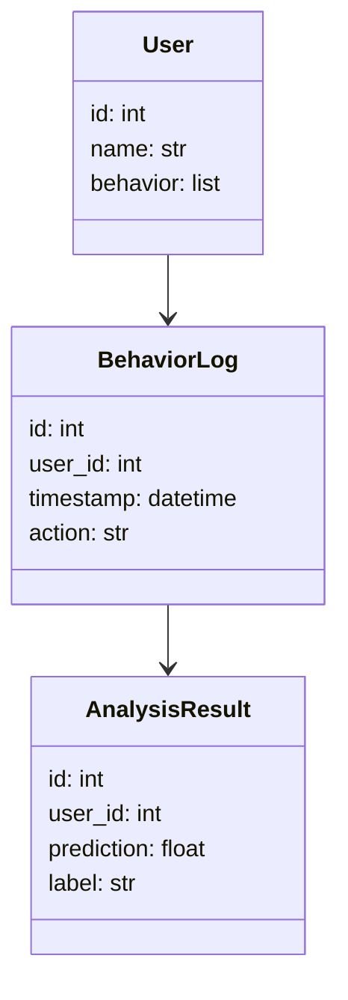

                 


# 《金融科技用户行为分析平台》

---

## 关键词：
- 金融科技
- 用户行为分析
- 数据分析
- 机器学习
- 系统架构
- 项目实战

---

## 摘要：
《金融科技用户行为分析平台》是一部深入探讨金融科技领域用户行为分析的实践性技术书籍。本书从金融科技的发展背景出发，系统性地介绍了用户行为分析的核心概念、技术基础、算法原理、系统架构以及项目实战。通过丰富的案例分析和详细的代码实现，帮助读者全面理解如何构建和优化金融科技用户行为分析平台。书中不仅涵盖了理论知识，还通过Mermaid图表和数学公式详细讲解了系统的实现过程，旨在为读者提供一份从理论到实践的完整指南。

---

# 第1章: 金融科技用户行为分析平台的背景与目标

## 1.1 金融科技的发展与现状
### 1.1.1 金融科技的定义与发展趋势
- 金融科技（Fintech）的定义
- 金融科技的发展趋势
- 金融科技对传统金融行业的变革

### 1.1.2 用户行为分析在金融科技中的重要性
- 用户行为分析的核心作用
- 金融科技中用户行为分析的应用场景
- 用户行为分析对金融决策的支持

### 1.1.3 金融科技用户行为分析平台的必要性
- 平台的目标与价值
- 平台在金融行业中的应用场景
- 平台的核心功能与优势

## 1.2 用户行为分析的核心概念
### 1.2.1 用户行为分析的定义与分类
- 用户行为分析的定义
- 用户行为的分类（点击、浏览、购买等）
- 用户行为分析的维度（时间、空间、用户属性等）

### 1.2.2 金融科技中的用户行为分析特点
- 金融行业的特殊性
- 用户行为数据的敏感性
- 分析结果的精准性要求

### 1.2.3 平台的目标与价值
- 平台的核心目标
- 平台对金融机构的价值
- 平台对用户体验的提升作用

## 1.3 本章小结
- 金融科技的发展背景
- 用户行为分析的重要性和必要性
- 平台的核心目标与价值

---

# 第2章: 金融科技用户行为分析的核心概念与联系

## 2.1 核心概念原理
### 2.1.1 用户行为数据的构成
- 用户行为数据的来源
- 数据的类型（结构化与非结构化数据）
- 数据的特征（时间戳、用户ID、行为类型等）

### 2.1.2 金融科技中的用户行为特征
- 用户行为特征的定义
- 金融科技中的用户行为特征分析
- 特征之间的关联性分析

### 2.1.3 平台分析模型的构建
- 分析模型的构建步骤
- 数据预处理与特征工程
- 模型训练与优化

## 2.2 核心概念属性特征对比表格
### 2.2.1 用户行为特征对比
| 特征维度 | 行为类型 | 示例 |
|----------|----------|------|
| 时间维度 | 登录时间 | 用户在什么时间登录最多？ |
| 空间维度 | 地区分布 | 用户来自哪些地区？ |
| 用户属性 | 年龄分布 | 用户的年龄分布是怎样的？ |

### 2.2.2 平台功能模块对比
| 功能模块 | 描述 | 示例 |
|----------|------|------|
| 数据采集 | 数据来源 | API接口、日志文件 |
| 数据处理 | 数据清洗 | 去重、填充缺失值 |
| 数据分析 | 行为挖掘 | 聚类分析、分类分析 |

## 2.3 ER实体关系图架构
```mermaid
erDiagram
    user} { behavior_log
    user} { transaction_record
    behavior_log} { analysis_result
```

## 2.4 本章小结
- 核心概念的定义与分类
- 用户行为特征的对比分析
- 平台分析模型的构建与优化

---

# 第3章: 金融科技用户行为分析的技术基础

## 3.1 数据采集与预处理
### 3.1.1 数据采集的来源与方法
- 数据采集的来源（API接口、数据库、日志文件等）
- 数据采集的方法（爬虫、数据库查询等）
- 数据采集的工具（Scrapy、Python的requests库等）

### 3.1.2 数据清洗与预处理的步骤
- 数据清洗的步骤（去重、去噪、填充缺失值）
- 数据预处理的方法（标准化、归一化）
- 数据预处理的工具（Pandas、Numpy等）

### 3.1.3 数据标准化与特征提取
- 数据标准化的方法（z-score标准化、min-max标准化）
- 特征提取的技巧（主成分分析、LDA主题模型）
- 特征提取的工具（scikit-learn、UMAP）

## 3.2 数据分析与挖掘方法
### 3.2.1 描述性分析
- 描述性分析的定义
- 描述性分析的工具（Pandas、Matplotlib）
- 描述性分析的案例（用户行为的分布分析）

### 3.2.2 预测性分析
- 预测性分析的定义
- 预测性分析的工具（XGBoost、LightGBM）
- 预测性分析的案例（用户流失预测）

### 3.2.3 聚类分析与分类分析
- 聚类分析的定义与应用
- 分类分析的定义与应用
- 聚类与分类分析的案例（用户分群、风险评估）

## 3.3 数据可视化技术
### 3.3.1 数据可视化工具的选择
- 可视化工具的对比（Matplotlib、Seaborn、Tableau）
- 可视化工具的优缺点
- 可视化工具的适用场景

### 3.3.2 数据图表的绘制与解读
- 常见数据图表的类型（柱状图、折线图、散点图）
- 数据图表的绘制步骤
- 数据图表的解读技巧

### 3.3.3 数据可视化在用户行为分析中的应用
- 用户行为分析的可视化案例
- 数据可视化对用户行为分析的支持
- 数据可视化对决策优化的作用

## 3.4 本章小结
- 数据采集与预处理的方法
- 数据分析与挖掘的技术
- 数据可视化的作用与应用

---

# 第4章: 金融科技用户行为分析的算法原理

## 4.1 机器学习算法原理
### 4.1.1 监督学习算法
- 监督学习的定义与分类
- 线性回归的数学模型
$$ y = \beta_0 + \beta_1x + \epsilon $$
- 逻辑回归的数学模型
$$ P(y=1|x) = \frac{e^{\beta_0 + \beta_1x}}{1 + e^{\beta_0 + \beta_1x}} $$

### 4.1.2 无监督学习算法
- 聚类分析的定义与方法
- K-means算法的数学模型
$$ \text{目标函数} = \sum_{i=1}^{k} \sum_{j=1}^{n_i} (x_{ij} - c_i)^2 $$
- DBSCAN算法的定义与应用

### 4.1.3 深度学习算法
- 深度学习的定义与特点
- LSTM的数学模型
$$ \text{门控机制} = \sigma(W_g x + U_g h_{\text{prev}}) $$

## 4.2 算法实现与优化
### 4.2.1 算法实现步骤
- 数据预处理与特征工程
- 模型训练与调参
- 模型评估与优化

### 4.2.2 算法优化技巧
- 超参数优化（网格搜索、随机搜索）
- 模型集成（投票法、堆叠法）
- 模型优化工具（GridSearchCV、XGBoost）

## 4.3 本章小结
- 机器学习算法的原理与应用
- 算法实现的关键步骤
- 算法优化的技巧与策略

---

# 第5章: 金融科技用户行为分析平台的系统架构设计

## 5.1 问题场景介绍
### 5.1.1 平台的功能需求
- 数据采集与存储
- 数据分析与挖掘
- 数据可视化与报告

### 5.1.2 平台的性能需求
- 数据处理的实时性
- 系统的可扩展性
- 系统的安全性

## 5.2 系统功能设计
### 5.2.1 领域模型（Mermaid类图）


### 5.2.2 系统架构设计（Mermaid架构图）
```mermaid
container 整体架构 {
    包含：数据采集层、数据处理层、数据分析层、数据可视化层
}
```

### 5.2.3 系统接口设计
- 数据接口的定义与实现
- API接口的设计与调用
- 系统模块的交互流程

## 5.3 本章小结
- 系统架构设计的步骤
- 系统功能模块的设计
- 系统接口的实现与交互

---

# 第6章: 金融科技用户行为分析平台的项目实战

## 6.1 项目环境搭建
### 6.1.1 开发环境的安装与配置
- Python的安装与配置
- 开发工具的安装与配置
- 数据库的安装与配置

### 6.1.2 项目依赖管理
- 依赖管理工具的使用（pipenv、venv）
- 项目依赖的安装与配置
- 依赖管理的注意事项

## 6.2 系统核心实现
### 6.2.1 数据采集与预处理的实现
- 数据采集的代码实现
- 数据清洗的代码实现
- 数据标准化的代码实现

### 6.2.2 数据分析与挖掘的实现
- 数据分析的代码实现
- 数据挖掘的代码实现
- 模型训练的代码实现

### 6.2.3 数据可视化与报告的生成
- 数据可视化的代码实现
- 报告生成的代码实现
- 可视化结果的解读与分析

## 6.3 项目小结
- 项目实现的关键步骤
- 项目实现的注意事项
- 项目实现的经验总结

## 6.4 本章小结
- 项目实战的环境搭建
- 系统核心实现的步骤
- 项目实现的总结与反思

---

# 第7章: 总结与展望

## 7.1 总结
- 本书的主要内容
- 金融科技用户行为分析平台的核心价值
- 读者收获与启发

## 7.2 未来展望
- 金融科技的发展趋势
- 用户行为分析的未来方向
- 人工智能与大数据的结合

## 7.3 最佳实践 tips
- 项目实施的注意事项
- 系统优化的建议
- 未来研究的方向

---

# 附录

## 附录 A: 常用工具与库
- Python的常用库（Pandas、Numpy、Scikit-learn）
- 数据可视化工具（Matplotlib、Seaborn）
- 机器学习框架（XGBoost、LightGBM）

## 附录 B: 项目代码示例
```python
# 数据采集示例
import requests
import pandas as pd

url = "https://api.example.com/behavior_logs"
response = requests.get(url)
data = response.json()
df = pd.DataFrame(data)
```

---

# 结束语

通过以上目录大纲，您可以逐步深入理解《金融科技用户行为分析平台》的核心内容和技术实现。每一章的内容都紧扣主题，结合理论与实践，帮助您全面掌握金融科技用户行为分析的技能。

