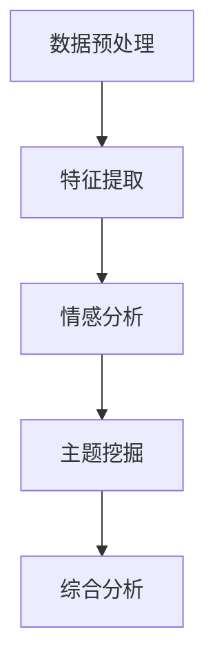

                 


# 金融舆情分析在投资决策中的应用

## 关键词：金融舆情分析、投资决策、自然语言处理、情感分析、主题挖掘、风险管理

## 摘要：  
金融舆情分析通过分析金融市场中的非结构化数据（如社交媒体、新闻文章等），提取市场情绪和潜在信息，辅助投资决策。本文从金融舆情分析的背景、核心概念、算法原理、系统架构到项目实战，全面探讨其在投资决策中的应用，并结合具体案例，详细解读其在风险管理、市场预测等方面的重要作用。

---

## 第1章: 金融舆情分析的定义与重要性

### 1.1 什么是金融舆情分析
金融舆情分析是通过对金融市场中的文本数据（如新闻、社交媒体帖子、论坛讨论等）进行分析，提取其中的情感倾向、主题信息和潜在关联，从而帮助投资者做出更明智的决策。

#### 1.1.1 金融舆情的定义  
金融舆情是指金融市场参与者（投资者、机构、媒体等）在公开渠道上表达的关于金融市场、公司、经济政策等的言论、观点和情绪的集合。

#### 1.1.2 舆情分析在金融领域的独特性  
金融舆情分析具有实时性、复杂性和高价值性。金融市场中的舆情往往与股价波动、经济趋势密切相关，因此其分析结果具有较高的实用价值。

#### 1.1.3 舆情分析的核心要素  
- **文本数据**：包括新闻、社交媒体帖子、评论等。  
- **情感倾向**：分析文本中的情绪（正面、负面、中性）。  
- **主题信息**：提取文本中的主要讨论主题。  
- **关联性分析**：分析舆情与市场走势的关联性。

### 1.2 金融舆情分析的重要性
舆情分析在投资决策中扮演着越来越重要的角色。

#### 1.2.1 舆情分析在投资决策中的作用  
- **捕捉市场情绪**：通过分析社交媒体和新闻，投资者可以快速捕捉市场情绪的变化，提前预判市场走势。  
- **发现潜在机会**：舆情分析可以帮助投资者发现市场中被忽视的投资机会。  
- **风险预警**：通过分析负面舆情，投资者可以提前规避潜在风险。

#### 1.2.2 舆情分析对风险管理的意义  
- 舆情分析可以帮助投资者识别市场中的风险点，如公司负面新闻、政策变动等。  
- 通过实时监控舆情，投资者可以及时调整投资策略，降低潜在损失。

#### 1.2.3 舆情分析对市场预测的价值  
- 舆情分析可以为市场预测提供额外的信息维度。  
- 结合历史数据，可以通过机器学习模型预测未来市场走势。

### 1.3 金融舆情分析的边界与外延
#### 1.3.1 舆情分析的适用范围  
- 股票市场、外汇市场、加密货币市场等。  
- 适用于短期市场预测和风险管理。

#### 1.3.2 舆情分析的局限性  
- 舆情分析无法完全替代传统金融分析方法。  
- 文本数据的质量和数量直接影响分析结果的准确性。  
- 市场参与者的情绪可能受到外部因素的干扰，导致分析结果的不可靠性。

#### 1.3.3 舆情分析与其他金融分析方法的区别  
- 舆情分析侧重于非结构化数据的分析，而传统金融分析方法侧重于结构化数据（如财务报表）。  
- 舆情分析更注重实时性，而传统分析方法更注重历史数据。

### 1.4 本章小结
本章介绍了金融舆情分析的基本概念、重要性及其在投资决策中的作用。通过分析市场情绪、主题信息和潜在风险，投资者可以利用舆情分析来优化投资策略，提高决策的科学性和时效性。

---

## 第2章: 金融舆情分析的核心概念与联系

### 2.1 数据来源与特征
#### 2.1.1 文本数据的来源  
- 社交媒体（Twitter、Facebook、Reddit等）。  
- 新闻网站（如 Bloomberg、Reuters）。  
- 论坛和博客。

#### 2.1.2 数据特征的提取方法  
- **关键词提取**：通过TF-IDF算法提取文本中的关键词。  
- **情感分析**：通过自然语言处理技术分析文本的情感倾向。  
- **主题挖掘**：通过主题模型（如 LDA）提取文本的主题信息。

#### 2.1.3 数据预处理的关键步骤  
- **去停用词**：移除无意义的词汇（如“的”、“是”等）。  
- **分词**：将文本分割成词语或短语。  
- **向量化**：将文本转换为向量形式（如词袋模型、词嵌入模型）。

### 2.2 情感分析与主题挖掘
#### 2.2.1 情感分析的基本原理  
- 情感分析是通过自然语言处理技术，判断文本中的情感倾向（正面、负面、中性）。  
- 常用算法包括基于规则的算法（如情感词典）和基于机器学习的算法（如 SVM、随机森林）。  

#### 2.2.2 主题挖掘的核心算法  
- 主题挖掘是通过分析文本，提取出文本的主要讨论主题。  
- 常用算法包括聚类算法（如 K-means）和主题模型（如 LDA）。  

#### 2.2.3 情感与主题的关联性分析  
- 情感和主题是相互关联的。例如，某公司被负面新闻报道，可能导致市场情绪转向负面。

### 2.3 舆情分析的数学模型
#### 2.3.1 情感分析的数学模型  
- 基于概率论的情感分析模型（如 Naive Bayes）。  
- 情感分析的数学公式：  
$$ P(\text{positive} | \text{words}) = \frac{P(\text{words} | \text{positive}) \cdot P(\text{positive})}{P(\text{words})} $$  

#### 2.3.2 主题挖掘的数学模型  
- 主题模型（如 LDA）的数学公式：  
$$ \theta_{d} \sim \text{Dirichlet}(\alpha) $$  
$$ \phi_{z} \sim \text{Dirichlet}(\beta) $$  
$$ \text{对于每个词 } w \text{，} z \sim \text{Multinomial}(\phi_{z}) \text{，} d \sim \text{Multinomial}(\theta_{d}) $$  

#### 2.3.3 综合分析模型的构建  
- 综合分析模型结合了情感分析和主题挖掘的结果，通过加权的方式得出最终的舆情分析结果。

### 2.4 核心概念的ER实体关系图
```mermaid
er
actor: User
actor: News Source
actor: Social Media
entity: Financial News
entity: Social Media Posts
entity: Sentiment Analysis Results
```

### 2.5 本章小结
本章详细介绍了金融舆情分析的核心概念，包括数据来源、情感分析、主题挖掘以及综合分析模型的构建。通过这些核心概念的分析，可以帮助投资者更好地理解市场情绪和主题信息。

---

## 第3章: 金融舆情分析的算法原理

### 3.1 基于自然语言处理的舆情分析算法
#### 3.1.1 情感分析算法  
- **基于规则的情感分析**：通过预定义的情感词典判断文本的情感倾向。  
- **基于机器学习的情感分析**：使用训练好的模型（如 SVM、随机森林）进行情感分类。  
- **基于深度学习的情感分析**：使用 LSTM 或 Transformer 模型进行情感分析。

#### 3.1.2 主题挖掘算法  
- **基于聚类的主题挖掘**：通过 K-means 或 DBSCAN 算法对文本进行聚类，提取主题。  
- **基于主题模型的主题挖掘**：使用 LDA 或 NMF 模型提取主题。  
- **基于规则的主题挖掘**：通过预定义的关键词提取主题。

#### 3.1.3 综合分析算法  
- 综合分析算法结合了情感分析和主题挖掘的结果，通过加权的方式得出最终的舆情分析结果。

### 3.2 情感分析算法流程图


### 3.3 数学模型的详细讲解
#### 3.3.1 情感分析的数学模型  
- 基于概率论的情感分析模型（如 Naive Bayes）。  
- 情感分析的数学公式：  
$$ P(\text{positive} | \text{words}) = \frac{P(\text{words} | \text{positive}) \cdot P(\text{positive})}{P(\text{words})} $$  

#### 3.3.2 主题挖掘的数学模型  
- 主题模型（如 LDA）的数学公式：  
$$ \theta_{d} \sim \text{Dirichlet}(\alpha) $$  
$$ \phi_{z} \sim \text{Dirichlet}(\beta) $$  
$$ \text{对于每个词 } w \text{，} z \sim \text{Multinomial}(\phi_{z}) \text{，} d \sim \text{Multinomial}(\theta_{d}) $$  

### 3.4 本章小结
本章详细介绍了金融舆情分析的算法原理，包括情感分析和主题挖掘的核心算法，以及综合分析模型的构建。通过这些算法的分析，可以帮助投资者更好地理解市场情绪和主题信息。

---

## 第4章: 金融舆情分析的系统架构与设计

### 4.1 问题场景介绍
- 金融舆情分析系统需要实时监控金融市场中的文本数据，分析市场情绪和主题信息，辅助投资者做出投资决策。

### 4.2 系统功能设计
- 数据采集模块：从社交媒体、新闻网站等渠道采集文本数据。  
- 数据预处理模块：对文本数据进行清洗和分词。  
- 情感分析模块：分析文本的情感倾向。  
- 主题挖掘模块：提取文本的主题信息。  
- 综合分析模块：结合情感分析和主题挖掘的结果，得出最终的舆情分析结果。

### 4.3 系统架构设计


### 4.4 接口设计
- 数据采集接口：接收外部数据源的文本数据。  
- 情感分析接口：接收待分析的文本数据，返回情感分析结果。  
- 主题挖掘接口：接收待分析的文本数据，返回主题挖掘结果。  
- 综合分析接口：接收情感分析和主题挖掘结果，返回综合分析结果。

### 4.5 本章小结
本章详细介绍了金融舆情分析系统的架构设计，包括功能模块、系统架构和接口设计。通过这些设计，可以帮助投资者更好地理解和应用金融舆情分析。

---

## 第5章: 项目实战

### 5.1 环境安装
- 安装必要的 Python 库（如 NLTK、spaCy、Gensim、LDA 等）。  
- 安装必要的机器学习库（如 Scikit-learn、XGBoost、TensorFlow 等）。

### 5.2 系统核心实现源代码
```python
import nltk
from sklearn.feature_extraction.text import TfidfVectorizer
from sklearn.naive_bayes import MultinomialNB
from sklearn.metrics import accuracy_score

# 数据预处理
def preprocess(text):
    # 分词
    words = nltk.word_tokenize(text)
    # 去停用词
    stopwords = set(nltk.corpus.stopwords.words('english'))
    filtered_words = [word for word in words if word not in stopwords]
    return ' '.join(filtered_words)

# 情感分析
vectorizer = TfidfVectorizer()
model = MultinomialNB()

# 训练模型
X_train = vectorizer.fit_transform(preprocessed_texts)
model.fit(X_train, labels)

# 预测
X_test = vectorizer.transform(new_texts)
y_pred = model.predict(X_test)
print(accuracy_score(y_test, y_pred))
```

### 5.3 代码应用解读与分析
- 数据预处理：包括分词和去停用词。  
- 情感分析：使用 TF-IDF 特征向量化和 Naive Bayes 分类器进行情感分类。  
- 主题挖掘：使用 LDA 模型提取主题信息。

### 5.4 实际案例分析
- 案例：某公司发布负面新闻，市场情绪转向负面。  
- 分析：通过舆情分析系统，投资者可以及时发现市场情绪的变化，调整投资策略。

### 5.5 本章小结
本章通过具体的项目实战，详细介绍了金融舆情分析系统的实现过程，包括环境安装、代码实现、案例分析等。通过这些实战，可以帮助投资者更好地理解和应用金融舆情分析。

---

## 第6章: 总结与展望

### 6.1 本章总结
金融舆情分析在投资决策中的应用具有重要的现实意义。通过分析市场情绪和主题信息，投资者可以更好地理解市场走势，优化投资策略。

### 6.2 未来展望
- 结合更多数据源（如语音数据、视频数据）进行舆情分析。  
- 使用更先进的 AI 技术（如大语言模型）提升舆情分析的准确性和实时性。  
- 拓展金融舆情分析的应用场景，如量化交易、风险管理等。

### 6.3 注意事项
- 舆情分析结果仅供参考，投资者需结合其他信息做出决策。  
- 数据质量和数量直接影响分析结果的准确性。  
- 需遵守相关法律法规，保护数据隐私和版权。

### 6.4 拓展阅读
- 推荐阅读《自然语言处理入门》、《机器学习实战》等书籍。  
- 关注最新的金融舆情分析研究和技术发展。

---

## 关键词：金融舆情分析、投资决策、自然语言处理、情感分析、主题挖掘、风险管理

## 摘要：  
金融舆情分析通过分析金融市场中的非结构化数据（如社交媒体、新闻文章等），提取市场情绪和潜在信息，辅助投资决策。本文从金融舆情分析的背景、核心概念、算法原理、系统架构到项目实战，全面探讨其在投资决策中的应用，并结合具体案例，详细解读其在风险管理、市场预测等方面的重要作用。

