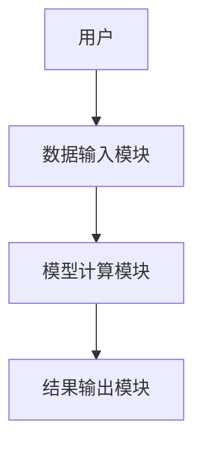
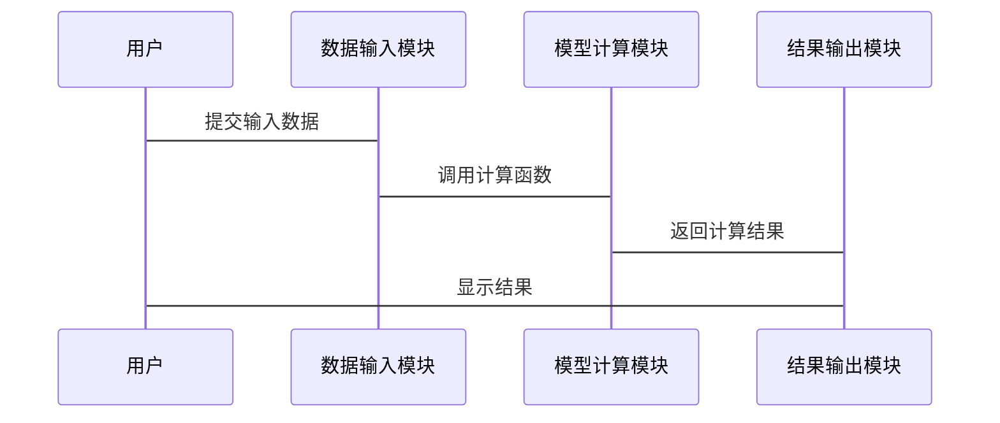

                 


```markdown
# 《金融衍生品交易对手风险量化模型》

## 关键词：金融衍生品，交易对手风险，量化模型，蒙特卡洛模拟，信用风险，VaR模型

## 摘要：
本文系统介绍了金融衍生品交易对手风险量化模型的核心概念、算法原理、系统架构及实际应用。通过详细分析交易对手风险的定义、量化模型的构建、蒙特卡洛模拟的应用、信用风险模型的实现以及VaR模型的使用，本文为读者提供了一个全面了解和应用金融衍生品交易对手风险量化模型的框架。结合实际案例和Python代码实现，本文旨在帮助读者掌握如何在实际金融市场中量化和管理交易对手风险。

---

## 第一章: 交易对手风险的背景与定义

### 1.1 金融衍生品市场的概述
#### 1.1.1 金融衍生品的基本定义
金融衍生品是一种基于基础资产（如股票、债券、商品等）或其价格指数的金融合约，其价值依赖于基础资产的价格变动。常见的金融衍生品包括期货、期权、互换和远期合约。

#### 1.1.2 金融衍生品的分类与特点
- **分类**：金融衍生品可以分为远期合约、期货合约、期权合约和互换合约。
- **特点**：杠杆效应高、风险高、收益潜力大、交易复杂。

#### 1.1.3 金融衍生品市场的基本结构
金融衍生品市场由买方、卖方、交易所、清算所和监管机构组成，交易通过场内和场外两种方式进行。

### 1.2 交易对手风险的定义与特征
#### 1.2.1 交易对手风险的定义
交易对手风险是指交易对手方在履行合约义务时出现违约的可能性，导致交易损失的风险。

#### 1.2.2 交易对手风险的主要特征
- **信用风险**：交易对手无法履行合约义务。
- **市场风险**：市场价格波动导致交易对手无法履行合约。
- **操作风险**：交易过程中的操作失误导致的风险。

#### 1.2.3 交易对手风险与信用风险的区别
- 信用风险是交易对手因自身财务状况恶化而违约的风险。
- 交易对手风险不仅包括信用风险，还包括因市场价格波动导致的履约风险。

### 1.3 交易对手风险的重要性
#### 1.3.1 交易对手风险对金融市场的冲击
交易对手风险可能导致连锁反应，引发系统性金融危机。

#### 1.3.2 交易对手风险对金融机构的影响
金融机构可能因交易对手违约而面临资金损失和流动性风险。

#### 1.3.3 交易对手风险的量化意义
量化交易对手风险有助于金融机构制定合理的风险管理策略，降低潜在损失。

---

## 第二章: 交易对手风险量化模型的核心概念

### 2.1 对手风险量化模型的基本原理
#### 2.1.1 模型的基本假设
- 市场价格服从随机游走。
- 交易对手违约概率与市场条件相关。

#### 2.1.2 模型的输入变量
- 基础资产价格。
- 交易合约的期限和条款。
- 交易对手的信用评级。

#### 2.1.3 模型的输出结果
- 交易对手的违约概率。
- 交易对手的潜在损失金额。

### 2.2 对手风险量化模型的数学基础
#### 2.2.1 概率论与统计学基础
概率论是量化风险的核心工具，统计学方法用于分析历史数据。

#### 2.2.2 随机过程与时间序列分析
随机过程用于模拟市场价格波动，时间序列分析用于预测未来价格走势。

#### 2.2.3 风险度量的数学方法
常用的风险度量指标包括方差、标准差、VaR（在险价值）和CVaR（条件在险价值）。

### 2.3 对手风险量化模型的关键指标
#### 2.3.1 信用风险模型
- 信用违约模型：评估交易对手违约的概率。
- 信用评级模型：根据交易对手的信用状况进行评级。

#### 2.3.2 市场风险模型
- VaR模型：衡量市场风险。
- 压力测试：模拟极端市场条件下的风险敞口。

#### 2.3.3 操作风险模型
- 操作风险模型：评估因操作失误导致的风险。

---

## 第三章: 蒙特卡洛模拟在对手风险量化中的应用

### 3.1 蒙特卡洛模拟的基本原理
#### 3.1.1 蒙特卡洛模拟的定义
蒙特卡洛模拟是一种通过随机采样来估计复杂系统行为的数值方法。

#### 3.1.2 蒙特卡洛模拟的实现步骤
1. 确定输入变量的分布。
2. 生成随机数。
3. 计算模型输出。
4. 统计结果。

#### 3.1.3 蒙特卡洛模拟的优势与局限
- **优势**：适用于复杂系统的建模。
- **局限**：计算量大，结果依赖于假设条件。

### 3.2 蒙特卡洛模拟在对手风险量化中的具体应用
#### 3.2.1 蒙特卡洛模拟的输入参数设置
- 基础资产价格的历史数据。
- 交易合约的期限和条款。

#### 3.2.2 蒙特卡洛模拟的随机变量生成
- 使用Python生成随机数。
- 根据历史数据拟合资产价格的分布。

#### 3.2.3 蒙特卡洛模拟的结果分析
- 计算交易对手违约概率。
- 估计潜在损失金额。

### 3.3 蒙特卡洛模拟的Python实现
#### 3.3.1 Python代码实现蒙特卡洛模拟
```python
import numpy as np

# 设置参数
n_simulation = 10000
initial_price = 100
volatility = 0.2
time_horizon = 1

# 生成随机数
random_numbers = np.random.normal(0, 1, n_simulation)

# 计算资产价格
final_prices = initial_price * np.exp(-0.5 * volatility**2 * time_horizon + volatility * random_numbers)
```

#### 3.3.2 代码运行结果解读
- 最终价格分布：显示资产价格的可能波动范围。
- 违约概率：根据价格波动计算交易对手的违约概率。

#### 3.3.3 代码优化与改进
- 使用并行计算加速模拟。
- 调整随机数生成方法以提高准确性。

---

## 第四章: 信用风险模型与VaR模型

### 4.1 信用风险模型
#### 4.1.1 信用违约模型
- Merton模型：根据交易对手的信用状况评估违约概率。
- KMV模型：基于市场数据估计交易对手的违约概率。

#### 4.1.2 信用评级模型
- 使用历史数据对交易对手进行信用评级。
- 根据信用评级调整违约概率。

### 4.2 VaR模型
#### 4.2.1 VaR的定义与计算方法
VaR是一定置信水平下，资产组合的最大可能损失。

#### 4.2.2 VaR模型的实现步骤
1. 确定资产组合。
2. 计算资产组合的收益率分布。
3. 计算VaR值。

#### 4.2.3 VaR模型的优缺点
- **优点**：简单直观，易于解释。
- **缺点**：假设资产收益分布是已知的，忽略尾部风险。

### 4.3 VaR模型的Python实现
```python
import numpy as np
import pandas as pd

# 生成资产收益数据
returns = np.random.normal(0, 1, 10000)

# 计算VaR
def calculate VaR(returns, confidence_level):
    sorted_returns = sorted(returns)
    index = int(len(sorted_returns) * (1 - confidence_level))
    VaR = -sorted_returns[index]
    return VaR

VaR_95 = calculate VaR(returns, 0.95)
print("95% VaR:", VaR_95)
```

---

## 第五章: 系统分析与架构设计

### 5.1 问题场景介绍
交易对手风险量化系统的应用场景包括银行、保险、证券公司等金融机构的风险管理。

### 5.2 系统功能设计
- 数据输入模块：接收基础资产价格和交易合约信息。
- 模型计算模块：运行蒙特卡洛模拟和信用风险模型。
- 结果输出模块：显示交易对手违约概率和潜在损失金额。

### 5.3 系统架构设计
#### 5.3.1 系统架构图


#### 5.3.2 系统接口设计
- 数据输入接口：接收JSON格式的输入数据。
- 模型计算接口：调用Python函数进行模拟。
- 结果输出接口：返回JSON格式的结果数据。

#### 5.3.3 系统交互流程


---

## 第六章: 项目实战

### 6.1 环境安装
- 安装Python和必要的库（如NumPy、Pandas、Matplotlib）。

### 6.2 系统核心实现
```python
import numpy as np
import pandas as pd

# 数据准备
data = pd.read_csv('asset_prices.csv')
prices = data['price'].values

# 蒙特卡洛模拟
n_simulation = 10000
random_numbers = np.random.normal(0, 1, n_simulation)
final_prices = prices[-1] * np.exp(-0.5 * 0.2**2 + 0.2 * random_numbers)
```

### 6.3 代码应用解读与分析
- 数据准备：读取资产价格数据。
- 蒙特卡洛模拟：生成随机数并计算最终价格。
- 结果分析：统计违约概率和潜在损失金额。

### 6.4 实际案例分析
- 案例背景：某金融机构的交易对手违约案例。
- 案例分析：使用量化模型评估风险。
- 案例结果：制定风险管理策略。

### 6.5 项目小结
通过项目实战，读者可以掌握交易对手风险量化模型的实际应用方法。

---

## 第七章: 最佳实践与小结

### 7.1 最佳实践
- 定期更新模型参数。
- 结合市场变化调整模型假设。
- 多模型结合使用以提高准确性。

### 7.2 小结
本文详细介绍了交易对手风险量化模型的核心概念、算法原理和实际应用。通过系统架构设计和项目实战，读者可以掌握如何在实际金融市场中量化和管理交易对手风险。

### 7.3 注意事项
- 模型假设可能影响结果的准确性。
- 数据质量对模型结果至关重要。
- 模型需要定期校准和更新。

### 7.4 拓展阅读
- 推荐阅读《金融风险管理》和《蒙特卡洛方法在金融中的应用》。

---

通过本文的学习，读者可以全面掌握金融衍生品交易对手风险量化模型的知识，并能够在实际工作中应用这些模型来管理和降低交易对手风险。
```

