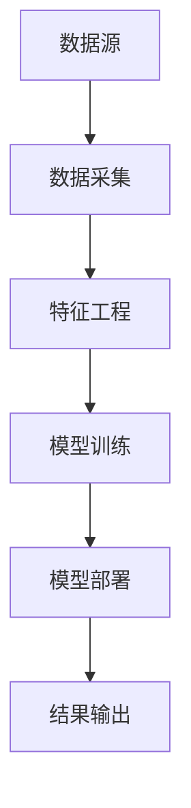

                 


# 金融衍生品定价中的机器学习应用

> 关键词：金融衍生品定价、机器学习、时间序列分析、深度学习、算法交易

> 摘要：本文探讨了机器学习在金融衍生品定价中的应用，详细介绍了传统定价模型的局限性，以及机器学习如何通过各种模型和算法提供更精准的定价方法。文章涵盖时间序列分析、神经网络、随机森林等机器学习技术，并结合实际案例分析，展示了如何构建高效的金融衍生品定价系统。最后，本文总结了机器学习在金融定价中的优势，并展望了未来的研究方向。

---

## 第一章: 金融衍生品定价概述

### 1.1 金融衍生品的基本概念

金融衍生品是一种金融合约，其价值来源于基础资产（如股票、债券、商品等）的价格变动。常见的衍生品包括期权、期货、掉期和远期合约。这些工具广泛应用于风险管理和投机交易。

#### 1.1.1 金融衍生品的分类

金融衍生品可以根据多种标准进行分类：

- **按基础资产**：股票、债券、商品、外汇等。
- **按执行方式**：欧式期权、美式期权。
- **按交易场所**：场内交易和场外交易。

### 1.2 金融衍生品定价的基本问题

定价是金融衍生品的核心问题。传统方法依赖于数学模型，如Black-Scholes模型，但这些模型存在假设限制，难以应对复杂市场条件。

#### 1.2.1 定价问题的挑战

- **市场波动性**：价格波动难以预测。
- **数据稀疏性**：某些衍生品交易数据有限。
- **非线性关系**：价格与市场变量之间的关系复杂。

### 1.3 机器学习在金融衍生品定价中的应用

机器学习通过分析大量数据，识别传统模型难以捕捉的模式，提供更精准的定价方法。

#### 1.3.1 机器学习的优势

- **非线性建模**：能够捕捉复杂的市场关系。
- **自适应性**：模型可自动调整以适应市场变化。
- **数据驱动**：基于大量数据，减少对假设的依赖。

---

## 第二章: 机器学习的核心概念与原理

### 2.1 机器学习的基本概念

机器学习分为监督学习、无监督学习和强化学习。监督学习适用于金融定价问题，通过历史数据训练模型预测未来价格。

#### 2.1.1 监督学习

- **回归**：预测连续值，如期权价格。
- **分类**：预测类别，如判断期权是价内还是价外。

### 2.2 机器学习模型的训练与评估

模型训练涉及特征工程和调参，评估指标包括均方误差（MSE）和R²。

#### 2.2.1 特征工程

- **特征选择**：筛选重要变量，如波动率、利率。
- **特征变换**：处理数据分布，如标准化。

### 2.3 机器学习在金融定价中的应用特点

- **实时性**：需快速响应市场变化。
- **稳定性**：模型需稳定，避免过度波动。
- **解释性**：需理解模型决策过程。

---

## 第三章: 金融衍生品定价中的机器学习模型

### 3.1 线性回归模型

线性回归简单，但适用于线性关系。

#### 3.1.1 线性回归的基本公式

$$ y = \beta_0 + \beta_1x + \epsilon $$

### 3.2 支持向量机（SVM）

SVM通过找到超平面分割数据，适用于分类和回归。

#### 3.2.1 SVM的数学模型

$$ \text{最大化} \ \frac{1}{2}\|w\|^2 $$
$$ \text{subject to} \ y_i(w \cdot x_i + b) \geq 1 $$

### 3.3 随机森林与梯度提升树

随机森林通过集成决策树提高准确性，梯度提升树通过不断优化损失函数。

#### 3.3.1 随机森林的优势

- **抗过拟合**：通过随机采样减少过拟合。
- **高维数据处理**：适用于多特征数据。

### 3.4 神经网络与深度学习模型

深度学习模型，如LSTM，适用于时间序列数据。

#### 3.4.1 LSTM的结构

LSTM通过门控机制处理长期依赖关系，公式如下：

$$ f_t = \sigma(W_{ft}x_t + W_{ft}h_{t-1}) $$
$$ i_t = \sigma(W_{it}x_t + W_{it}h_{t-1}) $$
$$ o_t = \sigma(W_{ot}x_t + W_{ot}h_{t-1}) $$
$$ c_t = f_t \cdot c_{t-1} + i_t \cdot g(x_t, h_{t-1}) $$
$$ h_t = o_t \cdot \tanh(c_t) $$

---

## 第四章: 金融衍生品定价中的时间序列分析

### 4.1 时间序列的基本概念

时间序列数据具有趋势、季节性和随机性。

#### 4.1.1 时间序列的特征

- **趋势**：长期方向。
- **季节性**：周期性波动。
- **随机性**：不可预测的波动。

### 4.2 常见的时间序列模型

- **ARIMA**：适用于线性趋势。
- **GARCH**：建模波动率。
- **LSTM**：捕捉复杂模式。

### 4.3 时间序列模型在金融定价中的应用

LSTM在股票价格预测中的应用：

```python
model = LSTM(units=50, return_sequences=True)
model.add(Dense(1))
model.compile(loss='mean_squared_error', optimizer='adam')
```

---

## 第五章: 机器学习在金融衍生品定价中的系统架构设计

### 5.1 系统架构设计的基本原则

- **模块化**：数据采集、特征工程、模型训练、部署监控。
- **可扩展性**：支持新数据和模型更新。

#### 5.1.1 系统架构图



### 5.2 金融衍生品定价系统的功能设计

- **数据采集模块**：实时获取市场数据。
- **特征工程模块**：提取相关特征。
- **模型训练模块**：训练定价模型。
- **部署监控模块**：实时定价和模型监控。

#### 5.2.1 系统功能图


### 5.3 系统架构设计

采用微服务架构，各模块独立运行，便于扩展和维护。

---

## 总结

机器学习为金融衍生品定价提供了新的可能性，通过深度学习和时间序列分析，模型能够捕捉传统方法难以发现的模式。未来的研究应关注模型解释性和实时性，以应对复杂的金融市场挑战。

