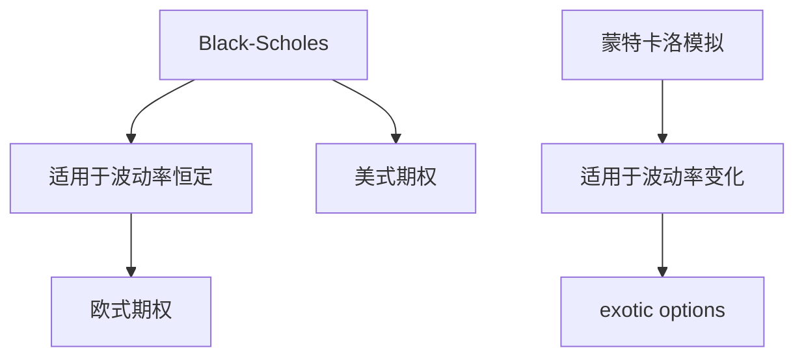
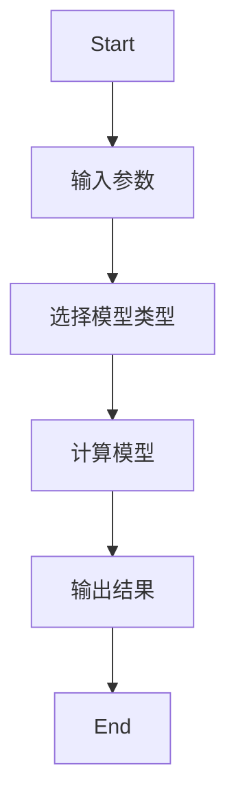
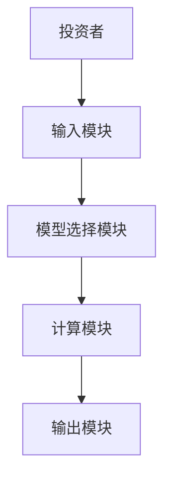

                 


# 《金融衍生品定价模型比较与选择框架》

## 关键词：金融衍生品，定价模型，Black-Scholes，蒙特卡洛模拟，模型选择

## 摘要：本文系统地介绍了金融衍生品定价模型的比较与选择框架，从背景介绍到数学模型，从算法原理到系统架构，再到项目实战，详细分析了各种定价模型的优缺点及其适用场景。通过实际案例和代码实现，帮助读者更好地理解和应用这些模型。

---

# 第一部分: 金融衍生品定价模型背景与基础

## 第1章: 金融衍生品定价模型概述

### 1.1 金融衍生品的基本概念

#### 1.1.1 金融衍生品的定义
金融衍生品是一种金融合约，其价值依赖于基础资产（如股票、债券、商品等）的价格变动。常见的衍生品包括期权、期货、掉期和互换。

#### 1.1.2 金融衍生品的分类
1. 期权：买方有权在特定时间以特定价格买入或卖出资产。
2. 期货：买方和卖方约定在未来特定时间以特定价格买卖资产。
3. 掉期：双方约定在未来交换资产或现金流。
4. 互换：双方在未来一段时间内交换现金流。

#### 1.1.3 金融衍生品的市场现状
衍生品市场是全球最大的金融市场之一，广泛应用于风险管理、投机和套利。市场规模巨大，交易复杂，对定价模型的要求极高。

### 1.2 定价模型的定义与作用

#### 1.2.1 定价模型的基本概念
定价模型是用于估计衍生品公允价值的数学工具。它们基于市场数据、资产价格波动性和利率等因素，帮助确定衍生品的合理价格。

#### 1.2.2 定价模型在金融衍生品中的作用
1. 评估衍生品的公允价值。
2. 辅助交易决策。
3. 计算风险敞口和资本需求。

#### 1.2.3 定价模型的发展历程
从早期的简单模型到现代的复杂模型，定价模型经历了从Black-Scholes到蒙特卡洛模拟的发展。

### 1.3 为什么需要比较与选择定价模型

#### 1.3.1 不同模型的适用场景
不同模型适用于不同的市场条件和资产类型。例如，Black-Scholes适用于波动率恒定的资产，而蒙特卡洛模拟适用于波动率变化的资产。

#### 1.3.2 模型选择对投资决策的影响
选择正确的模型可以提高定价准确性，降低交易风险，优化投资回报。

#### 1.3.3 模型选择的复杂性与挑战
市场条件变化、数据质量、模型假设等因素增加了模型选择的难度。

### 1.4 本章小结
本章介绍了金融衍生品的基本概念、定价模型的作用及其发展历程，强调了模型选择的重要性。

---

# 第二部分: 金融衍生品定价模型的核心概念与联系

## 第2章: 核心概念与联系

### 2.1 定价模型的核心原理

#### 2.1.1 随机过程与概率论基础
衍生品定价依赖于随机过程，如布朗运动，用于描述资产价格的波动。

#### 2.1.2 无套利定价原理
无套利原则确保在有效市场中，衍生品的定价不会产生无风险收益。

#### 2.1.3 风险中性定价方法
在风险中性框架下，投资者对风险的厌恶通过调整风险中性概率来反映。

### 2.2 不同定价模型的属性对比

#### 2.2.1 模型的假设条件对比
| 模型 | 假设条件 |
|------|-----------|
| Black-Scholes | 资产价格服从几何布朗运动，波动率恒定 |
| 蒙特卡洛模拟 | 资产价格波动率变化，适用于复杂衍生品 |

#### 2.2.2 模型的适用范围对比
| 模型 | 适用范围 |
|------|-----------|
| Black-Scholes | 美式期权、欧式期权 |
| 蒙特卡洛模拟 | 复杂衍生品，如 exotic options |

#### 2.2.3 模型的优缺点对比
| 模型 | 优点 | 缺点 |
|------|-------|------|
| Black-Scholes | 计算简单，假设明确 | 适用于波动率恒定的资产 |
| 蒙特卡洛模拟 | 适用于复杂模型，假设灵活 | 计算复杂，耗时较长 |

### 2.3 实体关系图与模型联系

#### 2.3.1 ER实体关系图
```mermaid
erDiagram
    actor 投资者 {
        <属性> 资产类型 : string
        <属性> 风险偏好 : string
    }
    actor 市场数据 {
        <属性> 价格 : float
        <属性> 波动率 : float
    }
    actor 定价模型 {
        <操作> 计算价格 : float
    }
    投资者 --> 定价模型
    市场数据 --> 定价模型
```

#### 2.3.2 模型之间的关系


#### 2.3.3 模型选择的流程图


### 2.4 本章小结
本章详细对比了不同定价模型的属性和适用场景，通过实体关系图和流程图展示了模型之间的联系。

---

# 第三部分: 金融衍生品定价模型的算法原理

## 第3章: 定价模型的算法原理

### 3.1 Black-Scholes模型

#### 3.1.1 模型假设与公式推导

Black-Scholes模型假设资产价格服从几何布朗运动，波动率恒定。欧式期权的定价公式为：
$$C = S_0 e^{r t} N(d_1) - K N(d_2)$$
其中：
- $C$：期权价格
- $S_0$：当前资产价格
- $r$：无风险利率
- $t$：到期时间
- $K$：行权价
- $N(d)$：标准正态分布的累积分布函数
- $d_1 = \frac{\ln(S_0/K) + (r + \sigma^2/2)t}{\sigma \sqrt{t}}$
- $d_2 = d_1 - \sigma \sqrt{t}$

#### 3.1.2 模型的实现步骤

1. 输入参数：$S_0$, $K$, $r$, $\sigma$, $t$。
2. 计算$d_1$和$d_2$。
3. 计算$N(d_1)$和$N(d_2)$。
4. 计算期权价格$C$。

#### 3.1.3 模型的优缺点分析
- **优点**：计算简单，假设明确。
- **缺点**：假设波动率恒定，不适用于波动率变化的资产。

#### 3.1.4 Python代码实现
```python
import numpy as np
from scipy.stats import norm

def black_scholes(S0, K, r, sigma, t):
    t = t / 365
    d1 = (np.log(S0 / K) + (r + sigma**2 / 2) * t) / (sigma * np.sqrt(t))
    d2 = d1 - sigma * np.sqrt(t)
    N_d1 = norm.cdf(d1)
    N_d2 = norm.cdf(d2)
    price = S0 * np.exp(r * t) * N_d1 - K * N_d2
    return price

# 示例
S0 = 100
K = 100
r = 0.05
sigma = 0.2
t = 1
print(black_scholes(S0, K, r, sigma, t))
```

### 3.2 蒙特卡洛模拟

#### 3.2.1 模型的数学基础
蒙特卡洛模拟通过随机抽样估计资产价格的路径，计算衍生品的平均 payoff。

#### 3.2.2 模型的实现步骤

1. 确定模拟次数和时间步长。
2. 生成资产价格的随机路径。
3. 计算每条路径的 payoff。
4. 计算 payoff 的平均值，作为衍生品的估计价格。

#### 3.2.3 模型的优缺点分析
- **优点**：适用于复杂衍生品，假设灵活。
- **缺点**：计算复杂，耗时较长。

#### 3.2.4 Python代码实现
```python
import numpy as np

def monte_carlo(S0, K, r, sigma, t, steps=1000):
    np.random.seed(42)
    dt = t / steps
    price_paths = np.zeros((steps, 1))
    price_paths[0] = S0
    for i in range(1, steps):
        drift = (r - 0.5 * sigma**2) * dt
        diffusion = sigma * np.sqrt(dt) * np.random.standard_normal(1)
        price_paths[i] = price_paths[i-1] * np.exp(drift + diffusion)
    payoffs = np.maximum(price_paths[-1] - K, 0)
    return np.mean(payoffs)

# 示例
S0 = 100
K = 100
r = 0.05
sigma = 0.2
t = 1
print(monte_carlo(S0, K, r, sigma, t))
```

### 3.3 模型选择的算法流程

#### 3.3.1 算法流程图


### 3.4 本章小结
本章详细讲解了Black-Scholes模型和蒙特卡洛模拟的算法原理，并通过Python代码实现，帮助读者理解模型的实现过程。

---

# 第四部分: 金融衍生品定价模型的系统分析与架构设计

## 第4章: 系统分析与架构设计

### 4.1 问题场景介绍
金融衍生品定价系统需要支持多种模型，根据用户需求选择合适的模型进行定价。

### 4.2 系统功能设计

#### 4.2.1 功能模块
1. 用户输入模块：接收衍生品类型、参数等输入。
2. 模型选择模块：根据输入选择合适的定价模型。
3. 计算模块：执行定价计算。
4. 输出模块：展示结果。

#### 4.2.2 领域模型


### 4.3 系统架构设计

#### 4.3.1 架构图


#### 4.3.2 接口设计
1. 输入接口：接收参数。
2. 输出接口：展示结果。

### 4.4 本章小结
本章通过系统分析与架构设计，展示了如何构建一个灵活的定价系统，支持多种模型的选择与应用。

---

# 第五部分: 金融衍生品定价模型的项目实战

## 第5章: 项目实战

### 5.1 环境安装

#### 5.1.1 安装Python
```bash
python --version
pip install numpy scipy matplotlib
```

### 5.2 系统核心实现源代码

#### 5.2.1 Black-Scholes模型实现
```python
import numpy as np
from scipy.stats import norm

def black_scholes(S0, K, r, sigma, t):
    t = t / 365
    d1 = (np.log(S0 / K) + (r + sigma**2 / 2) * t) / (sigma * np.sqrt(t))
    d2 = d1 - sigma * np.sqrt(t)
    N_d1 = norm.cdf(d1)
    N_d2 = norm.cdf(d2)
    price = S0 * np.exp(r * t) * N_d1 - K * N_d2
    return price

print(black_scholes(100, 100, 0.05, 0.2, 1))
```

#### 5.2.2 蒙特卡洛模拟实现
```python
import numpy as np

def monte_carlo(S0, K, r, sigma, t, steps=1000):
    np.random.seed(42)
    dt = t / steps
    price_paths = np.zeros((steps, 1))
    price_paths[0] = S0
    for i in range(1, steps):
        drift = (r - 0.5 * sigma**2) * dt
        diffusion = sigma * np.sqrt(dt) * np.random.standard_normal(1)
        price_paths[i] = price_paths[i-1] * np.exp(drift + diffusion)
    payoffs = np.maximum(price_paths[-1] - K, 0)
    return np.mean(payoffs)

print(monte_carlo(100, 100, 0.05, 0.2, 1))
```

### 5.3 案例分析与结果解读

#### 5.3.1 案例分析
选择两种模型，比较它们在期权定价中的表现。

#### 5.3.2 结果解读
Black-Scholes模型计算简单，适用于波动率恒定的资产；蒙特卡洛模拟适用于复杂衍生品，但计算耗时较长。

### 5.4 项目小结
本章通过实际案例展示了如何选择和应用不同模型进行定价，帮助读者理解模型的优缺点。

---

# 第六部分: 金融衍生品定价模型的最佳实践

## 第6章: 最佳实践、小结与注意事项

### 6.1 最佳实践
1. 根据具体场景选择模型。
2. 验证模型假设。
3. 定期更新模型参数。

### 6.2 小结
本文详细介绍了金融衍生品定价模型的比较与选择框架，从理论到实践，帮助读者掌握模型的选择与应用。

### 6.3 注意事项
1. 模型假设可能不成立，需定期验证。
2. 考虑计算复杂性和时间成本。
3. 结合实际需求选择模型。

### 6.4 拓展阅读
推荐阅读《金融工程与金融创新》和《蒙特卡洛方法在金融中的应用》。

---

# 第七部分: 总结

## 第7章: 总结

### 7.1 总结内容
本文系统地介绍了金融衍生品定价模型的比较与选择框架，从背景到数学模型，从算法原理到系统架构，再到项目实战，帮助读者全面掌握模型的选择与应用。

### 7.2 未来展望
未来，随着人工智能的发展，定价模型将更加智能化和复杂化，需要进一步研究和探索。

---

通过本文的详细分析，读者可以更好地理解金融衍生品定价模型的比较与选择框架，并能够实际应用这些模型进行定价和风险管理。

