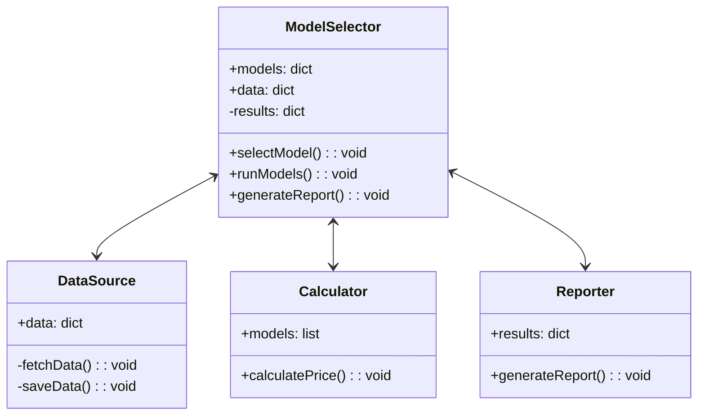

                 


# 《金融衍生品定价模型比较与选择框架》

---

## 关键词：金融衍生品、定价模型、Black-Scholes、蒙特卡洛模拟、波动率曲面

---

## 摘要

本文系统地探讨了金融衍生品定价模型的比较与选择框架，从基础概念到高级算法，结合实际案例，分析了多种定价模型的特点及其应用场景。通过深入的理论分析和实际操作，本文为读者提供了一套科学的选择框架，帮助在复杂的金融市场中做出最优决策。

---

# 第一部分: 金融衍生品定价模型背景与基础

---

## 第1章: 金融衍生品与定价模型概述

### 1.1 金融衍生品的基本概念

金融衍生品是一种以其他金融资产为标的资产的金融合约，其价值取决于标的资产的价格变动。常见的金融衍生品包括期权、期货、掉期和远期合约等。

#### 1.1.1 金融衍生品的类型

- **期权**：买方有权在特定时间内以固定价格购买或出售标的资产。
- **期货**：买方和卖方约定在未来特定时间以特定价格买卖标的资产。
- **掉期**：双方约定在未来特定时间交换资产或现金流。
- **远期合约**：双方约定在未来特定时间以特定价格买卖标的资产。

#### 1.1.2 金融衍生品的市场现状

- 全球金融市场衍生品市场规模庞大，涵盖股票、外汇、利率、商品等多种标的。
- 衍生品市场具有高杠杆特性，风险与收益并存。
- 市场参与者包括机构投资者、对冲基金和个人投资者。

#### 1.1.3 定价模型在金融衍生品中的作用

定价模型是金融衍生品交易的核心工具，用于确定其公允价值，帮助投资者做出理性决策。

---

### 1.2 金融衍生品定价模型的背景

#### 1.2.1 定价模型的基本假设

- 市场无摩擦：无交易成本、税收和短路限制。
- 有效市场：价格反映所有可获取信息。
- 随机过程：标的资产价格遵循随机游走。

#### 1.2.2 市场风险与定价模型的关系

- 定价模型需考虑市场波动性、利率变化和信用风险。
- 不同模型对风险的建模方式不同，影响定价结果。

#### 1.2.3 定价模型的选择标准

- 准确性：模型是否能准确反映市场价格。
- 计算效率：模型是否适用于高频交易。
- 灵活性：模型是否能适应不同市场环境。

---

### 1.3 本书研究目标与框架

#### 1.3.1 研究目标

- 比较不同定价模型的优缺点。
- 提供一套选择定价模型的框架。
- 实现模型的代码，结合实际案例分析。

#### 1.3.2 研究框架

- 第一部分：金融衍生品定价模型背景与基础。
- 第二部分：核心概念与联系。
- 第三部分：算法原理。
- 第四部分：系统分析与架构设计。
- 第五部分：项目实战。
- 第六部分：最佳实践与小结。

---

## 第2章: 金融衍生品定价模型的核心概念

---

### 2.1 定价模型的基本原理

#### 2.1.1 随机微分方程与金融模型

- 随机微分方程（SDE）是描述金融资产价格波动的基础工具。
- 常用的SDE模型包括几何布朗运动和跳跃过程。

#### 2.1.2 蒙特卡洛模拟的基本原理

- 蒙特卡洛模拟通过随机采样估计概率分布。
- 常用于复杂金融工具的定价和风险评估。

#### 2.1.3 波动率与定价模型的关系

- 波动率是定价模型的重要输入参数。
- 不同模型对波动率的处理方式不同，影响定价结果。

---

### 2.2 主流定价模型的比较

#### 2.2.1 Black-Scholes模型

- 假设：无股息股票，无摩擦市场，波动率恒定。
- 公式：$$ C = S_0 N(d_1) - K e^{-rT} N(d_2) $$
- 优点：简单易用，计算高效。
- 缺点：假设严格，难以适用于复杂场景。

#### 2.2.2 蒙特卡洛方法

- 基于随机模拟，适用于高维问题。
- 优点：灵活性高，可处理复杂路径依赖期权。
- 缺点：计算成本高，收敛速度慢。

#### 2.2.3 波动率曲面模型

- 建立波动率的三维曲面，捕捉波动率在不同 strike 和时间的变动。
- 优点：动态捕捉波动率变化。
- 缺点：计算复杂，数据需求高。

---

### 2.3 定价模型的优缺点对比

| 模型名称       | 优点                           | 缺点                           |
|----------------|--------------------------------|--------------------------------|
| Black-Scholes  | 简单，计算高效                | 假设严格，不适用于路径依赖期权 |
| 蒙特卡洛方法   | 灵活，适用于复杂问题           | 计算成本高，收敛慢              |
| 波动率曲面模型  | 动态捕捉波动率变化             | 计算复杂，数据需求高            |

---

## 第3章: Black-Scholes模型的数学推导

---

### 3.1 Black-Scholes模型的假设条件

- 标的资产价格遵循几何布朗运动。
- 无风险利率和波动率恒定。
- 市场无摩擦。

---

### 3.2 Black-Scholes公式的推导

#### 无股息股票的欧式期权定价公式

$$ C = S_0 N(d_1) - K e^{-rT} N(d_2) $$

其中：
- $$ d_1 = \frac{\ln(S_0/K) + (r + \sigma^2/2)T}{\sigma \sqrt{T}} $$
- $$ d_2 = d_1 - \sigma \sqrt{T} $$

---

### 3.3 Black-Scholes模型的实现代码

#### Python代码实现

```python
import numpy as np
from scipy.stats import norm

def black_scholes(S, K, r, T, sigma):
    """
    计算欧式期权的Black-Scholes定价。
    """
    d1 = (np.log(S/K) + (r + sigma**2/2)*T) / (sigma * np.sqrt(T))
    d2 = d1 - sigma * np.sqrt(T)
    C = S * norm.cdf(d1) - K * np.exp(-r*T) * norm.cdf(d2)
    return C

# 示例：计算一个股票期权的价格
S = 100  # 标的资产价格
K = 105  # 行权价
r = 0.05  # 无风险利率
T = 1  # 期限（年）
sigma = 0.2  # 波动率

price = black_scholes(S, K, r, T, sigma)
print(f"期权价格为: {price:.2f}")
```

---

## 第4章: 定价模型选择框架的系统分析

---

### 4.1 问题场景分析

#### 4.1.1 金融市场波动性

- 波动率是影响定价模型选择的关键因素。
- 高波动市场需要更灵活的模型。

#### 4.1.2 模型适用性

- Black-Scholes适用于简单期权。
- 蒙特卡洛适用于复杂期权。

#### 4.1.3 数据需求

- 历史价格数据。
- 利率、波动率数据。

---

### 4.2 系统功能设计

#### 4.2.1 系统功能模块

- 数据采集与预处理。
- 模型计算与对比。
- 结果可视化与报告生成。

#### 4.2.2 领域模型（Mermaid 类图）



---

### 4.3 系统架构设计

```mermaid
div title 系统架构图
graph TD
    A[用户] --> B(数据采集)
    B --> C[数据存储]
    C --> D(模型计算)
    D --> E[结果展示]
```

---

## 第5章: 项目实战

---

### 5.1 环境安装与配置

#### 5.1.1 安装Python环境

- 安装Python 3.8及以上版本。
- 安装必要的库：numpy、scipy、pandas、matplotlib。

#### 5.1.2 数据源选择

- 使用Yahoo Finance API获取股票价格数据。
- 下载期权市场数据。

---

### 5.2 核心实现代码

#### 5.2.1 数据采集与预处理

```python
import yfinance as yf

# 下载数据
data = yf.download('AAPL', start='2020-01-01', end='2023-12-31')

# 数据预处理
data['Close'].plot()
plt.show()
```

---

### 5.3 案例分析

#### 5.3.1 股票期权定价

假设我们想为AAPL股票定价一个欧式期权，参数如下：

- 标的资产价格：$150
- 行权价：$160
- 无风险利率：5%
- 期限：1年
- 波动率：30%

使用Black-Scholes模型计算期权价格：

```python
price = black_scholes(150, 160, 0.05, 1, 0.3)
print(f"期权价格为: {price:.2f}")
```

---

## 第6章: 最佳实践与小结

---

### 6.1 小结

- 不同定价模型适用于不同场景。
- 选择模型需考虑市场波动性、计算效率和模型假设。
- 实践中，结合实际数据和业务需求选择模型。

### 6.2 注意事项

- 定价模型需不断更新和调整。
- 注意模型假设的局限性。
- 风险管理是定价模型的重要组成部分。

### 6.3 拓展阅读

- 《金融工程与金融创新》
- 《蒙特卡洛方法在金融中的应用》

---

## 结语

通过本文的系统分析和实际案例，读者可以全面了解金融衍生品定价模型的选择与应用。希望本文能为金融从业者和研究者提供有价值的参考。

