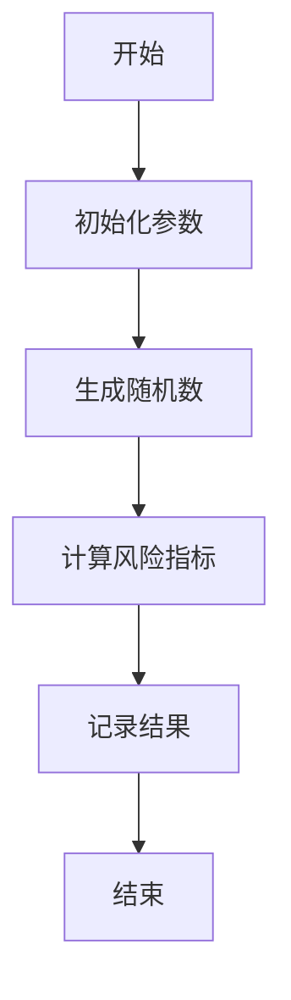
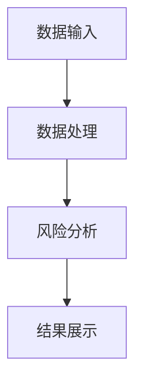

                 


# 金融衍生品组合风险分析工具

> 关键词：金融衍生品，风险分析，组合风险，VaR，CVaR，蒙特卡洛模拟

> 摘要：本文详细探讨了金融衍生品组合风险分析工具的构建与应用，从背景、核心概念、算法原理、系统架构到项目实战，全面解析了如何利用技术手段有效评估和管理金融衍生品的组合风险。文章结合实际案例，通过理论与实践相结合的方式，为金融从业者提供了一套系统化的风险分析解决方案。

---

# 第一部分: 金融衍生品组合风险分析工具概述

## 第1章: 金融衍生品与风险分析概述

### 1.1 金融衍生品的基本概念

#### 1.1.1 金融衍生品的定义与分类

金融衍生品（Financial Derivatives）是基于基础资产（如股票、债券、商品、指数等）的衍生金融工具，其价值依赖于基础资产的价格波动。常见的金融衍生品包括期货、期权、掉期和远期合约等。

- **定义**：金融衍生品是一种合约，其价值取决于基础资产的价格变化。
- **分类**：
  - 按照交易场所：场内衍生品（如期货、期权）和场外衍生品（如远期合约、掉期）。
  - 按照合约类型：期权（Call/Put）、期货、掉期、互换等。

#### 1.1.2 金融衍生品的市场现状与发展趋势

近年来，金融衍生品市场迅速发展，成为现代金融体系的重要组成部分。衍生品的市场规模庞大，且品种不断创新。随着市场波动加剧，衍生品的风险管理需求日益增加。

#### 1.1.3 金融衍生品的风险特征与管理需求

衍生品的风险主要体现在价格波动、信用风险、流动性风险等方面。组合风险分析工具的出现，为金融从业者提供了更高效的管理手段，尤其是在复杂市场环境下，能够帮助机构有效控制风险。

---

### 1.2 风险分析的基本原理

#### 1.2.1 风险的定义与分类

风险是金融活动中不确定性的一种表现，通常指资产价格波动带来的损失可能性。风险可以分为系统性风险和非系统性风险，前者影响整个市场，后者仅影响特定资产或行业。

#### 1.2.2 风险分析的核心目标与方法

- **核心目标**：量化风险、评估风险、制定风险管理策略。
- **主要方法**：
  - **VaR（Value at Risk）**：衡量在一定置信水平下可能的最大损失。
  - **CVaR（Conditional Value at Risk）**：VaR的扩展，衡量在VaR水平下的平均损失。
  - **压力测试**：模拟极端市场条件下的损失情况。

#### 1.2.3 风险分析在金融衍生品中的应用

衍生品的风险分析需要考虑多个因素，包括标的资产价格波动、市场流动性、交易对手信用等。组合风险分析工具能够帮助机构全面评估投资组合的风险敞口。

---

### 1.3 组合风险分析的必要性

#### 1.3.1 单一风险分析的局限性

单一风险分析仅关注单个资产的风险，无法反映组合的整体风险。在实际投资中，组合风险往往比单个资产风险更大，因此需要通过组合风险分析来全面评估。

#### 1.3.2 组合风险分析的优势与意义

- **优势**：能够量化组合的整体风险，帮助投资者制定更优的风险管理策略。
- **意义**：在复杂市场环境下，组合风险分析是机构投资者的必备工具。

#### 1.3.3 金融衍生品组合风险分析的场景与应用

- **资产配置**：优化投资组合，降低整体风险。
- **风险管理**：识别高风险资产，制定风险对冲策略。
- **绩效评估**：评估投资组合的收益与风险匹配程度。

---

## 第2章: 金融衍生品组合风险分析的核心概念

### 2.1 风险分析的核心要素

#### 2.1.1 风险指标的定义与选择

- **VaR**：在给定置信水平下，资产组合的最大可能损失。
- **CVaR**：VaR的扩展，衡量VaR水平下的平均损失。
- **波动率**：资产价格波动的指标，反映风险程度。

#### 2.1.2 风险因子的识别与量化

- **风险因子**：影响资产价格的主要因素，如市场波动率、利率、信用风险等。
- **量化方法**：通过历史数据和统计模型，量化各风险因子的影响程度。

#### 2.1.3 风险模型的构建与验证

- **模型构建**：基于历史数据和统计方法，构建风险模型。
- **模型验证**：通过回测和压力测试，验证模型的有效性。

---

### 2.2 组合风险分析的原理与方法

#### 2.2.1 风险的线性与非线性组合

- **线性组合**：资产组合的总体风险是各资产风险的线性组合。
- **非线性组合**：考虑资产之间的相互影响，风险组合是非线性的。

#### 2.2.2 风险的集中度与分散度分析

- **集中度**：资产组合中某单一资产的风险占比。
- **分散度**：资产组合中资产种类的多样性，分散度越高，组合风险越低。

#### 2.2.3 风险的敏感性与压力测试

- **敏感性分析**：评估资产组合对特定风险因子的敏感程度。
- **压力测试**：模拟极端市场条件下的组合风险。

---

### 2.3 风险分析工具的框架与功能

#### 2.3.1 工具的功能模块划分

- **数据输入与处理模块**：接收历史数据、市场数据等。
- **风险分析模块**：计算VaR、CVaR等风险指标。
- **结果展示与报告模块**：生成风险报告，可视化展示分析结果。

#### 2.3.2 工具的输入输出流程

1. 输入：历史价格数据、市场数据、资产权重。
2. 处理：计算各资产的风险指标，组合风险。
3. 输出：风险报告、可视化图表。

#### 2.3.3 工具的适用范围与限制

- **适用范围**：适用于股票、债券、衍生品等多种资产。
- **限制**：假设市场数据完整，模型的有效性依赖于历史数据。

---

## 第3章: 金融衍生品组合风险分析的算法原理

### 3.1 风险分析的主要算法

#### 3.1.1 方差-协方差法

- **原理**：基于资产的波动率和协方差矩阵，计算组合风险。
- **公式**：
  $$ \sigma_p^2 = \mathbf{w}^T \Sigma \mathbf{w} $$
  其中，$\mathbf{w}$是权重向量，$\Sigma$是协方差矩阵。

#### 3.1.2 历史模拟法

- **原理**：通过历史数据模拟资产价格变化，计算组合风险。
- **步骤**：
  1. 收集历史价格数据。
  2. 计算资产收益的波动情况。
  3. 计算组合的风险指标。

#### 3.1.3蒙特卡洛模拟法

- **原理**：通过随机模拟市场情景，计算组合风险。
- **流程图**：


---

### 3.2 算法的数学模型与公式

#### 3.2.1 方差-协方差法的数学模型

$$ \text{VaR} = \sqrt{w^T \Sigma w} $$

#### 3.2.2 蒙特卡洛模拟法的流程图


---

### 3.3 算法的实现与优化

#### 3.3.1 算法的实现步骤

1. 数据预处理：清洗和标准化数据。
2. 模型选择：选择合适的算法（如方差-协方差法、蒙特卡洛模拟）。
3. 参数设置：设定置信水平、模拟次数等。
4. 计算风险指标：根据算法计算VaR、CVaR等指标。

#### 3.3.2 算法的优化方法

- **并行计算**：通过并行处理提高计算效率。
- **参数优化**：调整模拟次数和随机数生成器，提高结果准确性。

#### 3.3.3 算法的性能评估

- **准确性**：通过回测验证模型的有效性。
- **效率**：评估算法的计算速度和资源消耗。

---

## 第4章: 金融衍生品组合风险分析的系统架构

### 4.1 系统功能模块设计

#### 4.1.1 数据输入与处理模块

- **功能**：接收历史数据、市场数据、资产权重。
- **流程**：数据清洗、标准化、存储。

#### 4.1.2 风险分析模块

- **功能**：计算VaR、CVaR等风险指标。
- **流程**：选择算法、计算风险、生成结果。

#### 4.1.3 结果展示与报告模块

- **功能**：生成风险报告、可视化图表。
- **流程**：输出报告、展示结果。

---

### 4.2 系统架构设计

#### 4.2.1 分层架构设计



---

## 第5章: 项目实战与最佳实践

### 5.1 项目实战

#### 5.1.1 环境安装

- **工具**：Python、NumPy、Pandas、Matplotlib。
- **安装步骤**：
  ```bash
  pip install numpy pandas matplotlib
  ```

#### 5.1.2 核心代码实现

- **计算VaR**：
  ```python
  import numpy as np
  def calculate VaR(returns, confidence_level=0.95):
      sorted_returns = np.sort(returns)
      index = int(len(sorted_returns) * (1 - confidence_level))
      VaR = -sorted_returns[index]
      return VaR
  ```

---

### 5.2 最佳实践

#### 5.2.1 注意事项

- **数据质量**：确保输入数据的完整性和准确性。
- **模型选择**：根据实际情况选择合适的算法。
- **结果验证**：通过回测和压力测试验证模型的有效性。

#### 5.2.2 小结

本文详细探讨了金融衍生品组合风险分析工具的构建与应用，从理论到实践，全面解析了如何利用技术手段有效评估和管理金融衍生品的组合风险。

---

# 结语

金融衍生品组合风险分析工具是现代金融风险管理的重要工具，通过本文的探讨，读者可以深入了解其构建与应用的关键点。未来，随着技术的进步和市场的变化，组合风险分析工具将更加智能化和多样化，为金融从业者提供更强大的支持。

