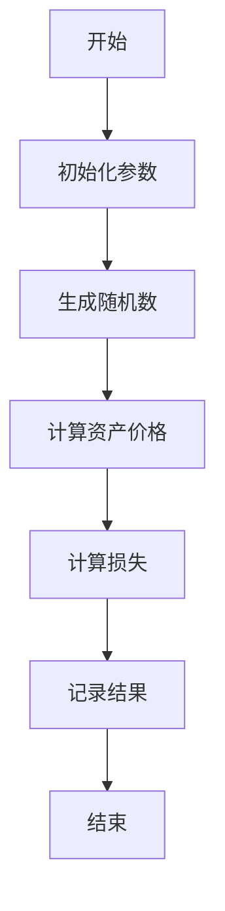

                 


# 金融衍生品风险敞口分析

> 关键词：金融衍生品，风险敞口，蒙特卡洛模拟，VaR，机器学习

> 摘要：本文详细探讨了金融衍生品风险敞口分析的核心概念、算法原理、系统架构设计以及实际项目应用。通过理论与实践相结合的方式，介绍了如何利用蒙特卡洛模拟和机器学习等技术手段，有效识别和度量金融衍生品的风险敞口，帮助金融机构更好地进行风险管理和决策支持。

---

## 第1章 金融衍生品风险敞口概述

### 1.1 金融衍生品的基本概念

#### 1.1.1 金融衍生品的定义与分类
金融衍生品（Financial Derivatives）是一类金融合约，其价值依赖于基础资产（如股票、债券、商品等）的价格波动。衍生品的主要类型包括：
- **远期合约**（Forwards）：约定在未来某一特定时间以预定价格购买或出售资产的协议。
- **期货合约**（Futures）：在交易所标准化交易的远期合约。
- **期权合约**（Options）：赋予买方在特定时间以特定价格购买或出售资产的权利，而非义务。
- **互换合约**（Swaps）：约定在未来期限内互相交换现金流的协议。

#### 1.1.2 金融衍生品的主要类型
金融衍生品可以根据多种标准分类，如：
- **按基础资产**：股票衍生品、债券衍生品、商品衍生品、外汇衍生品等。
- **按执行方式**：欧式期权、美式期权。
- **按市场结构**：场内交易和场外交易。

#### 1.1.3 金融衍生品的市场特征
金融衍生品市场具有以下特征：
- **杠杆效应**：衍生品通常具有高杠杆，小的市场波动可能导致较大的收益或损失。
- **复杂性**：衍生品的设计和交易策略复杂，需要专业的知识和技能。
- **流动性风险**：某些衍生品的流动性较低，可能导致交易困难。

### 1.2 风险敞口的定义与分类

#### 1.2.1 风险敞口的定义
风险敞口（Risk Exposure）是指投资者在某一资产或组合上面临的潜在损失。它反映了价格波动对投资组合价值的影响程度。

#### 1.2.2 风险敞口的分类
风险敞口可以根据不同的标准进行分类：
- **市场风险敞口**：由于市场价格波动导致的损失。
- **信用风险敞口**：由于交易对手违约导致的损失。
- **流动性风险敞口**：由于资产无法迅速变现导致的损失。
- **操作风险敞口**：由于操作失误或系统故障导致的损失。

#### 1.2.3 风险敞口的度量方法
风险敞口的度量方法包括：
- **VaR（Value at Risk）**：在给定置信水平下，投资组合可能遭受的最大损失。
- **CVaR（Conditional Value at Risk）**：VaR的条件期望损失，用于衡量VaR之外的尾部风险。

### 1.3 金融衍生品风险敞口分析的背景与意义

#### 1.3.1 金融衍生品在现代金融体系中的地位
金融衍生品是现代金融体系的重要组成部分，广泛应用于风险管理、价格发现和投机套利。

#### 1.3.2 风险敞口分析的重要性
准确度量金融衍生品的风险敞口，有助于金融机构制定有效的风险管理策略，降低潜在损失。

#### 1.3.3 数字化与智能化在风险敞口分析中的应用
随着大数据和人工智能技术的发展，金融机构开始采用更加智能化的风险敞口分析方法，如蒙特卡洛模拟和机器学习。

---

## 第2章 金融衍生品风险敞口的核心概念

### 2.1 金融衍生品的风险来源

#### 2.1.1 市场风险
市场风险是由于市场价格波动引起的损失，是衍生品的主要风险来源。

#### 2.1.2 信用风险
信用风险是由于交易对手违约引起的损失，特别是在场外衍生品中尤为重要。

#### 2.1.3 流动性风险
流动性风险是指在市场中无法迅速买卖资产而遭受的损失。

#### 2.1.4 操作风险
操作风险是由于内部操作失误或外部事件导致的损失。

### 2.2 风险敞口的数学模型与公式

#### 2.2.1 风险敞口的线性模型
线性模型假设资产价格的变化与市场指数呈线性关系，常用CAPM模型进行分析。

#### 2.2.2 风险敞口的非线性模型
非线性模型用于描述复杂衍生品的风险敞口，如期权的风险敞口可以用二叉树模型或Black-Scholes模型进行分析。

#### 2.2.3 风险敞口的动态模型
动态模型（如GARCH模型）用于捕捉资产价格的时变波动性。

### 2.3 风险敞口的度量指标

#### 2.3.1 VaR（Value at Risk）
VaR是在给定置信水平下，投资组合在正常市场条件下可能遭受的最大损失。

公式：
$$ VaR_{\alpha}(P) = \inf \{ L \mid P + L \geq 0, \text{概率} \geq \alpha \} $$

#### 2.3.2 CVaR（Conditional Value at Risk）
CVaR是VaR的条件期望损失，用于衡量尾部风险。

公式：
$$ CVaR_{\alpha}(P) = E[P + L \mid L \leq VaR_{\alpha}(P)] $$

#### 2.3.3 风险价值的其他度量方法
其他方法包括最大回撤（Max Drawdown）和波动率（Volatility）。

---

## 第3章 金融衍生品风险敞口分析的算法原理

### 3.1 风险敞口分析的算法流程

#### 3.1.1 数据收集与预处理
数据来源包括历史价格、市场数据和交易数据，需要进行清洗和标准化。

#### 3.1.2 风险模型的构建
选择适当的数学模型，如线性回归、时间序列模型或机器学习模型。

#### 3.1.3 风险敞口的计算与可视化
通过模型计算出风险敞口，并进行可视化分析。

### 3.2 基于蒙特卡洛模拟的风险敞口分析

#### 3.2.1 蒙特卡洛模拟的基本原理
蒙特卡洛模拟通过随机抽样方法，模拟市场价格波动，计算风险敞口。

流程图（Mermaid）：


#### 3.2.2 蒙特卡洛模拟在风险敞口分析中的应用
用于估计VaR和CVaR等风险度量指标。

### 3.3 基于机器学习的风险敞口分析

#### 3.3.1 机器学习在风险敞口分析中的应用
使用回归模型或分类模型，预测市场价格波动。

#### 3.3.2 常用算法（如随机森林、神经网络）的实现
随机森林用于特征重要性分析，神经网络用于非线性关系建模。

#### 3.3.3 机器学习模型的优缺点分析
优点：能够处理非线性关系，适应性强；缺点：模型复杂，解释性差。

---

## 第4章 金融衍生品风险敞口分析的系统架构

### 4.1 系统功能设计

#### 4.1.1 数据采集模块
负责收集和处理市场数据。

#### 4.1.2 风险模型构建模块
选择和训练风险模型。

#### 4.1.3 风险敞口计算模块
计算并输出风险敞口结果。

#### 4.1.4 结果可视化模块
将风险敞口结果以图表形式展示。

### 4.2 系统架构设计

#### 4.2.1 分层架构设计
将系统划分为数据层、业务逻辑层和用户界面层。

#### 4.2.2 微服务架构设计
将系统功能分解为多个微服务，提高系统的扩展性和灵活性。

#### 4.2.3 系统接口设计
定义系统之间的接口，确保模块之间的通信。

### 4.3 系统交互流程

#### 4.3.1 用户输入与数据处理
用户输入指令，系统处理数据。

#### 4.3.2 模型计算与结果输出
系统计算风险敞口，输出结果。

#### 4.3.3 结果展示与用户反馈
以图表形式展示结果，并根据用户反馈进行调整。

---

## 第5章 金融衍生品风险敞口分析的项目实战

### 5.1 环境搭建与数据准备

#### 5.1.1 开发环境的安装与配置
安装Python、NumPy、Pandas、Matplotlib等库。

#### 5.1.2 数据来源与数据清洗
从金融数据提供商获取数据，清洗缺失值和异常值。

#### 5.1.3 数据预处理与特征工程
对数据进行标准化、归一化处理，并提取特征。

### 5.2 系统核心实现

#### 5.2.1 风险模型的实现代码
```python
import numpy as np
import pandas as pd
import matplotlib.pyplot as plt

# 数据加载与预处理
data = pd.read_csv('market_data.csv')
returns = data['price'].pct_change().dropna()

# VaR计算
def calculate VaR(returns, confidence_level=0.95):
    sorted_returns = sorted(returns)
    index = int(len(sorted_returns) * (1 - confidence_level))
    VaR = -sorted_returns[index]
    return VaR

VaR = calculate VaR(returns)
print(f"VaR at {confidence_level} confidence level: {VaR:.4f}")
```

#### 5.2.2 蒙特卡洛模拟的代码实现
```python
import numpy as np

def monte_carlo_simulation(prices, num_simulations=10000):
    # 计算波动率
    volatility = np.std(prices.pct_change())
    # 生成随机数
    np.random.seed(42)
    simulations = np.random.normal(0, volatility, (num_simulations, len(prices)))
    # 计算模拟价格
    simulated_prices = np.exp(simulations) * prices.iloc[-1]
    # 计算VaR
    VaR = np.percentile(simulated_prices.max(), 5)
    return VaR

VaR = monte_carlo_simulation(prices)
print(f"VaR based on Monte Carlo simulation: {VaR:.4f}")
```

#### 5.2.3 机器学习模型的代码实现
```python
from sklearn.ensemble import RandomForestRegressor
from sklearn.model_selection import train_test_split

# 数据准备
X = data[['market_return', 'volatility', 'interest_rate']]
y = data['risk_exposure']

# 划分训练集和测试集
X_train, X_test, y_train, y_test = train_test_split(X, y, test_size=0.2, random_state=42)

# 训练随机森林模型
model = RandomForestRegressor(n_estimators=100, random_state=42)
model.fit(X_train, y_train)

# 预测风险敞口
y_pred = model.predict(X_test)
print(f"模型预测的风险敞口: {y_pred}")
```

### 5.3 实际案例分析

#### 5.3.1 案例背景介绍
以某股票期权的风险敞口分析为例，数据包括历史价格和波动率。

#### 5.3.2 数据分析与模型构建
使用历史数据训练随机森林模型，预测期权的风险敞口。

#### 5.3.3 结果
模型预测的VaR和CVaR值，以及对交易策略的优化建议。

---

## 总结

通过本文的详细讲解，读者可以系统地了解金融衍生品风险敞口分析的核心概念、算法原理和系统架构设计。同时，通过实际案例分析，读者可以掌握如何将理论应用于实践，利用蒙特卡洛模拟和机器学习等技术手段，有效识别和度量金融衍生品的风险敞口，为金融机构的风险管理和决策支持提供有力支持。未来，随着技术的进步，风险敞口分析将更加智能化和精准化。

---

**注意事项**：
- 风险敞口分析需要结合实际市场情况，模型结果仅供参考。
- 数据质量和模型选择对分析结果有重要影响，需谨慎处理。
- 交易策略应根据市场变化及时调整，避免过度依赖模型预测。

**拓展阅读**：
- 《金融风险管理》
- 《蒙特卡洛方法在金融中的应用》
- 《机器学习与金融》

