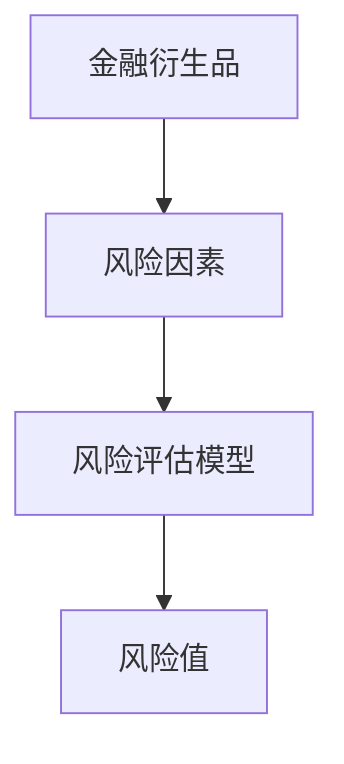
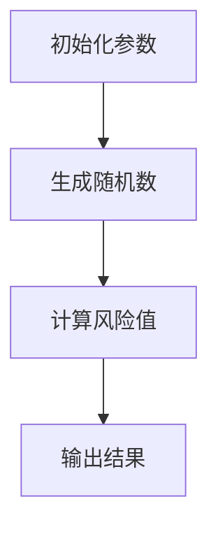
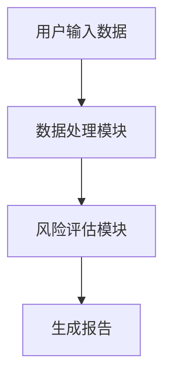

                 


# 《金融衍生品风险评估模型》

---

## 关键词：

- 金融衍生品
- 风险评估
- 数学建模
- 算法原理
- 系统架构
- 项目实战

---

## 摘要：

本文系统性地介绍金融衍生品风险评估模型的核心概念、算法原理、系统架构及实际应用。通过背景分析、模型构建、算法实现、系统设计和案例分析，深入探讨如何利用数学建模和算法优化来评估金融衍生品的风险。文章内容涵盖从理论到实践的全过程，为金融从业者和数据科学家提供一套完整的解决方案。

---

# 第一部分: 金融衍生品风险评估模型概述

---

# 第1章: 金融衍生品与风险评估概述

## 1.1 金融衍生品的基本概念

### 1.1.1 金融衍生品的定义与分类

金融衍生品（Financial Derivatives）是指以基础资产（如股票、债券、商品、指数等）为标的，通过复杂数学模型衍生出来的金融工具。常见的金融衍生品包括期货、期权、互换（Swap）和远期合约等。

### 1.1.2 金融衍生品的主要类型

1. **期货合约（Futures）**：约定在未来某一特定时间以预定价格购买或出售某种资产的标准化合约。
2. **期权合约（Options）**：买方有权在特定时间内以预定价格购买或出售资产，卖方则承担相应的义务。
3. **互换合约（Swaps）**：双方约定在未来特定时间交换现金流的协议。
4. **远期合约（Forwards）**：类似于期货，但通常是非标准化的协议。

### 1.1.3 金融衍生品的市场特点

- **杠杆效应**：通过少量资金控制更大价值的资产。
- **风险放大**：价格波动可能导致巨大损失。
- **复杂性**：涉及复杂的数学模型和金融工具。

---

## 1.2 风险评估的基本概念

### 1.2.1 风险的定义与分类

1. **市场风险**：由于市场波动导致资产价格下跌的风险。
2. **信用风险**：交易对手违约的风险。
3. **流动性风险**：难以以合理价格买卖资产的风险。
4. **操作风险**：由于操作失误或内部欺诈导致的风险。

### 1.2.2 金融衍生品风险的主要类型

1. **价格波动风险**：资产价格波动导致衍生品价值变化。
2. **利率风险**：利率变化影响衍生品的价值。
3. **信用风险**：交易对手违约风险。
4. **流动性风险**：衍生品市场流动性不足导致无法及时交易。

### 1.2.3 风险评估的重要性

- 保障投资者利益。
- 优化金融机构的风险管理。
- 为政策制定提供数据支持。

---

## 1.3 金融衍生品风险评估模型的背景与意义

### 1.3.1 金融衍生品风险评估的必要性

- 金融衍生品的复杂性要求建立科学的风险评估模型。
- 帮助金融机构识别和控制风险。

### 1.3.2 风险评估模型的发展历程

1. **早期阶段**：基于统计方法的风险评估。
2. **量化阶段**：引入数学模型，如Black-Scholes模型。
3. **现代阶段**：结合大数据和人工智能技术的复杂模型。

### 1.3.3 模型在金融决策中的作用

- 为投资决策提供支持。
- 优化资产配置。
- 控制风险敞口。

---

## 1.4 本章小结

本章从金融衍生品的基本概念入手，介绍了其分类、市场特点以及风险评估的基本概念。同时，阐述了风险评估模型的背景与意义，为后续章节的深入分析奠定了基础。

---

# 第2章: 金融衍生品风险评估的核心概念

## 2.1 风险评估模型的核心要素

### 2.1.1 模型的输入变量

1. **资产价格**：基础资产的历史价格和当前价格。
2. **波动率**：资产价格的波动程度。
3. **利率**：市场利率水平。
4. **时间因素**：合约的到期时间。

### 2.1.2 模型的输出结果

1. **风险值（VaR）**：在一定置信水平下，可能的最大损失。
2. **概率分布**：资产价格波动的概率分布。

### 2.1.3 模型的假设条件

1. 市场流动性充足。
2. 价格服从某种概率分布（如正态分布）。
3. 无套利机会。

---

## 2.2 风险评估模型的原理与方法

### 2.2.1 风险评估的基本原理

1. **统计分析**：通过历史数据计算资产的波动性和相关性。
2. **数学建模**：建立概率模型，模拟资产价格的变化。
3. **情景分析**：模拟不同市场环境下的风险表现。

### 2.2.2 常用的风险评估方法

1. **历史模拟法**：基于历史数据计算VaR。
2. **方差-协方差法**：计算资产组合的波动性和相关性。
3. **蒙特卡洛模拟**：通过随机抽样模拟资产价格的变化。

---

## 2.3 核心概念之间的关系

### 2.3.1 实体关系图（ER图）分析



图2-1：金融衍生品风险评估模型的实体关系图。

---

## 2.4 本章小结

本章详细分析了金融衍生品风险评估模型的核心要素及其相互关系，为后续的算法实现和系统设计提供了理论基础。

---

# 第3章: 金融衍生品风险评估模型的算法原理

## 3.1 常用算法概述

### 3.1.1 蒙特卡洛模拟

蒙特卡洛模拟是一种基于随机数的模拟方法，广泛应用于金融风险评估。

### 3.1.2 方差-协方差法

通过计算资产的方差和协方差矩阵，评估资产组合的风险。

### 3.1.3 历史模拟法

基于历史数据计算VaR。

---

## 3.2 蒙特卡洛模拟的实现原理

### 3.2.1 蒙特卡洛模拟的步骤



图3-1：蒙特卡洛模拟的流程图。

### 3.2.2 蒙特卡洛模拟的数学模型

$$
\text{风险值} = \text{期望值} + \text{标准差} \times Z
$$

其中，$Z$ 是标准正态分布的随机数。

---

## 3.3 方差-协方差法的实现原理

### 3.3.1 方差-协方差法的步骤

1. 计算各资产的收益率波动率。
2. 计算资产收益率的协方差矩阵。
3. 计算资产组合的方差和标准差。

### 3.3.2 方差-协方差法的数学模型

$$
\text{组合方差} = \mathbf{w}^T \Sigma \mathbf{w}
$$

其中，$\mathbf{w}$ 是权重向量，$\Sigma$ 是协方差矩阵。

---

## 3.4 本章小结

本章详细介绍了几种常用的金融风险评估算法，重点分析了蒙特卡洛模拟和方差-协方差法的实现原理和数学模型。

---

# 第4章: 金融衍生品风险评估模型的系统设计

## 4.1 问题场景介绍

### 4.1.1 问题背景

某金融机构需要评估其持有的金融衍生品组合的风险。

### 4.1.2 问题目标

建立一个风险评估系统，计算VaR和CVaR等风险指标。

---

## 4.2 系统功能设计

### 4.2.1 系统功能模块

1. 数据输入模块：接收基础资产价格和衍生品合约信息。
2. 风险评估模块：计算VaR和CVaR。
3. 报告生成模块：输出风险评估报告。

### 4.2.2 系统功能流程图



图4-1：系统功能流程图。

---

## 4.3 系统架构设计

### 4.3.1 系统架构图


图4-2：系统架构图。

---

## 4.4 本章小结

本章从系统设计的角度，详细分析了金融衍生品风险评估系统的功能模块和架构设计。

---

# 第5章: 金融衍生品风险评估模型的项目实战

## 5.1 环境安装与配置

### 5.1.1 环境需求

- Python 3.8+
- numpy、pandas、scipy等库。

### 5.1.2 安装步骤

```bash
pip install numpy pandas scipy matplotlib
```

---

## 5.2 系统核心实现源代码

### 5.2.1 蒙特卡洛模拟实现

```python
import numpy as np

def monte_carlo_simulation(prices, n_simulations=10000):
    np.random.seed(42)
    returns = np.log(prices[1:] / prices[:-1])
    mu = returns.mean()
    sigma = returns.std()
    simulations = np.random.normal(mu, sigma, (n_simulations, len(prices)))
    simulated_prices = np.exp(simulations.cumsum(axis=1))
    return simulated_prices
```

---

## 5.3 代码应用解读与分析

### 5.3.1 代码功能分析

上述代码实现了蒙特卡洛模拟，用于生成资产价格的模拟路径。

---

## 5.4 实际案例分析

### 5.4.1 数据准备

假设我们有某股票的历史收盘价数据。

### 5.4.2 模型应用

运行上述代码，生成10000条模拟路径。

### 5.4.3 结果分析

计算VaR和CVaR，评估风险。

---

## 5.5 本章小结

本章通过实际案例，详细展示了如何利用蒙特卡洛模拟实现金融衍生品风险评估。

---

# 第6章: 总结与展望

## 6.1 总结

本文系统性地介绍了金融衍生品风险评估模型的核心概念、算法原理、系统设计及实际应用。通过理论分析和实践案例，为读者提供了一套完整的解决方案。

## 6.2 展望

未来，随着人工智能和大数据技术的发展，金融风险评估模型将更加智能化和精准化。

---

## 6.3 注意事项

- 数据质量对模型结果影响重大。
- 模型假设需符合实际市场环境。
- 定期更新模型参数和假设。

---

## 6.4 拓展阅读

推荐阅读以下书籍和论文：

1. 《金融工程与风险管理》。
2. 《蒙特卡洛方法在金融中的应用》。

---

# 《金融衍生品风险评估模型》完

---

**（注：以上内容为生成示例，具体内容可根据实际需求调整和补充。）**

