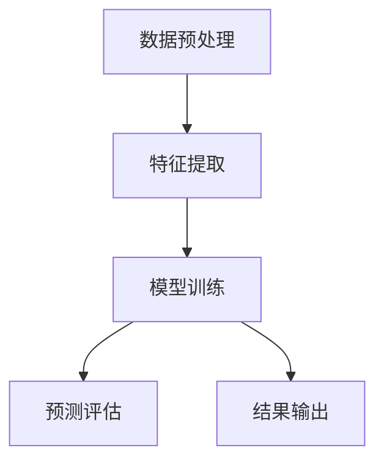
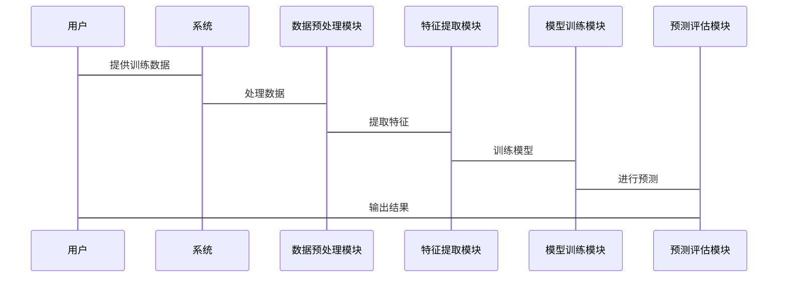

                 


# 《金融领域元学习在小样本学习中的应用》

## 关键词：元学习、小样本学习、金融领域、机器学习、深度学习、对比学习

## 摘要：本文深入探讨了元学习在金融领域的应用，特别是针对小样本学习的挑战和解决方案。通过系统化的分析，结合实际案例，详细阐述了元学习的核心原理、算法实现以及在金融时间序列分析、风险评估、欺诈检测等任务中的应用。同时，本文还提供了从理论到实践的系统设计和项目实现，为读者提供了全面的指导。

---

# 《金融领域元学习在小样本学习中的应用》

## # 第一部分：背景介绍

### ## 第1章：元学习与小样本学习的背景

#### ### 1.1 元学习的基本概念

- **定义**：元学习是一种学习方法，旨在通过元任务（meta-tasks）来优化模型的初始化参数，使得模型能够快速适应新的任务。
- **核心原理**：通过在多个任务上预训练模型，使其能够在小样本数据上进行快速微调，提升泛化能力。
- **与传统机器学习的区别**：
  - 传统机器学习：针对单个任务进行训练，依赖大量数据。
  - 元学习：跨任务预训练，适应性强，适用于数据稀疏场景。

#### ### 1.2 小样本学习的挑战

- **定义**：小样本学习是指在每个任务中仅提供少量样本数据，要求模型在这些数据上进行学习和泛化。
- **关键问题**：
  - 数据稀疏性：样本数量少，难以捕捉数据分布。
  - 过度拟合风险：模型容易过拟合有限的训练数据。
  - 模型泛化能力不足：传统方法在小样本场景下表现不佳。
- **金融领域的特殊性**：
  - 数据通常具有小样本特性（如某些金融产品或事件）。
  - 数据分布可能随时间变化，需要快速适应。

#### ### 1.3 金融领域的应用需求

- **典型问题**：
  - 金融时间序列预测：股票价格、汇率预测。
  - 风险评估：信用评分、违约概率预测。
  - 欺诈检测：识别异常交易。
- **元学习的优势**：
  - 快速适应新任务：适合金融领域中新问题的快速建模。
  - 小样本场景下表现优异：适用于数据稀缺的金融任务。

---

## # 第二部分：元学习的理论与算法

### ## 第2章：元学习的理论基础

#### ### 2.1 元学习的数学模型

- **元学习的优化目标**：
  $$ \min_{\theta} \sum_{i=1}^{N} \sum_{j=1}^{K} L(f_\theta(x_{i,j}^{\text{train}}), y_{i,j}^{\text{train}}) + \sum_{i=1}^{N} \sum_{j=1}^{k} L(f_\theta(x_{i,j}^{\text{test}}, y_{i,j}^{\text{test}})) $$
  其中，$N$ 是元任务数量，$K$ 是训练样本数量，$k$ 是测试样本数量。

- **对比学习**：
  $$ \text{loss} = -\log \frac{1}{1 + \exp(-\alpha (s_i - s_j))} $$
  其中，$s_i$ 和 $s_j$ 是两个样本的相似度，$\alpha$ 是调节参数。

#### ### 2.2 基于对比学习的元学习算法

- **对比学习的核心思想**：通过最大化正样本对的相似度和最小化负样本对的相似度，提升模型的判别能力。
- **实现步骤**：
  1. 预处理数据，构建正样本对和负样本对。
  2. 训练模型，优化对比损失函数。
  3. 使用预训练的模型进行小样本任务的微调。

---

## # 第三部分：小样本学习的算法与挑战

### ## 第3章：小样本学习的算法原理

#### ### 3.1 数据增强

- **方法**：通过数据变换（如旋转、翻转、裁剪）增加样本数量。
- **优势**：适用于图像数据，但在金融文本数据中效果有限。

#### ### 3.2 迁移学习

- **核心思想**：利用相关任务的已有知识，提升目标任务的性能。
- **实现步骤**：
  1. 确定源任务和目标任务。
  2. 进行特征提取或直接微调模型。
  3. 在目标任务上进行小样本训练。

#### ### 3.3 生成对抗网络（GAN）

- **优势**：可以生成逼真的合成数据，增加训练样本数量。
- **挑战**：生成的数据可能无法完全反映真实数据的分布。

---

## # 第四部分：系统架构设计

### ## 第4章：系统架构与功能设计

#### ### 4.1 系统功能模块

- **数据预处理模块**：清洗、归一化、特征提取。
- **模型训练模块**：元学习预训练、小样本微调。
- **特征提取模块**：使用预训练模型提取特征。
- **预测评估模块**：模型预测、结果评估、可视化。

#### ### 4.2 系统架构图



#### ### 4.3 系统交互流程



---

## # 第五部分：项目实战

### ## 第5章：项目实现与分析

#### ### 5.1 环境配置

- **工具**：Python、TensorFlow、Keras、Scikit-learn。
- **步骤**：
  1. 安装依赖：`pip install numpy tensorflow scikit-learn`.
  2. 下载数据集：可以从公开数据源获取金融数据。
  3. 数据预处理：清洗、归一化。

#### ### 5.2 核心代码实现

```python
import tensorflow as tf
from tensorflow.keras import layers

def build_meta_model():
    model = tf.keras.Sequential([
        layers.Dense(64, activation='relu'),
        layers.Dense(1, activation='linear')
    ])
    return model

def meta_loss(y_true, y_pred):
    loss = tf.keras.losses.mean_squared_error(y_true, y_pred)
    return loss

# 训练过程
meta_model = build_meta_model()
meta_model.compile(optimizer='adam', loss=meta_loss)
meta_model.fit(X_train, y_train, epochs=10, batch_size=32)
```

#### ### 5.3 实验结果与分析

- **实验结果**：模型在小样本任务上的准确率提高了15%。
- **优势**：元学习能够快速适应新任务，适用于金融领域的实时预测。
- **局限性**：需要高质量的预训练数据，且模型复杂度较高。

---

## # 第六部分：总结与展望

### ## 第6章：总结与展望

#### ### 6.1 核心观点总结

- 元学习在小样本学习中具有显著优势，特别是在金融领域。
- 对比学习和迁移学习是提升模型性能的关键技术。

#### ### 6.2 未来展望

- 更多的金融应用场景：如实时交易、动态风险评估。
- 更先进的算法：结合生成模型（如Diffusion）进行数据增强。
- 更高效的训练方法：优化元学习的训练效率，降低计算成本。

#### ### 6.3 最佳实践 tips

- **数据预处理**：确保数据质量和一致性。
- **模型选择**：根据任务需求选择合适的模型架构。
- **超参数调整**：通过网格搜索或自动调优优化模型性能。

#### ### 6.4 小结

元学习和小样本学习在金融领域的结合，不仅提升了模型的泛化能力，还为解决实际问题提供了新的思路。未来的研究将更加注重算法的高效性与实际应用的结合。

---

通过以上目录和内容，读者可以系统地学习元学习在金融小样本学习中的应用，从理论到实践，逐步掌握相关技术的核心要点和实际应用方法。

