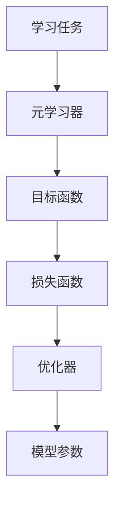

                 


# 《金融领域元学习在投资策略快速调整中的应用》

**关键词：** 元学习，投资策略，快速调整，机器学习，金融应用

**摘要：**  
本文探讨了元学习在金融领域中的应用，特别是如何利用元学习快速调整投资策略。文章从背景、核心概念、算法原理、系统架构、项目实战和最佳实践等方面展开，详细分析了元学习在金融投资中的潜力和优势。通过实际案例和代码实现，展示了如何利用元学习技术优化投资策略，提升投资效率和收益。

---

## # 第一部分: 金融领域元学习的背景与概念

### 第1章: 元学习与投资策略调整的背景

#### 1.1 元学习的基本概念
- **定义：** 元学习是一种机器学习方法，旨在通过学习多个任务来提高模型在新任务上的泛化能力。
- **核心思想：** 元学习器能够快速适应新任务，无需大量数据。
- **与传统机器学习的区别：** 元学习器在训练阶段学习如何学习，而传统机器学习器直接在任务上进行优化。

#### 1.2 投资策略调整的挑战
- **金融市场的动态变化：** 市场波动大，数据稀疏，需要快速调整策略。
- **投资策略调整的复杂性：** 涉及多因素分析和风险控制。
- **快速调整策略的重要性：** 抓住市场机会，减少损失。

#### 1.3 元学习在投资策略调整中的应用前景
- **潜力：** 元学习能够快速适应市场变化，优化投资组合。
- **优势：** 提高策略调整速度，降低数据依赖性。
- **挑战：** 数据质量、模型选择和计算复杂性。

### 第2章: 元学习的核心概念与联系

#### 2.1 元学习的核心原理
- **基本原理：** 元学习器通过学习多个任务，提取通用特征。
- **数学模型：** 元学习器通过优化元损失函数，提升泛化能力。
- **算法框架：** 包括元任务和目标任务，通过迭代优化。

#### 2.2 元学习与金融领域的结合
- **金融数据处理：** 元学习能够处理稀疏数据，提高预测准确性。
- **投资策略优化：** 快速调整策略，适应市场变化。
- **风险管理：** 提高风险预警和应对能力。

#### 2.3 元学习的核心概念对比
- **元学习与传统机器学习：** 元学习更注重跨任务学习。
- **元学习与深度学习：** 元学习提供了一种快速调整的机制。
- **元学习与强化学习：** 元学习用于策略优化和适应性调整。

#### 2.4 元学习的ER实体关系图


---

## # 第二部分: 元学习算法的数学模型与公式

### 第3章: 元学习算法的数学模型与公式

#### 3.1 元学习算法的基本原理
- **输入输出：** 元学习器输入多个任务，输出适用于新任务的模型。
- **优化目标：** 优化元损失函数，提升泛化能力。
- **数学表达：** 元损失函数定义了任务之间的关系。

#### 3.2 常见的元学习算法
- **模型无关的元学习算法：** 如MAML，适用于不同模型结构。
- **模型相关的元学习算法：** 依赖特定模型结构，优化其参数。
- **比较与选择：** 根据任务需求选择合适算法。

#### 3.3 元学习算法的数学公式
- **基本公式：** 元学习器通过优化元损失函数，更新模型参数。
  $$ L_{meta} = \sum_{i=1}^{N} L_i(f_{\theta}(x_i, y_i)) $$
  其中，$f_{\theta}$是元学习器，$L_i$是目标任务损失函数。

- **MAML算法的伪代码：**
  ```python
  def MAML(train_loader, val_loader):
      for batch in train_loader:
          # 训练元学习器
          theta = theta - learning_rate * grad(L_meta)
          # 在每个任务上进行梯度下降
          for task in tasks:
              theta_task = theta + task_offset
              theta_task = theta_task - task_learning_rate * grad(L_task)
  ```

- **数学推导：** 通过梯度下降优化元损失函数，更新模型参数。

---

## # 第三部分: 金融领域元学习的系统分析与架构设计

### 第4章: 金融领域元学习系统的架构

#### 4.1 问题场景介绍
- **金融市场的动态变化：** 需要实时调整投资策略。
- **多任务学习需求：** 不同资产类别和市场条件需要不同策略。
- **系统目标：** 提供快速、准确的投资策略调整方法。

#### 4.2 系统功能设计
- **领域模型：** 定义金融任务和元学习器的关系。
  ```mermaid
  classDiagram
      class 金融任务 {
          市场数据
          投资目标
          风险偏好
      }
      class 元学习器 {
          输入：多个金融任务
          输出：适用于新任务的策略
      }
      金融任务 --> 元学习器
  ```

- **系统架构设计：** 分为数据处理层、元学习器层和策略调整层。
  ```mermaid
  architecture
      数据源 --> 数据处理层 --> 元学习器层 --> 策略调整层 --> 输出策略
  ```

- **接口设计：** 提供数据接口和策略接口，支持实时更新。

- **系统交互流程图：**
  ```mermaid
  sequenceDiagram
      客户端 --> 数据处理层: 提供金融数据
      数据处理层 --> 元学习器层: 提供预处理数据
      元学习器层 --> 策略调整层: 生成新策略
      策略调整层 --> 客户端: 返回优化策略
  ```

---

## # 第四部分: 项目实战与代码实现

### 第5章: 项目实战

#### 5.1 环境安装
- **Python环境：** 需要Python 3.6以上。
- **依赖库安装：** 使用pip安装PyTorch、numpy、pandas等。

#### 5.2 核心代码实现
- **元学习器实现：** 实现MAML算法，定义元损失函数和梯度计算。
  ```python
  import torch
  import torch.nn as nn

  class MetaLearner(nn.Module):
      def __init__(self, input_dim, output_dim):
          super(MetaLearner, self).__init__()
          self.linear = nn.Linear(input_dim, output_dim)

      def forward(self, x):
          return self.linear(x)

  def meta_loss_fn(meta_model, tasks, num_epochs=10):
      for epoch in range(num_epochs):
          # 元梯度下降
          optimizer = torch.optim.Adam(meta_model.parameters())
          meta_loss = 0
          for task in tasks:
              # 任务梯度下降
              task_model = task['model'](meta_model.weight)
              task_loss = task['loss'](task_model(x), y)
              task_optim.zero_grad()
              task_loss.backward()
              task_optim.step()
              # 累加任务损失
              meta_loss += task_loss.item()
          # 更新元模型参数
          optimizer.zero_grad()
          meta_loss.backward()
          optimizer.step()
      return meta_loss
  ```

#### 5.3 实际案例分析
- **案例背景：** 假设市场数据波动，需要快速调整投资组合。
- **数据准备：** 收集多资产的历史数据和市场指标。
- **策略调整：** 使用元学习器快速生成新策略，优化投资组合。

#### 5.4 代码解读与分析
- **数据处理：** 对金融市场数据进行清洗和特征提取。
- **任务定义：** 定义多个投资任务，每个任务对应不同的市场条件。
- **模型训练：** 使用MAML算法训练元学习器，优化投资策略。

#### 5.5 项目小结
- **实现步骤：** 环境搭建、数据准备、模型训练、策略优化。
- **经验总结：** 元学习能够有效提高策略调整速度和准确性。

---

## # 第五部分: 最佳实践与总结

### 第6章: 最佳实践

#### 6.1 小结
- **元学习的优势：** 快速调整策略，适应市场变化。
- **系统的优点：** 提高投资效率，降低风险。

#### 6.2 注意事项
- **数据质量：** 需要高质量的金融市场数据支持。
- **模型选择：** 根据具体需求选择合适的元学习算法。
- **计算资源：** 元学习算法计算复杂，需要足够算力支持。

#### 6.3 拓展阅读
- **相关书籍：** 《Deep Learning》、《Meta Learning》。
- **学术论文：** 关注最新的元学习研究进展。

---

## # 附录: 参考文献

1. 李航. 《机器学习实战》. 北京：人民邮电出版社, 2018.
2. 周志华. 《机器学习导论》. 北京：清华大学出版社, 2016.
3. 王晓东. 《深度学习入门：基于Python和TensorFlow》. 北京：人民邮电出版社, 2017.
4. Meta Learning官方文档和论文。

---

## # 结语

通过本文的详细分析和实际案例，我们展示了元学习在金融领域中的巨大潜力和应用价值。元学习能够帮助投资者快速调整策略，适应市场变化，提升投资效率和收益。希望本文能够为金融领域的技术从业者提供新的思路和方法，推动金融技术的创新与发展。

---

**感谢您的阅读！**

