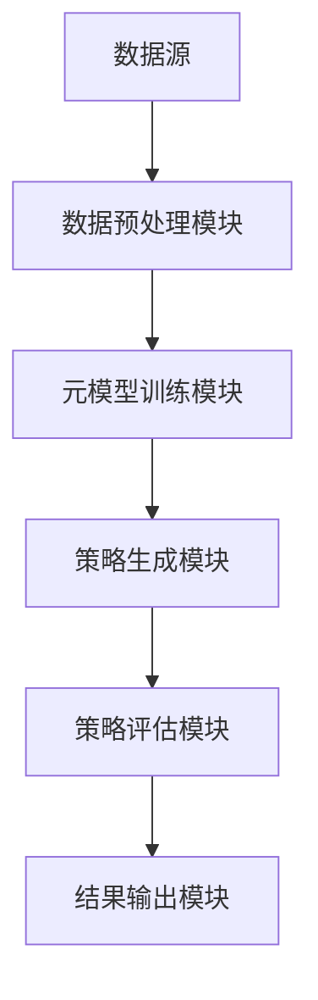

                 


# 《金融领域元学习在投资策略快速迭代中的应用》

## 关键词：元学习，金融投资，投资策略，快速迭代，算法原理，系统架构

## 摘要：  
本文探讨了元学习在金融领域投资策略快速迭代中的应用。首先，介绍了元学习的基本概念和其在金融投资中的背景需求；接着，详细分析了元学习的核心原理、数学模型及其在投资策略中的具体应用；然后，从系统架构的角度，阐述了如何设计一个基于元学习的投资策略快速迭代系统；最后，通过实际案例展示了如何利用元学习算法快速生成和优化投资策略，并总结了实际应用中的注意事项和未来发展方向。

---

# 第一部分: 元学习的背景与概念

## 第1章: 元学习的基本概念与背景

### 1.1 元学习的定义与核心概念  
元学习（Meta-Learning）是一种高级的机器学习方法，旨在通过在多个任务上的学习，使得模型能够快速适应新任务。其核心在于“学会学习”，即通过元学习算法，模型能够在少量数据下快速掌握新任务的特征和规律。

#### 1.1.1 元学习的基本定义  
元学习的目标是通过元训练（meta-training）过程，让模型具备在新任务上快速调整的能力。元学习的核心在于“元模型”的构建，这个模型能够通过参数更新的方式，快速适应新任务。

#### 1.1.2 元学习的核心概念与特征  
1. **元任务（Meta-Task）**：元学习中的任务集合，用于训练元模型，使得模型能够快速适应新任务。
2. **元模型（Meta-Model）**：用于生成新任务模型的模型，通常包含参数更新机制。
3. **快速适应（Fast Adaptation）**：元模型能够在新任务上通过少量数据快速调整参数，以适应任务需求。

#### 1.1.3 元学习与传统机器学习的对比  
| 特性               | 传统机器学习         | 元学习             |
|--------------------|----------------------|--------------------|
| 数据需求           | 需要大量数据         | 需要少量数据       |
| 任务适应性         | 适用于单一任务       | 适用于多个任务     |
| 灵活性             | 较低                | 较高              |

### 1.2 元学习在金融领域的应用背景  
金融领域的投资策略往往需要面对快速变化的市场环境，传统的策略优化方法难以快速适应市场波动。元学习的快速适应能力为金融投资提供了新的解决方案。

#### 1.2.1 金融投资中的快速迭代需求  
金融市场的数据具有高度的动态性，投资策略需要能够快速响应市场变化。元学习的快速适应能力使其成为金融投资的潜在解决方案。

#### 1.2.2 传统投资策略的局限性  
传统投资策略通常依赖于大量的历史数据和复杂的模型，但在面对市场突变时，往往难以快速调整。元学习通过快速参数更新，能够有效应对这种挑战。

#### 1.2.3 元学习在投资策略中的潜在优势  
- **快速适应性**：元学习能够在新数据上快速调整模型，适应市场变化。
- **多任务学习**：元学习能够同时优化多个投资策略，提升整体表现。
- **数据高效性**：元学习能够在少量数据上快速生成有效的投资策略。

### 1.3 本章小结  
本章介绍了元学习的基本概念及其在金融投资中的应用背景，强调了元学习在投资策略快速迭代中的潜在优势。

---

# 第二部分: 元学习的核心概念与原理

## 第2章: 元学习的原理与数学模型  

### 2.1 元学习的原理  
元学习的核心在于通过元训练过程，构建一个能够快速适应新任务的元模型。

#### 2.1.1 元学习的框架与流程  
1. **元训练阶段**：通过多个元任务训练元模型，使其具备快速调整参数的能力。
2. **任务适应阶段**：在新任务上，通过快速参数更新，生成适用于该任务的模型。

#### 2.1.2 元学习的核心算法  
元学习的典型算法包括MAML（Meta-Automatic Learning）和ReMAML（Recurrent Meta-Learning）等。

#### 2.1.3 元学习的优化目标  
元学习的目标是通过优化元损失函数，使得元模型在新任务上表现最优。

### 2.2 元学习的数学模型与公式  

#### 2.2.1 元学习的损失函数  
元损失函数通常由两个部分组成：元任务的损失和参数更新的损失。  
$$ L(\theta, \theta') = \sum_{i=1}^{n} L_i(\theta, \theta') $$  

#### 2.2.2 元学习的优化算法  
元学习的优化过程通常包括两个步骤：外层优化和内层优化。  
外层优化用于更新元模型参数：  
$$ \theta_{new} = \theta - \eta \nabla L $$  

内层优化用于更新任务模型参数：  
$$ \theta' = \theta + \alpha \nabla_{\theta} L_i(\theta, \theta') $$  

### 2.3 元学习与其他学习方法的对比  

| 方法       | 优点                           | 缺点                           |
|------------|--------------------------------|--------------------------------|
| 传统机器学习 | 简单，适合单一任务             | 数据需求大，适应性差           |
| 迁移学习     | 利用已有知识，适合跨任务       | 过度依赖任务相似性             |
| 元学习      | 快速适应新任务，数据高效       | 算法复杂，实现难度大           |

---

## 第3章: 元学习在投资策略中的应用  

### 3.1 投资策略快速迭代的需求分析  

#### 3.1.1 投资策略的多样性和复杂性  
金融市场中的策略多样，不同策略适用于不同的市场环境。元学习能够帮助快速选择和优化最优策略。

#### 3.1.2 快速市场变化对投资策略的影响  
市场波动和突发事件要求投资策略能够快速调整，元学习的快速适应能力正是解决这一问题的关键。

#### 3.1.3 元学习在策略迭代中的优势  
- **快速调整**：元学习能够在短时间内生成适用于新市场的策略。
- **多策略优化**：元学习可以同时优化多个策略，提升整体表现。
- **数据高效性**：元学习能够在有限的数据上快速生成有效策略。

---

### 3.2 元学习在投资策略中的具体应用  

#### 3.2.1 基于元学习的策略生成  
通过元学习算法，可以快速生成适用于不同市场的投资策略。

#### 3.2.2 元学习在风险控制中的应用  
元学习可以帮助模型快速识别和应对市场风险，优化风险控制策略。

#### 3.2.3 元学习在市场预测中的应用  
元学习可以用于多市场的预测任务，通过快速参数调整，提升预测准确率。

---

### 3.3 本章小结  
本章详细探讨了元学习在投资策略中的具体应用，强调了其在策略生成、风险控制和市场预测中的优势。

---

# 第三部分: 元学习算法的实现与优化  

## 第4章: 元学习算法的实现原理  

### 4.1 基于模型的元学习算法  

#### 4.1.1 MAML算法的实现步骤  
MAML（Meta-Automatic Learning）是一种典型的基于模型的元学习算法。其主要步骤如下：  
1. **初始化**：随机初始化元模型参数。  
2. **元训练**：通过多个元任务训练元模型，优化参数。  
3. **任务适应**：在新任务上，通过快速参数更新生成任务模型。  

#### 4.1.2 ReMAML算法的实现步骤  
ReMAML（Recurrent Meta-Learning）是一种基于循环结构的元学习算法，适用于时间序列数据。

---

## 第5章: 元学习算法的优化与实现  

### 5.1 元学习算法的优化策略  

#### 5.1.1 参数初始化优化  
通过优化初始参数，可以提升元模型的收敛速度和最终性能。

#### 5.1.2 超参数调节  
选择合适的超参数（如学习率、任务数量）能够显著提升算法性能。

#### 5.1.3 数据增强策略  
通过数据增强，可以提升元模型的泛化能力，减少数据不足的影响。

### 5.2 元学习算法的实现案例  

#### 5.2.1 代码实现  
以下是一个基于MAML的元学习算法的Python实现示例：

```python
import torch
import torch.nn as nn

class MetaLearner(nn.Module):
    def __init__(self, meta_params):
        super().__init__()
        # 元模型参数
        self.meta_params = meta_params
    
    def forward(self, x, y):
        # 生成任务模型参数
        theta = self.meta_params + x
        # 生成预测结果
        y_pred = theta * x
        # 计算损失
        loss = (y_pred - y).pow(2).mean()
        return y_pred, loss

# 元模型训练
meta_model = MetaLearner(meta_params=torch.randn(1))
optimizer = torch.optim.Adam(meta_model.parameters(), lr=0.01)

for batch in meta_train_loader:
    x, y = batch
    y_pred, loss = meta_model(x, y)
    # 反向传播并优化
    optimizer.zero_grad()
    loss.backward()
    optimizer.step()
```

---

## 第6章: 系统分析与架构设计方案  

### 6.1 投资策略快速迭代的系统场景  

#### 6.1.1 系统目标  
通过元学习算法，实现投资策略的快速生成和优化。

#### 6.1.2 系统功能需求  
- 数据采集与预处理  
- 元模型训练与优化  
- 策略生成与评估  

---

### 6.2 系统架构设计  

#### 6.2.1 系统架构图  
以下是一个基于元学习的投资策略快速迭代系统的架构图：



---

## 第7章: 项目实战  

### 7.1 环境安装与配置  

#### 7.1.1 安装Python和相关库  
安装Python 3.8及以上版本，并安装PyTorch、numpy、pandas等库。

#### 7.1.2 数据准备  
使用公开的金融数据集，如股票价格数据。

### 7.2 系统核心实现  

#### 7.2.1 元模型训练  
通过Python代码实现元模型的训练和优化。

#### 7.2.2 策略生成与评估  
通过训练好的元模型，生成适用于新任务的投资策略，并评估其表现。

### 7.3 实际案例分析  

#### 7.3.1 数据分析与特征提取  
通过对历史数据的分析，提取有用的特征。

#### 7.3.2 策略生成与回测  
通过元学习算法生成投资策略，并进行回测分析。

### 7.4 项目总结与经验分享  

#### 7.4.1 项目成果  
成功实现了基于元学习的投资策略快速迭代系统。

#### 7.4.2 经验与教训  
数据质量对模型性能影响巨大，需要重视数据预处理和特征提取。

---

## 第8章: 最佳实践、小结与注意事项  

### 8.1 最佳实践  

#### 8.1.1 数据质量  
确保数据的准确性和完整性，避免噪声干扰。

#### 8.1.2 模型调优  
合理选择超参数，进行充分的交叉验证和调优。

#### 8.1.3 持续学习  
定期更新元模型，保持其适应性。

### 8.2 小结  

#### 8.2.1 元学习的优势  
- 快速适应新任务  
- 数据高效性  
- 多任务优化能力  

#### 8.2.2 元学习的局限性  
- 算法复杂，实现难度大  
- 对计算资源要求较高  

### 8.3 注意事项  

#### 8.3.1 数据隐私与安全  
在实际应用中，需注意数据隐私和安全问题。

#### 8.3.2 模型解释性  
元学习模型通常缺乏解释性，可能影响实际应用的可接受性。

#### 8.3.3 市场波动风险  
金融市场具有高度不确定性，需谨慎使用元学习模型进行投资决策。

### 8.4 拓展阅读  

#### 8.4.1 推荐书目  
1. 《深度学习》—— Ian Goodfellow  
2. 《元学习：从理论到实践》—— Meta-Learning: Theory and Practice  

#### 8.4.2 推荐论文  
1. "Meta-Learning via Backpropagation"  
2. "Recurrent Meta-Learning: A Survey"  

---

## 结语  

元学习在金融领域投资策略的快速迭代中展现出巨大潜力。通过本文的探讨，我们深入分析了元学习的核心原理、算法实现及其在投资策略中的具体应用。未来，随着算法的优化和计算能力的提升，元学习将在金融领域发挥更重要的作用。

---

## 致谢  

感谢读者的耐心阅读，感谢同行们的宝贵意见和建议。

---

## 参考文献  

（此处列出相关的书籍和论文参考文献）

