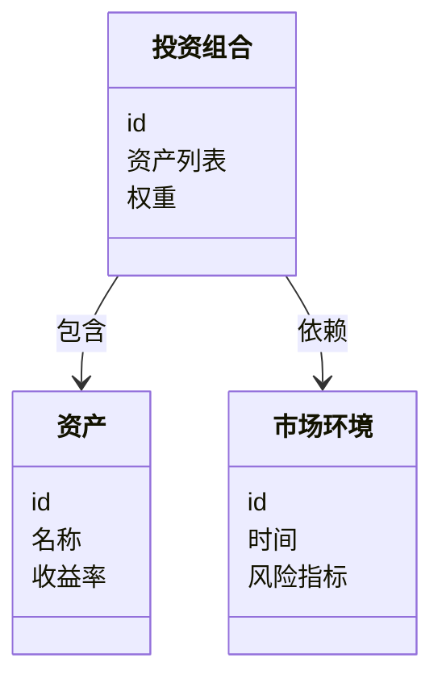

                 


# 《金融领域元学习在投资组合快速调整中的应用》

> 关键词：元学习，投资组合优化，快速调整，金融建模，机器学习

> 摘要：本文深入探讨了元学习在金融投资组合优化中的应用，分析了其核心概念、算法原理、系统架构，并通过实际案例展示了如何利用元学习快速调整投资组合，实现高效的风险控制和收益最大化。

---

# 第一部分：背景介绍

## 第1章：元学习与投资组合优化的背景

### 1.1 元学习的基本概念

#### 1.1.1 元学习的定义与特点

元学习是一种机器学习的高级方法，其核心在于通过学习如何学习，从而能够快速适应新任务或数据的变化。与传统机器学习不同，元学习强调模型的泛化能力，能够在少量数据或经验下完成新任务的适应。其主要特点包括：

- **层次化学习**：元学习通过构建层次化的模型，能够将不同任务的知识进行整合和迁移。
- **快速适应**：元学习能够快速适应新任务，无需大量重新训练。
- **灵活性与泛化性**：元学习模型具有较高的灵活性，能够在不同领域和任务中进行迁移。

#### 1.1.2 投资组合优化的基本原理

投资组合优化是指通过科学的资产配置，使得投资组合在风险和收益之间达到最佳平衡。其核心在于根据市场环境和投资者需求，动态调整资产权重，以实现收益最大化或风险最小化。

传统的投资组合优化方法（如均值-方差模型）虽然经典，但在实际应用中面临以下挑战：

- **市场波动性**：金融市场具有高度不确定性，传统方法难以快速适应市场变化。
- **数据稀疏性**：在新兴市场或小样本数据下，传统方法的表现受限。
- **计算复杂性**：复杂的优化问题需要大量计算资源，且难以实时调整。

### 1.2 元学习在金融领域的应用背景

#### 1.2.1 金融领域的复杂性与挑战

金融市场是一个高度动态和不确定的环境，传统的静态模型难以应对市场的快速变化。投资者需要一种能够快速调整投资组合的方法，以应对市场波动、政策变化和突发事件。

#### 1.2.2 元学习在金融中的优势

元学习在金融领域的应用优势主要体现在以下几个方面：

- **快速适应能力**：元学习能够快速适应市场的变化，无需重新训练整个模型。
- **多任务学习能力**：元学习可以同时处理多个金融任务（如风险评估、资产分配），并进行知识共享。
- **增强的泛化能力**：元学习模型能够更好地泛化到新的金融市场环境。

---

# 第二部分：核心概念与联系

## 第2章：元学习的核心概念与联系

### 2.1 元学习的核心原理

#### 2.1.1 元学习的层次结构

元学习的层次结构主要由两个层次组成：

1. **元任务层**：负责处理具体的金融任务（如投资组合优化）。
2. **元学习层**：负责学习如何调整模型参数以适应新任务。

#### 2.1.2 元学习的特征表示

特征表示是元学习的关键部分，其质量直接影响模型的性能。在金融领域，特征通常包括资产的历史收益、波动性、相关性等。

#### 2.1.3 元学习的策略优化

策略优化是元学习的核心，通过优化策略函数，模型能够在不同任务之间进行平衡，避免过拟合某一特定任务。

### 2.2 元学习与投资组合优化的关系

#### 2.2.1 元学习如何提升投资组合优化的效率

元学习通过快速适应能力和多任务学习能力，能够显著提高投资组合优化的效率。

#### 2.2.2 元学习在投资组合调整中的具体应用

元学习可以应用于投资组合的实时调整、风险控制、资产配置等多个方面。

#### 2.2.3 元学习与投资组合风险控制的结合

通过元学习，可以更好地捕捉市场风险，实现投资组合的动态调整和风险控制。

---

# 第三部分：算法原理

## 第3章：元学习算法的数学模型与公式

### 3.1 元学习算法的基本框架

#### 3.1.1 元学习的层次结构表示

元学习的层次结构可以用以下公式表示：

$$
\theta = f(\phi)
$$

其中，$\theta$ 是目标模型的参数，$\phi$ 是元学习模型的参数，$f$ 是元学习模型。

#### 3.1.2 元学习的损失函数

元学习的损失函数通常包括两部分：元任务损失和元损失。

元任务损失表示具体任务的损失，元损失表示对元任务损失的惩罚。

#### 3.1.3 元学习的优化目标

元学习的优化目标是通过优化元损失，使得目标模型能够快速适应新任务。

### 3.2 投资组合优化的数学模型

#### 3.2.1 投资组合优化的数学表达

投资组合优化的目标是最大化收益或最小化风险，可以用以下公式表示：

$$
\min_{w} w^T \Sigma w
$$

其中，$w$ 是权重向量，$\Sigma$ 是协方差矩阵。

#### 3.2.2 常见的投资组合优化算法

- 均值-方差模型
- 最小方差模型
- 最大收益模型

#### 3.2.3 元学习在投资组合优化中的数学表达

通过元学习，可以将投资组合优化转化为一个元任务：

$$
\theta = f(\phi)
$$

其中，$\theta$ 是优化后的权重向量，$\phi$ 是市场环境的特征。

---

# 第四部分：系统分析与架构设计

## 第4章：系统分析与架构设计方案

### 4.1 问题场景介绍

#### 4.1.1 系统功能设计

- 数据采集与预处理
- 元学习模型训练
- 投资组合优化与调整

#### 4.1.2 领域模型的ER实体关系图



---

# 第五部分：项目实战

## 第5章：项目实战

### 5.1 环境安装

- Python 3.8+
- PyTorch 1.9+
- Pandas 1.3+
- Scikit-learn 0.24+

### 5.2 核心算法实现

#### 5.2.1 元学习模型实现

```python
import torch
import torch.nn as nn

class MetaLearner(nn.Module):
    def __init__(self, input_dim, output_dim):
        super(MetaLearner, self).__init__()
        self.meta_layer = nn.Linear(input_dim, output_dim)

    def forward(self, x):
        return self.meta_layer(x)
```

#### 5.2.2 投资组合优化实现

```python
import numpy as np

def optimize_portfolio(weights, returns):
    n = len(weights)
    covariance_matrix = np.cov(returns)
    return_weights = np.dot(weights, returns.mean())
    return_variance = np.dot(weights.T, covariance_matrix.dot(weights))
    return return_weights, return_variance
```

### 5.3 案例分析

#### 5.3.1 数据准备

```python
import pandas as pd

data = pd.read_csv('financial_data.csv')
returns = data.pct_change().dropna()
```

#### 5.3.2 模型训练

```python
model = MetaLearner(returns.shape[1], 1)
criterion = nn.MSELoss()
optimizer = torch.optim.Adam(model.parameters(), lr=0.001)

for epoch in range(100):
    outputs = model(torch.tensor(returns.values))
    loss = criterion(outputs, torch.tensor([1.0]*len(returns)))
    optimizer.zero_grad()
    loss.backward()
    optimizer.step()
```

#### 5.3.3 投资组合调整

```python
weights = model(torch.tensor(returns.values)).softmax(dim=0)
returns_mean, variance = optimize_portfolio(weights, returns)
```

---

# 第六部分：总结

## 第6章：总结与展望

### 6.1 最佳实践 tips

- 在实际应用中，建议结合市场专家知识对元学习模型进行调整。
- 定期重新训练模型，以适应市场变化。

### 6.2 小结

通过本文的探讨，我们可以看到元学习在金融投资组合优化中的巨大潜力。它能够帮助投资者快速适应市场变化，实现高效的投资组合调整。

### 6.3 注意事项

- 元学习模型的泛化能力依赖于高质量的特征表示和充分的训练数据。
- 在实际应用中，需要考虑模型的计算效率和实时性。

### 6.4 拓展阅读

- 《Meta-Learning: A Review and Future Directions》
- 《Advances in Financial Machine Learning》

---

通过以上步骤，我们可以系统地了解和实现元学习在金融投资组合优化中的应用，为投资者提供更加高效和灵活的投资策略。

