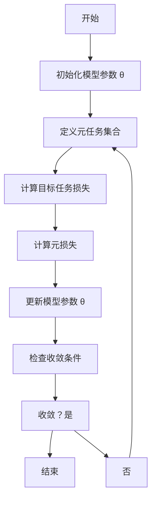

                 


# 《金融领域元学习在资产定价模型快速迭代中的应用》

---

## 关键词：元学习、资产定价模型、机器学习、金融数据、快速迭代、模型优化、金融建模

---

## 摘要：

本文探讨了元学习在金融领域资产定价模型中的应用，详细分析了元学习如何通过快速迭代优化模型性能。文章从背景介绍、核心概念、算法原理、系统架构设计到实战案例，全面阐述了元学习在金融建模中的优势和实现方法。通过理论与实践相结合，本文展示了如何利用元学习提升资产定价模型的准确性和效率，为金融领域提供了新的思路和解决方案。

---

## 正文：

### 第一部分: 金融领域元学习基础

#### 第1章: 元学习的基本概念与背景

##### 1.1 元学习的定义与特点

- **元学习的定义**：元学习（Meta-Learning）是一种机器学习方法，旨在通过学习如何学习来加速新任务的模型训练。与传统机器学习不同，元学习专注于从多个任务中提取通用知识，以快速适应新任务。

- **元学习的核心特点**：
  - **快速适应性**：能够在少量数据下快速适应新任务。
  - **通用性**：能够从多个任务中提取通用特征，适用于多种场景。
  - **元任务驱动**：通过元任务（Meta-Tasks）设计，引导模型学习有用的表示。

- **元学习与传统机器学习的区别**：
  | 特性       | 传统机器学习                  | 元学习                          |
  |------------|-------------------------------|---------------------------------|
  | 数据需求   | 需要大量标注数据               | 少量标注数据，快速适应           |
  | 任务适应性 | 针对单个任务优化               | 跨任务学习，适应多个任务         |
  | 学习目标   | 学习具体任务                   | 学习如何学习，适用于新任务       |

##### 1.2 资产定价模型的背景与挑战

- **资产定价模型的基本概念**：资产定价模型旨在通过历史数据预测资产的未来价格，是金融领域的重要工具。常用的模型包括CAPM、APT等，但这些模型在面对复杂市场变化时表现有限。

- **资产定价模型的传统方法与局限性**：
  - 传统模型依赖于特定假设，如均值-方差假设，难以应对实际市场中的非线性关系。
  - 数据需求量大，模型更新迭代速度慢，难以适应快速变化的市场环境。
  - 模型解释性较差，难以满足实际投资中的定制化需求。

- **快速迭代在资产定价中的重要性**：金融市场变化迅速，模型需要能够快速响应市场变化，及时捕捉新的市场信号。元学习的快速适应性正好解决了这一问题。

##### 1.3 元学习在金融领域的应用前景

- **元学习在金融领域的潜在应用场景**：
  - 快速调整资产定价模型，应对市场波动。
  - 跨资产类别学习，提升模型的泛化能力。
  - 处理小样本数据，优化冷启动问题。

- **元学习在资产定价中的优势**：
  - 能够在小样本数据下快速适应新资产或新市场环境。
  - 通过元任务设计，提升模型对多种资产类型的泛化能力。
  - 减少对大量标注数据的依赖，降低数据获取成本。

- **元学习应用的挑战与机遇**：
  - 挑战：元学习算法的复杂性较高，需要大量计算资源；金融数据的敏感性和隐私性增加了模型部署的难度。
  - 机遇：随着云计算和分布式计算技术的发展，元学习在金融领域的应用将更加广泛。

#### 第2章: 元学习的核心概念与联系

##### 2.1 元学习的原理与机制

- **元学习的原理**：元学习通过在元任务（Meta-Tasks）上进行优化，学习一种能够快速适应新任务的模型。元任务通常是一组与目标任务相关的任务，通过在这些任务上的优化，模型能够提取通用特征，快速迁移到新任务。

- **元学习的元任务与目标函数**：元任务是元学习中的关键组成部分，通常设计为与目标任务相关的任务。目标函数旨在优化模型的元任务性能，从而提升目标任务的表现。

- **元学习的优化过程**：元学习通过在元任务上的多次迭代优化，调整模型参数，使得模型能够在新任务上快速收敛。

##### 2.2 资产定价模型与元学习的关系

- **资产定价模型的元任务定义**：在资产定价中，元任务可以设计为不同资产类别或不同时间窗口的价格预测任务。通过在这些任务上的优化，模型能够提取跨资产或跨时间的价格波动特征，提升在新资产或新时间窗口上的预测能力。

- **元学习如何加速资产定价模型的迭代**：元学习通过在多个资产或多个时间窗口上的优化，使得模型能够在单个资产或单个时间窗口上快速收敛，从而实现快速迭代。

- **资产定价模型的快速迭代与元学习的结合**：通过元学习，资产定价模型能够快速适应市场变化，无需重新训练整个模型，只需调整元参数即可实现性能提升。

##### 2.3 元学习与资产定价模型的核心要素对比

- **核心要素对比**：
  | 元学习       | 资产定价模型             |
  |--------------|--------------------------|
  | 元任务       | 资产类型、时间窗口       |
  | 元参数       | 模型参数                 |
  | 快速适应性   | 预测准确率               |

- **ER实体关系图**：
  ```mermaid
  erDiagram
    Asset_Pricing_Model {
      entity Asset {
        string id
        string name
        double price
        date timestamp
      }
      entity Task {
        string id
        string type
        double target
        Asset asset
      }
      entity Meta_Task {
        string id
        string group
        Task[] tasks
      }
      entity Meta_Parameter {
        string id
        double value
        Meta_Task task
      }
    }
  ```

---

### 第二部分: 元学习算法原理与数学模型

#### 第3章: 元学习算法原理与数学模型

##### 3.1 元学习算法的基本流程

- **元学习的元任务与目标函数**：
  - 元任务：多个相关任务的集合，如不同资产类别或不同时间窗口的任务。
  - 目标函数：在元任务上的优化目标，通常包括元损失（meta-loss）和目标任务损失（task-loss）。

- **元学习的优化过程**：
  1. 在元任务上优化模型参数，使得模型能够在元任务上表现良好。
  2. 利用优化后的模型参数，快速适应目标任务。

- **元学习的数学模型**：
  - 元任务目标函数：
  $$ L_{meta} = \sum_{i=1}^{N} L_{task}(f_{\theta}(x_i), y_i) $$
  - 元学习的优化目标：
  $$ \min_{\theta} L_{meta} $$

##### 3.2 元学习的数学模型与公式

- **元学习的基本数学模型**：
  $$ f_{\theta}(x_i) = \theta^T x_i $$
  其中，$\theta$ 是模型参数，$x_i$ 是输入特征，$f_{\theta}(x_i)$ 是模型输出。

- **元学习的优化目标**：
  $$ \min_{\theta} \sum_{i=1}^{N} (y_i - f_{\theta}(x_i))^2 $$

- **元学习的梯度计算**：
  $$ \nabla_{\theta} L = \sum_{i=1}^{N} 2(y_i - f_{\theta}(x_i))x_i $$

##### 3.3 算法流程图



---

### 第三部分: 系统分析与架构设计

#### 第4章: 系统分析与架构设计方案

##### 4.1 问题场景介绍

- **目标**：通过元学习快速迭代资产定价模型，提升预测准确性。
- **场景**：金融交易环境，数据量大，市场变化快，需要模型快速适应新资产或新市场环境。

##### 4.2 系统功能设计

- **领域模型**：
  ```mermaid
  classDiagram
    class Asset_Pricing_Model {
      double predict_price(string asset_id, date timestamp)
      void train(Meta_Task task)
    }
    class Meta_Task {
      Task[] tasks
    }
    class Task {
      string asset_id
      date timestamp
      double target_price
    }
  ```

- **系统架构设计**：
  ```mermaid
  architecture
    Component Meta_Learning_Server {
      Service Meta_Trainer {
        train Asset_Pricing_Model on Meta_Task
      }
      Service Task_Optimizer {
        optimize model for specific tasks
      }
    }
    Component Asset_Pricing_Client {
      Service Asset_Predictor {
        predict price for specific asset and timestamp
      }
    }
  ```

- **系统接口设计**：
  ```mermaid
  sequenceDiagram
    Client -> Meta_Trainer: request train with Meta_Task
    Meta_Trainer -> Task_Optimizer: optimize model parameters
    Task_Optimizer -> Client: return optimized model
    Client -> Asset_Predictor: request price prediction
    Asset_Predictor -> Client: return predicted price
  ```

---

### 第四部分: 项目实战

#### 第5章: 项目实战

##### 5.1 环境安装与配置

- **工具安装**：
  - Python 3.8+
  - TensorFlow 2.0+
  - Pandas、NumPy
  - Matplotlib

##### 5.2 核心代码实现

- **元学习模型实现**：
  ```python
  import tensorflow as tf
  import numpy as np

  class Meta_Learner(tf.keras.Model):
      def __init__(self, input_dim):
          super(Meta_Learner, self).__init__()
          self.meta_weights = tf.Variable(tf.random.normal([input_dim, 1], dtype=tf.float32))

      def call(self, inputs):
          return tf.matmul(inputs, self.meta_weights)

  def meta_loss(y_true, y_pred):
      return tf.reduce_mean(tf.square(y_true - y_pred))

  # 训练元学习模型
  meta_model = Meta_Learner(10)
  optimizer = tf.keras.optimizers.Adam(learning_rate=0.001)

  for epoch in range(100):
      for batch in batches:
          with tf.GradientTape() as tape:
              y_pred = meta_model(batch['features'])
              loss = meta_loss(batch['labels'], y_pred)
          grads = tape.gradient(loss, meta_model.trainable_weights)
          optimizer.apply_gradients(zip(grads, meta_model.trainable_weights))
  ```

##### 5.3 实际案例分析与解读

- **案例分析**：
  - 数据集：多只股票的历史价格数据，包括开盘价、收盘价、最高价、最低价、成交量等。
  - 元任务：不同股票的 price prediction 任务。
  - 模型训练：在元任务上优化模型参数，使得模型能够在新股票上快速预测价格。

##### 5.4 代码功能解读

- **元学习模型实现**：
  - `Meta_Learner` 类继承自 `tf.keras.Model`，定义了元学习模型的结构，包含一个权重矩阵 `meta_weights`。
  - `call` 方法实现了前向传播，将输入特征与 `meta_weights` 矩阵相乘，得到预测结果。
  - `meta_loss` 函数定义了元任务的损失函数，使用均方误差。

---

### 第五部分: 最佳实践与总结

#### 第6章: 最佳实践 tips、小结、注意事项、拓展阅读

##### 6.1 tips

- **数据预处理**：确保数据质量，进行归一化或标准化处理。
- **模型选择**：根据具体任务选择合适的元学习算法，如 MAML、Meta-SGD 等。
- **计算资源**：元学习需要大量计算资源，建议使用 GPU 加速训练。
- **模型评估**：使用验证集评估模型性能，避免过拟合。

##### 6.2 小结

- 元学习通过快速适应新任务，显著提升了资产定价模型的迭代速度和预测准确性。
- 在金融领域，元学习的应用前景广阔，特别是在处理小样本数据和快速变化的市场环境中。

##### 6.3 注意事项

- **数据隐私**：金融数据敏感，需注意数据隐私和安全。
- **模型解释性**：元学习模型通常较为复杂，需关注模型的解释性和可解释性。
- **计算效率**：元学习算法计算量较大，需优化算法和计算资源。

##### 6.4 拓展阅读

- "Meta-Learning for Everyone"（Palmero & Lopez-Paz, 2019）
- "A Survey on Meta-Learning"（Yoon et al., 2018）
- "Financial Risk Management with Machine Learning"（Chen et al., 2020）

---

### 结语

通过本文的详细阐述，我们了解了元学习在金融领域资产定价模型中的应用，从理论基础到实战案例，全面探讨了如何利用元学习加速模型迭代。未来，随着技术的发展，元学习将在金融领域发挥更大的作用，为资产定价和风险管理提供更高效、更智能的解决方案。

--- 

# 《金融领域元学习在资产定价模型快速迭代中的应用》

