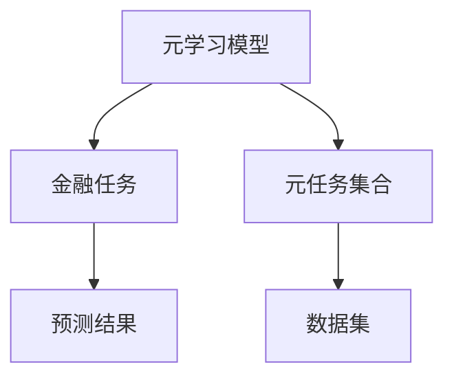
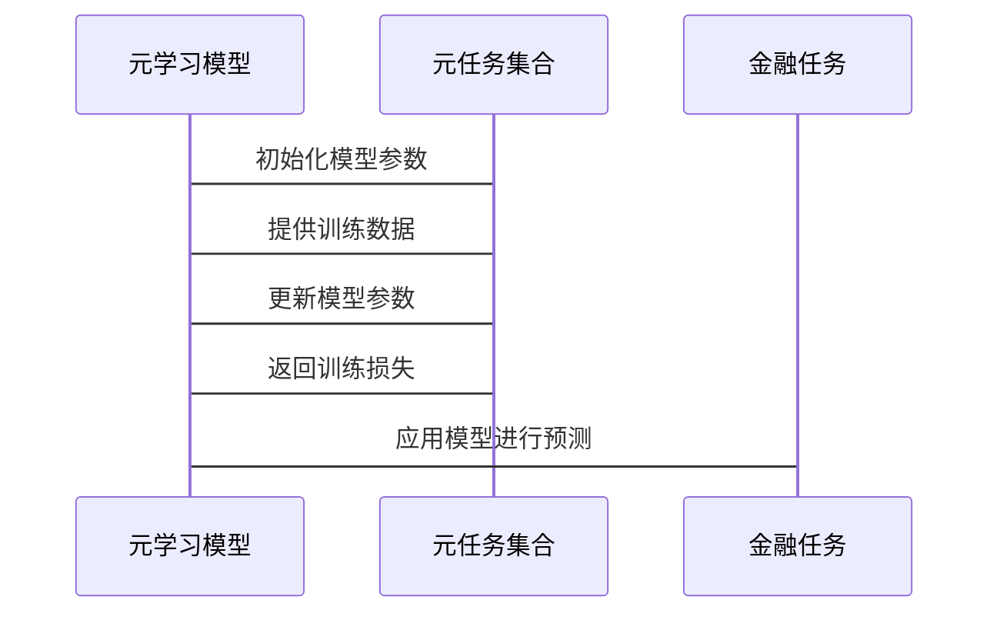

                 


# 金融领域元学习技术的探索与应用

> 关键词：元学习，金融领域，机器学习，算法原理，系统架构

> 摘要：本文探讨了元学习技术在金融领域的应用，分析了其核心概念、算法原理、系统架构，并通过实际案例展示了其在金融预测中的优势。文章深入浅出地介绍了元学习的基本原理，及其在金融数据处理、预测和决策中的具体应用，为金融领域的技术研究提供了新的思路。

---

## 第1章: 元学习的基本概念与背景

### 1.1 元学习的定义与核心概念

#### 1.1.1 元学习的定义
元学习（Meta-Learning）是一种机器学习范式，旨在通过在多个任务上进行训练，使得模型能够快速适应新的任务，而无需大量标注数据。其核心在于“学习如何学习”，即模型在训练过程中掌握如何从少量数据中学习新任务的能力。

#### 1.1.2 元学习的核心概念
- **元任务（Meta-Task）**：元学习中的任务集合，用于训练模型的泛化能力。
- **参数共享（Parameter Sharing）**：模型在多个任务上共享参数，以减少数据依赖性。
- **梯度下降（Gradient Descent）**：元学习中常用的优化方法，用于更新模型参数。
- **适应性（Adaptability）**：模型在新任务上快速调整参数的能力。

#### 1.1.3 元学习与传统机器学习的对比
| 对比维度        | 元学习                        | 传统机器学习                    |
|-----------------|-------------------------------|---------------------------------|
| 数据需求        | 低，适用于小样本任务          | 高，通常需要大量标注数据         |
| 任务泛化能力    | 强，能够快速适应新任务        | 弱，需要针对每个任务单独训练     |
| 训练目标        | 学会如何从少量数据中学习      | 直接优化特定任务的预测性能       |
| 应用场景        | 多任务学习、零样本学习        | 单任务学习                      |

#### 1.1.4 元学习在金融领域的应用背景
金融领域数据通常具有小样本、高噪声和强波动性等特点，传统机器学习方法在这些场景下表现受限。元学习的泛化能力和快速适应性使其成为金融领域的理想选择，尤其是在股票预测、风险评估和交易策略优化等方面。

### 1.2 元学习的数学模型与公式

#### 1.2.1 元学习的数学模型
元学习的核心思想是通过优化元损失函数（Meta-Loss Function）来更新模型参数，使其能够快速适应新任务。数学模型如下：

$$ \mathcal{L}_{\text{meta}} = \sum_{i=1}^{N} \mathcal{L}_i(\theta, \phi_i) $$

其中，$\theta$ 是模型的参数，$\phi_i$ 是第 $i$ 个任务的参数。

#### 1.2.2 元学习的优化目标
元学习的目标是最小化元损失函数，从而使得模型在多个任务上表现良好。优化目标为：

$$ \theta^* = \arg \min_{\theta} \mathcal{L}_{\text{meta}} $$

#### 1.2.3 元学习的核心公式推导
以元学习算法 Meta-LSTM 为例，其更新公式为：

$$ \Delta \theta = \alpha \cdot \nabla_{\theta} \mathcal{L}_{\text{meta}} $$

其中，$\alpha$ 是学习率。

---

## 第2章: 元学习在金融领域的应用背景

### 2.1 金融领域的复杂性与挑战

#### 2.1.1 金融数据的特点
- **小样本性**：金融数据通常难以获取大量标注样本。
- **高噪声**：金融数据受市场情绪和外部事件影响较大。
- **强波动性**：金融市场的波动性使得预测任务更具挑战性。

#### 2.1.2 金融预测的不确定性
金融市场的不确定性主要来源于：
- **市场情绪**：投资者行为的不可预测性。
- **宏观经济因素**：如利率、通货膨胀等。
- **突发事件**：如政策变化、自然灾害等。

#### 2.1.3 金融模型的可解释性问题
金融模型需要满足监管要求，因此可解释性是关键。元学习模型通常较难解释，这在金融领域是一个挑战。

#### 2.1.4 金融领域的多任务学习需求
金融领域涉及多个相关任务，如股票预测、风险评估、交易策略优化等，元学习的多任务学习能力使其成为理想选择。

### 2.2 元学习在金融领域的优势

#### 2.2.1 提高模型的泛化能力
元学习能够在多个金融任务上共享参数，从而提高模型的泛化能力。

#### 2.2.2 降低数据依赖性
元学习适用于小样本数据，能够在数据不足的情况下仍保持较好的性能。

#### 2.2.3 提高模型的适应性
元学习能够快速适应新任务，适用于金融市场快速变化的场景。

#### 2.2.4 优化金融决策的效率
通过元学习，金融决策可以在更短的时间内完成，提高交易效率。

---

## 第3章: 元学习的核心概念与联系

### 3.1 元学习的核心原理

#### 3.1.1 元学习的元任务概念
元任务是指一组任务集合，用于训练模型的泛化能力。例如，在金融领域，元任务可以包括股票预测、风险评估等多个任务。

#### 3.1.2 元学习的参数共享机制
模型在多个任务上共享参数，从而减少数据依赖性。例如，在股票预测任务中，共享的参数可以捕捉股票价格的共性特征。

#### 3.1.3 元学习的梯度下降方法
元学习通常使用梯度下降方法来优化参数。例如，Meta-SGD 算法通过计算梯度更新模型参数。

#### 3.1.4 元学习的模型更新策略
模型在训练过程中不断更新参数，以适应不同的任务。例如，在 Meta-LSTM 中，模型通过 LSTM 网络来生成任务特定的参数。

### 3.2 元学习的核心概念对比表

| 对比维度        | 元学习                        | 传统机器学习                    |
|-----------------|-------------------------------|---------------------------------|
| 数据需求        | 低，适用于小样本任务          | 高，通常需要大量标注数据         |
| 任务泛化能力    | 强，能够快速适应新任务        | 弱，需要针对每个任务单独训练     |
| 训练目标        | 学会如何从少量数据中学习      | 直接优化特定任务的预测性能       |
| 应用场景        | 多任务学习、零样本学习        | 单任务学习                      |

### 3.3 元学习的ER实体关系图

```mermaid
er
  %%{init: { 'Mermaid': { 'theme': 'default' }}}
  %%{init: { 'default': { 'grid': true }}}
  entity 元学习模型 {
    <属性> 参数 θ
    <关系> ←[训练]→ 元任务集合
    <关系> →[应用]→ 金融任务
  }
  entity 元任务集合 {
    <属性> 任务 ID, 任务类型
    <关系> ←[包含]→ 元学习模型
  }
  entity 金融任务 {
    <属性> 任务 ID, 输入数据, 输出结果
    <关系> ←[应用]→ 元学习模型
  }
```

---

## 第4章: 元学习的算法原理与数学模型

### 4.1 元学习算法的基本原理

#### 4.1.1 元学习算法的输入输出
- **输入**：多个金融任务的数据集。
- **输出**：能够快速适应新任务的模型。

#### 4.1.2 元学习算法的训练过程
1. 初始化模型参数 θ。
2. 在元任务集合上进行训练，更新参数 θ 以最小化元损失函数。
3. 对于新任务，使用更新后的 θ 进行预测或优化。

#### 4.1.3 元学习算法的优化目标
最小化元损失函数：

$$ \mathcal{L}_{\text{meta}} = \sum_{i=1}^{N} \mathcal{L}_i(\theta, \phi_i) $$

#### 4.1.4 元学习算法的核心公式推导
以 Meta-SGD 算法为例，其更新公式为：

$$ \Delta \theta = \alpha \cdot \nabla_{\theta} \mathcal{L}_{\text{meta}} $$

### 4.2 元学习算法的数学模型

#### 4.2.1 元学习的数学模型推导
$$ \mathcal{L}_{\text{meta}} = \sum_{i=1}^{N} \mathcal{L}_i(\theta, \phi_i) $$

#### 4.2.2 元学习的数学模型应用
在金融领域，元学习模型可以用于股票价格预测：

$$ y_{\text{预测}} = f(x, \theta) $$

其中，$x$ 是输入数据，$y_{\text{预测}}$ 是预测结果。

### 4.3 元学习算法的Python实现

#### 4.3.1 元学习算法的Python代码实现
```python
import torch
import torch.nn as nn
import torch.optim as optim

class MetaLSTM(nn.Module):
    def __init__(self, input_size, hidden_size):
        super(MetaLSTM, self).__init__()
        self.lstm = nn.LSTM(input_size, hidden_size)
        self.fc = nn.Linear(hidden_size, 1)

    def forward(self, x, h=None):
        out, h = self.lstm(x, h)
        out = self.fc(out)
        return out, h

# 初始化模型
model = MetaLSTM(input_size=10, hidden_size=20)
optimizer = optim.Adam(model.parameters(), lr=0.001)

# 元任务训练
for batch in meta_train_loader:
    inputs, labels = batch
    outputs, _ = model(inputs)
    loss = nn.MSELoss()(outputs, labels)
    optimizer.zero_grad()
    loss.backward()
    optimizer.step()
```

#### 4.3.2 元学习算法的代码解析
上述代码实现了一个基于 LSTM 的元学习模型，用于股票价格预测。模型通过 LSTM 网络捕捉时间序列特征，并通过全连接层输出预测结果。

---

## 第5章: 元学习的系统分析与架构设计

### 5.1 金融领域的元学习系统场景

#### 5.1.1 金融预测的场景描述
- **输入**：股票价格历史数据、市场情绪指标等。
- **输出**：股票价格预测结果。
- **目标**：通过元学习模型实现准确的股票价格预测。

#### 5.1.2 金融交易的场景描述
- **输入**：多只股票的历史数据、市场新闻等。
- **输出**：交易策略建议。
- **目标**：通过元学习模型优化交易策略。

#### 5.1.3 金融风险控制的场景描述
- **输入**：客户信用评分、市场波动性指标等。
- **输出**：风险评估结果。
- **目标**：通过元学习模型提高风险控制能力。

### 5.2 系统功能设计

#### 5.2.1 领域模型（领域模型类图）
```mermaid
classDiagram
    class 元学习模型 {
        输入数据
        输出结果
        参数 θ
    }
    class 元任务集合 {
        任务 ID
        任务类型
        数据集
    }
    元学习模型 <--[训练]--> 元任务集合
    元学习模型 -->[应用]--> 金融任务
```

#### 5.2.2 系统架构（系统架构图）


### 5.3 系统接口设计与交互

#### 5.3.1 系统接口设计
- **输入接口**：接受多个金融任务的数据集。
- **输出接口**：输出能够快速适应新任务的模型。

#### 5.3.2 系统交互流程图


---

## 第6章: 元学习的项目实战

### 6.1 项目环境安装

#### 6.1.1 安装依赖
```bash
pip install torch
pip install numpy
pip install pandas
```

#### 6.1.2 环境配置
```bash
conda create -n meta_learning python=3.8
conda activate meta_learning
```

### 6.2 系统核心实现源代码

#### 6.2.1 元学习模型的实现
```python
import torch
import torch.nn as nn
import torch.optim as optim

class MetaLSTM(nn.Module):
    def __init__(self, input_size, hidden_size):
        super(MetaLSTM, self).__init__()
        self.lstm = nn.LSTM(input_size, hidden_size)
        self.fc = nn.Linear(hidden_size, 1)

    def forward(self, x, h=None):
        out, h = self.lstm(x, h)
        out = self.fc(out)
        return out, h

# 初始化模型
model = MetaLSTM(input_size=10, hidden_size=20)
optimizer = optim.Adam(model.parameters(), lr=0.001)
```

#### 6.2.2 金融任务的实现
```python
# 股票价格预测
inputs = torch.randn(10, 10)
outputs, _ = model(inputs)
loss = nn.MSELoss()(outputs, labels)
loss.backward()
optimizer.step()
```

### 6.3 代码应用解读与分析

#### 6.3.1 代码解读
上述代码实现了基于 LSTM 的元学习模型，用于股票价格预测。模型通过 LSTM 网络捕捉时间序列特征，并通过全连接层输出预测结果。

#### 6.3.2 代码分析
- **模型初始化**：定义了一个 LSTM 网络，用于处理时间序列数据。
- **优化器选择**：使用 Adam 优化器，学习率为 0.001。
- **训练过程**：在每个训练批次中，模型接受输入数据，计算损失函数，反向传播并更新参数。

### 6.4 实际案例分析

#### 6.4.1 案例背景
以股票价格预测为例，假设我们有 10 只股票的历史数据，目标是通过元学习模型实现准确的预测。

#### 6.4.2 案例实现
```python
# 股票价格预测
for batch in stock_loader:
    inputs, labels = batch
    outputs, _ = model(inputs)
    loss = nn.MSELoss()(outputs, labels)
    loss.backward()
    optimizer.step()
```

### 6.5 项目小结

#### 6.5.1 项目总结
通过元学习模型，我们能够在金融领域中实现多个任务的高效预测和优化，尤其是在小样本数据和多任务场景下表现优异。

#### 6.5.2 项目注意事项
- 数据预处理是关键，需要确保数据的干净和一致性。
- 模型的可解释性是金融领域的重要考量，需要进一步优化。
- 训练过程中需要注意过拟合问题，可以通过数据增强和正则化方法解决。

---

## 第7章: 元学习的最佳实践

### 7.1 小结

#### 7.1.1 小结内容
元学习在金融领域的应用前景广阔，尤其是在小样本数据和多任务场景下具有显著优势。通过合理的系统设计和算法优化，元学习能够有效提升金融决策的效率和准确性。

### 7.2 注意事项

#### 7.2.1 模型的可解释性
金融领域对模型的可解释性有较高要求，需要通过可视化和解释性工具进一步优化。

#### 7.2.2 数据的隐私与安全
金融数据通常涉及敏感信息，需要严格遵守数据隐私法规。

#### 7.2.3 模型的鲁棒性
需要确保模型在不同市场条件下的鲁棒性，避免因外部事件导致的性能下降。

### 7.3 拓展阅读

#### 7.3.1 元学习的最新研究
建议阅读相关论文，如《Meta-Learning: A Survey》。

#### 7.3.2 金融领域的机器学习应用
建议阅读《机器学习在金融中的应用》。

#### 7.3.3 元学习的工具与库
推荐使用 PyTorch 和 TensorFlow 等深度学习框架进行元学习模型的开发。

---

## 总结

通过本文的探讨，我们深入了解了元学习在金融领域的应用，从基本概念到算法实现，再到系统设计和项目实战，全面展示了元学习的优势和潜力。希望本文能够为金融领域的技术研究和实践提供新的思路和参考。

