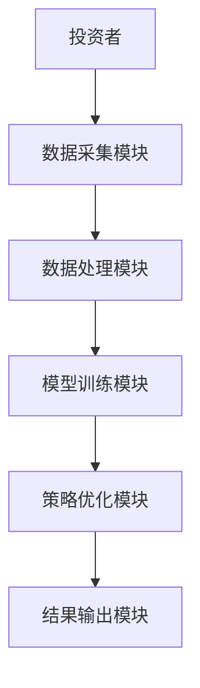

                 

# 《金融领域元强化学习在多周期多目标投资决策中的应用》

---

## 关键词：元强化学习、多目标投资、金融应用、强化学习算法、系统设计

---

## 摘要：  
本文深入探讨了元强化学习在金融领域多周期多目标投资决策中的应用。通过分析元强化学习的核心原理、算法框架以及在金融投资中的实际应用，结合系统设计与项目实战，展示了如何利用元强化学习解决复杂的投资决策问题。文章从理论到实践，详细阐述了多目标优化、系统架构设计以及实际案例，为金融投资领域的技术实践提供了新的思路和方法。

---

# 第一部分：金融领域元强化学习的背景与基础

---

# 第1章：元强化学习与多目标投资决策概述

## 1.1 元强化学习的基本概念

### 1.1.1 强化学习的定义与特点
强化学习（Reinforcement Learning，RL）是一种机器学习范式，通过智能体与环境的交互，逐步学习最优策略以最大化累计奖励。其特点包括：
- **环境动态性**：智能体在环境中行动，环境的状态和奖励会随之变化。
- **策略优化**：通过试错不断优化策略，实现对目标的最大化。
- **延迟回报**：奖励可能在行动之后延迟出现，需要考虑长期收益。

### 1.1.2 元强化学习的定义与核心思想
元强化学习（Meta-Reinforcement Learning）是一种更高层次的强化学习，旨在通过学习如何学习，使得智能体能够快速适应不同任务或环境的变化。其核心思想在于：
- **跨任务学习**：通过学习多个相关任务，共享知识和经验，提高对新任务的适应能力。
- **元优化**：在元层面上优化学习过程，使得智能体能够快速调整策略以应对新问题。

### 1.1.3 元强化学习与传统强化学习的区别
| **方面**       | **传统强化学习**                 | **元强化学习**                   |
|----------------|---------------------------------|----------------------------------|
| 学习目标       | 单一任务的最优策略               | 多任务或新任务的快速适应         |
| 知识复用       | 任务间知识复用有限               | 任务间知识复用能力强             |
| 灵活性         | 对新环境或任务的适应能力较弱     | 对新环境或任务的适应能力较强     |

---

## 1.2 多目标投资决策的定义与特点

### 1.2.1 投资决策的基本概念
投资决策是指在金融市场中，投资者根据市场信息和个人目标，选择最优的投资组合或策略，以实现特定的财务目标。常见的投资目标包括：
- **收益最大化**：追求投资回报的最大化。
- **风险最小化**：降低投资组合的波动性和潜在损失。
- **流动性优化**：保持资金的流动性，以应对突发需求。

### 1.2.2 多目标投资的定义与挑战
多目标投资是指在投资决策中同时考虑多个目标（如收益、风险、流动性等），并寻找最优的平衡点。其挑战在于：
- **目标冲突**：不同目标之间可能存在冲突，例如高收益可能伴随着高风险。
- **复杂性**：需要同时优化多个目标，增加了问题的复杂性。
- **动态性**：金融市场环境动态变化，投资目标和策略需要不断调整。

### 1.2.3 多周期投资决策的复杂性
多周期投资决策涉及在不同时间周期内（如短期、中期、长期）进行投资决策，其复杂性体现在：
- **时间跨度**：不同周期的投资目标和策略可能不同。
- **动态变化**：市场环境在不同周期内可能发生变化，需要动态调整投资策略。
- **多目标协调**：在不同周期内同时优化多个目标，增加了协调难度。

---

## 1.3 元强化学习在金融领域的应用前景

### 1.3.1 元强化学习在金融中的潜在应用场景
元强化学习在金融领域的应用潜力巨大，包括：
- **多资产配置**：通过元强化学习优化多个资产的投资组合。
- **动态风险管理**：在复杂市场环境中快速调整风险管理策略。
- **跨市场投资**：在不同市场之间快速切换，适应市场变化。

### 1.3.2 多目标投资决策在金融中的重要性
多目标投资决策是金融领域的重要问题，尤其是在面对复杂市场环境时，需要在多个目标之间找到最优平衡点。

### 1.3.3 元强化学习与多目标投资结合的优势
元强化学习通过跨任务学习和快速适应能力，为多目标投资决策提供了新的解决方案，能够在复杂多变的金融市场中实现高效的投资决策。

---

## 1.4 本章小结
本章从强化学习和元强化学习的基本概念出发，详细介绍了多目标投资决策的定义与特点，以及元强化学习在金融领域的应用前景。通过对比传统强化学习和元强化学习，明确了元强化学习在多目标投资中的优势和潜力。

---

# 第2章：元强化学习的核心算法

## 2.1 元强化学习的基本算法框架

### 2.1.1 基于模型的元强化学习
基于模型的元强化学习通过构建环境的模型，快速适应新任务。其核心步骤包括：
1. **模型学习**：学习环境的动态模型。
2. **策略优化**：基于模型进行策略优化。
3. **任务适应**：快速调整策略以适应新任务。

### 2.1.2 基于无模型的元强化学习
基于无模型的元强化学习直接在任务之间共享策略优化的经验，其核心步骤包括：
1. **经验复用**：共享不同任务中的经验。
2. **快速调整**：通过参数调整快速适应新任务。

### 2.1.3 元强化学习的统一框架
元强化学习的统一框架结合了基于模型和无模型的方法，通过元学习器对不同任务的策略进行统一优化，实现跨任务的快速适应。

---

## 2.2 元强化学习的关键技术

### 2.2.1 知识表示与状态空间建模
知识表示是元强化学习的核心技术之一，通过构建有效的状态空间模型，能够更好地捕捉环境的特征。

### 2.2.2 动作选择与策略优化
动作选择和策略优化是元强化学习的关键步骤，通过优化策略参数，实现对新任务的快速适应。

### 2.2.3 奖励建模与目标函数设计
奖励建模和目标函数设计直接影响元强化学习的效果，需要结合具体任务进行定制化设计。

---

## 2.3 多目标优化的算法实现

### 2.3.1 多目标优化的基本概念
多目标优化是指在多个目标之间寻找最优平衡点，常见的多目标优化方法包括遗传算法、Pareto优化等。

### 2.3.2 基于 Pareto 前沿的优化方法
Pareto 前沿优化方法通过寻找 Pareto 最优解，实现多个目标之间的最优平衡。

### 2.3.3 多目标强化学习的算法实现
多目标强化学习的算法实现需要结合强化学习和多目标优化，通过不断试错和优化，找到最优的投资策略。

---

## 2.4 本章小结
本章详细介绍了元强化学习的核心算法框架，包括基于模型和无模型的元强化学习方法，以及多目标优化的算法实现。通过这些算法，元强化学习能够快速适应不同任务，实现高效的多目标投资决策。

---

# 第3章：多周期多目标投资决策的系统分析

## 3.1 投资决策的领域模型

### 3.1.1 投资决策的主体与客体分析
投资决策的主体是投资者，客体是金融市场中的各种资产和投资工具。

### 3.1.2 多周期投资的特征分析
多周期投资需要在不同时间周期内进行投资决策，环境和目标可能发生变化。

### 3.1.3 多目标投资的约束条件
多目标投资需要在多个目标之间找到最优平衡点，受到多种约束条件的限制。

---

## 3.2 多周期多目标投资的系统架构

### 3.2.1 系统功能模块划分
系统功能模块包括数据采集、模型训练、策略优化、结果输出等。

### 3.2.2 系统架构的 Mermaid 图

### 3.2.3 系统接口设计
系统接口设计需要考虑模块之间的数据交互和功能调用。

---

## 3.3 投资决策的数学模型与公式

### 3.3.1 多目标优化的数学表达
$$ \text{minimize } f(x) $$
$$ \text{subject to } g(x) \leq 0 $$

### 3.3.2 基于强化学习的投资决策模型
$$ Q(s, a) = r + \gamma \max_{a'} Q(s', a') $$

### 3.3.3 多周期投资的动态规划公式
$$ V_{t}(s) = \max_{a} [r_t + \gamma V_{t+1}(s')] $$

---

## 3.4 本章小结
本章通过构建多周期多目标投资的系统模型，详细分析了系统的功能模块和架构设计，并通过数学公式描述了投资决策的核心算法。

---

# 第4章：项目实战与案例分析

## 4.1 项目环境与工具安装

### 4.1.1 环境搭建与依赖管理
需要安装 Python、TensorFlow、PyTorch 等工具。

### 4.1.2 数据集准备与预处理
收集历史股价数据，进行数据清洗和特征提取。

### 4.1.3 开发工具与框架选择
选择合适的开发工具和框架，如 Jupyter Notebook、Keras 等。

---

## 4.2 系统核心实现

### 4.2.1 元强化学习算法的实现
实现元强化学习的核心算法，包括模型训练和策略优化。

### 4.2.2 多目标优化的代码实现
通过 Python 实现多目标优化的算法，如遗传算法。

### 4.2.3 投资决策系统的功能实现
实现投资决策系统的功能模块，包括数据采集、模型训练和结果输出。

---

## 4.3 代码应用解读与分析

### 4.3.1 核心算法的代码分析
分析元强化学习算法的代码实现，理解其工作原理。

### 4.3.2 系统功能的实现细节
详细解读系统功能模块的实现细节，包括数据处理和模型训练。

### 4.3.3 代码的可扩展性与优化建议
讨论代码的可扩展性和优化方向，提出改进建议。

---

## 4.4 实际案例分析与详细讲解

### 4.4.1 案例背景与数据介绍
介绍实际案例的背景和数据来源。

### 4.4.2 投资策略的优化过程
详细讲解投资策略的优化过程，包括模型训练和策略调整。

### 4.4.3 优化结果与分析
分析优化结果，对比不同策略的投资收益和风险。

---

## 4.5 本章小结
本章通过项目实战和案例分析，详细展示了元强化学习在多周期多目标投资中的应用，验证了其有效性和优越性。

---

# 第5章：总结与展望

## 5.1 本章总结
总结本文的主要内容和研究成果，强调元强化学习在金融投资中的潜力。

## 5.2 未来研究方向
提出未来的研究方向，包括算法优化、应用场景拓展等。

## 5.3 注意事项与最佳实践
提出实际应用中的注意事项和最佳实践，帮助读者更好地理解和应用元强化学习。

## 5.4 拓展阅读
推荐相关领域的书籍和论文，供读者进一步学习和研究。

---

# 附录：参考文献与代码仓库

---

通过以上目录和内容设计，我们可以系统地介绍元强化学习在金融领域多周期多目标投资决策中的应用，从理论到实践，为读者提供全面的知识和实践指导。

