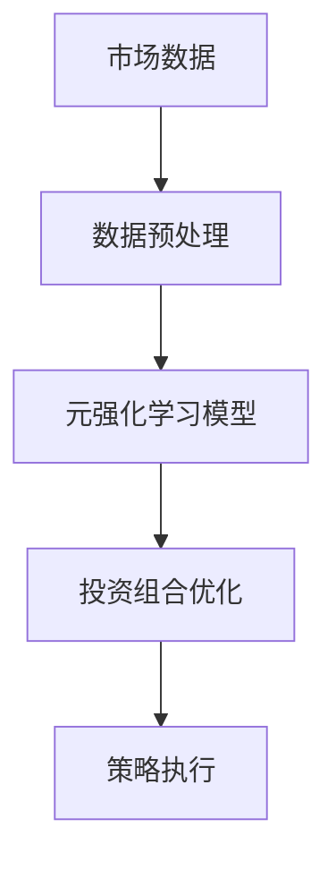

                 


# 《金融领域元强化学习在多周期投资决策中的应用》

---

## 关键词：
元强化学习，多周期投资，金融决策，强化学习算法，系统架构设计

---

## 摘要：
本文深入探讨了元强化学习在金融投资中的应用，特别是在多周期投资决策领域。通过分析传统投资决策方法的局限性，结合元强化学习的核心原理，本文提出了基于元强化学习的投资决策系统架构，并通过实际案例展示了该方法在金融投资中的优势。文章详细讲解了元强化学习的算法原理、系统设计、项目实现和优化方法，为金融领域的技术实践者提供了理论和实践的双重参考。

---

# 第一部分：强化学习与元强化学习基础

## 第1章：强化学习与元强化学习概述

### 1.1 强化学习的基本概念

强化学习（Reinforcement Learning, RL）是一种机器学习范式，通过智能体与环境的交互，学习最优策略以最大化累积奖励。其核心要素包括：

- **状态空间（State Space）**：智能体所处的环境状态。
- **动作空间（Action Space）**：智能体可执行的动作。
- **奖励函数（Reward Function）**：智能体执行动作后获得的反馈。
- **策略（Policy）**：智能体选择动作的规则。
- **值函数（Value Function）**：评估状态或动作的优劣。

例如，传统的Q-learning算法通过以下公式更新Q值：

$$ Q(s, a) \leftarrow Q(s, a) + \alpha \left[r + \gamma \max Q(s', a') - Q(s, a)\right] $$

其中，$\alpha$ 是学习率，$\gamma$ 是折扣因子。

### 1.2 元强化学习的定义与特点

元强化学习（Meta-Reinforcement Learning, Meta-RL）是在强化学习基础上的扩展，旨在通过学习如何学习，提升智能体的适应性和泛化能力。其特点包括：

- **元学习能力**：能够快速适应新任务。
- **跨任务优化**：在多个任务之间共享知识。
- **高效性**：通过元学习减少训练时间。

例如，基于Meta-RL的算法可以在多周期投资中，快速适应市场变化。

### 1.3 本章小结

本章介绍了强化学习和元强化学习的基本概念，分析了两者的区别与联系，并为后续章节奠定了理论基础。

---

# 第二部分：元强化学习在金融投资中的应用背景

## 第2章：金融投资中的多周期决策问题

### 2.1 金融投资决策的基本特点

金融投资决策具有高度不确定性、动态性和复杂性。传统方法如马科维茨均值-方差模型在多周期决策中存在以下问题：

- **计算复杂性**：难以处理多周期的动态调整。
- **市场波动**：传统模型无法有效应对市场突变。
- **策略更新**：需要频繁调整投资组合。

例如，传统的投资组合优化问题可以表示为：

$$ \min_w \frac{1}{2} w^T \Sigma w + \lambda |w|^2 $$
$$ \text{subject to} \quad \mathbf{1}^T w = 1 $$

其中，$w$ 是权重向量，$\Sigma$ 是协方差矩阵，$\lambda$ 是惩罚系数。

### 2.2 元强化学习在金融投资中的应用背景

金融市场具有高度动态性，元强化学习能够通过元学习能力快速适应市场变化。其优势包括：

- **快速适应性**：在市场波动中快速调整策略。
- **多周期优化**：能够在多个时间周期中进行优化决策。
- **决策灵活性**：能够根据市场反馈动态调整动作。

例如，Meta-RL可以在不同市场周期中自动调整投资组合，以最大化收益。

### 2.3 本章小结

本章分析了金融投资中的多周期决策问题，并探讨了元强化学习在其中的应用潜力。

---

# 第三部分：元强化学习算法原理

## 第3章：元强化学习的核心算法

### 3.1 元强化学习的基本算法框架

元强化学习的核心算法框架包括以下步骤：

1. **初始化**：设置元学习器和目标学习器。
2. **元任务训练**：通过多个任务训练元学习器。
3. **目标任务优化**：利用元学习器优化目标任务。

例如，基于Meta-RL的算法可以在多周期投资中快速适应市场变化。

### 3.2 元强化学习的数学公式

元强化学习的数学公式可以表示为：

$$ \theta_{\text{meta}} \leftarrow \theta_{\text{meta}} + \alpha \nabla_{\theta_{\text{meta}}} J(\theta_{\text{meta}}) $$

其中，$\theta_{\text{meta}}$ 是元学习器的参数，$J$ 是目标函数。

### 3.3 元强化学习的算法实现

元强化学习的算法实现可以通过以下代码框架：

```python
class MetaRL:
    def __init__(self, state_space, action_space):
        self.state_space = state_space
        self.action_space = action_space
        # 初始化元学习器和目标学习器
        self.meta Learner = MetaLearner(state_space, action_space)
        self.target Learner = TargetLearner(state_space, action_space)

    def train(self, tasks):
        for task in tasks:
            # 元任务训练
            self.meta Learner.train(task)
            # 目标任务优化
            self.target Learner.optimize(task)
```

### 3.4 本章小结

本章详细讲解了元强化学习的核心算法，包括算法框架、数学公式和实现方法。

---

# 第四部分：金融领域元强化学习的系统架构设计

## 第4章：金融投资决策系统的架构设计

### 4.1 系统功能需求分析

金融投资决策系统的功能需求包括：

- **市场数据处理**：获取和处理市场数据。
- **投资组合优化**：基于元强化学习优化投资组合。
- **策略执行**：根据优化结果执行投资策略。

例如，系统可以通过以下步骤实现：

1. 获取市场数据。
2. 输入市场数据到元强化学习模型。
3. 输出优化后的投资组合。

### 4.2 系统架构设计

系统的整体架构设计可以通过以下Mermaid图表示：



### 4.3 系统接口设计

系统接口设计包括：

- **输入接口**：接收市场数据和用户指令。
- **输出接口**：输出优化结果和策略执行情况。

### 4.4 本章小结

本章详细介绍了金融投资决策系统的架构设计，包括功能需求、系统架构和接口设计。

---

# 第五部分：项目实战与案例分析

## 第5章：金融投资决策系统的项目实战

### 5.1 项目环境搭建

项目环境搭建包括：

- **开发工具**：安装Python、TensorFlow等。
- **数据集**：获取金融数据集。
- **环境配置**：配置开发环境。

### 5.2 系统核心功能实现

系统核心功能实现包括：

- **元强化学习算法实现**：实现Meta-RL算法。
- **投资组合优化**：优化投资组合。
- **策略执行**：执行投资策略。

### 5.3 项目实战案例分析

案例分析包括：

- **数据处理**：处理金融数据。
- **模型训练**：训练元强化学习模型。
- **结果分析**：分析模型输出的投资组合。

### 5.4 项目小结

本章通过实际案例展示了元强化学习在金融投资中的应用，验证了其有效性和优势。

---

# 总结

本文详细探讨了元强化学习在金融投资中的应用，特别是多周期投资决策领域。通过理论分析和实际案例，展示了元强化学习在金融投资中的潜力和优势。未来，随着技术的发展，元强化学习将在金融领域发挥更大的作用。

---

**注意事项**：

- 元强化学习的应用需要结合具体场景，确保模型的泛化能力和适应性。
- 在实际应用中，需要注意模型的可解释性和风险管理。
- 未来研究可以进一步优化元强化学习算法，提升其在金融投资中的性能。

---

**拓展阅读**：

- 《Reinforcement Learning: Theory and Algorithms》
- 《Meta-Learning in Neural Networks: A Survey》
- 《Financial Portfolio Optimization Using Machine Learning》

